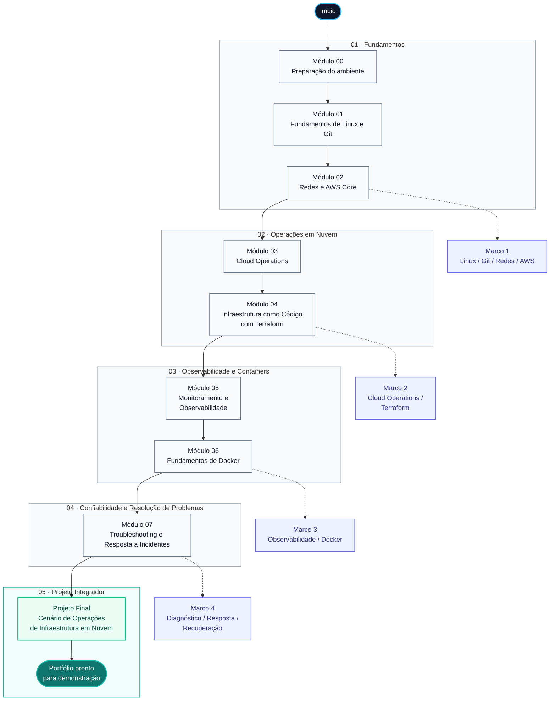

# Cloud Infrastructure Operations Lab

Laboratórios práticos para desenvolvimento das competências exigidas em vagas de **Analista Cloud Júnior**, utilizando **AWS**, **Linux**, **Terraform**, **Docker**, **CloudWatch** e **Zabbix**.

O objetivo deste repositório é proporcionar uma experiência de aprendizagem baseada em cenários reais de operações em nuvem, priorizando simplicidade, boas práticas e produtividade.

---

## Tecnologias


---

## Objetivo

Este laboratório foi desenvolvido para ajudar estudantes e profissionais iniciantes a desenvolver competências práticas em:

- Administração de ambientes Linux;
- Serviços fundamentais da AWS;
- Infraestrutura como Código (Terraform);
- Containers com Docker;
- Monitoramento e Observabilidade;
- Troubleshooting;
- Cloud Operations.

Todo o conteúdo foi organizado em uma sequência progressiva de laboratórios, permitindo construir conhecimento passo a passo.

---

## Público-alvo

Este repositório é indicado para:

- estudantes de Computação;
- profissionais em transição para Cloud Computing;
- candidatos a vagas de Analista Cloud Júnior;
- profissionais de Infraestrutura;
- profissionais de Service Desk que desejam evoluir para Cloud.

---

## Roadmap



---

## O que você aprenderá

Ao concluir esta trilha você será capaz de:

- preparar um ambiente profissional para estudos;
- utilizar Linux no contexto de Cloud Computing;
- administrar recursos básicos da AWS;
- criar infraestrutura utilizando Terraform;
- monitorar servidores com CloudWatch e Zabbix;
- trabalhar com containers Docker;
- solucionar problemas operacionais;
- executar um projeto integrador simulando um ambiente real.

---

## Tecnologias utilizadas

| Categoria | Tecnologias |
|-----------|-------------|
| Cloud Computing | AWS |
| Sistema Operacional | Linux |
| Infraestrutura como Código | Terraform |
| Containers | Docker |
| Monitoramento | CloudWatch, Zabbix |
| Versionamento | Git |
| Documentação | Markdown, Mermaid |

---

## Estrutura do projeto

```text
cloud-infrastructure-operations-lab/
│
├── docs/
├── labs/
├── terraform/
├── incident-response/
├── checklists/
├── resources/
├── templates/
├── scripts/
└── images/
```

---

## Organização dos laboratórios

| Fase | Conteúdo |
|------|----------|
| 00 | Preparação do ambiente |
| 01 | Linux e Git |
| 02 | AWS Foundations |
| 03 | Cloud Operations |
| 04 | Terraform |
| 05 | Monitoramento |
| 06 | Docker |
| 07 | Troubleshooting |
| 08 | FinOps básico |
| 09 | Projeto Final |

---

## Como utilizar

1. Clone este repositório.

2. Consulte o roadmap.

3. Execute os laboratórios na ordem proposta.

4. Ao final de cada laboratório:

   - realize o cleanup dos recursos;
   - registre as lições aprendidas;
   - utilize os checklists de validação.

---

## Filosofia do projeto

Este repositório prioriza:

- simplicidade;
- produtividade;
- boas práticas;
- documentação clara;
- ambientes reproduzíveis;
- laboratórios de baixo custo;
- aprendizado baseado em prática.

O foco não é memorizar serviços da AWS, mas compreender como eles são utilizados em ambientes reais de Cloud Operations.

---

## Licença

Este projeto está distribuído sob a licença MIT.
