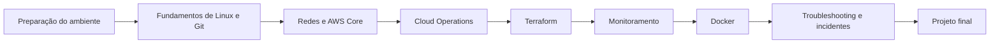
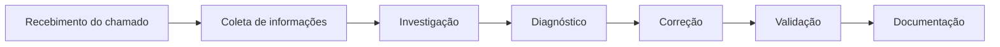

# Roadmap — Cloud Infrastructure Operations Lab

Este roadmap organiza a trilha prática do projeto **Cloud Infrastructure Operations Lab**, voltado à preparação de profissionais para vagas de **Analista Cloud Júnior**, **Analista de Infraestrutura Cloud** e **Cloud Operations** no mercado brasileiro.

A Amazon Web Services (AWS) será utilizada como único provedor de nuvem.

O conteúdo prioriza atividades práticas relacionadas a:

- operação e sustentação de ambientes AWS;
- infraestrutura de máquinas virtuais, redes e storage;
- Linux;
- Git e versionamento;
- Terraform;
- monitoramento básico;
- troubleshooting;
- atendimento a incidentes;
- Docker básico;
- Zabbix básico;
- documentação técnica;
- fundamentos de FinOps.

---

## Legenda

| Símbolo | Significado |
|---|---|
| ⬜ | Planejado |
| 🚧 | Em desenvolvimento |
| ✅ | Concluído |
| ⭐ | Competência essencial |
| ➕ | Diferencial para vagas júnior |

---

# Visão geral da trilha



---

# Módulo 00 — Preparação do ambiente

> Preparar a estação de trabalho e as ferramentas utilizadas ao longo do projeto.

| Status | Laboratório | Competências principais | Classificação |
|---|---|---|---|
| ⬜ | **Lab 00 — Preparação da estação de trabalho** | Git, VS Code, terminal e organização local | ⭐ |
| ⬜ | **Lab 01 — Configuração segura da conta AWS** | MFA, usuário administrativo e segurança da conta | ⭐ |
| ⬜ | **Lab 02 — Instalação e configuração da AWS CLI** | AWS CLI, profiles e validação de credenciais | ⭐ |
| ⬜ | **Lab 03 — Instalação das ferramentas de infraestrutura** | Terraform, Git e Session Manager Plugin | ⭐ |

## Resultado esperado

Ao concluir este módulo, o estudante deverá possuir uma estação de trabalho preparada para executar os demais laboratórios com segurança.

---

# Módulo 01 — Fundamentos de Linux e Git

> Desenvolver os conhecimentos básicos necessários para operar servidores Linux e versionar arquivos técnicos.

| Status | Laboratório | Competências principais | Classificação |
|---|---|---|---|
| ⬜ | **Lab 04 — Navegação e gerenciamento de arquivos no Linux** | Diretórios, arquivos, cópia, movimentação e remoção | ⭐ |
| ⬜ | **Lab 05 — Usuários, grupos e permissões** | `useradd`, `usermod`, `chmod`, `chown` e `sudo` | ⭐ |
| ⬜ | **Lab 06 — Processos, serviços e logs** | `ps`, `top`, `systemctl`, `journalctl` e logs | ⭐ |
| ⬜ | **Lab 07 — Git aplicado à documentação de infraestrutura** | Clone, branch, commit, push, pull e histórico | ⭐ |

## Resultado esperado

Ao concluir este módulo, o estudante deverá conseguir executar tarefas básicas em servidores Linux e registrar alterações utilizando Git.

---

# Módulo 02 — Redes e AWS Core

> Construir a infraestrutura fundamental utilizada pelos laboratórios de Cloud Operations.

| Status | Laboratório | Competências principais | Classificação |
|---|---|---|---|
| ⬜ | **Lab 08 — Fundamentos de redes para Cloud** | IP, CIDR, portas, protocolos e DNS | ⭐ |
| ⬜ | **Lab 09 — IAM para acesso seguro aos serviços AWS** | Users, Groups, Roles, Policies e least privilege | ⭐ |
| ⬜ | **Lab 10 — Criação de uma VPC básica** | VPC, subnet, route table e Internet Gateway | ⭐ |
| ⬜ | **Lab 11 — Criação de uma instância Amazon EC2** | EC2, AMI, instance type, tags e Security Group | ⭐ |
| ⬜ | **Lab 12 — Acesso seguro utilizando AWS Systems Manager** | IAM Role, SSM Agent e Session Manager | ⭐ |
| ⬜ | **Lab 13 — Gerenciamento de volumes Amazon EBS** | Volumes, montagem, expansão e persistência | ⭐ |
| ⬜ | **Lab 14 — Snapshots, AMIs e recuperação de instâncias** | Backup, restauração e recuperação operacional | ⭐ |
| ⬜ | **Lab 15 — Armazenamento de objetos com Amazon S3** | Buckets, objetos, versionamento e permissões | ⭐ |

## Resultado esperado

Ao concluir este módulo, o estudante deverá compreender e operar os principais componentes de uma infraestrutura básica na AWS.

---

# Módulo 03 — Cloud Operations

> Executar tarefas comuns de sustentação e manutenção de ambientes em nuvem.

| Status | Laboratório | Competências principais | Classificação |
|---|---|---|---|
| ⬜ | **Lab 16 — Implantação e operação do Nginx** | Instalação, serviço, configuração, portas e logs | ⭐ |
| ⬜ | **Lab 17 — Administração de usuários em um servidor EC2** | Usuários, grupos, permissões e controle de acesso | ⭐ |
| ⬜ | **Lab 18 — Diagnóstico de conectividade** | `ping`, `curl`, `nslookup`, `ss`, DNS e Security Groups | ⭐ |
| ⬜ | **Lab 19 — Manutenção e atualização de um servidor Linux** | Pacotes, atualizações, serviços e validação pós-mudança | ⭐ |
| ⬜ | **Lab 20 — Documentação de uma mudança operacional** | Evidências, validação, rollback e registro técnico | ⭐ |

## Resultado esperado

Ao concluir este módulo, o estudante deverá conseguir executar e documentar atividades operacionais básicas em servidores AWS.

---

# Módulo 04 — Infraestrutura como Código com Terraform

> Automatizar a criação da infraestrutura já conhecida por meio dos laboratórios manuais.

| Status | Laboratório | Competências principais | Classificação |
|---|---|---|---|
| ⬜ | **Lab 21 — Fundamentos do Terraform** | Provider, resource, `init`, `validate`, `plan` e `apply` | ⭐ |
| ⬜ | **Lab 22 — Criação de uma instância EC2 com Terraform** | EC2, Security Group, variables e outputs | ⭐ |
| ⬜ | **Lab 23 — Criação de VPC e rede com Terraform** | VPC, subnet, route table e dependências | ⭐ |
| ⬜ | **Lab 24 — Organização e reutilização do código Terraform** | Arquivos `.tf`, variables, outputs e organização | ⭐ |
| ⬜ | **Lab 25 — Estado, validação e destruição da infraestrutura** | State, `plan`, `destroy`, revisão e cleanup | ⭐ |

## Estratégia de aprendizagem

Nos laboratórios aplicáveis, a infraestrutura será:

1. criada manualmente no AWS Management Console;
2. validada e utilizada;
3. removida;
4. recriada posteriormente com Terraform.

Essa sequência evita que a automação esconda o funcionamento dos recursos da AWS.

---

# Módulo 05 — Monitoramento básico

> Monitorar disponibilidade e utilização de recursos sem introduzir observabilidade avançada.

| Status | Laboratório | Competências principais | Classificação |
|---|---|---|---|
| ⬜ | **Lab 26 — Métricas básicas com Amazon CloudWatch** | CPU, status checks, dashboards e métricas | ⭐ |
| ⬜ | **Lab 27 — Memória e disco com CloudWatch Agent** | Agent, configuração e custom metrics | ⭐ |
| ⬜ | **Lab 28 — Alarmes e notificações básicas** | CloudWatch Alarms e Amazon SNS | ⭐ |
| ⬜ | **Lab 29 — Instalação do Zabbix Agent em uma instância EC2** | Agent, comunicação e monitoramento do host | ➕ |
| ⬜ | **Lab 30 — Monitoramento operacional básico com Zabbix** | CPU, memória, disco, serviço e disponibilidade | ➕ |

## Limites deste módulo

Este módulo não abordará:

- OpenTelemetry;
- tracing distribuído;
- Prometheus;
- Grafana;
- Loki;
- Tempo;
- observabilidade avançada.

O foco será somente o monitoramento necessário para atividades iniciais de Cloud Operations.

---

# Módulo 06 — Docker básico

> Desenvolver os conhecimentos introdutórios de containers frequentemente indicados como diferenciais em vagas júnior.

| Status | Laboratório | Competências principais | Classificação |
|---|---|---|---|
| ⬜ | **Lab 31 — Instalação e fundamentos do Docker** | Image, container, pull, run, stop e remove | ➕ |
| ⬜ | **Lab 32 — Execução do Nginx em container** | Port mapping, logs e validação do serviço | ➕ |
| ⬜ | **Lab 33 — Volumes e persistência básica** | Volumes, bind mounts e persistência | ➕ |
| ⬜ | **Lab 34 — Diagnóstico básico de containers** | `docker ps`, `logs`, `inspect`, `exec` e restart | ➕ |

## Limites deste módulo

O módulo não pretende ensinar:

- orquestração avançada;
- Docker Swarm;
- Amazon ECS avançado;
- Amazon EKS;
- Kubernetes em profundidade.

---

# Módulo 07 — Troubleshooting e atendimento a incidentes

> Aplicar os conhecimentos anteriores em situações semelhantes às encontradas no trabalho de um Analista Cloud Júnior.

Os cenários deste módulo serão armazenados em:

```text
incident-response/
```

| Status | Incidente | Situação investigada | Classificação |
|---|---|---|---|
| ⬜ | **INC-001 — Aplicação indisponível** | EC2, Nginx, porta, serviço e conectividade | ⭐ |
| ⬜ | **INC-002 — Disco do servidor cheio** | Filesystem, logs, consumo e liberação de espaço | ⭐ |
| ⬜ | **INC-003 — Alto consumo de CPU** | Processos, métricas e investigação da causa | ⭐ |
| ⬜ | **INC-004 — Servidor sem acesso pelo Session Manager** | IAM Role, SSM Agent, rede e permissões | ⭐ |
| ⬜ | **INC-005 — Erro de acesso causado por Security Group** | Regras de entrada, portas e origem | ⭐ |
| ⬜ | **INC-006 — Falha após alteração operacional** | Evidências, rollback e documentação | ⭐ |
| ⬜ | **INC-007 — Container Nginx indisponível** | Status, logs, porta e restart | ➕ |
| ⬜ | **INC-008 — Zabbix deixou de receber métricas** | Agent, serviço, porta e conectividade | ➕ |

## Fluxo esperado

Cada simulação deverá seguir um fluxo operacional simples:



---

# Módulo 08 — FinOps básico

> Desenvolver consciência de custos e responsabilidade na utilização de recursos AWS.

| Status | Laboratório | Competências principais | Classificação |
|---|---|---|---|
| ⬜ | **Lab 35 — Tags e organização de recursos** | Identificação, projeto, ambiente e responsável | ➕ |
| ⬜ | **Lab 36 — Acompanhamento básico de custos AWS** | Billing, Cost Explorer e budgets | ➕ |
| ⬜ | **Lab 37 — Identificação e remoção de recursos ociosos** | EC2, EBS, Elastic IP, snapshots e cleanup | ➕ |

## Resultado esperado

Ao concluir este módulo, o estudante deverá compreender que criar recursos em nuvem também envolve acompanhar custos e remover infraestrutura desnecessária.

---

# Módulo 09 — Projeto final

> Integrar os conhecimentos essenciais em um ambiente AWS pequeno, documentado e reproduzível.

## Projeto — Ambiente operacional de uma aplicação web

O projeto final deverá incluir:

- VPC;
- subnet pública;
- Internet Gateway;
- route table;
- Security Group;
- IAM Role;
- instância Amazon EC2;
- acesso por Session Manager;
- volume Amazon EBS;
- servidor Nginx;
- métricas no CloudWatch;
- CloudWatch Agent;
- alarme básico;
- documentação de operação;
- checklist de validação;
- procedimento de troubleshooting;
- infraestrutura equivalente em Terraform;
- cleanup completo.

Como diferencial, o projeto poderá incluir:

- Nginx em Docker;
- Zabbix Agent;
- budget;
- simulação de incidente.

---

# Relação com as competências profissionais

| Competência encontrada em vagas júnior | Módulos relacionados |
|---|---|
| Operação de ambientes AWS | 02, 03 e 09 |
| Máquinas virtuais | 02 e 03 |
| Redes | 02 |
| Storage | 02 e 03 |
| Serviços gerenciados | 02 e 05 |
| Terraform | 04 e 09 |
| Troubleshooting | 03 e 07 |
| Atendimento a incidentes | 07 |
| Migração básica para Cloud | 02, 03 e 09 |
| Monitoramento | 05 |
| Documentação técnica | Todos |
| Git e versionamento | 01 |
| Linux | 01 e 03 |
| Segurança básica | 00 e 02 |
| Docker básico | 06 |
| Zabbix básico | 05 |
| FinOps | 08 |

---

# Padrão de cada laboratório

Cada laboratório deverá apresentar somente as informações necessárias para sua execução e compreensão.

Estrutura recomendada:

1. objetivo;
2. cenário;
3. competências desenvolvidas;
4. pré-requisitos;
5. arquitetura;
6. estimativa de custo;
7. execução passo a passo;
8. validação;
9. troubleshooting;
10. situação prática de trabalho;
11. cleanup;
12. lições aprendidas.

O conteúdo deverá ser direto, evitando textos teóricos extensos que não contribuam para a execução da atividade.

---

# Padrão de informações rápidas

No início de cada laboratório deverá existir uma tabela semelhante a esta:

| Informação | Descrição |
|---|---|
| **Nível** | Básico |
| **Tempo estimado** | 30–60 minutos |
| **Custo estimado** | Informado no laboratório |
| **Serviços AWS** | EC2, IAM e Systems Manager |
| **Competência principal** | Operação de instâncias |
| **Cleanup obrigatório** | Sim |

---

# Regras do projeto

- A AWS será o único Cloud Provider abordado.
- Os conteúdos serão escritos em português do Brasil.
- Os nomes oficiais de serviços, recursos e comandos permanecerão em inglês.
- Cada laboratório deverá desenvolver uma competência principal.
- Os laboratórios deverão priorizar execução prática.
- Todo recurso AWS criado deverá possuir instruções de cleanup.
- Custos deverão ser informados sempre que aplicável.
- Segurança básica deverá ser considerada desde os primeiros laboratórios.
- Terraform será introduzido após a compreensão manual dos recursos.
- Docker e Zabbix permanecerão em nível básico.
- Observabilidade avançada ficará fora do escopo.
- Kubernetes não será necessário para concluir a trilha principal.

---

# Critério de conclusão

A trilha será considerada concluída quando o estudante conseguir:

- criar e operar uma infraestrutura AWS básica;
- acessar e administrar uma instância Linux;
- compreender conectividade e regras de rede;
- criar recursos manualmente e com Terraform;
- verificar métricas e alarmes;
- identificar falhas comuns;
- executar troubleshooting básico;
- registrar uma atividade operacional;
- realizar cleanup com segurança;
- apresentar o projeto final como parte de seu portfólio.

---

> Este roadmap poderá evoluir conforme os laboratórios forem implementados e novas necessidades forem identificadas no mercado brasileiro para posições de Analista Cloud Júnior.
