# Lab 00 — Preparação da estação de trabalho

## Objetivo

Preparar uma estação de trabalho Windows para executar os laboratórios do projeto **Cloud Infrastructure Operations Lab**.

Neste laboratório, você verificará as ferramentas básicas, organizará o diretório local de trabalho, clonará o repositório e validará o acesso aos arquivos pelo terminal e pelo Visual Studio Code.

---

## Cenário

> Você iniciou suas atividades em uma equipe de Cloud Operations e precisa preparar sua estação de trabalho para executar tarefas técnicas, acessar documentação, utilizar controle de versão e manter os arquivos dos laboratórios organizados.

Antes de trabalhar com recursos da AWS, é necessário garantir que o ambiente local esteja funcional e padronizado.

---

## Informações rápidas

| Informação | Descrição |
|---|---|
| **Nível** | Básico |
| **Tempo estimado** | 20–30 minutos |
| **Sistema operacional** | Windows 10 ou Windows 11 |
| **Ferramentas** | PowerShell, Git e Visual Studio Code |
| **Serviços AWS** | Não aplicável |
| **Competência principal** | Preparação e organização da estação de trabalho |
| **Custo estimado** | Gratuito |
| **Cleanup obrigatório** | Não |

---

## Competências desenvolvidas

Ao concluir este laboratório, você será capaz de:

- utilizar o PowerShell para executar comandos básicos;
- verificar a instalação do Git;
- verificar a instalação do Visual Studio Code;
- criar e acessar diretórios pelo terminal;
- clonar um repositório do GitHub;
- abrir um projeto no Visual Studio Code;
- reconhecer a estrutura inicial do repositório;
- validar se a estação de trabalho está pronta para os próximos laboratórios.

---

## Pré-requisitos

Antes de iniciar, verifique se você possui:

- Windows 10 ou Windows 11;
- acesso à internet;
- permissão para instalar programas;
- uma conta no GitHub;
- acesso ao PowerShell.

> Este laboratório não exige uma conta AWS configurada.

---

## Ferramentas utilizadas

| Ferramenta | Finalidade |
|---|---|
| **PowerShell** | Execução de comandos e gerenciamento dos arquivos locais |
| **Git** | Clonagem e versionamento do repositório |
| **Visual Studio Code** | Edição e visualização dos arquivos do projeto |
| **GitHub** | Hospedagem do repositório remoto |

---

## Arquitetura

Este laboratório não cria infraestrutura em nuvem e, portanto, não necessita de diagrama de arquitetura.

O fluxo de preparação será:

```text
GitHub
   │
   │ git clone
   ▼
Repositório local
   │
   ├── PowerShell
   ├── Git
   └── Visual Studio Code
```

---

# Etapa 1 — Abrir o PowerShell

Abra o menu **Iniciar** do Windows.

Pesquise por:

```text
PowerShell
```

Abra o aplicativo **Windows PowerShell** ou **PowerShell**.

Não é necessário executar o terminal como administrador para as atividades normais deste laboratório.

### Validação

Execute:

```powershell
$PSVersionTable.PSVersion
```

### Resultado esperado

O PowerShell deverá apresentar sua versão instalada.

Exemplo:

```text
Major  Minor  Patch
-----  -----  -----
7      5      0
```

A versão apresentada em seu computador pode ser diferente.


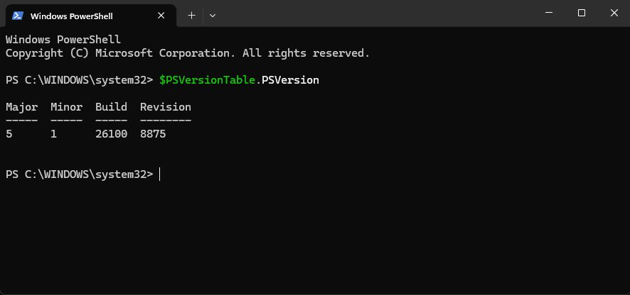


---

# Etapa 2 — Identificar o usuário e o diretório atual

Execute:

```powershell
whoami
```

O comando deverá apresentar o usuário atualmente conectado ao Windows.

Em seguida, execute:

```powershell
Get-Location
```

### Resultado esperado

O PowerShell deverá exibir o diretório atual.

Exemplo:

```text
Path
----
C:\WINDOWS\system32
```

> Os nomes e caminhos apresentados no seu computador serão diferentes dos exemplos deste laboratório.


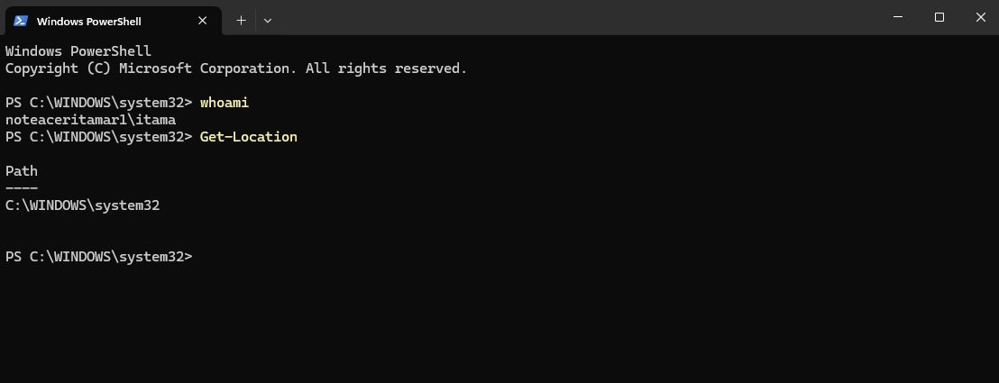


---

# Etapa 3 — Criar o diretório dos laboratórios

Para manter os projetos organizados, crie um diretório chamado `Cloud-Labs` dentro da pasta do seu usuário.

Execute:

```powershell
New-Item -ItemType Directory -Path "$HOME\Cloud-Labs" -Force
```

Acesse o diretório criado:

```powershell
Set-Location "$HOME\Cloud-Labs"
```

Confirme o diretório atual:

```powershell
Get-Location
```

### Resultado esperado

O caminho deverá terminar com:

```text
Cloud-Labs
```

Exemplo:

```text
C:\Users\seu-usuario\Cloud-Labs
```

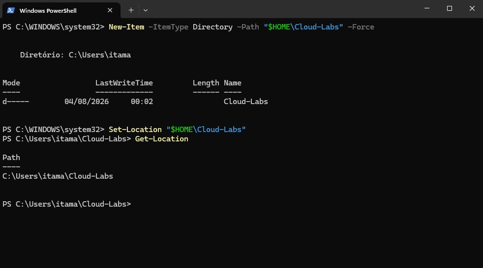


---

# Etapa 4 — Verificar a instalação do Git

Execute:

```powershell
git --version
```

### Resultado esperado

Se o Git estiver instalado, o terminal apresentará uma resposta semelhante a:

```text
git version 2.x.x.windows.x
```

A versão exata poderá ser diferente.


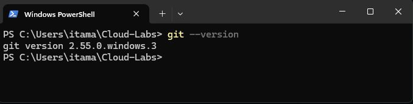


## Caso o Git não esteja instalado

Se o terminal apresentar uma mensagem informando que `git` não foi reconhecido, instale o Git utilizando uma das opções abaixo.

### Opção A — Instalação com WinGet

Execute:

```powershell
winget install --id Git.Git -e --source winget
```

Após a instalação:

1. feche o PowerShell;
2. abra um novo terminal;
3. execute novamente:

```powershell
git --version
```


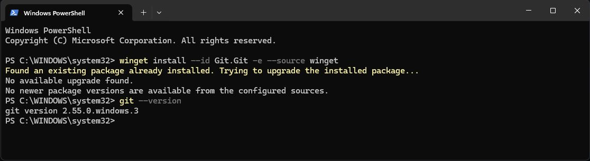


*No caso da imagem acima, o retorno indica que o Git já se encontra instalado.*


### Opção B — Instalador oficial

Baixe o instalador do **Git for Windows** no site oficial do projeto e mantenha as opções recomendadas durante a instalação.

Após concluir, feche e abra novamente o PowerShell.

> Não prossiga enquanto o comando `git --version` não funcionar corretamente.

---

# Etapa 5 — Verificar a instalação do Visual Studio Code

Execute:

```powershell
code --version
```

### Resultado esperado

O terminal deverá apresentar informações semelhantes a:

```text
1.xx.x
identificador-da-versao
x64
```
A versão exata poderá ser diferente.


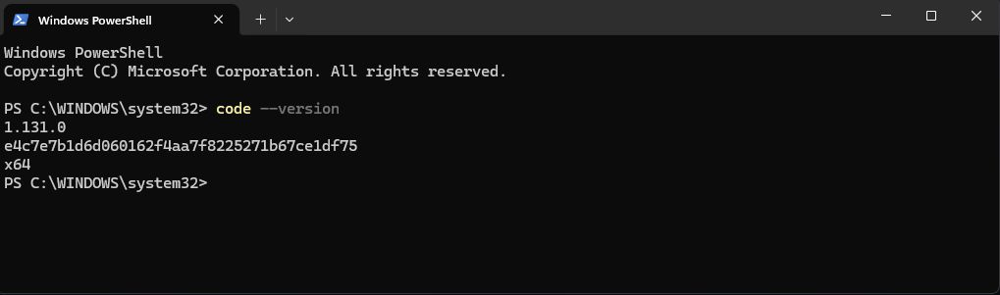


## Caso o Visual Studio Code não esteja instalado

Instale a versão estável do Visual Studio Code utilizando o instalador oficial para Windows.

Para uma instalação individual, utilize preferencialmente a opção:

```text
User Installer
```

Durante a instalação, mantenha habilitada a opção que adiciona o comando `code` ao `PATH`, quando apresentada.

Após concluir:

1. feche o PowerShell;
2. abra um novo terminal;
3. execute novamente:

```powershell
code --version
```

> Caso o Visual Studio Code abra normalmente, mas o comando `code` não seja reconhecido, reinicie o terminal ou o Windows e repita a validação.

---

# Etapa 6 — Clonar o repositório

Certifique-se de que o PowerShell está no diretório dos laboratórios:

```powershell
Set-Location "$HOME\Cloud-Labs"
```

Clone o repositório:

```powershell
git clone https://github.com/itamarsb/cloud-infrastructure-operations-lab.git
```

### Resultado esperado

O Git deverá apresentar mensagens semelhantes a:

```text
Cloning into 'cloud-infrastructure-operations-lab'...
remote: Enumerating objects...
Receiving objects: 100%
Resolving deltas: 100%
```

Acesse o diretório clonado:

```powershell
Set-Location ".\cloud-infrastructure-operations-lab"
```

Confirme o diretório atual:

```powershell
Get-Location
```


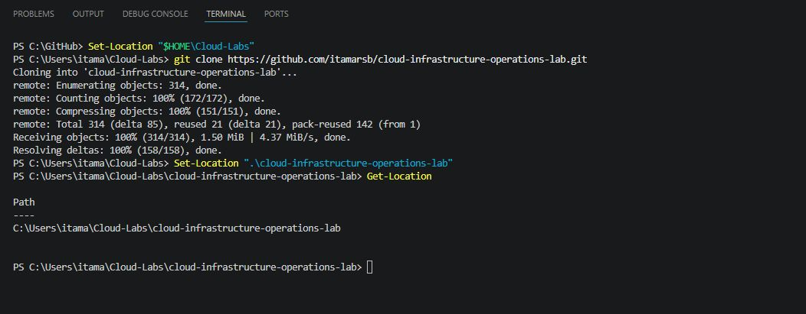


---

# Etapa 7 — Validar o repositório local

Liste os arquivos e diretórios:

```powershell
Get-ChildItem
```

### Resultado esperado

A listagem deverá incluir itens semelhantes a:

```text
checklists
docs
images
incident-response
labs
scripts
templates
terraform
.gitignore
LICENSE
README.md
```

Alguns arquivos ou diretórios poderão ser adicionados ao projeto ao longo do tempo.

Verifique se o diretório local é reconhecido pelo Git:

```powershell
git status
```

### Resultado esperado

A resposta deverá indicar a branch atual e informar que não existem alterações locais.

Exemplo:

```text
On branch main
Your branch is up to date with 'origin/main'.

nothing to commit, working tree clean
```


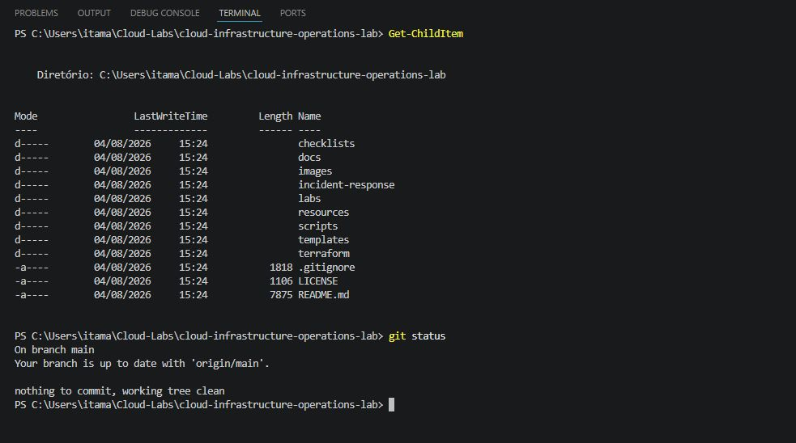


---

# Etapa 8 — Verificar o repositório remoto

Execute:

```powershell
git remote -v
```

### Resultado esperado

O terminal deverá apresentar o endereço do repositório remoto para operações de busca e envio.

Exemplo:

```text
origin  https://github.com/itamarsb/cloud-infrastructure-operations-lab.git (fetch)
origin  https://github.com/itamarsb/cloud-infrastructure-operations-lab.git (push)
```

Neste momento, você utilizará principalmente o repositório para acompanhar e executar os laboratórios.


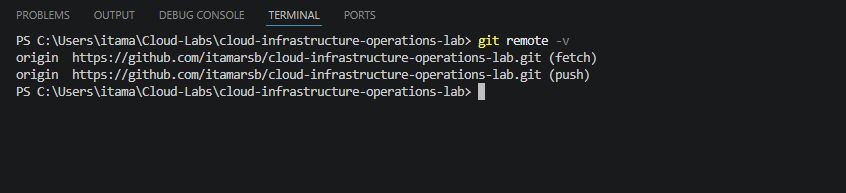


---

# Etapa 9 — Abrir o projeto no Visual Studio Code

Dentro do diretório do repositório, execute:

```powershell
code .
```

O ponto representa o diretório atual.

### Resultado esperado

O Visual Studio Code deverá abrir o projeto e apresentar os diretórios do repositório no painel **Explorer**.

Caso uma mensagem de confiança seja apresentada, confirme apenas se o diretório aberto corresponde ao repositório clonado deste projeto.


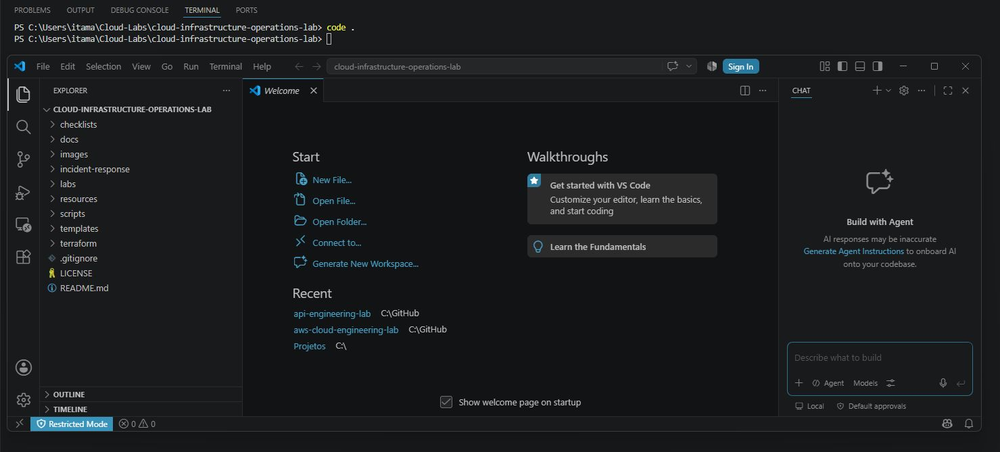


---

# Etapa 10 — Conhecer a estrutura do projeto

No painel **Explorer** do Visual Studio Code, localize os principais diretórios:

| Diretório | Finalidade |
|---|---|
| `docs/` | Documentação geral e roadmap |
| `labs/` | Laboratórios práticos |
| `terraform/` | Infraestrutura como Código |
| `incident-response/` | Registros e exercícios de incidentes |
| `checklists/` | Listas de verificação |
| `resources/` | Materiais auxiliares |
| `templates/` | Modelos padronizados de documentação |
| `scripts/` | Scripts de apoio |
| `images/` | Imagens e evidências visuais |


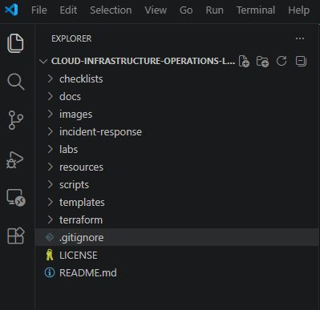


Abra o arquivo:

```text
README.md
```


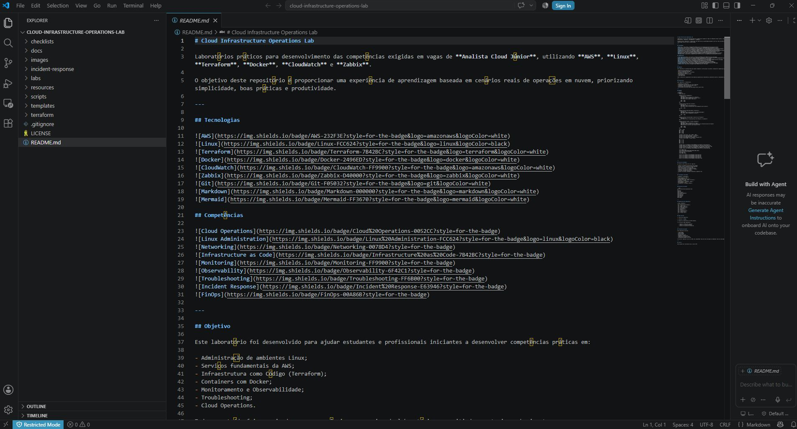


Em seguida, abra:

```text
docs/roadmap.md
```

Leia a visão geral da trilha e identifique os módulos que serão desenvolvidos.


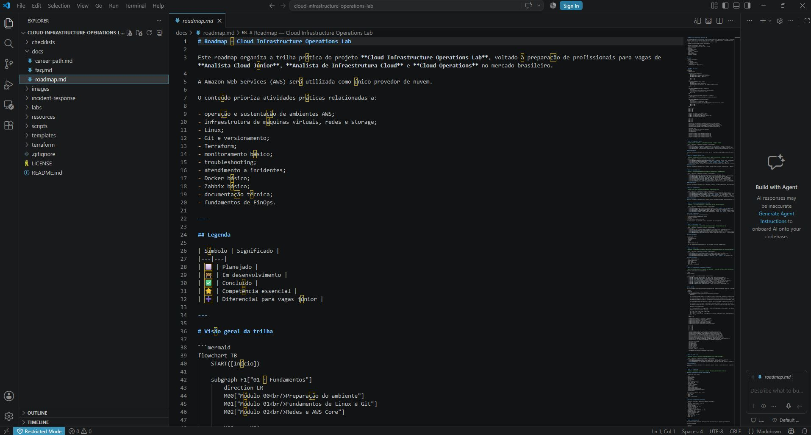


---

# Etapa 11 — Abrir o terminal integrado

No Visual Studio Code, acesse:

```text
Terminal > New Terminal
```

Ou utilize o atalho:

```text
Ctrl + Shift + `
```

Confirme que o terminal integrado foi aberto no diretório do repositório.

Execute:

```powershell
Get-Location
```

Depois:

```powershell
git status
```

### Resultado esperado

Os mesmos comandos utilizados no PowerShell externo deverão funcionar no terminal integrado do Visual Studio Code.


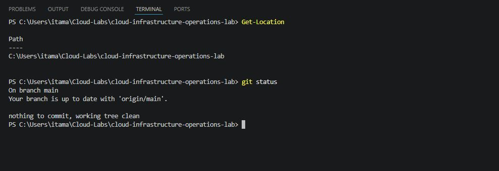


---

# Etapa 12 — Registrar as versões das ferramentas

No terminal integrado, execute:

```powershell
git --version
code --version
$PSVersionTable.PSVersion
```

Registre as versões utilizadas em suas anotações ou evidências do laboratório.

Exemplo:

```text
Sistema operacional: Windows 11
PowerShell: 7.x
Git: 2.x
Visual Studio Code: 1.x
```

Não é necessário utilizar exatamente as mesmas versões dos exemplos.


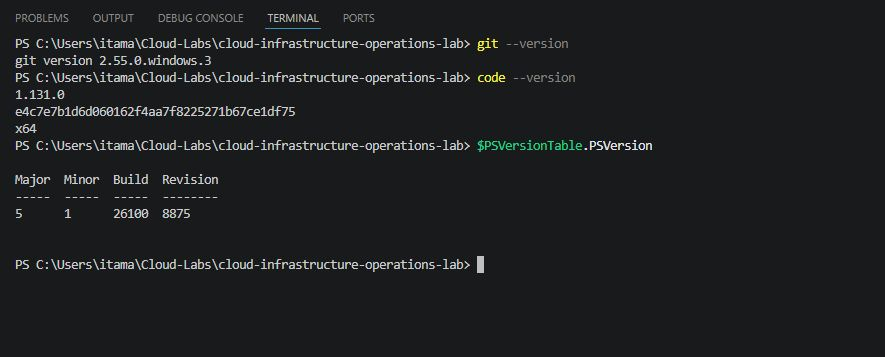


---

## Validação

Confirme os resultados do laboratório:

- [X] O PowerShell foi aberto corretamente.
- [X] O diretório `Cloud-Labs` foi criado.
- [X] O comando `git --version` funcionou.
- [X] O comando `code --version` funcionou.
- [X] O repositório foi clonado.
- [X] O diretório clonado foi reconhecido pelo Git.
- [X] O comando `git status` foi executado sem erro.
- [X] O repositório remoto foi confirmado com `git remote -v`.
- [X] O projeto foi aberto no Visual Studio Code.
- [X] O terminal integrado foi validado.
- [X] A estrutura do repositório foi identificada.

---

## Evidências sugeridas

Para documentar a conclusão do laboratório para uma futura postagem no Linkedin, por exemplo, você pode registrar:

1. saída do comando `git --version`;
2. saída do comando `code --version`;
3. resultado do `git status`;
4. estrutura do repositório aberta no Visual Studio Code;
5. terminal integrado executando `Get-Location`.

> Nunca publique senhas, tokens, credenciais, chaves privadas ou informações pessoais nas evidências.

Neste laboratório, nenhuma credencial AWS é utilizada.

---

## Troubleshooting

### Problema: o comando `git` não foi reconhecido

**Possível causa:**

O Git não está instalado ou seu diretório ainda não foi adicionado à variável `PATH`.

**Solução:**

Instale o Git, feche todos os terminais abertos e inicie um novo PowerShell.

Valide novamente:

```powershell
git --version
```

---

### Problema: o comando `code` não foi reconhecido

**Possível causa:**

O Visual Studio Code não foi adicionado ao `PATH` ou o terminal permaneceu aberto durante a instalação.

**Solução:**

Feche e reabra o PowerShell.

Execute novamente:

```powershell
code --version
```

Caso o problema continue, reinicie o Windows ou revise a instalação do Visual Studio Code.

---

### Problema: o diretório do repositório já existe

A mensagem poderá ser semelhante a:

```text
fatal: destination path 'cloud-infrastructure-operations-lab' already exists and is not an empty directory
```

**Possível causa:**

O repositório já foi clonado anteriormente.

**Solução:**

Não execute uma nova clonagem. Acesse o diretório existente:

```powershell
Set-Location "$HOME\Cloud-Labs\cloud-infrastructure-operations-lab"
```

Verifique o estado:

```powershell
git status
```

Atualize o conteúdo quando necessário:

```powershell
git pull origin main
```


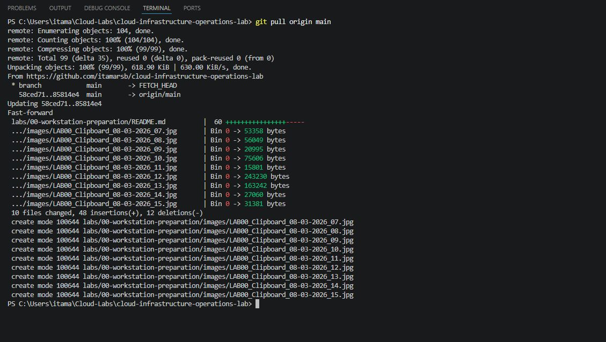


---

### Problema: falha de conexão durante a clonagem

**Possível causa:**

A estação está sem acesso à internet ou a conexão com o GitHub foi interrompida.

**Solução:**

Valide a conectividade:

```powershell
Test-Connection github.com -Count 4
```

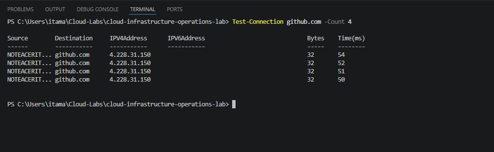


Depois, tente novamente:

```powershell
git clone https://github.com/itamarsb/cloud-infrastructure-operations-lab.git
```

---

### Problema: o Visual Studio Code abriu outro diretório

**Possível causa:**

O comando `code .` foi executado fora da pasta do repositório.

**Solução:**

Acesse o diretório correto:

```powershell
Set-Location "$HOME\Cloud-Labs\cloud-infrastructure-operations-lab"
```

Abra novamente:

```powershell
code .
```


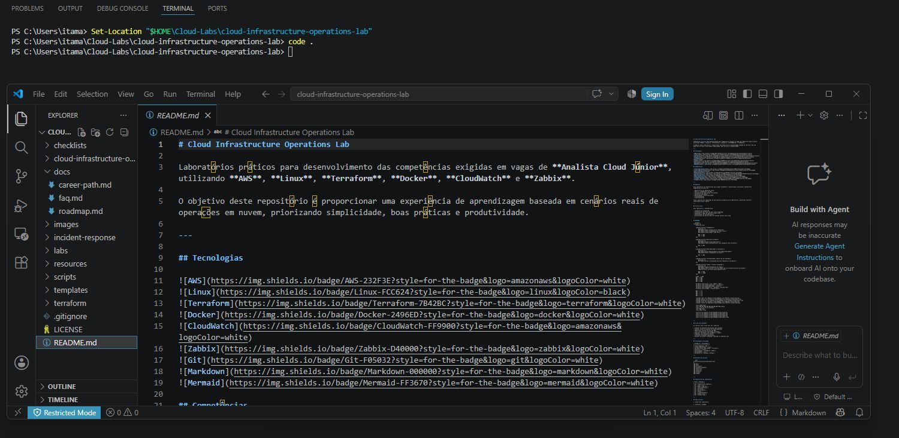


---

### Problema: o `git status` informa que o diretório não é um repositório

A mensagem poderá ser semelhante a:

```text
fatal: not a git repository
```

**Possível causa:**

O comando foi executado fora do diretório clonado.

**Solução:**

Acesse o repositório:

```powershell
Set-Location "$HOME\Cloud-Labs\cloud-infrastructure-operations-lab"
```

Execute novamente:

```powershell
git status
```

---

## Situação prática de trabalho

Em uma equipe de Cloud Operations, a estação de trabalho é utilizada para:

- consultar e editar documentação técnica;
- executar comandos operacionais;
- clonar repositórios;
- revisar alterações;
- trabalhar com scripts;
- executar ferramentas de infraestrutura;
- registrar evidências;
- manter arquivos técnicos versionados.

Uma estação organizada reduz erros, facilita a reprodução dos procedimentos e permite que diferentes profissionais trabalhem seguindo o mesmo padrão.

---

## Cleanup

Este laboratório não cria recursos AWS e não gera custos em nuvem.

Nenhuma ação de cleanup é obrigatória.

Caso deseje remover completamente a cópia local do repositório, feche o Visual Studio Code e execute:

```powershell
Set-Location "$HOME\Cloud-Labs"
Remove-Item ".\cloud-infrastructure-operations-lab" -Recurse -Force
```

> A remoção é opcional. Para continuar a trilha, mantenha o repositório em sua estação de trabalho.

---

## Checklist de conclusão

- [X] Li o objetivo e compreendi o cenário.
- [X] Validei o PowerShell.
- [X] Criei o diretório dos laboratórios.
- [X] Validei o Git.
- [X] Validei o Visual Studio Code.
- [X] Clonei o repositório.
- [X] Confirmei o repositório remoto.
- [X] Abri o projeto no Visual Studio Code.
- [X] Validei o terminal integrado.
- [X] Conheci a estrutura inicial do projeto.
- [X] Registrei as evidências necessárias.
- [X] Revisei os problemas comuns.
- [X] Confirmei que nenhum recurso AWS foi criado.

---

## Lições aprendidas

Ao concluir este laboratório, você praticou:

- utilização básica do PowerShell;
- organização de diretórios locais;
- validação de ferramentas;
- clonagem de um repositório;
- navegação pela estrutura de um projeto;
- utilização do terminal integrado;
- abertura de projetos com `code .`;
- validação de um repositório Git;
- preparação de uma estação para atividades de Cloud Operations.

---

## Resultado final

Ao final deste laboratório, sua estação de trabalho deverá possuir:

```text
Cloud-Labs/
└── cloud-infrastructure-operations-lab/
    ├── checklists/
    ├── docs/
    ├── images/
    ├── incident-response/
    ├── labs/
    ├── resources/
    ├── scripts/
    ├── templates/
    ├── terraform/
    ├── .gitignore
    ├── LICENSE
    └── README.md
```

A estação está preparada para continuar a trilha.


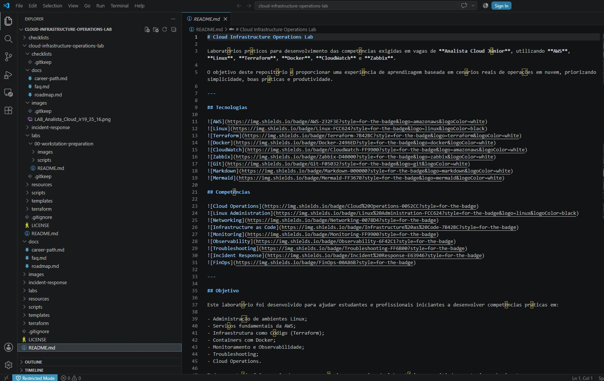


---

## Scripts

Esses arquivos são scripts do PowerShell, identificados pela extensão .ps1. Eles permitem reunir vários comandos em um procedimento automatizado, repetível e documentado.

No nosso caso, os scripts serão exclusivamente de validação:

- não instalarão programas;
- não modificarão configurações;
- não criarão recursos AWS;
- não excluirão arquivos;
- não farão login automaticamente;
- não exibirão Account ID, ARN ou credenciais;
- retornarão um resumo com sucesso, aviso ou falha.


### Como funcionam os resultados

Os scripts utilizarão três estados:

```text
[OK]     Verificação concluída com sucesso
[AVISO]  Situação que merece atenção, mas não impede necessariamente o laboratório
[FALHA]  Requisito obrigatório ausente ou incorreto
```

Ao final, eles também retornarão um código:

| Código | Significado                                        |
| -----: | -------------------------------------------------- |
|    `0` | Todas as verificações obrigatórias foram aprovadas |
|    `1` | Pelo menos uma verificação obrigatória falhou      |

Esses códigos são úteis posteriormente em automações e pipelines.


---

## Próximo laboratório

Continue para:

```text
Lab 01 — Configuração segura da conta AWS
```
