# Lab 01 — Configuração segura da conta AWS

## Objetivo

Configurar os controles básicos de segurança, recuperação de acesso e acompanhamento de custos de uma conta AWS antes da criação de recursos em nuvem.

Ao final do laboratório, a conta deverá possuir autenticação multifator no usuário root, informações de contato revisadas, alertas de uso do AWS Free Tier habilitados e um orçamento mensal configurado.

---

## Cenário

> Você recebeu uma conta AWS que será utilizada em laboratórios de Cloud Operations. Antes de criar servidores, redes ou permissões de acesso, sua primeira responsabilidade é reduzir o risco de acesso indevido, garantir que avisos importantes cheguem ao responsável correto e estabelecer uma proteção inicial contra cobranças inesperadas.

Esse tipo de preparação deve ser realizado antes do uso cotidiano da conta.

---

## Informações rápidas

| Informação | Descrição |
|---|---|
| **Nível** | Básico |
| **Tempo estimado** | 30–45 minutos |
| **Custo estimado** | Sem custo esperado para as configurações realizadas neste laboratório |
| **Serviços AWS** | AWS Account Management, IAM, Billing and Cost Management e AWS Budgets |
| **Competência principal** | Segurança inicial e controle de custos da conta AWS |
| **Cleanup obrigatório** | Não |

> [!IMPORTANT]
> O AWS Budgets permite monitorar custos e receber notificações sem cobrança. Este laboratório não configura ações automáticas de orçamento nem relatórios programados.

---

## Competências desenvolvidas

Ao concluir este laboratório, você será capaz de:

- reconhecer o uso excepcional do usuário root;
- proteger o acesso root com autenticação multifator;
- revisar os dados principais e os contatos alternativos da conta;
- habilitar alertas relacionados ao AWS Free Tier;
- criar um orçamento mensal com notificações de custo real e previsto;
- diferenciar configurações globais da conta de recursos regionais;
- registrar evidências sem expor informações sensíveis.

---

## Pré-requisitos

Antes de iniciar, verifique se você possui:

- uma conta AWS ativa;
- acesso ao endereço de e-mail associado ao usuário root;
- acesso ao telefone cadastrado para recuperação da conta;
- um aplicativo autenticador compatível com TOTP;
- acesso a um endereço de e-mail para receber alertas de custos;
- navegador atualizado;
- aproximadamente 30 minutos sem interrupções.

> [!WARNING]
> Não execute este laboratório em computador público ou compartilhado. Não salve a senha root no navegador de terceiros.

---

## Ferramentas utilizadas

| Ferramenta | Finalidade |
|---|---|
| **AWS Management Console** | Gerenciar as configurações da conta |
| **Aplicativo autenticador** | Gerar os códigos temporários de MFA |
| **AWS Billing and Cost Management** | Configurar alertas e acompanhar custos |
| **AWS Budgets** | Criar o orçamento mensal e suas notificações |

---

## Visão geral do laboratório

Este laboratório não provisiona recursos de infraestrutura. Em vez disso, estabelece a camada inicial de segurança, recuperação de acesso e controle financeiro da conta AWS.

O fluxo abaixo apresenta a sequência completa de configuração e validação:

```mermaid
flowchart TB
    START(["Início do Lab 01<br/>Preparação segura da conta AWS"])

    subgraph ROOT["1. Proteção da identidade root"]
        direction TB

        LOGIN["Acessar o AWS Management Console<br/>como usuário root"]

        KEYS{"Existem access keys<br/>ativas para o root?"}

        REVIEW_KEYS["Revisar dependências<br/>e remover chaves desnecessárias"]

        NO_KEYS["Confirmar ausência de<br/>access keys do root"]

        MFA["Configurar autenticação<br/>multifator — MFA"]

        MFA_TEST["Validar o acesso com<br/>senha + código temporário"]
    end

    subgraph RECOVERY["2. Recuperação e comunicação"]
        direction TB

        PRIMARY["Revisar contato principal<br/>e dados da conta"]

        ALTERNATIVE["Configurar contatos alternativos<br/>Billing, Operations e Security"]

        RECOVERY_CHECK["Confirmar acesso ao e-mail<br/>e telefone de recuperação"]
    end

    subgraph COSTS["3. Controle financeiro"]
        direction TB

        BILLING["Abrir Billing and<br/>Cost Management"]

        FREE_TIER["Habilitar alertas de uso<br/>do AWS Free Tier"]

        BUDGET["Criar orçamento mensal<br/>no AWS Budgets"]

        ALERTS["Configurar notificações de<br/>custo real e custo previsto"]

        EMAIL["Confirmar o endereço de e-mail<br/>que receberá os alertas"]
    end

    subgraph VALIDATION["4. Validação final"]
        direction TB

        CHECKLIST["Executar checklist de validação"]

        SECURITY_OK["Identidade root protegida"]

        CONTACTS_OK["Contatos e recuperação revisados"]

        COSTS_OK["Monitoramento inicial de custos ativo"]
    end

    READY(["Conta AWS preparada<br/>para os próximos laboratórios"])

    START --> LOGIN
    LOGIN --> KEYS

    KEYS -- "Sim" --> REVIEW_KEYS
    REVIEW_KEYS --> NO_KEYS
    KEYS -- "Não" --> NO_KEYS

    NO_KEYS --> MFA
    MFA --> MFA_TEST

    MFA_TEST --> PRIMARY
    PRIMARY --> ALTERNATIVE
    ALTERNATIVE --> RECOVERY_CHECK

    RECOVERY_CHECK --> BILLING
    BILLING --> FREE_TIER
    FREE_TIER --> BUDGET
    BUDGET --> ALERTS
    ALERTS --> EMAIL

    EMAIL --> CHECKLIST

    CHECKLIST --> SECURITY_OK
    CHECKLIST --> CONTACTS_OK
    CHECKLIST --> COSTS_OK

    SECURITY_OK --> READY
    CONTACTS_OK --> READY
    COSTS_OK --> READY

    classDef start fill:#eef2ff,stroke:#4f46e5,color:#1e1b4b,stroke-width:2px;
    classDef identity fill:#eff6ff,stroke:#2563eb,color:#172554,stroke-width:1.5px;
    classDef decision fill:#fff7ed,stroke:#ea580c,color:#7c2d12,stroke-width:2px;
    classDef recovery fill:#f5f3ff,stroke:#7c3aed,color:#3b0764,stroke-width:1.5px;
    classDef billing fill:#fffbeb,stroke:#d97706,color:#78350f,stroke-width:1.5px;
    classDef validation fill:#f0fdfa,stroke:#0f766e,color:#134e4a,stroke-width:1.5px;
    classDef success fill:#ecfdf5,stroke:#059669,color:#064e3b,stroke-width:2.5px;

    class START start;
    class LOGIN,NO_KEYS,MFA,MFA_TEST identity;
    class KEYS decision;
    class REVIEW_KEYS identity;
    class PRIMARY,ALTERNATIVE,RECOVERY_CHECK recovery;
    class BILLING,FREE_TIER,BUDGET,ALERTS,EMAIL billing;
    class CHECKLIST,SECURITY_OK,CONTACTS_OK,COSTS_OK validation;
    class READY success;

    style ROOT fill:#f8fbff,stroke:#93c5fd,stroke-width:1.5px
    style RECOVERY fill:#faf8ff,stroke:#c4b5fd,stroke-width:1.5px
    style COSTS fill:#fffdf5,stroke:#fcd34d,stroke-width:1.5px
    style VALIDATION fill:#f5fffc,stroke:#5eead4,stroke-width:1.5px

```



---

# Etapa 1 — Acessar a conta como usuário root

O usuário root é a identidade criada junto com a conta AWS. Ele possui acesso completo a todos os serviços e configurações da conta e, por isso, deve ser utilizado apenas em tarefas que realmente exigem esse nível de acesso.

1. Abra a página de login do AWS Management Console.
2. Selecione **Root user**.
3. Informe o endereço de e-mail associado à conta AWS.
4. Escolha **Next**.
5. Informe a senha do usuário root.
6. Conclua qualquer verificação adicional solicitada pela AWS.

> [!CAUTION]
> Nunca compartilhe a senha root, códigos MFA, QR Code do autenticador, chaves de acesso ou códigos de recuperação.

### Validação

Após o login, confirme que o menu da conta aparece no canto superior direito do console.

### Evidência sugerida

Registre somente uma captura parcial do console, ocultando:

- nome completo;
- e-mail;
- Account ID;
- telefone;
- endereço;
- qualquer informação financeira.

---

# Etapa 2 — Verificar a ausência de chaves de acesso do usuário root

Chaves de acesso root não devem ser utilizadas em scripts, aplicações ou ferramentas de linha de comando.

1. No canto superior direito, escolha o nome da conta.
2. Abra **Security credentials**.
3. Localize a seção **Access keys**.
4. Confirme que não existem chaves de acesso ativas para o usuário root.

### Resultado esperado

A seção deve indicar que nenhuma access key root está ativa.

> [!WARNING]
> Caso exista uma chave root, não publique sua identificação. Revise se ela é realmente necessária e remova-a quando não houver dependência legítima. Os próximos laboratórios não utilizarão credenciais root.

---

# Etapa 3 — Habilitar MFA para o usuário root

A autenticação multifator adiciona uma segunda verificação ao login. Mesmo que a senha seja descoberta, o acesso ainda dependerá de um código temporário ou outro fator cadastrado.

1. Ainda em **Security credentials**, localize **Multi-factor authentication (MFA)**.
2. Escolha **Assign MFA device**.
3. Defina um nome que permita identificar o dispositivo, por exemplo:

```text
root-mfa-primary
```

4. Selecione **Authenticator app**.
5. Escolha **Next**.
6. Abra o aplicativo autenticador no telefone.
7. Adicione uma nova conta e leia o QR Code apresentado pela AWS.
8. Informe no console dois códigos consecutivos gerados pelo aplicativo.
9. Escolha **Add MFA**.

> [!CAUTION]
> O QR Code contém o segredo utilizado para gerar os códigos MFA. Não fotografe, não publique e não inclua esse QR Code nas evidências do GitHub.

### Resultado esperado

O dispositivo deverá aparecer como atribuído ao usuário root.

### Recomendação adicional

A AWS permite cadastrar mais de um dispositivo MFA compatível. Em uma conta real, um segundo método protegido pode reduzir o risco de bloqueio caso o dispositivo principal seja perdido ou danificado.

Essa configuração adicional é opcional neste laboratório.

---

# Etapa 4 — Testar o login com MFA

Uma configuração de segurança somente deve ser considerada concluída depois de validada.

1. Escolha o menu da conta.
2. Selecione **Sign out**.
3. Entre novamente como **Root user**.
4. Informe a senha.
5. Quando solicitado, informe o código atual do aplicativo autenticador.

### Resultado esperado

O login deverá ser concluído somente após a validação do segundo fator.

> [!IMPORTANT]
> Não remova o dispositivo MFA depois do teste. O objetivo é manter a proteção ativa permanentemente.

---

# Etapa 5 — Revisar as informações principais da conta

Dados de contato atualizados são importantes para recuperação de acesso, comunicação de cobrança e contato da AWS em situações operacionais ou de segurança.

1. No canto superior direito, escolha o nome da conta.
2. Abra **Account**.
3. Localize **Contact information**.
4. Revise os dados cadastrados.
5. Caso alguma informação esteja incorreta, escolha **Edit**.
6. Atualize somente os campos necessários.
7. Escolha **Update**.

Revise especialmente:

- nome do responsável;
- endereço;
- país;
- telefone com capacidade de receber mensagens;
- demais informações aplicáveis à conta.

### Resultado esperado

Os dados devem estar atuais e corresponder ao responsável legítimo pela conta.

> [!WARNING]
> Não faça capturas de tela abertas dessa seção. Ela pode exibir dados pessoais suficientes para comprometer a privacidade ou auxiliar tentativas de recuperação indevida da conta.

---

# Etapa 6 — Configurar os contatos alternativos

A AWS permite registrar contatos específicos para assuntos de cobrança, operações e segurança.

1. Na página **Account**, localize **Alternate contacts**.
2. Revise ou configure os seguintes contatos:

| Contato | Finalidade |
|---|---|
| **Billing** | Comunicações relacionadas a faturamento e pagamentos |
| **Operations** | Avisos operacionais e comunicações sobre serviços |
| **Security** | Alertas e comunicações relacionadas à segurança |

3. Em cada categoria necessária, escolha **Edit**.
4. Preencha os dados do responsável.
5. Salve a alteração.

Para uma conta individual de laboratório, os três contatos podem apontar para o próprio responsável, desde que o e-mail e o telefone sejam acompanhados regularmente.

Em um ambiente corporativo, o ideal é utilizar contatos institucionais ou listas de distribuição, evitando dependência de uma única pessoa.

### Resultado esperado

Os três tipos de contato devem possuir informações válidas e acessíveis.

---

# Etapa 7 — Conhecer o seletor de Região

Muitos recursos AWS são criados dentro de uma Região específica. Outros serviços e configurações, como IAM, dados da conta e faturamento, são globais.

1. Observe o seletor de Região no canto superior direito do console.
2. Abra a lista de Regiões.
3. Localize **South America (São Paulo)**, identificada por:

```text
sa-east-1
```

4. Selecione essa Região para utilizá-la como referência nos próximos laboratórios, salvo orientação diferente.

### Importante

Selecionar uma Região no console não move recursos existentes e não transforma configurações globais em regionais.

Nos próximos laboratórios, sempre confirme a Região antes de criar ou procurar recursos como EC2, VPC e EBS.

### Resultado esperado

O console deverá exibir **South America (São Paulo)** como Região selecionada.

---

# Etapa 8 — Abrir o Billing and Cost Management

1. No campo de pesquisa do console, procure por:

```text
Billing and Cost Management
```

2. Abra o serviço.
3. Conheça a página inicial e localize no menu lateral:

- **Bills**;
- **Cost Explorer**;
- **Budgets**;
- **Free Tier**;
- **Billing preferences**.

> [!NOTE]
> A primeira abertura de algumas páginas de custos pode exigir ativação ou levar algum tempo para exibir dados. Isso não impede a criação do orçamento.

---

# Etapa 9 — Habilitar alertas de uso do AWS Free Tier

Os alertas do AWS Free Tier ajudam a identificar quando o uso elegível se aproxima ou ultrapassa os limites aplicáveis à conta.

1. No menu lateral de Billing, abra **Billing preferences**.
2. Localize **Alert preferences**.
3. Escolha **Edit**.
4. Marque a opção para receber alertas de uso do AWS Free Tier.
5. Informe ou confirme o endereço de e-mail que receberá os avisos.
6. Escolha **Update**.

### Resultado esperado

A preferência de alertas do AWS Free Tier deverá permanecer habilitada e associada a um e-mail válido.

> [!IMPORTANT]
> Alertas não interrompem recursos e não substituem a revisão periódica da página de custos.

---

# Etapa 10 — Criar um orçamento mensal de custos

O orçamento será utilizado como um limite de acompanhamento. Ele não bloqueia automaticamente gastos.

1. No menu lateral, abra **Budgets**.
2. Escolha **Create budget**.
3. Se a interface apresentar modelos, selecione uma opção de orçamento mensal de custos ou configure manualmente um **Cost budget**.
4. Defina um nome descritivo:

```text
monthly-cloud-lab-budget
```

5. Selecione o período **Monthly**.
6. Defina o método como orçamento fixo.
7. Informe um valor compatível com o limite pessoal destinado aos laboratórios.

Exemplo didático:

```text
5.00 USD
```

> [!NOTE]
> O valor acima é apenas um exemplo. Escolha um limite que faça sentido para sua conta, seu método de pagamento e os laboratórios que serão executados.

8. Mantenha o orçamento abrangendo todos os serviços da conta.
9. Prossiga para a configuração das notificações.

---

# Etapa 11 — Configurar notificações do orçamento

Configure alertas que permitam agir antes de uma cobrança maior.

Uma configuração inicial recomendada é:

| Alerta | Tipo | Limite |
|---|---|---:|
| **Primeiro aviso** | Custo real | 50% do orçamento |
| **Segundo aviso** | Custo real | 80% do orçamento |
| **Previsão de excesso** | Custo previsto | 100% do orçamento |

Para cada alerta:

1. Escolha **Add an alert threshold**.
2. Informe o percentual.
3. Selecione **Actual** ou **Forecasted**, conforme a tabela.
4. Informe o endereço de e-mail que receberá a notificação.
5. Não configure ações automáticas neste laboratório.
6. Revise as informações.
7. Escolha **Create budget** ou a opção equivalente apresentada no console.

### Resultado esperado

O orçamento deverá aparecer na lista com:

- nome definido;
- valor mensal;
- custo atual;
- custo previsto, quando disponível;
- alertas configurados.

> [!WARNING]
> Um AWS Budget não representa um teto rígido. Recursos continuam funcionando depois que o limite é atingido, a menos que outras ações tenham sido configuradas.

---

# Etapa 12 — Confirmar o recebimento dos alertas

1. Abra a caixa de entrada do endereço configurado.
2. Verifique se existe alguma mensagem de confirmação ou notificação relacionada ao orçamento.
3. Caso tenha sido utilizado apenas o envio direto por e-mail do AWS Budgets, nenhuma assinatura SNS será necessária.
4. Confirme que mensagens da AWS não estão sendo direcionadas para spam.

### Resultado esperado

O endereço de e-mail deverá estar apto a receber os alertas configurados.

---

# Etapa 13 — Revisar o estado final da conta

Confirme os seguintes controles:

| Controle | Estado esperado |
|---|---|
| Login root | Protegido por MFA |
| Access keys root | Nenhuma chave ativa |
| Contato principal | Atualizado |
| Contato de Billing | Configurado |
| Contato de Operations | Configurado |
| Contato de Security | Configurado |
| Alertas do AWS Free Tier | Habilitados |
| Orçamento mensal | Criado |
| Alertas do orçamento | Configurados |
| Região de referência | `sa-east-1` selecionada para os próximos labs |

---

## Validação

Marque cada item depois de confirmar o resultado:

- [ ] acessei a conta como usuário root;
- [ ] confirmei que não existem access keys root ativas;
- [ ] cadastrei e testei o MFA do usuário root;
- [ ] revisei as informações principais da conta;
- [ ] configurei os contatos alternativos de Billing, Operations e Security;
- [ ] identifiquei a diferença entre configurações globais e recursos regionais;
- [ ] habilitei os alertas do AWS Free Tier;
- [ ] criei um orçamento mensal;
- [ ] configurei alertas de custo real e previsto;
- [ ] confirmei que o e-mail de notificação está acessível.

---

## Evidências sugeridas

Registre apenas evidências que não exponham dados sensíveis.

Sugestões seguras:

1. seção de MFA mostrando apenas que um dispositivo está atribuído, com identificadores ocultados;
2. seção de access keys indicando ausência de chaves root;
3. tela de preferências mostrando que os alertas do AWS Free Tier estão habilitados, com o e-mail ocultado;
4. lista de budgets mostrando nome, valor e status, ocultando Account ID e informações financeiras desnecessárias;
5. seletor de Região mostrando `South America (São Paulo)`.

Não publique:

- QR Code ou segredo MFA;
- códigos temporários;
- senha;
- Account ID;
- e-mail completo;
- telefone;
- endereço;
- dados do cartão;
- números de fatura;
- chaves de acesso;
- códigos de recuperação.

Uma forma simples de anonimizar informações é cobrir completamente os dados antes de enviar a imagem ao repositório.

---

## Troubleshooting

### Problema: a opção de MFA já aparece configurada

**Possível causa:**

A conta já possui um dispositivo MFA atribuído ou a AWS exigiu sua configuração durante o cadastro ou login.

**Solução:**

- confirme se você reconhece o dispositivo cadastrado;
- teste o login com esse dispositivo;
- não remova um MFA funcional apenas para repetir o procedimento;
- registre como evidência somente o estado final protegido.

---

### Problema: os códigos do aplicativo autenticador são recusados

**Possível causa:**

O relógio do telefone pode estar fora de sincronia, o QR Code pode ter sido lido mais de uma vez ou os códigos informados não eram consecutivos.

**Solução:**

1. ative data e hora automáticas no telefone;
2. aguarde a geração de um novo código;
3. informe o primeiro código;
4. aguarde o próximo código e informe-o no segundo campo;
5. caso necessário, cancele a configuração incompleta e reinicie o cadastro.

---

### Problema: perdi acesso ao dispositivo MFA

**Possível causa:**

O telefone foi perdido, substituído, formatado ou o aplicativo autenticador foi removido.

**Solução:**

Utilize o processo oficial de recuperação do usuário root apresentado pela AWS. A recuperação pode exigir acesso ao e-mail e ao telefone associados à conta.

Não crie outra conta apenas para contornar o problema sem antes tentar recuperar a conta original.

---

### Problema: não encontro a página Billing and Cost Management

**Possível causa:**

O nome do serviço, a organização do menu ou a interface do console pode ter sido atualizada.

**Solução:**

Utilize o campo de pesquisa do AWS Management Console e procure por:

```text
Billing
```

ou:

```text
Billing and Cost Management
```

---

### Problema: o orçamento não apresenta custo previsto

**Possível causa:**

A conta ainda não possui histórico suficiente de uso para gerar uma previsão.

**Solução:**

Nenhuma correção é necessária. Confirme que o orçamento e os alertas foram criados e revise o valor previsto novamente após o início dos próximos laboratórios.

---

### Problema: não recebi o e-mail do orçamento

**Possível causa:**

O limite ainda não foi atingido, o endereço foi digitado incorretamente ou a mensagem foi filtrada.

**Solução:**

- revise o endereço cadastrado;
- verifique as pastas de spam e promoções;
- confirme que o alerta está associado ao orçamento;
- lembre que a notificação normalmente é enviada quando o limite configurado é atingido, e não imediatamente após a criação.

---

### Problema: existem cobranças que não reconheço

**Possível causa:**

Pode existir um recurso ativo em outra Região, um serviço criado anteriormente ou consumo fora dos limites gratuitos.

**Solução:**

1. abra **Bills** e identifique o serviço responsável;
2. verifique em qual Região ocorreu o consumo;
3. localize e remova o recurso, quando apropriado;
4. registre o ocorrido;
5. caso a cobrança permaneça sem explicação, utilize os canais oficiais de suporte de conta e faturamento da AWS.

---

## Situação prática de trabalho

Em uma equipe de Cloud Operations, a preparação inicial da conta reduz riscos antes da implantação de infraestrutura.

Um Analista Cloud Júnior pode participar de atividades como:

- confirmar que acessos privilegiados utilizam MFA;
- verificar se contatos de segurança e operação estão atualizados;
- apoiar a configuração de alertas financeiros;
- conferir a Região correta antes de procurar recursos;
- registrar evidências de controles aplicados;
- escalar ao responsável qualquer chave root, contato inválido ou cobrança inesperada.

O profissional júnior normalmente não decide sozinho políticas corporativas de identidade ou limites financeiros, mas deve reconhecer configurações inseguras e comunicá-las de forma objetiva.

---

## Cleanup

Este laboratório não cria instâncias, redes, volumes ou outros recursos de infraestrutura.

Nenhuma ação de cleanup é obrigatória.

Não remova:

- o MFA do usuário root;
- os contatos configurados;
- os alertas do AWS Free Tier;
- o orçamento mensal.

Esses controles deverão permanecer ativos durante todo o projeto.

---

## Checklist de conclusão

- [ ] Li o objetivo e compreendi o cenário.
- [ ] Confirmei que não existem chaves de acesso root ativas.
- [ ] Protegi o usuário root com MFA.
- [ ] Testei o login utilizando MFA.
- [ ] Revisei as informações principais da conta.
- [ ] Configurei os contatos alternativos.
- [ ] Habilitei alertas do AWS Free Tier.
- [ ] Criei um orçamento mensal.
- [ ] Configurei notificações de custo real e previsto.
- [ ] Registrei evidências sem expor dados sensíveis.
- [ ] Revisei as lições aprendidas.

---

## Lições aprendidas

Ao concluir este laboratório, você praticou:

- proteção de uma identidade altamente privilegiada;
- uso de autenticação multifator;
- verificação de mecanismos de recuperação e comunicação;
- configuração inicial de controle de custos;
- diferenciação entre serviços globais e recursos regionais;
- validação de controles de segurança;
- produção de evidências técnicas com proteção de dados sensíveis.

Também foi possível compreender que:

- o usuário root não deve ser utilizado nas atividades cotidianas;
- MFA reduz o risco associado ao comprometimento de senha;
- alertas e budgets avisam sobre custos, mas não interrompem automaticamente os recursos;
- dados de contato desatualizados podem dificultar a recuperação da conta;
- a Região selecionada influencia a visualização e criação de diversos recursos AWS.

---

## Referências oficiais

- [AWS account root user](https://docs.aws.amazon.com/IAM/latest/UserGuide/id_root-user.html)
- [Root user best practices](https://docs.aws.amazon.com/IAM/latest/UserGuide/root-user-best-practices.html)
- [Multi-factor authentication for the AWS account root user](https://docs.aws.amazon.com/IAM/latest/UserGuide/enable-mfa-for-root.html)
- [Update the primary contact for your AWS account](https://docs.aws.amazon.com/accounts/latest/reference/manage-acct-update-contact-primary.html)
- [Update the alternate contacts for your AWS account](https://docs.aws.amazon.com/accounts/latest/reference/manage-acct-update-contact-alternate.html)
- [Tracking your AWS Free Tier usage](https://docs.aws.amazon.com/awsaccountbilling/latest/aboutv2/tracking-free-tier-usage.html)
- [Managing your costs with AWS Budgets](https://docs.aws.amazon.com/cost-management/latest/userguide/budgets-managing-costs.html)
- [Choosing your AWS Region](https://docs.aws.amazon.com/awsconsolehelpdocs/latest/gsg/select-region.html)

---

## Próximo laboratório

Continue para:

```text
Lab 02 — Instalação e configuração da AWS CLI
```

No próximo laboratório, será preparado o acesso à AWS por linha de comando utilizando credenciais próprias para atividades técnicas, sem utilizar o usuário root.

