# Lab 02 — Instalação e configuração da AWS CLI

## Objetivo

Instalar a AWS Command Line Interface versão 2 no Windows 11, configurar um perfil nomeado com autenticação temporária pelo AWS IAM Identity Center e validar, com segurança, a identidade, a Região e o funcionamento da comunicação entre a estação de trabalho e a AWS.

Ao final do laboratório, a AWS CLI deverá estar disponível no PowerShell e no terminal integrado do Visual Studio Code, utilizando o perfil `cloud-operations-lab` e a Região `us-east-1`, sem credenciais do usuário root e sem chaves de acesso de longa duração armazenadas no repositório.

---

## Cenário

> Você recebeu a tarefa de preparar uma estação de trabalho para executar atividades de Cloud Operations. A conta AWS já possui os controles básicos de segurança. Agora é necessário instalar a ferramenta oficial de linha de comando, configurar um acesso individual, identificar claramente o perfil utilizado e comprovar que os comandos estão sendo executados na conta e na Região corretas.

Em ambientes profissionais, essa preparação reduz erros de contexto, evita o uso indevido da identidade root e estabelece a base para automação, troubleshooting, infraestrutura como código e scripts operacionais.

---

## Informações rápidas

| Informação | Descrição |
|---|---|
| **Nível** | Básico |
| **Tempo estimado** | 35–50 minutos |
| **Custo estimado** | Sem custo esperado |
| **Serviços AWS** | AWS CLI, AWS IAM Identity Center e AWS Security Token Service — STS |
| **Competência principal** | Instalação, autenticação e validação segura da AWS CLI |
| **Sistema operacional principal** | Windows 11 com PowerShell |
| **Cleanup obrigatório** | Não |

---

## Competências desenvolvidas

Ao concluir este laboratório, você será capaz de:

- instalar e atualizar a AWS CLI versão 2 no Windows;
- localizar o executável utilizado pelo terminal;
- diferenciar AWS CLI v1 e v2;
- configurar um perfil nomeado com AWS IAM Identity Center;
- autenticar-se com credenciais temporárias;
- definir Região e formato de saída padrão;
- listar e inspecionar perfis sem revelar segredos;
- validar a identidade ativa com AWS STS;
- reconhecer a precedência básica entre parâmetros e perfis;
- registrar evidências técnicas sem publicar dados sensíveis.

---

## Pré-requisitos

Antes de iniciar, verifique se você possui:

- o **Lab 00 — Preparação da estação de trabalho** concluído;
- o **Lab 01 — Configuração segura da conta AWS** concluído;
- Windows 11 de 64 bits;
- PowerShell e Visual Studio Code instalados;
- permissão para instalar aplicativos no computador;
- acesso ao AWS Access Portal;
- um usuário individual no AWS IAM Identity Center;
- um permission set atribuído à conta de laboratório;
- MFA habilitado para o acesso, quando exigido;
- navegador atualizado;
- conexão com a internet.

Tenha disponíveis, sem publicá-los:

- a **SSO Start URL** ou **Issuer URL** do portal;
- a Região onde o IAM Identity Center foi configurado;
- a conta AWS e o permission set autorizados para seu usuário.

> [!IMPORTANT]
> Este laboratório adota autenticação pelo AWS IAM Identity Center, com sessões temporárias. Não crie access keys para o usuário root. Também não é necessário criar chaves de longa duração para concluir o procedimento principal.

> [!WARNING]
> Não publique SSO Start URL, Issuer URL, Account ID, códigos de autorização, tokens, access keys, secret access keys nem o conteúdo integral da pasta `%UserProfile%\.aws`.

---

## Ferramentas utilizadas

| Ferramenta | Finalidade |
|---|---|
| **PowerShell** | Instalar e validar a AWS CLI |
| **AWS CLI v2** | Executar comandos e acessar serviços AWS |
| **AWS IAM Identity Center** | Fornecer autenticação individual e temporária |
| **AWS STS** | Confirmar a identidade utilizada pela sessão |
| **Visual Studio Code** | Repetir as validações no terminal de trabalho |
| **Navegador** | Autorizar o login no AWS Access Portal |

---

## Visão geral do laboratório

Este laboratório não provisiona infraestrutura. O fluxo estabelece uma relação autenticada entre a estação de trabalho, o AWS IAM Identity Center e os serviços AWS.

```mermaid
flowchart TB
    START(["Início do Lab 02<br/>Preparar acesso pela AWS CLI"])

    subgraph INSTALL["1. Instalação"]
        CHECK["Verificar instalação existente"]
        MSI["Instalar AWS CLI v2<br/>com pacote oficial"]
        VERSION["Validar versão e executável"]
    end

    subgraph CONFIG["2. Configuração"]
        SSO["Executar aws configure sso"]
        PROFILE["Criar perfil nomeado<br/>cloud-operations-lab"]
        DEFAULTS["Definir Região us-east-1<br/>e saída json"]
    end

    subgraph AUTH["3. Autenticação"]
        LOGIN["Executar aws sso login"]
        PORTAL["Autorizar no navegador<br/>com identidade individual"]
        CACHE["Receber credenciais temporárias"]
    end

    subgraph VALIDATE["4. Validação"]
        STS["Executar sts get-caller-identity"]
        REGION["Confirmar perfil e Região"]
        VSCODE["Repetir teste no VS Code"]
    end

    READY(["AWS CLI pronta<br/>para os próximos laboratórios"])

    START --> CHECK --> MSI --> VERSION
    VERSION --> SSO --> PROFILE --> DEFAULTS
    DEFAULTS --> LOGIN --> PORTAL --> CACHE
    CACHE --> STS --> REGION --> VSCODE --> READY

    classDef start fill:#eef2ff,stroke:#4f46e5,color:#1e1b4b,stroke-width:2px
    classDef install fill:#eff6ff,stroke:#2563eb,color:#172554,stroke-width:1.5px
    classDef config fill:#f5f3ff,stroke:#7c3aed,color:#3b0764,stroke-width:1.5px
    classDef auth fill:#fff7ed,stroke:#ea580c,color:#7c2d12,stroke-width:1.5px
    classDef validation fill:#f0fdfa,stroke:#0f766e,color:#134e4a,stroke-width:1.5px
    classDef success fill:#ecfdf5,stroke:#059669,color:#064e3b,stroke-width:2.5px

    class START start
    class CHECK,MSI,VERSION install
    class SSO,PROFILE,DEFAULTS config
    class LOGIN,PORTAL,CACHE auth
    class STS,REGION,VSCODE validation
    class READY success

    style INSTALL fill:#f8fbff,stroke:#93c5fd,stroke-width:1.5px
    style CONFIG fill:#faf8ff,stroke:#c4b5fd,stroke-width:1.5px
    style AUTH fill:#fffaf5,stroke:#fdba74,stroke-width:1.5px
    style VALIDATE fill:#f5fffc,stroke:#5eead4,stroke-width:1.5px
```



---

# Etapa 1 — Abrir o PowerShell e verificar instalações existentes

Abra uma nova janela do PowerShell. Não é necessário executá-la como administrador para esta verificação.

Execute:

```powershell
aws --version
```

Se a AWS CLI ainda não estiver instalada, o PowerShell poderá informar que o termo `aws` não foi reconhecido. Esse resultado é esperado antes da instalação.

Em seguida, verifique se existe algum executável com esse nome no `PATH`:

```powershell
Get-Command aws -All -ErrorAction SilentlyContinue
```

### Resultado esperado

- nenhuma ocorrência, se a AWS CLI não estiver instalada; ou
- o caminho e o tipo do executável atualmente associado ao comando `aws`.

> [!IMPORTANT]
> Se a saída de `aws --version` começar com `aws-cli/1`, consulte o troubleshooting deste laboratório antes de continuar. As versões 1 e 2 usam o mesmo comando e uma instalação antiga pode ser encontrada primeiro no `PATH`.

### Evidência sugerida

Registre o PowerShell mostrando a verificação inicial. Não é necessário publicar nomes completos de diretórios do usuário.

---

# Etapa 2 — Baixar o instalador oficial da AWS CLI v2

No PowerShell, defina um caminho temporário para o instalador:

```powershell
$AwsCliInstaller = Join-Path $env:TEMP "AWSCLIV2.msi"
```

Baixe o pacote oficial:

```powershell
Invoke-WebRequest `
  -Uri "https://awscli.amazonaws.com/AWSCLIV2.msi" `
  -OutFile $AwsCliInstaller
```

Confirme que o arquivo foi baixado:

```powershell
Get-Item $AwsCliInstaller | Select-Object Name, Length, LastWriteTime
```

### Resultado esperado

O PowerShell deverá exibir o arquivo `AWSCLIV2.msi` com tamanho maior que zero.

> [!NOTE]
> O arquivo é salvo na pasta temporária do Windows e não deve ser incluído no repositório.

---

# Etapa 3 — Instalar a AWS CLI v2

Execute o instalador com a interface padrão do Windows:

```powershell
Start-Process msiexec.exe `
  -Wait `
  -ArgumentList "/i `"$AwsCliInstaller`""
```

1. Autorize a execução, caso o Windows solicite confirmação.
2. Avance pelo assistente.
3. Aceite os termos aplicáveis.
4. Mantenha o diretório padrão, salvo necessidade específica.
5. Conclua a instalação.

Feche o PowerShell após a instalação e abra uma nova janela. Isso permite que o terminal carregue o `PATH` atualizado.

### Resultado esperado

O assistente deverá informar que a instalação foi concluída com sucesso.

### Evidência sugerida

Registre a tela final do instalador, sem exibir dados pessoais desnecessários.

---

# Etapa 4 — Validar a versão instalada

Na nova janela do PowerShell, execute:

```powershell
aws --version
```

### Resultado esperado

A saída deverá começar com `aws-cli/2` e indicar Windows como plataforma. Os números exatos variam conforme a versão atual.

Exemplo de formato:

```text
aws-cli/2.x.x Python/3.x.x Windows/11 exe/AMD64
```

Localize também o executável:

```powershell
Get-Command aws | Select-Object Name, CommandType, Source
```

O caminho padrão normalmente aponta para:

```text
C:\Program Files\Amazon\AWSCLIV2\aws.exe
```

> [!NOTE]
> Não compare sua versão com o número ilustrativo. O requisito deste laboratório é utilizar a versão principal 2.

---

# Etapa 5 — Obter os dados do acesso programático no AWS Access Portal

1. Entre no AWS Access Portal com seu usuário individual.
2. Conclua a autenticação multifator, quando solicitada.
3. Localize a conta AWS utilizada nos laboratórios.
4. Abra o permission set atribuído ao seu usuário.
5. Escolha **Access keys**.
6. Selecione o método de credenciais do **IAM Identity Center**.
7. Localize a **SSO Start URL** e a **SSO Region**.

Não copie para o README valores reais apresentados no portal.

> [!CAUTION]
> Não selecione o método de credenciais de curta duração para copiar access key, secret key e session token. Neste laboratório, a autenticação será configurada diretamente com `aws configure sso`.

### Resultado esperado

Você deverá ter identificado a URL do portal e a Região do IAM Identity Center sem registrar esses valores em uma captura pública.

---

# Etapa 6 — Iniciar a configuração do perfil SSO

No PowerShell, execute:

```powershell
aws configure sso
```

Quando solicitado, informe um nome descritivo para a sessão:

```text
SSO session name (Recommended): cloud-operations-sso
```

Informe a URL obtida no portal:

```text
SSO start URL [None]: <SUA_SSO_START_URL>
```

Informe a Região em que o IAM Identity Center está configurado:

```text
SSO region [None]: <SUA_SSO_REGION>
```

Mantenha o escopo padrão:

```text
SSO registration scopes [sso:account:access]:
```

Pressione `Enter` para aceitar o valor exibido entre colchetes.

> [!IMPORTANT]
> A SSO Region não é necessariamente a Região onde os recursos do laboratório serão criados. Ela identifica onde o IAM Identity Center está configurado. A Região padrão dos recursos será definida posteriormente como `us-east-1`.

---

# Etapa 7 — Autorizar a AWS CLI no navegador

Durante a configuração, a AWS CLI deverá abrir o navegador padrão.

1. Confirme que o endereço pertence ao domínio legítimo da AWS.
2. Entre com o mesmo usuário individual utilizado no AWS Access Portal.
3. Confira o código ou a solicitação de autorização apresentada.
4. Autorize o acesso da AWS CLI.
5. Retorne ao PowerShell.

Se o navegador não abrir automaticamente, siga a URL e as instruções temporárias exibidas pelo próprio terminal.

### Resultado esperado

O navegador deverá informar que a autorização foi concluída, e o terminal deverá prosseguir para a seleção da conta e do permission set.

> [!CAUTION]
> Não publique o código de autorização nem a URL temporária exibida nessa etapa.

---

# Etapa 8 — Selecionar a conta e o permission set

A AWS CLI apresentará apenas as contas e os permission sets atribuídos ao usuário autenticado.

1. Se houver uma única conta, confirme a seleção.
2. Se houver mais de uma, escolha cuidadosamente a conta de laboratório.
3. Selecione o permission set autorizado para as atividades.

### Resultado esperado

O terminal deverá confirmar a conta e a função selecionadas antes de solicitar as configurações padrão do perfil.

> [!WARNING]
> Sempre confira a conta selecionada. Em um ambiente corporativo, executar um comando no ambiente errado pode causar indisponibilidade, exposição de dados ou custos inesperados.

---

# Etapa 9 — Definir a Região, o formato de saída e o nome do perfil

Quando solicitado, informe a Região padrão dos recursos:

```text
CLI default client Region [None]: us-east-1
```

Defina JSON como formato de saída:

```text
CLI default output format [None]: json
```

Informe o nome do perfil:

```text
CLI profile name [<nome-sugerido>]: cloud-operations-lab
```

### Resultado esperado

Ao final, a AWS CLI deverá apresentar um exemplo de comando contendo:

```text
--profile cloud-operations-lab
```

O uso de um perfil nomeado torna explícito o contexto utilizado e reduz a possibilidade de executar comandos acidentalmente com outra identidade.

---

# Etapa 10 — Listar os perfis configurados

Execute:

```powershell
aws configure list-profiles
```

### Resultado esperado

A lista deverá conter:

```text
cloud-operations-lab
```

Perfis adicionais podem aparecer caso a estação já tenha sido utilizada com outras contas ou ambientes.

---

# Etapa 11 — Inspecionar a configuração efetiva do perfil

Execute:

```powershell
aws configure list --profile cloud-operations-lab
```

### Resultado esperado

A saída deverá indicar o perfil, a Região `us-east-1` e a origem dos valores de configuração.

Para confirmar apenas a Região:

```powershell
aws configure get region --profile cloud-operations-lab
```

Resultado esperado:

```text
us-east-1
```

> [!NOTE]
> O perfil SSO é gravado no arquivo `%UserProfile%\.aws\config`. As credenciais temporárias são obtidas após o login e armazenadas em cache local. O arquivo não deve ser copiado para o repositório.

---

# Etapa 12 — Efetuar login com o perfil nomeado

Execute:

```powershell
aws sso login --profile cloud-operations-lab
```

Conclua a autenticação no navegador, se solicitada.

### Resultado esperado

O terminal deverá informar que o login foi concluído com sucesso.

> [!IMPORTANT]
> A sessão possui duração limitada. Quando expirar, execute novamente o mesmo comando. Não tente resolver a expiração criando access keys permanentes.

---

# Etapa 13 — Validar a identidade com AWS STS

Execute:

```powershell
aws sts get-caller-identity --profile cloud-operations-lab
```

### Resultado esperado

O comando deverá retornar um documento JSON com a estrutura:

```json
{
  "UserId": "VALOR_OCULTADO",
  "Account": "000000000000",
  "Arn": "arn:aws:sts::000000000000:assumed-role/ROLE/SESSION"
}
```

Valide localmente:

- se `Account` corresponde à conta de laboratório;
- se `Arn` representa a role associada ao permission set esperado;
- se a identidade não é o usuário root.

> [!WARNING]
> O retorno não contém secret access key, mas expõe Account ID, ARN e identificadores internos. Oculte esses valores antes de publicar a captura no GitHub.

### Evidência sugerida

Publique uma captura do comando bem-sucedido com `UserId`, `Account` e partes identificadoras do `Arn` mascarados.

---

# Etapa 14 — Validar o endpoint e a Região configurada

Execute um comando somente de consulta:

```powershell
aws ec2 describe-regions `
  --region us-east-1 `
  --profile cloud-operations-lab `
  --query "Regions[?RegionName=='us-east-1'].RegionName" `
  --output text
```

### Resultado esperado

```text
us-east-1
```

Esse comando não cria recursos. Ele confirma que a identidade possui comunicação com a API e consegue consultar a Região de referência.

> [!NOTE]
> Se o permission set não permitir `ec2:DescribeRegions`, o acesso negado pode estar coerente com a política atribuída. Nesse caso, o sucesso de `sts get-caller-identity` continua validando a autenticação; registre a limitação de permissão em vez de ampliar acesso sem justificativa.

---

# Etapa 15 — Repetir a validação no terminal do Visual Studio Code

1. Abra o Visual Studio Code.
2. Abra **Terminal > New Terminal**.
3. Confirme que o perfil do terminal é PowerShell.
4. Execute:

```powershell
aws --version
```

5. Execute:

```powershell
aws sts get-caller-identity --profile cloud-operations-lab
```

### Resultado esperado

Os comandos deverão funcionar da mesma forma que na janela externa do PowerShell.

Se o VS Code já estava aberto durante a instalação, feche todas as janelas do editor e abra-o novamente para recarregar o `PATH`.

---

# Etapa 16 — Compreender a seleção explícita do perfil

Neste repositório, os comandos AWS utilizarão preferencialmente:

```powershell
--profile cloud-operations-lab
```

Exemplo:

```powershell
aws sts get-caller-identity --profile cloud-operations-lab
```

Também é possível definir temporariamente o perfil na sessão atual do PowerShell:

```powershell
$env:AWS_PROFILE = "cloud-operations-lab"
```

Depois disso:

```powershell
aws sts get-caller-identity
```

Para remover a variável da sessão:

```powershell
Remove-Item Env:AWS_PROFILE
```

### Boa prática adotada

Durante os laboratórios iniciais, prefira informar `--profile` explicitamente. Essa prática facilita a leitura das evidências e torna o contexto do comando visível.

> [!IMPORTANT]
> Parâmetros informados diretamente no comando, como `--profile` e `--region`, podem alterar o contexto utilizado. Antes de executar comandos de criação, alteração ou exclusão, valide identidade e Região.

---

## Validação final

Confirme os resultados do laboratório:

| Controle | Estado esperado |
|---|---|
| AWS CLI | Versão principal 2 instalada |
| Executável | Localizado no diretório oficial da AWS CLI v2 |
| Autenticação | AWS IAM Identity Center |
| Identidade | Usuário individual, nunca root |
| Perfil | `cloud-operations-lab` |
| Região padrão | `us-east-1` |
| Formato de saída | `json` |
| Login SSO | Concluído com sucesso |
| AWS STS | Identidade retornada e conferida |
| PowerShell | Comandos validados |
| Terminal do VS Code | Comandos validados |
| Credenciais no GitHub | Nenhuma credencial publicada |

---

## Troubleshooting

### Problema: `aws` não é reconhecido após a instalação

**Possível causa:**

O terminal estava aberto antes da instalação ou o diretório da AWS CLI ainda não foi carregado no `PATH`.

**Solução:**

1. feche todas as janelas do PowerShell e do VS Code;
2. abra um novo PowerShell;
3. execute `aws --version`;
4. se necessário, reinicie o Windows;
5. confirme se existe `C:\Program Files\Amazon\AWSCLIV2\aws.exe`.

---

### Problema: `aws --version` apresenta `aws-cli/1`

**Possível causa:**

A AWS CLI v1 também está instalada e aparece antes da v2 no `PATH`.

**Solução:**

Execute:

```powershell
Get-Command aws -All
```

Identifique todas as instalações. Remova ou migre a versão antiga somente depois de verificar se scripts existentes dependem dela. Feche e reabra o terminal após a correção.

---

### Problema: o navegador não abre durante `aws configure sso`

**Possível causa:**

O navegador padrão pode estar bloqueado, o terminal pode não conseguir iniciá-lo ou uma política local pode impedir a abertura automática.

**Solução:**

Copie somente para seu navegador a URL temporária exibida pelo terminal e siga o processo de autorização. Não publique essa URL ou o código apresentado.

---

### Problema: `InvalidRequestException` ou erro relacionado à SSO Start URL

**Possível causa:**

A URL, a Issuer URL ou a Região do IAM Identity Center foi informada incorretamente.

**Solução:**

1. retorne ao AWS Access Portal;
2. abra as instruções de acesso programático;
3. confirme a URL e a SSO Region;
4. execute novamente `aws configure sso`.

---

### Problema: nenhuma conta ou permission set é apresentado

**Possível causa:**

O usuário autenticado não recebeu atribuição para a conta, a atribuição foi removida ou foi utilizado outro usuário no navegador.

**Solução:**

- confirme a identidade utilizada;
- verifique no portal se a conta aparece para esse usuário;
- solicite ao administrador a atribuição correta;
- não crie uma permissão mais ampla apenas para contornar o erro.

---

### Problema: `The SSO session associated with this profile has expired`

**Possível causa:**

A sessão temporária expirou.

**Solução:**

Execute:

```powershell
aws sso login --profile cloud-operations-lab
```

Depois, repita o comando original.

---

### Problema: `Unable to locate credentials`

**Possível causa:**

O comando foi executado sem o perfil correto, a configuração SSO está incompleta ou ainda não foi realizado login.

**Solução:**

```powershell
aws configure list-profiles
aws sso login --profile cloud-operations-lab
aws sts get-caller-identity --profile cloud-operations-lab
```

---

### Problema: `AccessDenied` ao executar um comando

**Possível causa:**

A autenticação funcionou, mas o permission set não autoriza a operação solicitada.

**Solução:**

1. execute `aws sts get-caller-identity --profile cloud-operations-lab`;
2. confirme a conta e a role;
3. identifique a ação negada na mensagem;
4. compare a ação com a necessidade real do laboratório;
5. solicite a menor permissão necessária, quando justificável.

> [!NOTE]
> `AccessDenied` é diferente de falha de autenticação. A primeira situação indica que a identidade foi reconhecida, mas não possui autorização suficiente.

---

### Problema: o comando funciona no PowerShell, mas não no VS Code

**Possível causa:**

O VS Code foi iniciado antes da alteração do `PATH` ou está usando outro shell.

**Solução:**

- feche todas as janelas do VS Code;
- abra novamente o editor;
- crie um terminal PowerShell;
- execute `Get-Command aws` e `aws --version`.

---

### Problema: o comando está usando outro perfil ou outra Região

**Possível causa:**

Existem variáveis de ambiente, parâmetros explícitos ou configurações de outro perfil influenciando a execução.

**Solução:**

Inspecione:

```powershell
Get-ChildItem Env:AWS*
aws configure list --profile cloud-operations-lab
```

Remova somente variáveis que você reconhece e que não são necessárias. Para evitar ambiguidade, informe explicitamente:

```powershell
--profile cloud-operations-lab --region us-east-1
```

Não publique a saída de variáveis de ambiente se ela contiver credenciais.

---

## Segurança das evidências

Antes de adicionar imagens ao repositório, revise cada captura.

### Pode aparecer

- o comando executado;
- a indicação `aws-cli/2`;
- o nome didático do perfil;
- a Região `us-east-1`;
- a confirmação de login concluído;
- saídas com identificadores devidamente mascarados.

### Deve ser ocultado

- nome de usuário local do Windows, quando desnecessário;
- caminhos que revelem dados pessoais;
- SSO Start URL e Issuer URL;
- Account ID;
- UserId e ARN completos;
- códigos de autorização;
- tokens e credenciais temporárias;
- access key e secret access key;
- e-mail, telefone e QR Codes de MFA.

> [!CAUTION]
> Se uma credencial for publicada, apagar apenas a imagem ou o commit não é suficiente. Revogue ou invalide imediatamente a credencial e revise o histórico do repositório.

---

## Evidências recomendadas

Utilize nomes consistentes na pasta `images/`:

| Evidência | Conteúdo sugerido | Nome sugerido |
|---|---|---|
| 01 | Verificação antes da instalação | `LAB02_Cloud_Operations_Clipboard_01.jpg` |
| 02 | Instalador concluído | `LAB02_Cloud_Operations_Clipboard_02.jpg` |
| 03 | `aws --version` e localização do executável | `LAB02_Cloud_Operations_Clipboard_03.jpg` |
| 04 | Início do assistente SSO, com URL ocultada | `LAB02_Cloud_Operations_Clipboard_04.jpg` |
| 05 | Autorização concluída no navegador, sem código | `LAB02_Cloud_Operations_Clipboard_05.jpg` |
| 06 | Perfil criado | `LAB02_Cloud_Operations_Clipboard_06.jpg` |
| 07 | Lista de perfis | `LAB02_Cloud_Operations_Clipboard_07.jpg` |
| 08 | Região e configuração efetiva | `LAB02_Cloud_Operations_Clipboard_08.jpg` |
| 09 | `get-caller-identity` com identificadores ocultados | `LAB02_Cloud_Operations_Clipboard_09.jpg` |
| 10 | Validação final no terminal do VS Code | `LAB02_Cloud_Operations_Clipboard_10.jpg` |

As imagens somente deverão ser referenciadas neste README depois de produzidas, revisadas e adicionadas à pasta.

---

## Situação prática de trabalho

> Em uma equipe de Cloud Operations, perfis nomeados permitem separar contas, funções e ambientes. Antes de uma mudança operacional, o analista pode executar `aws sts get-caller-identity` e confirmar a Região para evitar ações no contexto errado. A autenticação por IAM Identity Center também reduz a dependência de credenciais estáticas e centraliza a atribuição de acesso.

Esse procedimento aparece em atividades como:

- preparação de notebooks corporativos;
- onboarding de profissionais de infraestrutura;
- acesso a contas de desenvolvimento, homologação e produção;
- validação de permissões;
- execução de runbooks;
- automação com scripts;
- troubleshooting de falhas de autenticação e autorização;
- preparação do ambiente para Terraform.

### Pergunta de entrevista relacionada

**Como você confirma qual identidade a AWS CLI está utilizando antes de executar uma mudança?**

Resposta esperada:

> Eu utilizo um perfil nomeado e executo `aws sts get-caller-identity --profile <perfil>`. Confiro o Account ID e o ARN retornados e também valido a Região efetiva. Para acesso humano, prefiro sessões temporárias pelo IAM Identity Center em vez de chaves permanentes.

---

## Cleanup

Este laboratório não cria recursos AWS e não gera custos. Nenhuma ação de cleanup é obrigatória.

Ao encerrar uma sessão em computador compartilhado ou quando houver necessidade de invalidar o cache SSO local, execute:

```powershell
aws sso logout
```

O logout encerra as sessões SSO armazenadas em cache para os perfis configurados na estação. Em um computador pessoal protegido, também é possível permitir que a sessão expire normalmente.

O instalador temporário pode ser removido:

```powershell
Remove-Item $AwsCliInstaller -ErrorAction SilentlyContinue
```

> [!WARNING]
> Não exclua a pasta `%UserProfile%\.aws` como cleanup rotineiro. Ela pode conter configurações compartilhadas pela AWS CLI, SDKs e outras ferramentas.

---

## Checklist de conclusão

- [ ] Li o objetivo e compreendi o cenário.
- [ ] Confirmei que não estou utilizando credenciais root.
- [ ] Instalei a AWS CLI versão 2.
- [ ] Validei o caminho do executável.
- [ ] Configurei autenticação pelo IAM Identity Center.
- [ ] Criei o perfil `cloud-operations-lab`.
- [ ] Configurei a Região `us-east-1`.
- [ ] Configurei o formato de saída `json`.
- [ ] Concluí o login SSO.
- [ ] Validei a identidade com AWS STS.
- [ ] Testei um comando de consulta.
- [ ] Repeti a validação no terminal do VS Code.
- [ ] Revisei as capturas e ocultei identificadores sensíveis.
- [ ] Confirmei que nenhum segredo foi incluído no repositório.
- [ ] Revisei as lições aprendidas.

---

## Lições aprendidas

Ao concluir este laboratório, você praticou:

- instalação e verificação da AWS CLI v2;
- autenticação federada com sessões temporárias;
- configuração de sessão SSO e perfil nomeado;
- distinção entre Região do IAM Identity Center e Região dos recursos;
- validação de identidade com AWS STS;
- diagnóstico inicial de autenticação, autorização e `PATH`;
- seleção explícita de conta, perfil e Região;
- proteção de dados sensíveis em documentação pública;
- preparação da estação para automação e infraestrutura como código.

---

## Referências oficiais

- [Instalar ou atualizar a AWS CLI](https://docs.aws.amazon.com/cli/latest/userguide/getting-started-install.html)
- [Configurar a AWS CLI](https://docs.aws.amazon.com/cli/latest/userguide/getting-started-quickstart.html)
- [Configurar autenticação com IAM Identity Center](https://docs.aws.amazon.com/cli/latest/userguide/cli-configure-sso.html)
- [Arquivos de configuração e credenciais](https://docs.aws.amazon.com/cli/latest/userguide/cli-configure-files.html)
- [AWS STS `get-caller-identity`](https://docs.aws.amazon.com/cli/latest/reference/sts/get-caller-identity.html)
- [Migração da AWS CLI v1 para v2](https://docs.aws.amazon.com/cli/latest/userguide/cliv2-migration.html)

---

## Próximo laboratório

Continue para:

```text
Lab 03 — Instalação das ferramentas de infraestrutura
```

No próximo laboratório serão instalados e validados Terraform, Git e AWS Systems Manager Session Manager Plugin.
