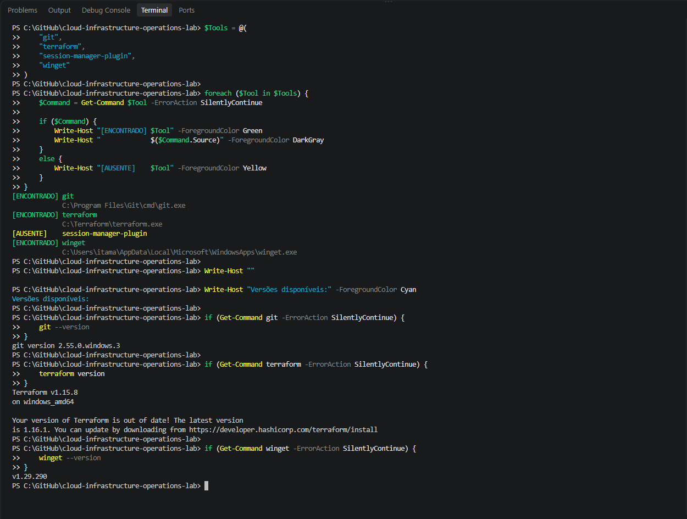
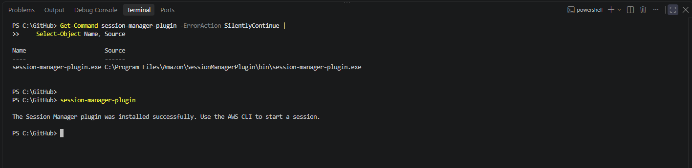
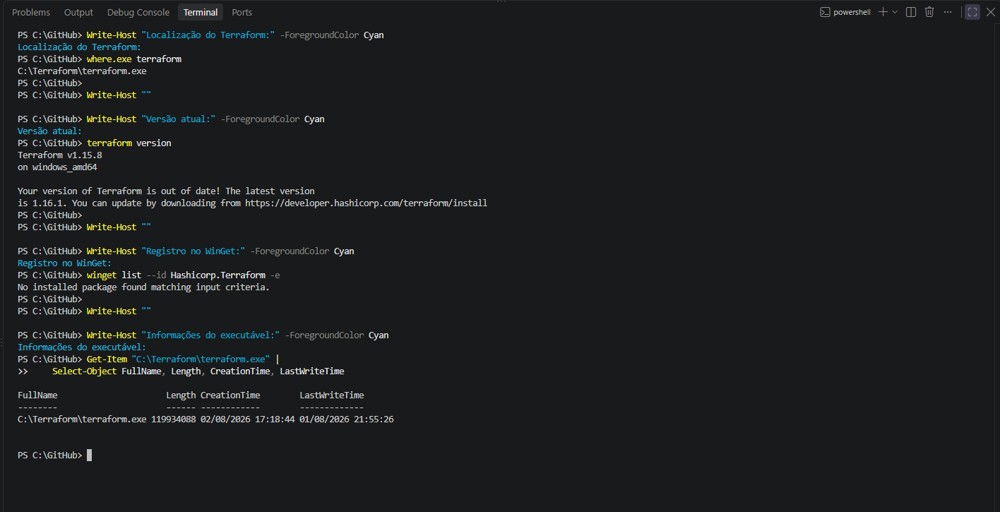
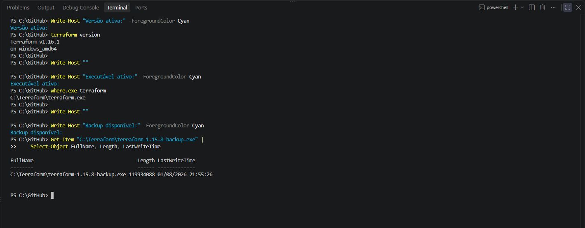
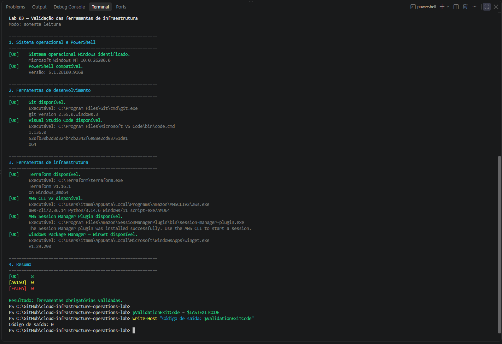

# Lab 03 — Instalação das ferramentas de infraestrutura

## Objetivo

Instalar, atualizar e validar as ferramentas de infraestrutura utilizadas nos próximos laboratórios do projeto **Cloud Infrastructure Operations Lab**.

---

## Informações rápidas

| Item | Informação |
|---|---|
| Sistema operacional | Windows 11 |
| Shell | Windows PowerShell 5.1 |
| Nível | Básico |
| Serviços AWS | Nenhum recurso criado |
| Custos AWS | Nenhum |
| Script de validação | `scripts/validate-infrastructure-tools.ps1` |
| Status | ✅ Concluído |

---

## Ferramentas utilizadas

| Ferramenta | Versão validada | Finalidade |
|---|---:|---|
| Git | 2.55.0 | Versionamento do projeto |
| Visual Studio Code | 1.136.0 | Edição e terminal integrado |
| Terraform | 1.16.1 | Infraestrutura como código |
| AWS CLI | 2.36.14 | Administração da AWS pela linha de comando |
| Session Manager Plugin | Instalado | Acesso a sessões do AWS Systems Manager |
| WinGet | 1.29.290 | Gerenciamento de pacotes no Windows |
| Windows PowerShell | 5.1.26100.9168 | Execução dos procedimentos e validações |

---

## Cenário inicial

O inventário inicial confirmou que Git, Terraform, WinGet, PowerShell e Visual Studio Code já estavam disponíveis.

Também foram identificadas duas ações necessárias:

- instalar o AWS Systems Manager Session Manager Plugin;
- atualizar o Terraform da versão 1.15.8 para a versão 1.16.1.



---

## Instalação do AWS Systems Manager Session Manager Plugin

O plugin foi obtido por meio do endereço oficial de distribuição da AWS e instalado no Windows.

A instalação foi validada pela localização do executável:

```text
C:\Program Files\Amazon\SessionManagerPlugin\bin\session-manager-plugin.exe
```

A execução do comando `session-manager-plugin` confirmou que o componente estava instalado e disponível para utilização pela AWS CLI.



---

## Atualização do Terraform

A instalação existente do Terraform utilizava diretamente o executável:

```text
C:\Terraform\terraform.exe
```

O Terraform não era gerenciado pelo WinGet e estava na versão 1.15.8.



Antes da atualização, foram adotados os seguintes controles:

1. download do Terraform 1.16.1 pelo repositório oficial da HashiCorp;
2. obtenção do arquivo oficial de checksums;
3. cálculo local do hash SHA-256;
4. comparação entre o checksum oficial e o calculado;
5. criação de um backup da versão anterior;
6. substituição controlada do executável;
7. validação da versão ativa e do caminho utilizado.

Os checksums oficial e calculado foram idênticos:

```text
5C6C6D8FEDF56CE29C55F0C1FC91DE3C259F42C2D220A28E827B5B60FD47BFA1
```

O backup foi preservado em:

```text
C:\Terraform\terraform-1.15.8-backup.exe
```

A validação confirmou o Terraform 1.16.1 para Windows AMD64.



---

## Script de validação

O script `validate-infrastructure-tools.ps1` executa somente operações de leitura.

Ele verifica:

- sistema operacional Windows;
- compatibilidade do PowerShell;
- Git;
- Visual Studio Code;
- Terraform;
- AWS CLI v2;
- AWS Systems Manager Session Manager Plugin;
- Windows Package Manager — WinGet.

O script não:

- instala ou remove programas;
- modifica o `PATH`;
- altera configurações;
- realiza autenticação na AWS;
- exibe credenciais;
- cria, modifica ou remove recursos AWS.

### Execução

A partir da raiz do repositório:

```powershell
Set-ExecutionPolicy `
    -Scope Process `
    -ExecutionPolicy Bypass

.\labs\03-infrastructure-tools-installation\scripts\validate-infrastructure-tools.ps1

Write-Host "Código de saída: $LASTEXITCODE"
```

A alteração da política de execução é limitada ao processo atual do PowerShell e não modifica permanentemente a configuração do Windows.

---

## Compatibilidade de codificação

O Windows PowerShell 5.1 requer atenção ao executar arquivos com caracteres acentuados.

O script foi gravado em **UTF-8 com BOM** para garantir a interpretação correta dos caracteres e impedir que partes do código fossem tratadas como texto.

Essa correção também foi registrada separadamente no histórico Git.

---

## Validação final

A validação conjunta apresentou:

```text
[OK]     8
[AVISO]  0
[FALHA]  0
```

O script encerrou com código de saída `0`, confirmando que todas as ferramentas obrigatórias estavam disponíveis.



---

## Cleanup

Os arquivos temporários utilizados para as instalações foram removidos:

- instalador do Session Manager Plugin;
- arquivo compactado do Terraform 1.16.1;
- diretório temporário de extração do Terraform.

O backup do Terraform 1.15.8 foi preservado para permitir uma recuperação manual caso seja necessária.

Este laboratório não criou recursos AWS e não gerou custos.

---

## Checklist de conclusão

- [x] Inventário inicial das ferramentas realizado.
- [x] Git validado.
- [x] Visual Studio Code validado.
- [x] AWS CLI v2 validada.
- [x] AWS Systems Manager Session Manager Plugin instalado.
- [x] Terraform atualizado para a versão 1.16.1.
- [x] Checksum SHA-256 do Terraform validado.
- [x] Backup da versão anterior do Terraform criado.
- [x] WinGet validado.
- [x] Script de validação criado.
- [x] Compatibilidade com o Windows PowerShell 5.1 confirmada.
- [x] Validação executada no terminal integrado do VS Code.
- [x] Evidências revisadas e adicionadas.
- [x] Arquivos temporários removidos.
- [x] Nenhuma credencial foi incluída no repositório.

---

## Lições aprendidas

Ao concluir este laboratório, foram praticados:

- inventário de ferramentas de uma estação de trabalho;
- instalação de componentes oficiais da AWS;
- atualização controlada de uma ferramenta de infraestrutura;
- validação de integridade com SHA-256;
- criação de backup antes de uma mudança;
- diagnóstico de executáveis disponíveis no `PATH`;
- automação de verificações com PowerShell;
- utilização de códigos de saída;
- compatibilidade de scripts com diferentes codificações;
- cleanup após uma atividade de manutenção;
- registro de evidências técnicas.

---

## Referências oficiais

- [Install the Session Manager plugin for Windows](https://docs.aws.amazon.com/systems-manager/latest/userguide/install-plugin-windows.html)
- [Install Terraform](https://developer.hashicorp.com/terraform/install)
- [Terraform releases](https://releases.hashicorp.com/terraform/)
- [AWS CLI documentation](https://docs.aws.amazon.com/cli/)
- [Git for Windows](https://gitforwindows.org/)
- [Visual Studio Code documentation](https://code.visualstudio.com/docs)
- [Windows Package Manager](https://learn.microsoft.com/windows/package-manager/)

---

## Próximo laboratório

Continue para:

```text
Lab 04 — Navegação e gerenciamento de arquivos no Linux
```
