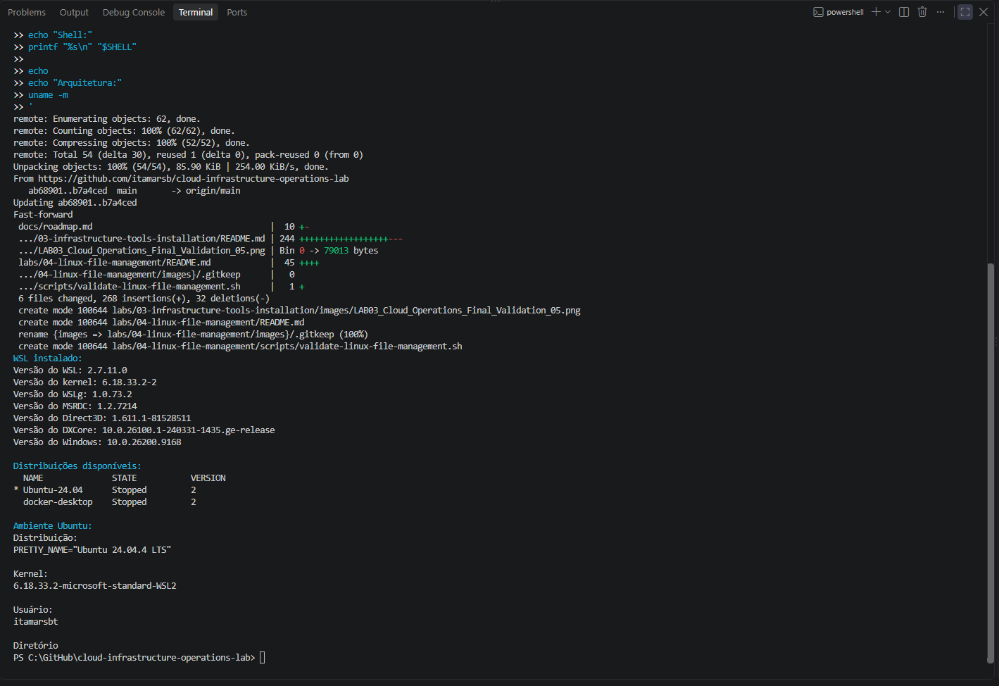
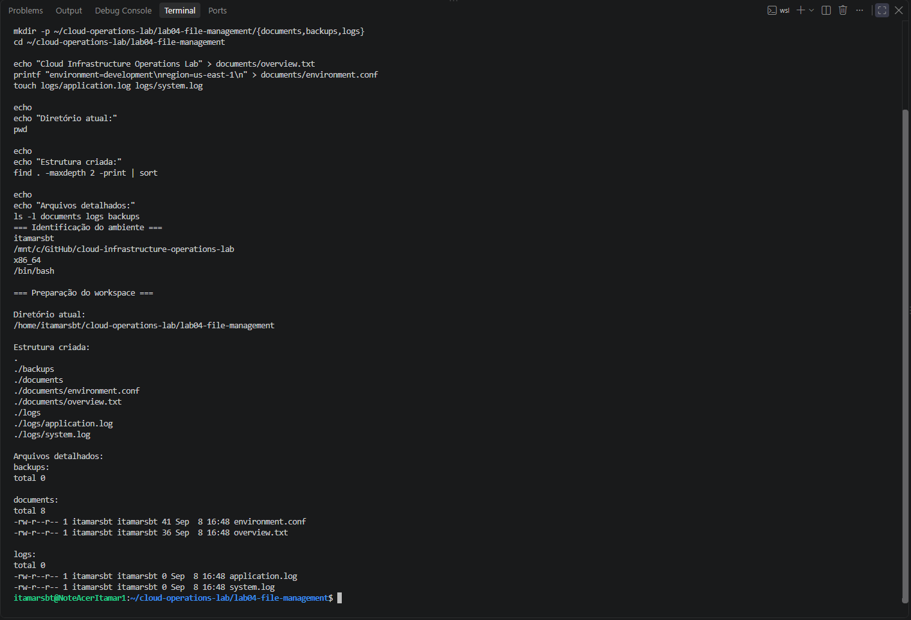
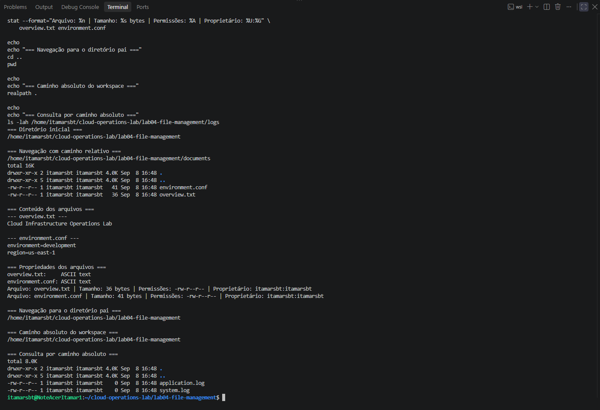
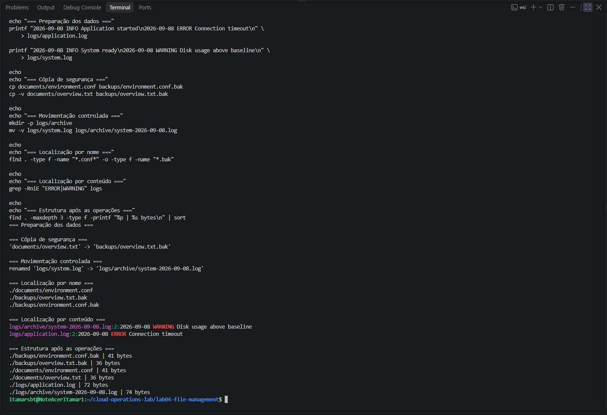
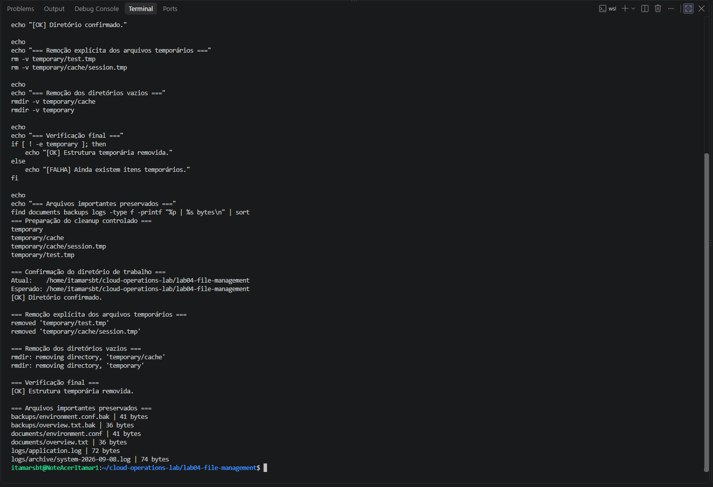
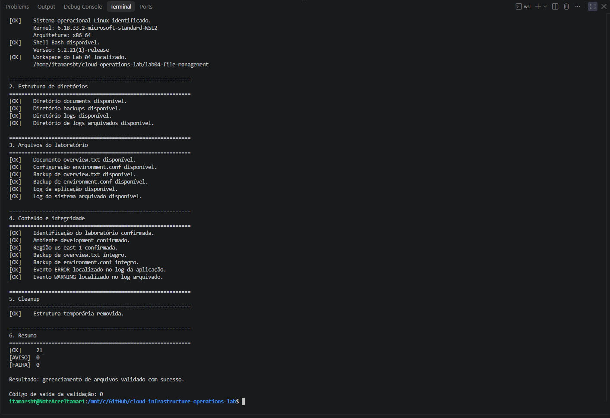

# Lab 04 — Navegação e gerenciamento de arquivos no Linux

## Objetivo

Desenvolver habilidades fundamentais para navegar pelo sistema de arquivos Linux e executar operações controladas de criação, consulta, cópia, movimentação, localização e remoção de arquivos.

O laboratório também implementa uma validação automatizada em Bash para verificar a estrutura criada, a integridade dos backups, o conteúdo dos arquivos e o cleanup do ambiente temporário.

---

## Ambiente utilizado

| Componente | Configuração |
|:---:|---|
| Sistema hospedeiro | Windows 11 Pro |
| Ambiente Linux | Windows Subsystem for Linux 2 |
| Distribuição | Ubuntu 24.04.4 LTS |
| Kernel | `6.18.33.2-microsoft-standard-WSL2` |
| Arquitetura | `x86_64` |
| Shell | Bash `5.2.21` |
| Usuário Linux | `itamarsbt` |
| Diretório do laboratório | `/home/itamarsbt/cloud-operations-lab/lab04-file-management` |

---

## Competências desenvolvidas

Durante este laboratório foram praticadas as seguintes atividades:

- identificação do ambiente Linux;
- navegação entre diretórios;
- utilização de caminhos relativos e absolutos;
- criação de diretórios e arquivos;
- listagem de arquivos com diferentes níveis de detalhe;
- leitura e inspeção de conteúdo;
- consulta de propriedades, permissões e proprietário;
- criação de cópias de segurança;
- movimentação e renomeação de arquivos;
- localização de arquivos por nome;
- pesquisa de conteúdo em logs;
- remoção controlada de arquivos temporários;
- validação da integridade dos backups;
- criação e execução de um script Bash;
- utilização de códigos de saída;
- tratamento de incompatibilidades entre CRLF e LF;
- registro de evidências técnicas.

---

## Estrutura do laboratório

A estrutura documental armazenada no repositório é:

```text
labs/04-linux-file-management/
├── README.md
├── images/
│   ├── LAB04_Cloud_Operations_Controlled_Cleanup_05.png
│   ├── LAB04_Cloud_Operations_Copy_Move_Search_04.png
│   ├── LAB04_Cloud_Operations_Final_Validation_06.png
│   ├── LAB04_Cloud_Operations_Linux_Environment_01.png
│   ├── LAB04_Cloud_Operations_Navigation_Inspection_03.png
│   └── LAB04_Cloud_Operations_Workspace_Creation_02.png
└── scripts/
    └── validate-linux-file-management.sh
```

O workspace operacional criado dentro do Ubuntu possui a seguinte estrutura:

```text
/home/itamarsbt/cloud-operations-lab/lab04-file-management/
├── backups/
│   ├── environment.conf.bak
│   └── overview.txt.bak
├── documents/
│   ├── environment.conf
│   └── overview.txt
└── logs/
    ├── application.log
    └── archive/
        └── system-2026-09-08.log
```

O workspace foi mantido no sistema de arquivos nativo do Linux para preservar o comportamento esperado de permissões, caminhos e ferramentas GNU/Linux.

---

## 1. Validação do ambiente Linux

A distribuição instalada no WSL foi identificada com os seguintes comandos:

```bash
whoami
pwd
uname -m
getent passwd "$(whoami)" | cut -d: -f7
```

Também foram consultadas, pelo PowerShell, a versão do WSL e as distribuições disponíveis:

```powershell
wsl --version
wsl --list --verbose
```

O ambiente validado apresentou:

- WSL versão `2.7.11.0`;
- distribuição Ubuntu `24.04.4 LTS`;
- execução sobre WSL 2;
- arquitetura `x86_64`;
- shell `/bin/bash`;
- usuário comum `itamarsbt`.



---

## 2. Preparação do workspace

O diretório de trabalho foi criado dentro do diretório pessoal do usuário:

```bash
mkdir -p ~/cloud-operations-lab/lab04-file-management/{documents,backups,logs}

cd ~/cloud-operations-lab/lab04-file-management
```

Os primeiros arquivos foram preparados com:

```bash
echo "Cloud Infrastructure Operations Lab" > documents/overview.txt

printf "environment=development\nregion=us-east-1\n" \
    > documents/environment.conf

touch logs/application.log logs/system.log
```

A estrutura foi conferida com:

```bash
find . -maxdepth 2 -print | sort
ls -l documents logs backups
```



---

## 3. Navegação e inspeção

A navegação por caminho relativo foi realizada entrando no diretório `documents`:

```bash
cd documents
pwd
ls -lah
```

O conteúdo dos arquivos foi consultado com:

```bash
cat overview.txt
cat environment.conf
```

O tipo, o tamanho, as permissões e o proprietário foram verificados com:

```bash
file overview.txt environment.conf

stat \
    --format="Arquivo: %n | Tamanho: %s bytes | Permissões: %A | Proprietário: %U:%G" \
    overview.txt environment.conf
```

O retorno ao diretório pai utilizou um caminho relativo:

```bash
cd ..
```

O caminho absoluto do workspace foi obtido com:

```bash
realpath .
```

A consulta direta ao diretório de logs demonstrou o uso de um caminho absoluto:

```bash
ls -lah /home/itamarsbt/cloud-operations-lab/lab04-file-management/logs
```



---

## 4. Cópia, movimentação e localização

Foram adicionados registros controlados aos arquivos de log:

```bash
printf "2026-09-08 INFO Application started\n2026-09-08 ERROR Connection timeout\n" \
    > logs/application.log

printf "2026-09-08 INFO System ready\n2026-09-08 WARNING Disk usage above baseline\n" \
    > logs/system.log
```

### Criação dos backups

Os documentos foram copiados para o diretório `backups`:

```bash
cp documents/environment.conf backups/environment.conf.bak
cp -v documents/overview.txt backups/overview.txt.bak
```

Os arquivos originais permaneceram disponíveis no diretório `documents`.

### Movimentação do log

O log do sistema foi movido e renomeado para representar um processo simples de arquivamento:

```bash
mkdir -p logs/archive

mv -v \
    logs/system.log \
    logs/archive/system-2026-09-08.log
```

### Localização por nome

Os arquivos de configuração e backup foram localizados com:

```bash
find . \
    -type f -name "*.conf*" \
    -o \
    -type f -name "*.bak"
```

### Localização por conteúdo

Eventos de erro e aviso foram pesquisados recursivamente:

```bash
grep -RniE "ERROR|WARNING" logs
```

A busca encontrou:

```text
logs/archive/system-2026-09-08.log:2:2026-09-08 WARNING Disk usage above baseline
logs/application.log:2:2026-09-08 ERROR Connection timeout
```



---

## 5. Remoção controlada e cleanup

Para praticar a remoção com segurança, foi criada uma estrutura exclusivamente temporária:

```bash
mkdir -p temporary/cache
touch temporary/test.tmp
touch temporary/cache/session.tmp
```

Antes da remoção, o diretório atual foi comparado com o caminho esperado:

```bash
CURRENT_DIRECTORY="$(pwd)"
EXPECTED_DIRECTORY="$HOME/cloud-operations-lab/lab04-file-management"

if [ "$CURRENT_DIRECTORY" != "$EXPECTED_DIRECTORY" ]; then
    echo "[FALHA] Diretório inesperado. Cleanup interrompido."
    exit 1
fi
```

Somente após essa confirmação os arquivos temporários foram removidos explicitamente:

```bash
rm -v temporary/test.tmp
rm -v temporary/cache/session.tmp

rmdir -v temporary/cache
rmdir -v temporary
```

Esse procedimento evita comandos recursivos aplicados sobre caminhos amplos ou não validados.

A verificação final confirmou a remoção da estrutura temporária e a preservação dos documentos, backups e logs.



---

## 6. Validação automatizada

O script utilizado está disponível em:

```text
scripts/validate-linux-file-management.sh
```

Ele opera em modo somente leitura e verifica:

- sistema operacional Linux;
- disponibilidade do Bash;
- existência do workspace;
- estrutura de diretórios;
- presença dos documentos;
- presença dos backups;
- existência dos logs;
- conteúdo do arquivo de configuração;
- conteúdo dos registros de log;
- igualdade entre arquivos originais e backups;
- ausência da estrutura temporária;
- quantidade de sucessos, avisos e falhas.

### Verificação da sintaxe

Antes da execução, a sintaxe foi validada com:

```bash
bash -n scripts/validate-linux-file-management.sh
```

Um código de saída `0` indica que não foram encontrados erros de sintaxe.

### Execução

A partir da raiz do repositório:

```bash
bash labs/04-linux-file-management/scripts/validate-linux-file-management.sh
```

### Resultado

A execução final retornou:

```text
[OK]     21
[AVISO]  0
[FALHA]  0

Resultado: gerenciamento de arquivos validado com sucesso.

Código de saída da validação: 0
```



---

## Troubleshooting — terminações de linha CRLF e LF

Durante a primeira tentativa de execução, o Bash apresentou:

```text
$'\r': command not found
```

A causa foi a presença de terminações de linha CRLF, utilizadas normalmente pelo Windows, em um script executado pelo Bash no Linux.

A conversão local foi realizada com:

```bash
sed -i 's/\r$//' \
    labs/04-linux-file-management/scripts/validate-linux-file-management.sh
```

As primeiras linhas foram verificadas com:

```bash
sed -n '1,3l' \
    labs/04-linux-file-management/scripts/validate-linux-file-management.sh
```

Para evitar recorrência, foi criado o arquivo `.gitattributes` na raiz do repositório:

```gitattributes
*.sh text eol=lf
```

Essa regra determina que scripts shell sejam mantidos com terminações LF, independentemente do sistema operacional utilizado para manipular o repositório.

---

## Boas práticas aplicadas

- utilização de um workspace restrito ao laboratório;
- execução com usuário comum;
- uso de caminhos claros e verificáveis;
- preservação dos arquivos originais;
- criação de backups antes de operações posteriores;
- movimentação controlada de logs;
- remoção somente de alvos temporários explícitos;
- validação do diretório antes do cleanup;
- comparação dos backups com `cmp`;
- pesquisa de eventos com `grep`;
- automação de verificações com Bash;
- utilização de códigos de saída;
- padronização das terminações de linha com `.gitattributes`;
- registro de evidências técnicas no GitHub.

---

## Resultado alcançado

O laboratório foi concluído com sucesso.

Foram demonstradas operações fundamentais de administração de arquivos no Linux, desde a criação do workspace até a validação automatizada de sua estrutura e conteúdo.

A atividade também registrou um cenário real de troubleshooting em um ambiente híbrido Windows, Git e WSL, incluindo identificação e correção de incompatibilidade entre terminações CRLF e LF.

---

## Status

✅ Laboratório concluído.

---

## Próximo laboratório

Continue para:

```text
Lab 05 — Usuários, grupos e permissões
```
