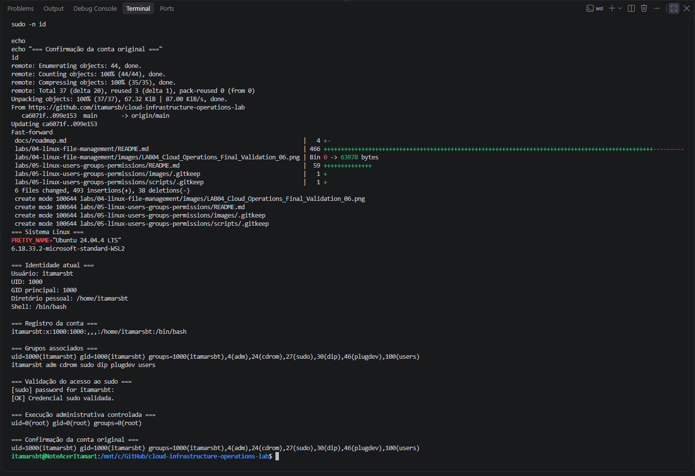
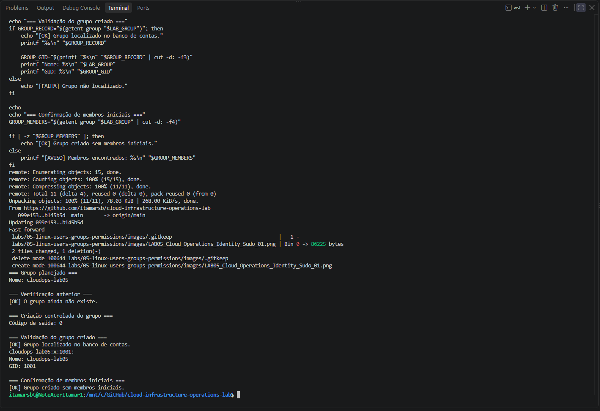
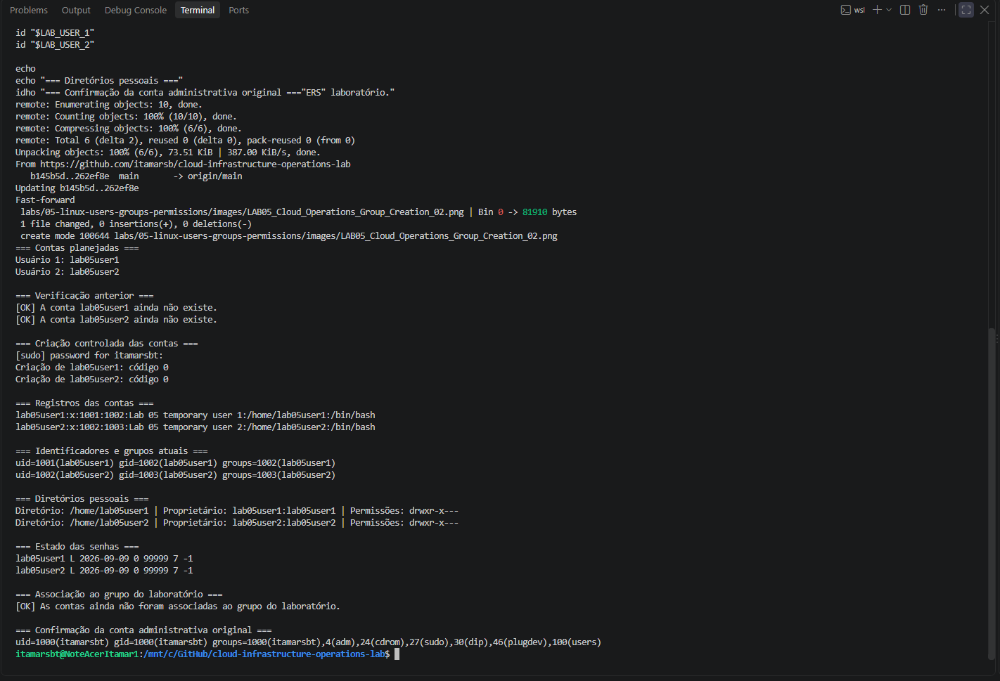
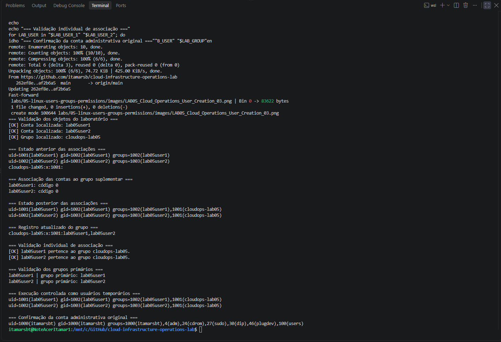
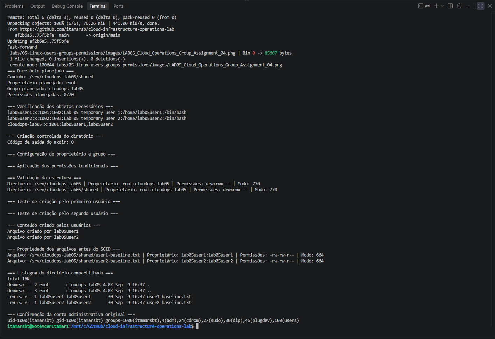
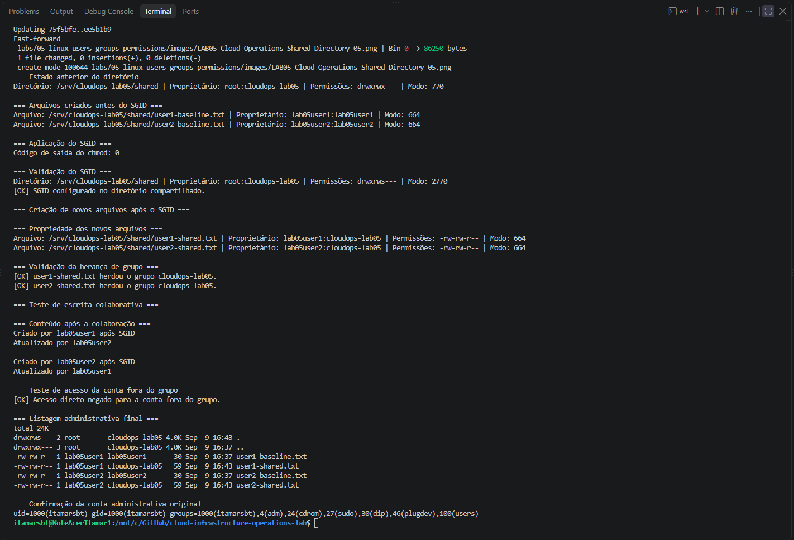
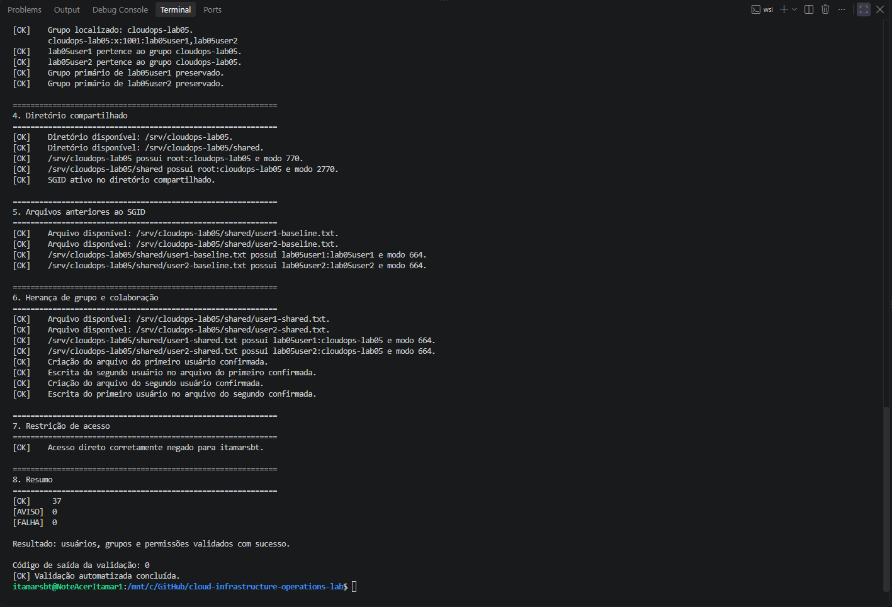
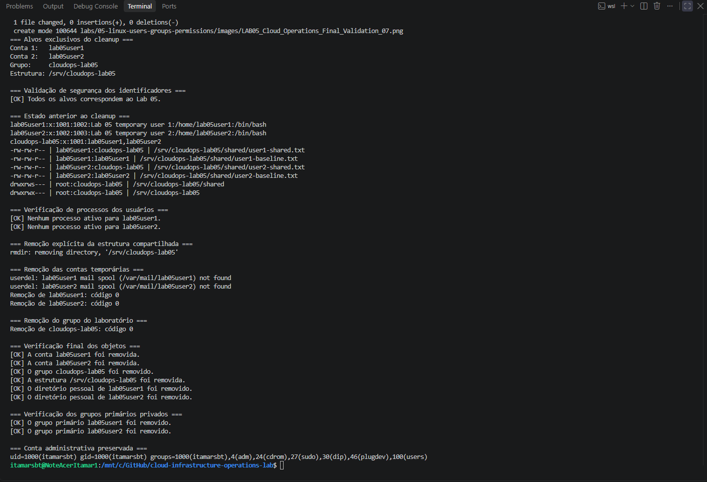

# Lab 05 — Usuários, grupos e permissões no Linux

## Visão geral

Este laboratório apresenta uma implementação prática de gerenciamento de identidades e controle de acesso em um sistema Linux.

A atividade utiliza contas temporárias, um grupo exclusivo e um diretório compartilhado para demonstrar:

- identificação de usuários e grupos;
- execução administrativa com `sudo`;
- criação controlada de contas locais;
- associação a grupos suplementares;
- configuração de proprietário e grupo;
- aplicação de permissões tradicionais;
- utilização do SGID em diretórios;
- colaboração entre usuários;
- restrição de acesso para contas não autorizadas;
- validação automatizada;
- cleanup seguro dos objetos criados.

Todos os recursos utilizados foram exclusivos deste laboratório e removidos ao final da atividade.

---

## Objetivo

Configurar e validar um ambiente colaborativo no Linux utilizando usuários, grupos e permissões de sistema de arquivos.

Ao concluir o laboratório, o estudante deverá conseguir:

- consultar a identidade de uma conta Linux;
- interpretar UID, GID e grupos suplementares;
- utilizar `sudo` de maneira controlada;
- criar usuários e grupos locais;
- bloquear autenticação direta em contas temporárias;
- configurar proprietário e grupo de arquivos e diretórios;
- aplicar permissões com `chmod`;
- utilizar SGID para controlar herança de grupo;
- testar acesso entre usuários;
- automatizar verificações com Bash;
- remover contas, grupos e diretórios de maneira segura.

---

## Ambiente utilizado

| Componente | Configuração |
|:---:|:---:|
| Sistema operacional hospedeiro | Windows 11 Pro |
| Ambiente Linux | WSL 2 |
| Distribuição | Ubuntu 24.04.4 LTS |
| Kernel | `6.18.33.2-microsoft-standard-WSL2` |
| Arquitetura | `x86_64` |
| Shell | Bash |
| Conta administrativa | `itamarsbt` |
| Grupo do laboratório | `cloudops-lab05` |
| Usuários temporários | `lab05user1` e `lab05user2` |
| Diretório compartilhado | `/srv/cloudops-lab05/shared` |

---

## Estrutura do laboratório

```text
labs/
└── 05-linux-users-groups-permissions/
    ├── README.md
    ├── images/
    │   ├── LAB05_Cloud_Operations_Identity_Sudo_01.png
    │   ├── LAB05_Cloud_Operations_Group_Creation_02.png
    │   ├── LAB05_Cloud_Operations_User_Creation_03.png
    │   ├── LAB05_Cloud_Operations_Group_Assignment_04.png
    │   ├── LAB05_Cloud_Operations_Shared_Directory_05.png
    │   ├── LAB05_Cloud_Operations_SGID_Collaboration_06.png
    │   ├── LAB05_Cloud_Operations_Final_Validation_07.png
    │   └── LAB05_Cloud_Operations_Controlled_Cleanup_08.png
    └── scripts/
        └── validate-linux-users-groups-permissions.sh
```

---

## Escopo de segurança

As contas e os grupos utilizados foram criados exclusivamente para este laboratório:

| Objeto | Finalidade |
|---|---|
| `cloudops-lab05` | Grupo suplementar para colaboração |
| `lab05user1` | Primeira conta temporária |
| `lab05user2` | Segunda conta temporária |
| `/srv/cloudops-lab05` | Estrutura isolada do laboratório |
| `/srv/cloudops-lab05/shared` | Diretório colaborativo |

Nenhuma conta existente foi removida ou teve suas permissões alteradas.

As contas temporárias foram criadas sem senha utilizável. A execução de comandos em seus contextos ocorreu por meio de `sudo --user`, evitando autenticação direta.

O cleanup utilizou identificadores e caminhos explícitos, verificação de processos ativos e validação posterior à remoção.

---

## 1. Validação da identidade e do acesso administrativo

A primeira etapa identificou o ambiente Linux, a conta atual e os grupos associados.

Os comandos `whoami`, `id`, `getent` e `groups` permitiram consultar informações mantidas pelos bancos de contas do sistema.

```bash
grep '^PRETTY_NAME=' /etc/os-release
uname -r

whoami
id -u
id -g
printf "%s\n" "$HOME"
printf "%s\n" "$SHELL"

getent passwd "$(whoami)"
id
groups
```

A conta `itamarsbt` apresentou:

- UID `1000`;
- GID principal `1000`;
- diretório pessoal `/home/itamarsbt`;
- shell `/bin/bash`;
- associação ao grupo administrativo `sudo`.

A credencial administrativa foi validada com:

```bash
sudo -v
sudo -n id
```

O comando administrativo retornou:

```text
uid=0(root) gid=0(root) groups=0(root)
```

Depois da operação, `id` confirmou que o terminal continuava no contexto da conta original.



---

## 2. Criação do grupo do laboratório

Foi criado o grupo suplementar:

```text
cloudops-lab05
```

Antes da alteração, `getent` confirmou que o nome ainda não estava registrado.

```bash
getent group cloudops-lab05
```

O grupo foi criado com:

```bash
sudo groupadd cloudops-lab05
```

A validação posterior apresentou:

```text
cloudops-lab05:x:1001:
```

Nesse registro:

- `cloudops-lab05` é o nome do grupo;
- `x` indica que informações protegidas são mantidas separadamente;
- `1001` é o GID atribuído;
- o campo final vazio indica ausência de membros suplementares naquele momento.



---

## 3. Criação das contas temporárias

Foram criadas duas contas exclusivas do laboratório:

```text
lab05user1
lab05user2
```

A criação utilizou diretórios pessoais, Bash como shell e comentários descritivos:

```bash
sudo useradd \
    --create-home \
    --shell /bin/bash \
    --comment "Lab 05 temporary user 1" \
    lab05user1

sudo useradd \
    --create-home \
    --shell /bin/bash \
    --comment "Lab 05 temporary user 2" \
    lab05user2
```

Os registros foram consultados com:

```bash
getent passwd lab05user1
getent passwd lab05user2
```

Resultado:

```text
lab05user1:x:1001:1002:Lab 05 temporary user 1:/home/lab05user1:/bin/bash
lab05user2:x:1002:1003:Lab 05 temporary user 2:/home/lab05user2:/bin/bash
```

Cada conta recebeu:

- UID próprio;
- grupo primário privado;
- diretório pessoal;
- shell `/bin/bash`;
- senha bloqueada.

O estado das senhas foi validado com:

```bash
sudo passwd --status lab05user1
sudo passwd --status lab05user2
```

O estado `L` indicou que as senhas estavam bloqueadas.

As permissões dos diretórios pessoais foram apresentadas como:

```text
drwxr-x---
```

Isso restringiu o acesso aos respectivos proprietários e grupos.



---

## 4. Associação das contas ao grupo

As contas foram associadas ao grupo `cloudops-lab05` com `usermod`.

A opção `--append` foi utilizada para preservar os grupos existentes:

```bash
sudo usermod --append --groups cloudops-lab05 lab05user1
sudo usermod --append --groups cloudops-lab05 lab05user2
```

A utilização de `--append` é importante porque uma alteração de grupos suplementares sem essa opção pode substituir associações existentes.

A validação foi realizada com:

```bash
id lab05user1
id lab05user2
getent group cloudops-lab05
```

O registro atualizado do grupo foi:

```text
cloudops-lab05:x:1001:lab05user1,lab05user2
```

Os grupos primários permaneceram inalterados:

```text
lab05user1 → grupo primário lab05user1
lab05user2 → grupo primário lab05user2
```

A execução controlada no contexto das contas foi confirmada com:

```bash
sudo --user=lab05user1 -- id
sudo --user=lab05user2 -- id
```



---

## 5. Criação do diretório compartilhado

Foi criada uma estrutura compartilhada em `/srv`, diretório tradicionalmente utilizado para dados disponibilizados por serviços e ambientes administrados.

```bash
sudo mkdir --parents /srv/cloudops-lab05/shared
```

O proprietário e o grupo foram configurados com:

```bash
sudo chown root:cloudops-lab05 /srv/cloudops-lab05
sudo chown root:cloudops-lab05 /srv/cloudops-lab05/shared
```

Inicialmente, foram aplicadas permissões tradicionais `770`:

```bash
sudo chmod 0770 /srv/cloudops-lab05
sudo chmod 0770 /srv/cloudops-lab05/shared
```

O modo `770` representa:

| Classe | Permissões |
|---|---|
| Proprietário | leitura, escrita e execução |
| Grupo | leitura, escrita e execução |
| Outros | nenhuma permissão |

A configuração resultante foi:

```text
drwxrwx--- root:cloudops-lab05
```

### Comportamento anterior ao SGID

Cada usuário criou um arquivo no diretório compartilhado.

```bash
sudo --user=lab05user1 -- \
    bash -c 'printf "Arquivo criado por %s\n" "$(whoami)" > /srv/cloudops-lab05/shared/user1-baseline.txt'

sudo --user=lab05user2 -- \
    bash -c 'printf "Arquivo criado por %s\n" "$(whoami)" > /srv/cloudops-lab05/shared/user2-baseline.txt'
```

Antes do SGID, os arquivos receberam os grupos primários de seus criadores:

```text
user1-baseline.txt → lab05user1:lab05user1
user2-baseline.txt → lab05user2:lab05user2
```

Esse resultado estabeleceu uma referência para comparação com a etapa seguinte.



---

## 6. Configuração e validação do SGID

O bit SGID foi aplicado ao diretório compartilhado:

```bash
sudo chmod 2770 /srv/cloudops-lab05/shared
```

O modo passou de `770` para `2770`:

```text
drwxrws--- root:cloudops-lab05
```

A letra `s` na posição de execução do grupo indica que o SGID está ativo.

Em um diretório com SGID, novos arquivos e subdiretórios herdam o grupo do diretório pai, em vez do grupo primário do usuário que os criou.

### Criação de arquivos após o SGID

Foram criados dois novos arquivos:

```bash
sudo --user=lab05user1 -- \
    bash -c 'umask 0002; printf "Criado por %s após SGID\n" "$(whoami)" > /srv/cloudops-lab05/shared/user1-shared.txt'

sudo --user=lab05user2 -- \
    bash -c 'umask 0002; printf "Criado por %s após SGID\n" "$(whoami)" > /srv/cloudops-lab05/shared/user2-shared.txt'
```

A propriedade resultante foi:

```text
user1-shared.txt → lab05user1:cloudops-lab05
user2-shared.txt → lab05user2:cloudops-lab05
```

Os dois arquivos herdaram corretamente o grupo `cloudops-lab05`.

### Escrita colaborativa

O segundo usuário atualizou o arquivo criado pelo primeiro:

```bash
sudo --user=lab05user2 -- \
    bash -c 'printf "Atualizado por %s\n" "$(whoami)" >> /srv/cloudops-lab05/shared/user1-shared.txt'
```

O primeiro usuário atualizou o arquivo criado pelo segundo:

```bash
sudo --user=lab05user1 -- \
    bash -c 'printf "Atualizado por %s\n" "$(whoami)" >> /srv/cloudops-lab05/shared/user2-shared.txt'
```

A colaboração foi possível porque:

- ambos pertenciam ao grupo `cloudops-lab05`;
- o diretório utilizava SGID;
- os arquivos possuíam permissão de escrita para o grupo;
- a criação utilizou `umask 0002`.

### Restrição de acesso

A conta administrativa original não pertencia ao grupo do laboratório.

Uma tentativa direta de listar o diretório foi negada, enquanto o acesso administrativo permaneceu disponível com `sudo`.

Isso demonstrou a diferença entre:

- acesso comum baseado nas permissões da conta;
- acesso administrativo explicitamente elevado.



---

## 7. Validação automatizada

O script abaixo foi criado para validar o estado configurado antes do cleanup:

```text
scripts/validate-linux-users-groups-permissions.sh
```

A validação foi desenvolvida em modo somente leitura. O script não cria, altera nem remove contas, grupos, arquivos ou permissões.

Ele verifica:

- ambiente Linux;
- disponibilidade dos comandos necessários;
- existência das contas temporárias;
- shell e diretórios pessoais;
- bloqueio das senhas;
- existência do grupo;
- associações suplementares;
- preservação dos grupos primários;
- existência da estrutura em `/srv`;
- proprietário e grupo dos diretórios;
- modos `770` e `2770`;
- presença do SGID;
- arquivos anteriores ao SGID;
- herança de grupo nos arquivos posteriores;
- conteúdo produzido nos testes colaborativos;
- restrição de acesso para a conta fora do grupo.

### Verificação de sintaxe

Antes da execução, a sintaxe Bash foi verificada:

```bash
bash -n labs/05-linux-users-groups-permissions/scripts/validate-linux-users-groups-permissions.sh
```

Código retornado:

```text
0
```

### Execução

Como parte das verificações exige acesso a informações e objetos restritos, o script foi executado administrativamente:

```bash
sudo bash labs/05-linux-users-groups-permissions/scripts/validate-linux-users-groups-permissions.sh
```

Resumo obtido:

```text
[OK]     37
[AVISO]  0
[FALHA]  0

Resultado: usuários, grupos e permissões validados com sucesso.
```

Código de saída:

```text
0
```



> O validador verifica o estado operacional anterior ao cleanup. Para executá-lo novamente depois da conclusão do laboratório, as contas, o grupo, os diretórios e os arquivos demonstrativos deverão ser recriados.

---

## 8. Cleanup controlado

Depois da validação, todos os objetos temporários foram removidos.

Antes da exclusão, foram confirmados:

- nomes exatos das contas;
- nome exato do grupo;
- caminho exato da estrutura;
- ausência de processos ativos pertencentes às contas temporárias.

### Remoção da estrutura compartilhada

A estrutura foi removida utilizando o caminho explícito:

```bash
sudo find /srv/cloudops-lab05 -depth -mindepth 1 -delete
sudo rmdir /srv/cloudops-lab05
```

### Remoção das contas

As contas e seus diretórios pessoais foram removidos:

```bash
sudo userdel --remove lab05user1
sudo userdel --remove lab05user2
```

Mensagens informando a inexistência de arquivos em `/var/mail` são esperadas para contas que nunca receberam correio local e não representam falha.

### Remoção do grupo

O grupo exclusivo do laboratório foi removido:

```bash
sudo groupdel cloudops-lab05
```

### Estado final

As verificações posteriores confirmaram a remoção de:

- `lab05user1`;
- `lab05user2`;
- `cloudops-lab05`;
- grupos primários privados;
- `/home/lab05user1`;
- `/home/lab05user2`;
- `/srv/cloudops-lab05`.

A conta administrativa `itamarsbt` e seus grupos originais permaneceram preservados.



---

## Comparação dos arquivos antes e depois do SGID

| Arquivo | Momento da criação | Proprietário | Grupo | Modo |
|---|---|---|---|---|
| `user1-baseline.txt` | Antes do SGID | `lab05user1` | `lab05user1` | `664` |
| `user2-baseline.txt` | Antes do SGID | `lab05user2` | `lab05user2` | `664` |
| `user1-shared.txt` | Depois do SGID | `lab05user1` | `cloudops-lab05` | `664` |
| `user2-shared.txt` | Depois do SGID | `lab05user2` | `cloudops-lab05` | `664` |

A comparação demonstra que o SGID altera a herança de grupo dos novos objetos sem modificar retroativamente os arquivos existentes.

---

## Comandos principais utilizados

| Comando | Finalidade |
|---|---|
| `whoami` | Identificar o usuário efetivo |
| `id` | Consultar UID, GID e grupos |
| `groups` | Listar grupos associados |
| `getent passwd` | Consultar registros de usuários |
| `getent group` | Consultar registros de grupos |
| `sudo -v` | Validar a credencial administrativa |
| `groupadd` | Criar um grupo |
| `useradd` | Criar uma conta |
| `usermod -aG` | Adicionar uma conta a um grupo suplementar |
| `passwd -S` | Consultar o estado da senha |
| `chown` | Alterar proprietário e grupo |
| `chmod` | Alterar permissões e bits especiais |
| `stat` | Consultar propriedades detalhadas |
| `sudo --user` | Executar comando no contexto de outra conta |
| `userdel -r` | Remover conta e diretório pessoal |
| `groupdel` | Remover grupo |
| `pgrep -u` | Localizar processos pertencentes a um usuário |

---

## Conceitos demonstrados

### UID e GID

O UID identifica uma conta de usuário. O GID identifica um grupo.

Os nomes facilitam a administração humana, enquanto o sistema de arquivos registra internamente os identificadores numéricos.

### Grupo primário

Todo usuário possui um grupo primário. Por padrão, arquivos novos utilizam esse grupo quando não existe outro mecanismo de herança.

### Grupos suplementares

Grupos suplementares concedem acesso adicional sem substituir o grupo primário da conta.

Neste laboratório, `cloudops-lab05` foi utilizado como grupo suplementar das duas contas.

### Permissões tradicionais

As permissões Linux são organizadas em três classes:

- proprietário;
- grupo;
- outros.

Cada classe pode receber:

- `r` — leitura;
- `w` — escrita;
- `x` — execução ou travessia de diretório.

### Umask

A `umask` remove permissões do modo solicitado durante a criação de novos objetos.

A `umask 0002` permitiu preservar a escrita para o grupo nos arquivos colaborativos.

### SGID em diretórios

Quando o SGID está ativo em um diretório, os novos objetos herdam o grupo desse diretório.

Esse comportamento é particularmente útil em:

- diretórios de equipes;
- áreas compartilhadas;
- ambientes de desenvolvimento;
- diretórios de serviços;
- estruturas de operação e suporte.

### Princípio do menor privilégio

A conta `itamarsbt` permaneceu fora do grupo compartilhado e não recebeu acesso permanente ao diretório.

Quando necessário, operações administrativas foram realizadas explicitamente com `sudo`.

---

## Resultado alcançado

O laboratório foi concluído com sucesso.

Foram demonstradas operações fundamentais de administração de identidades e permissões no Linux, desde a criação controlada das contas até a validação automatizada e o cleanup do ambiente.

O cenário comprovou:

- criação segura de usuários e grupos;
- separação entre grupos primários e suplementares;
- controle de acesso por proprietário, grupo e outros;
- colaboração baseada em grupo;
- herança de grupo com SGID;
- restrição para contas não autorizadas;
- uso controlado de privilégios administrativos;
- validação por código de saída;
- remoção segura de todos os objetos temporários.

---

## Evidências

| Nº | Evidência | Resultado |
|---:|---|---|
| 01 | Identidade Linux e acesso ao `sudo` | Validado |
| 02 | Criação do grupo exclusivo | Validado |
| 03 | Criação das contas temporárias | Validado |
| 04 | Associação ao grupo suplementar | Validado |
| 05 | Diretório compartilhado e permissões `770` | Validado |
| 06 | SGID, herança de grupo e colaboração | Validado |
| 07 | Validação automatizada: 37 verificações aprovadas | Validado |
| 08 | Cleanup controlado | Validado |

---

## Status

✅ Laboratório concluído.

---

## Próximo laboratório

Continue para:

```text
Lab 06 — Processos, serviços e logs
```
