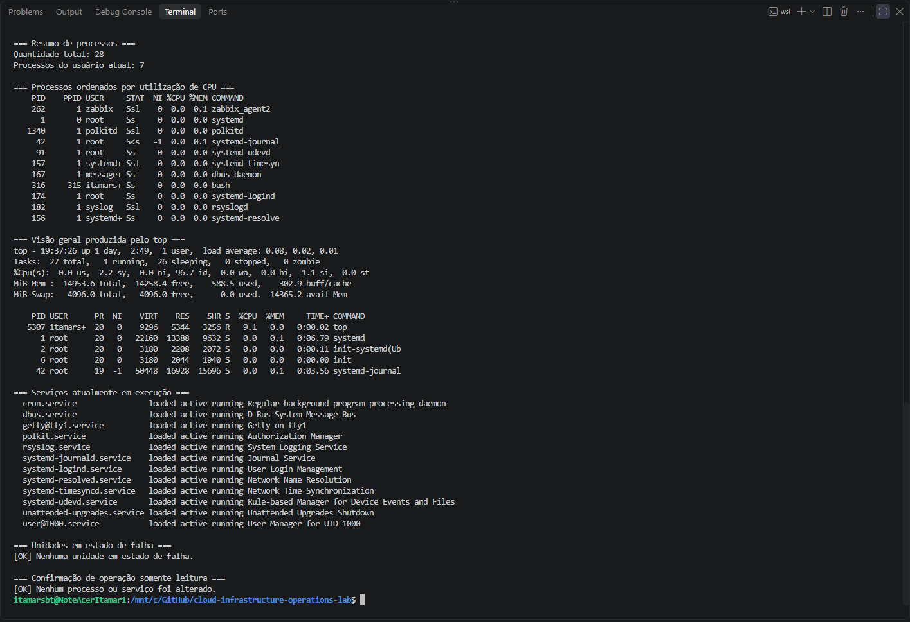
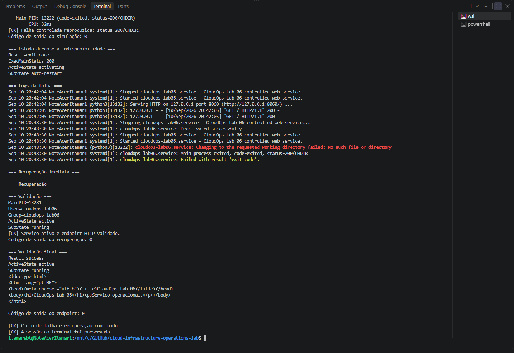

# Lab 06 — Serviços e logs no Linux

## Objetivo

Implantar e administrar um serviço Linux com `systemd`, verificar sua disponibilidade, diagnosticar uma falha de configuração pelos logs e restaurar a operação.

O laboratório utiliza um servidor HTTP local executado por uma conta de serviço dedicada.

---

## Ambiente

| Componente | Configuração |
|---|---|
| Sistema | Ubuntu 24.04 LTS no WSL 2 |
| Gerenciador de serviços | systemd |
| Serviço | cloudops-lab06.service |
| Aplicação | Python HTTP Server |
| Endpoint | http://127.0.0.1:8060 |
| Diretório | /srv/cloudops-lab06 |
| Conta de serviço | cloudops-lab06 |

---

## Cenário

Uma aplicação HTTP precisa ser instalada como serviço do sistema e permanecer disponível após sua inicialização.

O trabalho inclui:

- instalação e inicialização do serviço;
- execução com usuário sem acesso interativo;
- inspeção de processo, porta e estado;
- consulta de registros com `journalctl`;
- simulação de uma configuração inválida;
- identificação da falha `200/CHDIR`;
- restauração do serviço;
- validação do endpoint;
- remoção segura dos recursos.

---

## Implementação

O script [`manage-lab06-service.sh`](scripts/manage-lab06-service.sh) concentra as operações do laboratório.

| Ação | Finalidade |
|---|---|
| `setup` | Instala, habilita e inicia o serviço |
| `inspect` | Exibe estado, porta, logs e resposta HTTP |
| `simulate-failure` | Aplica uma configuração inválida controlada |
| `recover` | Remove a configuração inválida e restaura o serviço |
| `validate` | Confirma o processo e a disponibilidade HTTP |
| `cleanup` | Remove os recursos criados pelo laboratório |

A unidade utiliza opções básicas de proteção do `systemd`, incluindo:

- `NoNewPrivileges=true`;
- `PrivateTmp=true`;
- `ProtectSystem=strict`;
- `ProtectHome=true`;
- execução por uma conta com shell `nologin`;
- acesso HTTP restrito ao endereço local.

---

## Execução

A partir da raiz do repositório:

    cd labs/06-linux-processes-services-logs

Validar a sintaxe:

    bash -n scripts/manage-lab06-service.sh

Instalar o serviço:

    sudo bash scripts/manage-lab06-service.sh setup

Inspecionar a operação:

    sudo bash scripts/manage-lab06-service.sh inspect

Simular a falha:

    sudo bash scripts/manage-lab06-service.sh simulate-failure

Recuperar o serviço:

    sudo bash scripts/manage-lab06-service.sh recover

Validar o resultado:

    sudo bash scripts/manage-lab06-service.sh validate

Remover os recursos:

    sudo bash scripts/manage-lab06-service.sh cleanup

---

## Diagnóstico realizado

A falha controlada substitui o diretório de trabalho da unidade por um caminho inexistente.

O `systemd` registra:

    status=200/CHDIR

Esse resultado indica que o processo não conseguiu acessar o diretório configurado em `WorkingDirectory`.

Durante a falha, o serviço entra em tentativa automática de reinicialização e o endpoint deixa de responder. A recuperação remove o override inválido, recarrega as unidades e reinicia o serviço.

---

## Resultados

O ciclo foi validado com sucesso:

- serviço instalado e habilitado;
- processo executado pela conta `cloudops-lab06`;
- endpoint HTTP respondendo;
- falha de configuração identificada nos logs;
- serviço recuperado;
- recursos removidos ao final;
- repositório preservado sem alterações locais.

### Ambiente e inventário inicial

### Falha e recuperação do serviço

---

## Status

✅ Laboratório concluído.
