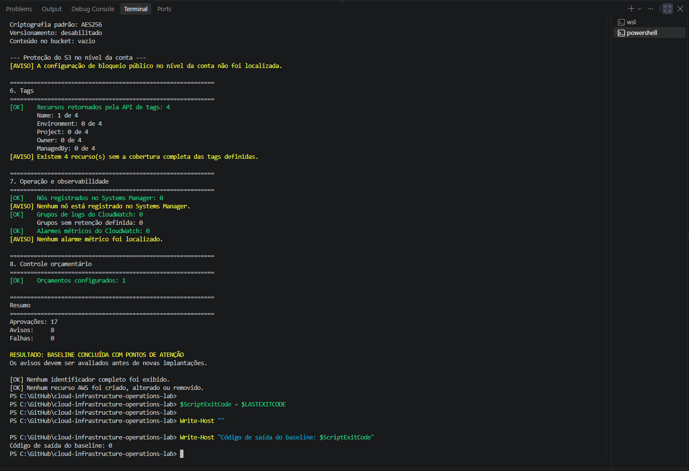

# Lab 07 — Baseline operacional da conta AWS

## Objetivo

Executar uma avaliação somente leitura de uma conta AWS antes de novas implantações.

O baseline reúne informações de identidade, rede, computação, armazenamento, segurança, tags, observabilidade e orçamento. A finalidade é entender o estado atual da conta, identificar pontos de atenção e evitar alterações em recursos cuja origem ou finalidade ainda precise ser confirmada.

---

## Ambiente validado

| Componente | Configuração |
|:---:|:---:|
| Sistema operacional | Windows 11 |
| Terminal | Windows PowerShell 5.1 |
| AWS CLI | AWS CLI 2.36.14 |
| Autenticação | AWS IAM Identity Center |
| Perfil | `cloud-operations-lab` |
| Região | `us-east-1` |
| Modo de execução | Somente leitura |
| Codificação do script | UTF-8 com BOM |

O uso de UTF-8 com BOM mantém a compatibilidade dos caracteres em português com o Windows PowerShell 5.1.

---

## O que é verificado

O script `scripts/test-aws-account-baseline.ps1` consulta:

- identidade e sessão AWS;
- Região operacional;
- VPCs, sub-redes e Security Groups;
- Elastic IPs e NAT Gateways;
- instâncias EC2 e volumes EBS;
- configurações de segurança do Amazon S3;
- cobertura de tags;
- integração com AWS Systems Manager;
- grupos de logs e alarmes do CloudWatch;
- orçamentos configurados no AWS Budgets.

O script trata respostas vazias ou incompletas da AWS CLI e apresenta um resumo com aprovações, avisos e falhas.

---

## Proteções adotadas

O baseline não:

- cria recursos;
- altera configurações;
- remove componentes;
- aplica correções automaticamente;
- exibe nomes de buckets;
- exibe Account ID, ARN ou UserId completos;
- exibe credenciais, tokens ou informações de sessão.

As correções identificadas devem ser avaliadas e executadas separadamente.

---

## Pré-requisitos

Antes da execução, é necessário possuir:

- AWS CLI versão 2;
- perfil `cloud-operations-lab` configurado;
- acesso pelo AWS IAM Identity Center;
- permissões de leitura para os serviços consultados;
- repositório sincronizado localmente.

Para renovar a sessão:

    aws sso login --profile cloud-operations-lab

---

## Validação de sintaxe

A sintaxe pode ser validada sem executar o script:

    Set-Location C:\GitHub\cloud-infrastructure-operations-lab

    $ScriptPath = ".\labs\07-aws-account-baseline\scripts\test-aws-account-baseline.ps1"

    $Tokens = $null
    $ParseErrors = $null

    [System.Management.Automation.Language.Parser]::ParseFile(
        (Resolve-Path -LiteralPath $ScriptPath).Path,
        [ref]$Tokens,
        [ref]$ParseErrors
    ) | Out-Null

    Write-Host "Erros de sintaxe: $($ParseErrors.Count)"

Resultado obtido:

    Erros de sintaxe: 0

---

## Execução

    Set-Location C:\GitHub\cloud-infrastructure-operations-lab

    $ScriptPath = ".\labs\07-aws-account-baseline\scripts\test-aws-account-baseline.ps1"

    & $ScriptPath `
        -ProfileName "cloud-operations-lab" `
        -Region "us-east-1"

    $ScriptExitCode = $LASTEXITCODE

    Write-Host ""
    Write-Host "Código de saída do baseline: $ScriptExitCode"

---

## Resultado

A execução completa apresentou:

| Resultado | Quantidade |
|:---:|:---:|
| Aprovações | 17 |
| Avisos | 8 |
| Falhas | 0 |
| Código de saída | 0 |

Resultado final:

    BASELINE CONCLUÍDA COM PONTOS DE ATENÇÃO

O script também confirmou que nenhum identificador completo foi exibido e nenhum recurso AWS foi criado, alterado ou removido.

---

## Evidência da execução

A captura abaixo registra as verificações finais de segurança, tags, observabilidade e orçamento, além do resumo consolidado.

A evidência confirma:

- 17 verificações aprovadas;
- 8 pontos de atenção;
- nenhuma falha;
- código de saída `0`;
- ausência de identificadores completos;
- ausência de criação, alteração ou remoção de recursos AWS.

---

## Inventário anonimizado

### Rede

| Recurso | Resultado |
|---|:---:|
| VPCs acessíveis | 1 |
| VPCs padrão | 1 |
| Sub-redes | 6 |
| Security Groups | 2 |
| Elastic IPs | 0 |
| NAT Gateways ativos ou pendentes | 0 |

### Computação e armazenamento

| Recurso | Resultado |
|---|:---:|
| Instâncias EC2 não terminadas | 1 |
| Instâncias EC2 paradas | 1 |
| Volumes EBS | 1 |
| Capacidade EBS provisionada | 8 GiB |

### Amazon S3

| Verificação | Resultado |
|---|:---:|
| Buckets acessíveis | 1 |
| Bloqueio público integral no bucket | Não |
| Política do bucket | Não configurada ou não acessível |
| ACL com concessão pública | Não |
| Hospedagem de site | Não configurada |
| Propriedade dos objetos | `BucketOwnerPreferred` |
| Criptografia padrão | `AES256` |
| Versionamento | Desabilitado |
| Conteúdo do bucket | Vazio |
| Bloqueio público no nível da conta | Não localizado |

O nome do bucket foi intencionalmente ocultado.

### Tags e operação

| Verificação | Resultado |
|---|:---:|
| Recursos retornados pela API de tags | 4 |
| Recursos com tag `Name` | 1 de 4 |
| Recursos com tag `Environment` | 0 de 4 |
| Recursos com tag `Project` | 0 de 4 |
| Recursos com tag `Owner` | 0 de 4 |
| Recursos com tag `ManagedBy` | 0 de 4 |
| Nós registrados no Systems Manager | 0 |
| Grupos de logs do CloudWatch | 0 |
| Alarmes métricos do CloudWatch | 0 |
| Orçamentos configurados | 1 |

---

## Pontos de atenção

A execução encontrou oito avisos:

1. uma instância EC2 está parada;
2. o monitoramento detalhado está desabilitado nessa instância;
3. existe um volume EBS sem criptografia;
4. o bucket S3 não possui bloqueio integral de acesso público;
5. o bloqueio público do S3 no nível da conta não foi localizado;
6. quatro recursos não possuem a cobertura completa das tags definidas;
7. nenhum nó está registrado no Systems Manager;
8. nenhum alarme métrico foi localizado no CloudWatch.

Os avisos não representam erros do script. Eles registram condições reais que devem ser avaliadas antes de novas implantações.

---

## Próximas decisões

A partir do baseline, as próximas decisões são:

1. confirmar a finalidade da instância EC2 e do volume EBS;
2. revisar o bloqueio de acesso público do Amazon S3;
3. decidir se o bucket vazio ainda precisa ser mantido;
4. avaliar a criptografia do armazenamento existente;
5. definir uma política mínima de tags;
6. avaliar a necessidade de Systems Manager e alarmes do CloudWatch;
7. executar novamente o baseline depois das correções aprovadas.

Nenhuma alteração será realizada sem análise prévia.

---

## Conclusão

O Lab 07 produziu um inventário operacional reproduzível e anonimizado da conta AWS.

A execução foi concluída sem falhas e sem alterações na infraestrutura. Os oito avisos encontrados formam uma lista objetiva de decisões para as próximas etapas operacionais.

---

## Status

✅ Script implementado e validado  
✅ Compatibilidade com Windows PowerShell 5.1 confirmada  
✅ Auditoria somente leitura executada  
✅ Evidência anonimizada registrada  
✅ Resultado documentado  
⚠️ Pontos de atenção aguardando avaliação
