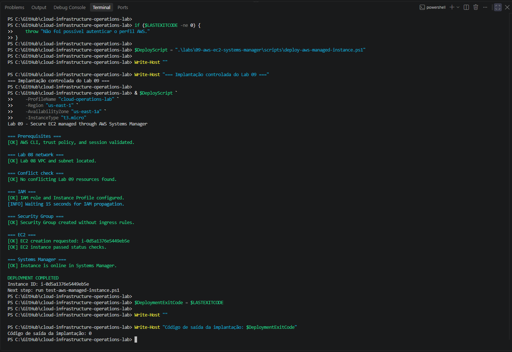
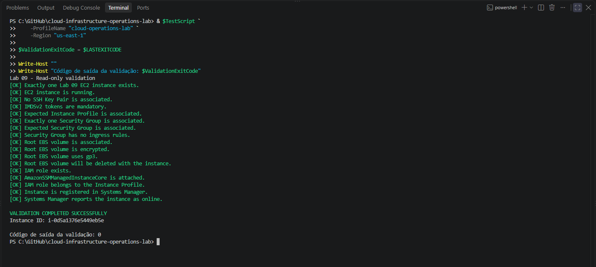
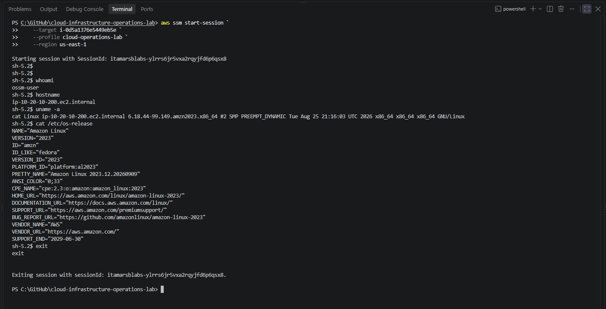
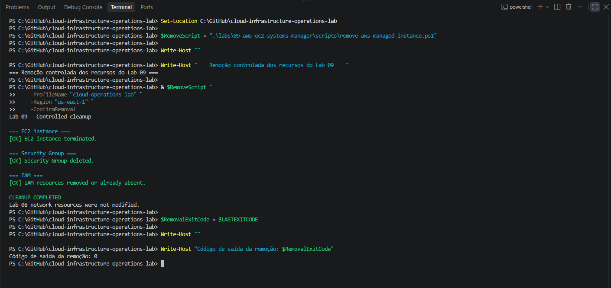

# Lab 09 — Instância EC2 administrada pelo Systems Manager

## Objetivo

Implantar uma instância Amazon EC2 administrável pelo AWS Systems Manager Session Manager, sem chave SSH, porta administrativa exposta ou regra de entrada no Security Group.

O laboratório demonstra uma rotina completa de Cloud Operations: provisionar, validar, acessar e remover recursos com segurança.

> **English summary:** Deploy, validate, access, and remove a secure Amazon EC2 instance managed through AWS Systems Manager Session Manager, without SSH keys or inbound Security Group rules.

---

## Arquitetura

O Lab 09 reutiliza temporariamente a VPC e a sub-rede pública criadas no Lab 08.

    Operador autenticado pelo AWS IAM Identity Center
                         |
                         v
             AWS Systems Manager
                         |
                         v
        EC2 Amazon Linux 2023 + IAM Role

| Componente | Configuração |
|:---:|:---:|
| Região | `us-east-1` |
| Zona de disponibilidade | `us-east-1a` |
| VPC | `lab08-application-vpc` |
| Sub-rede | `lab08-public-subnet-a` |
| Instância | `lab09-managed-instance` |
| Tipo | `t3.micro` |
| Sistema operacional | Amazon Linux 2023 |
| Acesso administrativo | AWS Systems Manager Session Manager |
| Security Group | Sem regras de entrada |
| Key Pair | Não utilizada |
| IAM Role | `lab09-ec2-ssm-role` |
| Instance Profile | `lab09-ec2-ssm-instance-profile` |
| Política | `AmazonSSMManagedInstanceCore` |
| IMDS | IMDSv2 obrigatório |
| Volume raiz | EBS `gp3`, 8 GiB e criptografado |

O IPv4 público é utilizado apenas para comunicação de saída com os endpoints públicos da AWS. Não existe acesso administrativo direto pela Internet.

---

## O que este laboratório demonstra

- descoberta dinâmica da imagem mais recente do Amazon Linux 2023;
- uso de IAM Role e Instance Profile;
- ausência de credenciais permanentes na instância;
- administração pelo Session Manager;
- ausência de SSH e da porta TCP `22`;
- Security Group sem regras de entrada;
- exigência do IMDSv2;
- volume raiz criptografado;
- validação independente em modo somente leitura;
- cleanup explícito e protegido por tags;
- preservação da infraestrutura criada no Lab 08.

Não são criados:

- NAT Gateway;
- VPC Endpoints;
- Elastic IP;
- Load Balancer;
- Key Pair;
- aplicação;
- banco de dados.

---

## Estrutura

    labs/09-aws-ec2-systems-manager/
    ├── README.md
    ├── images/
    │   ├── lab09-deployment-success.png
    │   ├── lab09-read-only-validation.png
    │   ├── lab09-session-manager.png
    │   ├── lab09-cleanup-success.png
    │   └── lab09-post-cleanup-validation.png
    ├── policies/
    │   └── ec2-ssm-trust-policy.json
    └── scripts/
        ├── deploy-aws-managed-instance.ps1
        ├── test-aws-managed-instance.ps1
        └── remove-aws-managed-instance.ps1

| Arquivo | Responsabilidade |
|:---:|---|
| `deploy-aws-managed-instance.ps1` | Criar IAM, Security Group e EC2 |
| `test-aws-managed-instance.ps1` | Validar a configuração sem modificá-la |
| `remove-aws-managed-instance.ps1` | Remover somente os recursos identificados como Lab 09 |
| `ec2-ssm-trust-policy.json` | Permitir que o serviço EC2 assuma a IAM Role |

---

## Pré-requisitos

- Windows PowerShell 5.1 ou PowerShell 7;
- AWS CLI v2;
- perfil `cloud-operations-lab` configurado pelo IAM Identity Center;
- Lab 08 implantado em `us-east-1`;
- Session Manager Plugin instalado;
- permissões necessárias para EC2, IAM e Systems Manager.

Autenticação:

    aws sso login --profile cloud-operations-lab

---

## 1. Implantação

No diretório raiz do repositório:

    $DeployScript = ".\labs\09-aws-ec2-systems-manager\scripts\deploy-aws-managed-instance.ps1"

    & $DeployScript `
        -ProfileName "cloud-operations-lab" `
        -Region "us-east-1" `
        -AvailabilityZone "us-east-1a" `
        -InstanceType "t3.micro"

O script:

1. valida a sessão e as dependências;
2. localiza a rede do Lab 08;
3. impede conflitos com recursos existentes;
4. cria a IAM Role e o Instance Profile;
5. cria o Security Group sem regras de entrada;
6. inicia a EC2 com IMDSv2 e EBS criptografado;
7. aguarda o registro no Systems Manager.

Se ocorrer uma falha depois da criação de algum recurso, o cleanup deve ser executado antes de uma nova tentativa.

### Evidência da implantação

A implantação foi concluída com código de saída `0`. A instância passou nas verificações de status da EC2 e ficou online no Systems Manager.

---

## 2. Validação independente

    $TestScript = ".\labs\09-aws-ec2-systems-manager\scripts\test-aws-managed-instance.ps1"

    & $TestScript `
        -ProfileName "cloud-operations-lab" `
        -Region "us-east-1"

O validador executa somente consultas e confirma:

- estado da EC2;
- ausência de Key Pair;
- IMDSv2 obrigatório;
- associação do Instance Profile;
- existência de somente um Security Group;
- ausência de regras de entrada;
- criptografia e tipo do volume EBS;
- remoção automática do volume raiz com a instância;
- existência da IAM Role;
- associação da política `AmazonSSMManagedInstanceCore`;
- vínculo entre IAM Role e Instance Profile;
- registro online no Systems Manager.

### Evidência da validação

Todas as verificações foram aprovadas e o script terminou com código de saída `0`.

---

## 3. Acesso pelo Session Manager

Obtenha o ID da instância:

    $InstanceId = aws ec2 describe-instances `
        --profile cloud-operations-lab `
        --region us-east-1 `
        --filters `
            "Name=tag:Name,Values=lab09-managed-instance" `
            "Name=instance-state-name,Values=running" `
        --query "Reservations[0].Instances[0].InstanceId" `
        --output text `
        --no-cli-pager

Inicie a sessão:

    aws ssm start-session `
        --profile cloud-operations-lab `
        --region us-east-1 `
        --target $InstanceId

Dentro da instância:

    whoami
    hostname
    uname -a
    cat /etc/os-release

Finalize a sessão:

    exit

### Evidência de acesso

A sessão foi iniciada como `ssm-user` em uma instância Amazon Linux 2023 e encerrada corretamente.

O acesso ocorreu sem:

- chave SSH;
- porta TCP `22`;
- regra de entrada no Security Group;
- exposição de um serviço administrativo à Internet.

---

## 4. Cleanup

    $RemoveScript = ".\labs\09-aws-ec2-systems-manager\scripts\remove-aws-managed-instance.ps1"

    & $RemoveScript `
        -ProfileName "cloud-operations-lab" `
        -Region "us-east-1" `
        -ConfirmRemoval

O script remove:

1. instância EC2;
2. Security Group;
3. associação entre IAM Role e Instance Profile;
4. Instance Profile;
5. política anexada à IAM Role;
6. IAM Role.

Os recursos são conferidos pelas tags `Lab=09` e `Owner=itamarsb`. A VPC e a sub-rede do Lab 08 não são removidas.

### Evidência do cleanup

O cleanup terminou com código de saída `0` e informou explicitamente que os recursos de rede do Lab 08 não foram modificados.

---

## 5. Verificação pós-cleanup

Depois da remoção, consultas independentes confirmaram o estado final da conta.

| Verificação | Resultado |
|:---:|:---:|
| Instâncias ativas do Lab 09 | `0` |
| Security Groups do Lab 09 | `0` |
| IAM Roles do Lab 09 | `0` |
| Instance Profiles do Lab 09 | `0` |
| VPC `lab08-application-vpc` | `1` |
| Sub-rede `lab08-public-subnet-a` | `1` |

### Evidência do estado final

A verificação confirmou a ausência de recursos ativos do Lab 09 e a preservação da rede utilizada pelo Lab 08.

---

## Resultado

O ciclo operacional do Lab 09 foi concluído:

- implantação segura da instância;
- validação independente da configuração;
- acesso administrativo pelo Systems Manager;
- ausência de SSH e regras de entrada;
- remoção controlada dos recursos;
- verificação pós-cleanup;
- preservação da infraestrutura do Lab 08.

O laboratório demonstrou uma forma segura de administrar uma instância EC2 sem expor uma porta administrativa à Internet e sem manter credenciais permanentes dentro do sistema operacional.

---

## Considerações de custo

A instância EC2, o volume EBS e o endereço IPv4 público podem gerar cobrança enquanto estiverem em uso.

O laboratório utiliza somente uma instância `t3.micro`, não cria NAT Gateway e prevê a remoção dos recursos imediatamente após o registro das evidências.

Ao final da execução documentada, nenhum recurso ativo do Lab 09 permaneceu na conta.
