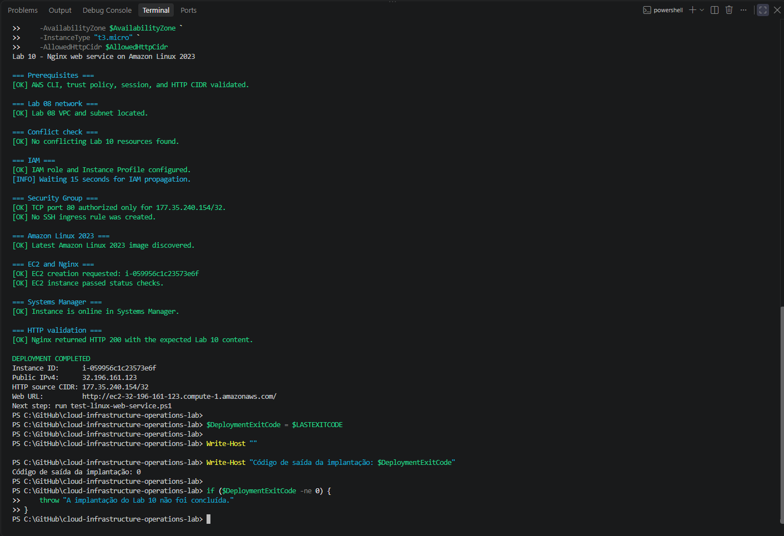
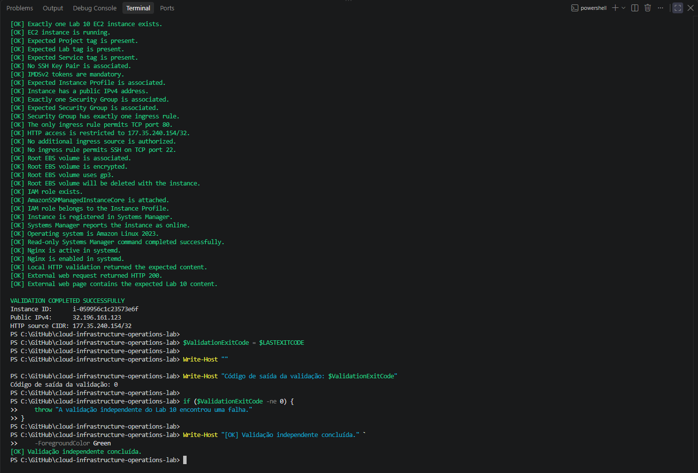
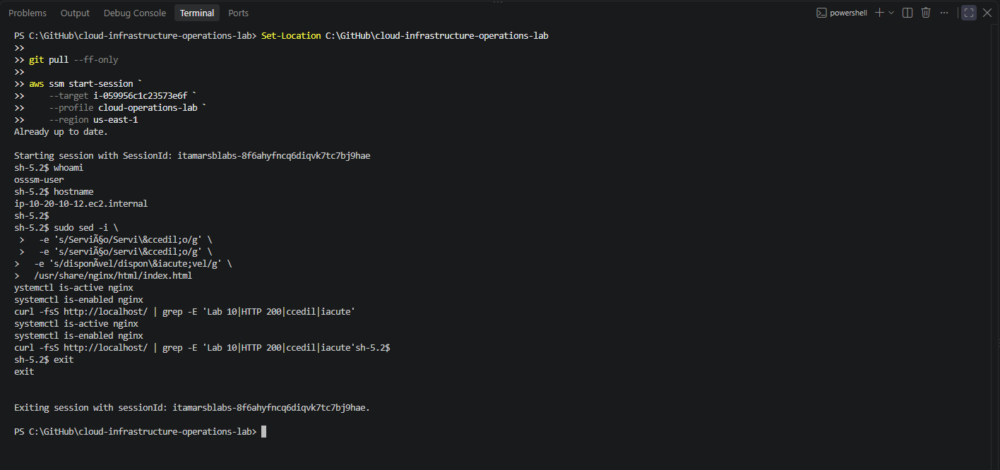
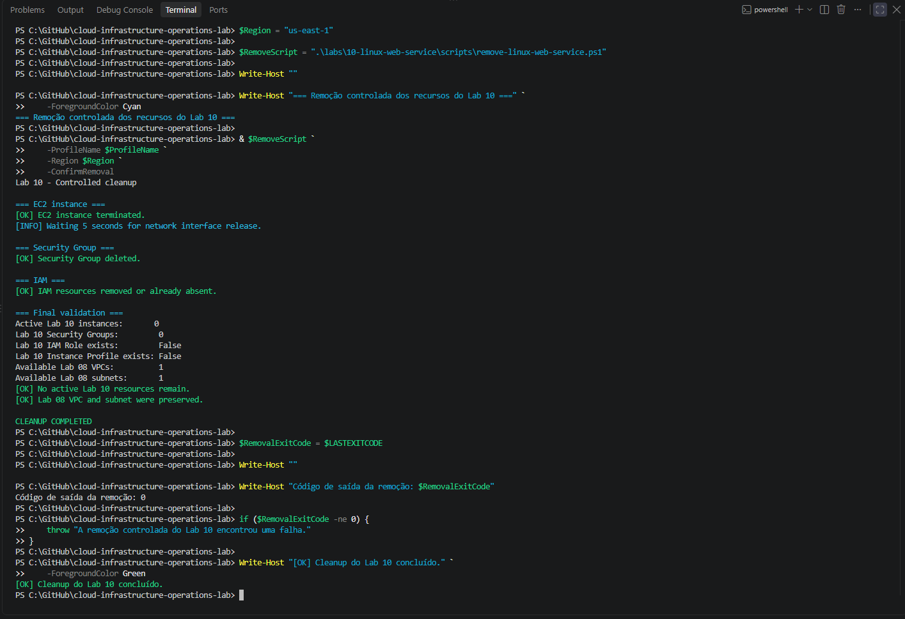
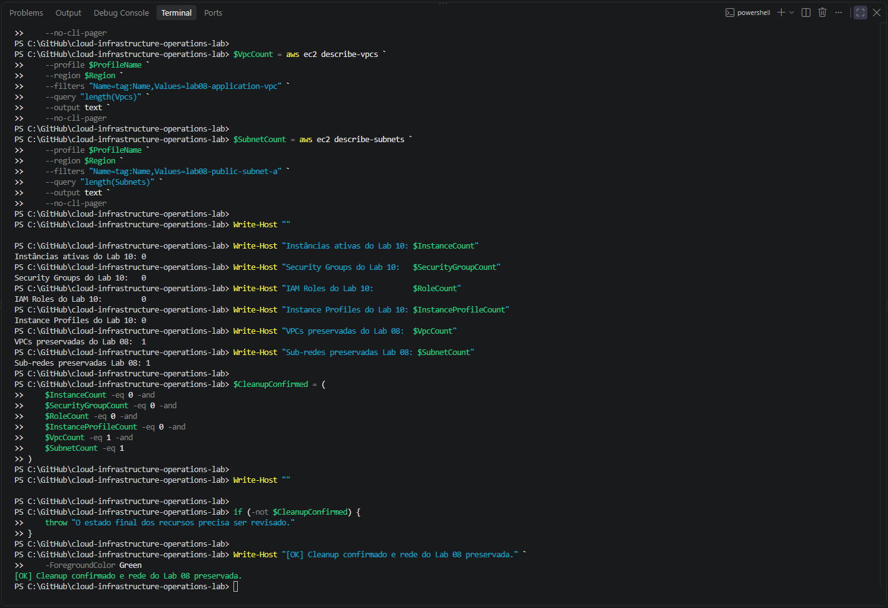

# Lab 10 — Serviço web Nginx em Linux

## Objetivo

Implantar, operar, validar e remover um serviço web Nginx em uma instância Amazon Linux 2023, utilizando `systemd`, acesso HTTP controlado e administração segura pelo AWS Systems Manager.

O laboratório reutilizou temporariamente a rede criada no Lab 08 e aplicou os seguintes controles:

- ausência de chave SSH;
- bloqueio da porta TCP `22`;
- administração pelo Systems Manager;
- IMDSv2 obrigatório;
- volume EBS criptografado;
- acesso HTTP restrito ao endereço IPv4 público do operador;
- validação independente da infraestrutura;
- cleanup controlado;
- preservação da VPC e da sub-rede compartilhadas.

> **English summary:** Deploy, operate, validate, and remove an Nginx web service on Amazon Linux 2023 using systemd, restricted HTTP access, independent validation, AWS Systems Manager administration, and controlled cleanup.

---

## Arquitetura

O Lab 10 utilizou uma instância EC2 na sub-rede pública criada no Lab 08.

    Navegador do operador
        |
        | HTTP TCP 80
        | origem autorizada: IPv4 público /32
        v
    Security Group do Lab 10
        |
        v
    EC2 Amazon Linux 2023
        |
        ├── Nginx
        ├── systemd
        └── AWS Systems Manager Agent

O acesso administrativo ocorreu exclusivamente pelo Systems Manager Session Manager:

    Operador autenticado pelo AWS IAM Identity Center
                         |
                         v
             AWS Systems Manager
                         |
                         v
              EC2 do Lab 10

| Componente | Configuração |
|:---:|:---:|
| Região | `us-east-1` |
| Zona de disponibilidade | `us-east-1a` |
| VPC | `lab08-application-vpc` |
| Sub-rede | `lab08-public-subnet-a` |
| Instância | `lab10-linux-web-server` |
| Tipo | `t3.micro` |
| Sistema operacional | Amazon Linux 2023 |
| Serviço web | Nginx |
| Gerenciamento | `systemd` |
| Porta HTTP | TCP `80` |
| Origem HTTP | IPv4 público autorizado com máscara `/32` |
| Acesso administrativo | AWS Systems Manager Session Manager |
| Porta SSH | Não permitida |
| Key Pair | Não utilizada |
| Security Group | `lab10-linux-web-sg` |
| IAM Role | `lab10-ec2-ssm-role` |
| Instance Profile | `lab10-ec2-ssm-instance-profile` |
| Política IAM | `AmazonSSMManagedInstanceCore` |
| IMDS | IMDSv2 obrigatório |
| Volume raiz | EBS `gp3`, 8 GiB e criptografado |

---

## Estrutura

    labs/10-linux-web-service/
    ├── README.md
    ├── images/
    │   ├── lab10-deployment-success.png
    │   ├── lab10-read-only-validation.png
    │   ├── lab10-http-validation.png
    │   ├── lab10-session-manager.png
    │   ├── lab10-cleanup-success.png
    │   └── lab10-post-cleanup-validation.png
    ├── policies/
    │   └── ec2-ssm-trust-policy.json
    └── scripts/
        ├── deploy-linux-web-service.ps1
        ├── test-linux-web-service.ps1
        └── remove-linux-web-service.ps1

| Arquivo | Responsabilidade |
|:---:|---|
| `deploy-linux-web-service.ps1` | Criar IAM, Security Group e EC2, instalar o Nginx e validar o serviço |
| `test-linux-web-service.ps1` | Validar infraestrutura, segurança, Systems Manager, `systemd` e HTTP |
| `remove-linux-web-service.ps1` | Remover somente os recursos pertencentes ao Lab 10 |
| `ec2-ssm-trust-policy.json` | Permitir que o serviço EC2 assuma a IAM Role |

---

## Escopo executado

O laboratório realizou:

- descoberta dinâmica da imagem mais recente do Amazon Linux 2023;
- criação da IAM Role e do Instance Profile;
- associação da política `AmazonSSMManagedInstanceCore`;
- criação de um Security Group específico;
- liberação temporária da porta TCP `80` para um único IPv4 `/32`;
- implantação de uma instância EC2 sem Key Pair;
- exigência de IMDSv2;
- criação de volume EBS `gp3` criptografado;
- instalação e configuração do Nginx;
- criação de uma página web estática;
- inicialização e habilitação do Nginx pelo `systemd`;
- validação HTTP local e externa;
- validação independente e somente leitura;
- acesso administrativo pelo Session Manager;
- remoção controlada dos recursos;
- validação independente do estado final;
- preservação da rede criada no Lab 08.

Não foram criados:

- NAT Gateway;
- VPC Endpoints;
- Elastic IP;
- Load Balancer;
- Auto Scaling Group;
- certificado TLS;
- domínio DNS;
- banco de dados;
- Key Pair;
- regra de entrada para SSH.

---

## Controles de segurança

### Acesso HTTP restrito

A porta TCP `80` foi autorizada somente para o endereço IPv4 público do operador, utilizando máscara `/32`.

Exemplo de formato:

    203.0.113.10/32

A máscara `/32` limita a origem da conexão a um único endereço IPv4.

O endereço acima é apenas documental. O endereço real foi fornecido durante a execução e não foi incluído nos scripts do repositório.

### Administração sem SSH

A instância não utilizou Key Pair e não recebeu regra de entrada para a porta TCP `22`.

A administração foi realizada pelo AWS Systems Manager Session Manager, utilizando a IAM Role associada à instância.

### Proteção da instância

A validação confirmou:

- IMDSv2 obrigatório;
- volume raiz criptografado;
- tipo de volume `gp3`;
- exclusão do volume junto com a instância;
- política `AmazonSSMManagedInstanceCore` associada;
- registro online no Systems Manager.

---

## Pré-requisitos

- Windows PowerShell 5.1 ou PowerShell 7;
- AWS CLI v2;
- Session Manager Plugin;
- perfil `cloud-operations-lab`;
- autenticação pelo AWS IAM Identity Center;
- Lab 08 implantado em `us-east-1`;
- acesso à Internet pela instância;
- endereço IPv4 público do operador;
- permissões para EC2, IAM e Systems Manager.

Autenticação utilizada:

    aws sso login --profile cloud-operations-lab

---

## Execução

### 1. Identificação do IPv4 público

O endereço IPv4 público do operador foi identificado antes da implantação e convertido para CIDR `/32`.

    $PublicIp = (
        Invoke-RestMethod `
            -Uri "https://checkip.amazonaws.com" `
            -TimeoutSec 15
    ).Trim()

    $AllowedHttpCidr = "$PublicIp/32"

Esse valor foi informado aos scripts de implantação e validação sem ser gravado permanentemente no código.

### 2. Implantação

    $DeployScript = ".\labs\10-linux-web-service\scripts\deploy-linux-web-service.ps1"

    & $DeployScript `
        -ProfileName "cloud-operations-lab" `
        -Region "us-east-1" `
        -AvailabilityZone "us-east-1a" `
        -InstanceType "t3.micro" `
        -AllowedHttpCidr $AllowedHttpCidr

A implantação criou os recursos IAM, o Security Group e a instância EC2, instalou o Nginx e aguardou a disponibilidade da instância no Systems Manager.

O próprio script também realizou uma primeira validação HTTP.

### 3. Validação independente

    $TestScript = ".\labs\10-linux-web-service\scripts\test-linux-web-service.ps1"

    & $TestScript `
        -ProfileName "cloud-operations-lab" `
        -Region "us-east-1" `
        -AllowedHttpCidr $AllowedHttpCidr

O validador realizou consultas somente leitura e confirmou:

- existência de exatamente uma instância do Lab 10;
- estado `running`;
- presença das tags esperadas;
- ausência de Key Pair;
- IMDSv2 obrigatório;
- associação do Instance Profile;
- existência de somente um Security Group;
- existência de somente uma regra de entrada;
- liberação exclusiva da porta TCP `80`;
- restrição HTTP ao endereço `/32`;
- ausência de regra SSH;
- volume EBS criptografado e do tipo `gp3`;
- associação da política do Systems Manager;
- registro online no Systems Manager;
- Amazon Linux 2023;
- Nginx ativo e habilitado;
- conteúdo HTTP local esperado;
- resposta HTTP externa `200`;
- conteúdo externo correspondente ao Lab 10.

A validação foi concluída com código de saída `0`.

### 4. Acesso administrativo

O acesso administrativo foi realizado sem SSH:

    aws ssm start-session `
        --target ID_DA_INSTANCIA `
        --profile cloud-operations-lab `
        --region us-east-1

Durante a sessão foram verificados:

    whoami
    hostname
    systemctl is-active nginx
    systemctl is-enabled nginx
    curl -fsS http://localhost
    exit

A sessão confirmou:

- acesso como `ssm-user`;
- conexão com a instância correta;
- Nginx ativo;
- Nginx habilitado no `systemd`;
- página disponível localmente.

### 5. Cleanup

    $RemoveScript = ".\labs\10-linux-web-service\scripts\remove-linux-web-service.ps1"

    & $RemoveScript `
        -ProfileName "cloud-operations-lab" `
        -Region "us-east-1" `
        -ConfirmRemoval

O cleanup removeu:

- instância EC2 do Lab 10;
- Security Group do Lab 10;
- associação da política IAM;
- Instance Profile;
- IAM Role.

A VPC e a sub-rede do Lab 08 não foram modificadas.

---

## Resultado da implantação

A implantação foi concluída com sucesso e retornou código de saída `0`.

Foram confirmados:

- pré-requisitos válidos;
- VPC e sub-rede do Lab 08 localizadas;
- ausência de recursos conflitantes;
- IAM Role e Instance Profile configurados;
- Security Group sem SSH;
- porta TCP `80` restrita ao IPv4 autorizado;
- imagem Amazon Linux 2023 localizada;
- instância EC2 aprovada nos status checks;
- instância online no Systems Manager;
- resposta HTTP `200`;
- conteúdo esperado na página web.

---

## Resultado da validação independente

Todas as verificações de infraestrutura, segurança, sistema operacional, Systems Manager, `systemd` e HTTP foram concluídas com sucesso.

O validador encerrou com código de saída `0`.

---

## Validação HTTP

A página do laboratório foi acessada externamente pela porta TCP `80`.

O navegador confirmou:

- resposta HTTP bem-sucedida;
- identificação do Lab 10;
- Nginx em Amazon Linux 2023;
- gerenciamento pelo `systemd`;
- administração pelo AWS Systems Manager.

> A indicação “Não seguro” apresentada pelo navegador é esperada, pois o escopo utiliza HTTP sem certificado TLS. A porta ficou temporariamente limitada ao endereço IPv4 `/32` do operador.

---

## Validação pelo Session Manager

A sessão administrativa comprovou o acesso à instância pelo AWS Systems Manager sem a utilização de SSH.

Também foram confirmados o estado ativo do Nginx e sua habilitação no `systemd`.

---

## Resultado do cleanup

O script de remoção encerrou a instância e removeu os recursos específicos do Lab 10.

A própria execução confirmou:

- nenhuma instância ativa do Lab 10;
- nenhum Security Group do Lab 10;
- IAM Role removida;
- Instance Profile removido;
- VPC do Lab 08 preservada;
- sub-rede do Lab 08 preservada.

O cleanup foi concluído com código de saída `0`.

---

## Validação final independente

Após o cleanup, uma nova consulta independente confirmou:

| Recurso | Quantidade final |
|:---|:---:|
| Instâncias ativas do Lab 10 | `0` |
| Security Groups do Lab 10 | `0` |
| IAM Roles do Lab 10 | `0` |
| Instance Profiles do Lab 10 | `0` |
| VPC `lab08-application-vpc` | `1` |
| Sub-rede `lab08-public-subnet-a` | `1` |

Os resultados confirmam que nenhum recurso ativo do Lab 10 permaneceu na conta e que a infraestrutura compartilhada do Lab 08 foi preservada.

---

## Ajustes realizados durante a execução

Durante a validação independente, o envio inicial do comando remoto ao Systems Manager apresentou uma falha de serialização no parâmetro `commands`.

A chamada foi corrigida para utilizar um arquivo JSON temporário em UTF-8 sem BOM. Após o ajuste, o comando remoto foi concluído com sucesso e todas as verificações passaram.

Também foi identificada uma interpretação incorreta de caracteres acentuados na página entregue pelo Nginx. O conteúdo HTML passou a utilizar entidades como:

    &ccedil;
    &iacute;

A correção eliminou a dependência da interpretação de codificação entre PowerShell, User Data, Linux e navegador.

Esses ajustes foram incorporados aos scripts do repositório antes do encerramento do laboratório.

---

## Critérios de sucesso

- [x] exatamente uma instância EC2 foi implantada;
- [x] Amazon Linux 2023 foi utilizado;
- [x] nenhum Key Pair foi associado;
- [x] IMDSv2 foi configurado como obrigatório;
- [x] o volume raiz EBS foi criptografado;
- [x] o volume utilizou o tipo `gp3`;
- [x] a IAM Role foi associada ao Instance Profile;
- [x] a política `AmazonSSMManagedInstanceCore` foi anexada;
- [x] a instância ficou online no Systems Manager;
- [x] nenhuma regra de entrada para SSH foi criada;
- [x] a porta TCP `80` foi limitada ao IPv4 autorizado;
- [x] o Nginx permaneceu ativo no `systemd`;
- [x] o Nginx permaneceu habilitado no `systemd`;
- [x] a página respondeu com HTTP `200`;
- [x] o conteúdo identificou o Lab 10;
- [x] o acesso pelo Session Manager foi comprovado;
- [x] as evidências foram registradas;
- [x] o cleanup removeu os recursos do Lab 10;
- [x] o estado final foi validado;
- [x] a VPC e a sub-rede do Lab 08 foram preservadas.

---

## Considerações de custo

Durante a execução, a instância EC2, o volume EBS e o endereço IPv4 público estiveram sujeitos a cobrança.

O laboratório utilizou somente uma instância `t3.micro`, não criou NAT Gateway e removeu os recursos após o registro das evidências.

O Security Group, a IAM Role e o Instance Profile não possuem cobrança direta, mas também foram removidos para manter a conta organizada.

Ao final da execução, nenhum recurso ativo específico do Lab 10 permaneceu na conta.

---

## Resultado

O Lab 10 foi concluído com sucesso e demonstrou:

- implantação segura de uma instância Linux;
- instalação e operação do Nginx;
- gerenciamento de serviço pelo `systemd`;
- validação HTTP externa e local;
- restrição de acesso por Security Group;
- administração sem SSH;
- validação independente da infraestrutura;
- diagnóstico e correção de falhas operacionais;
- remoção segura dos recursos;
- validação independente do estado final;
- preservação da infraestrutura compartilhada do Lab 08.
