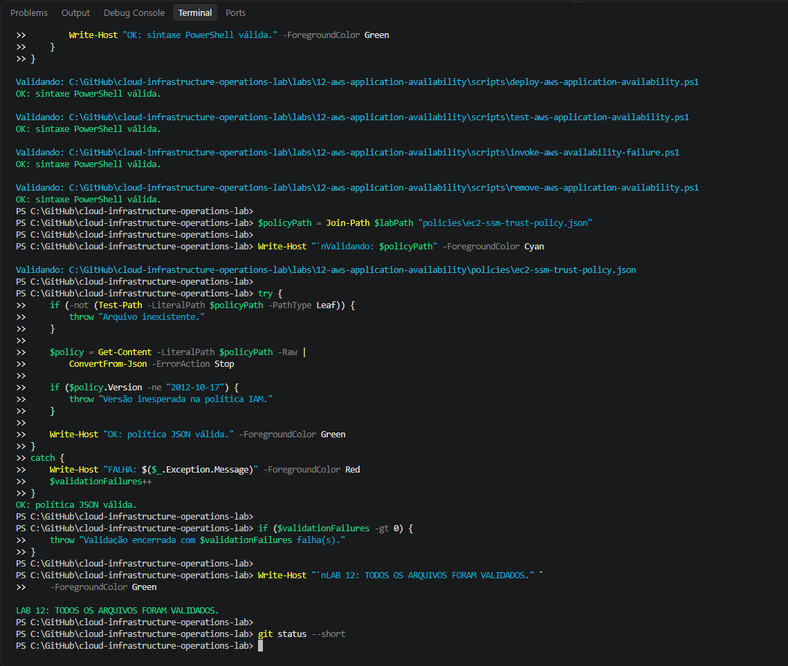
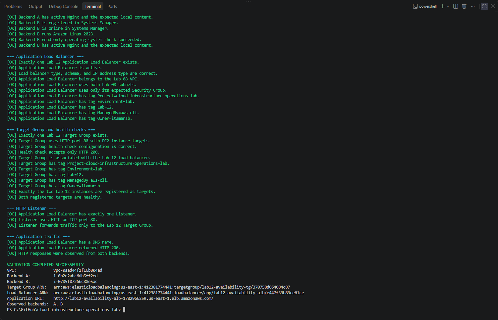
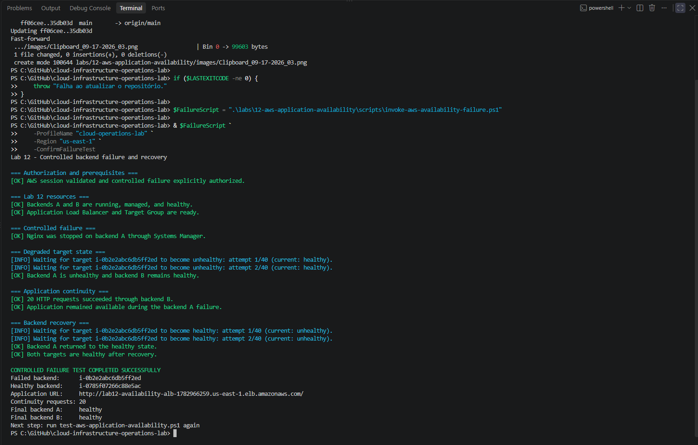
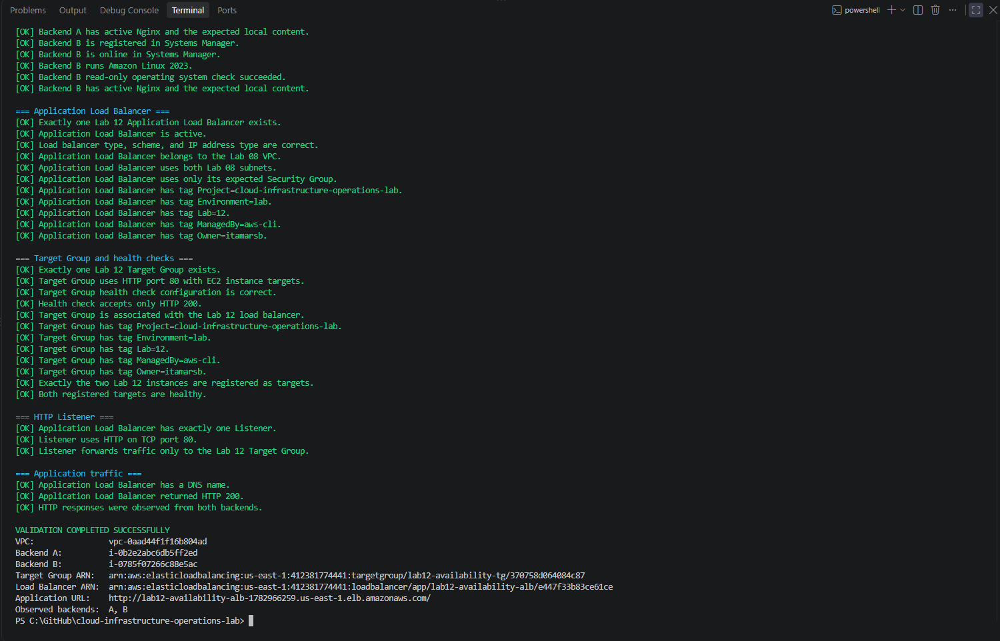
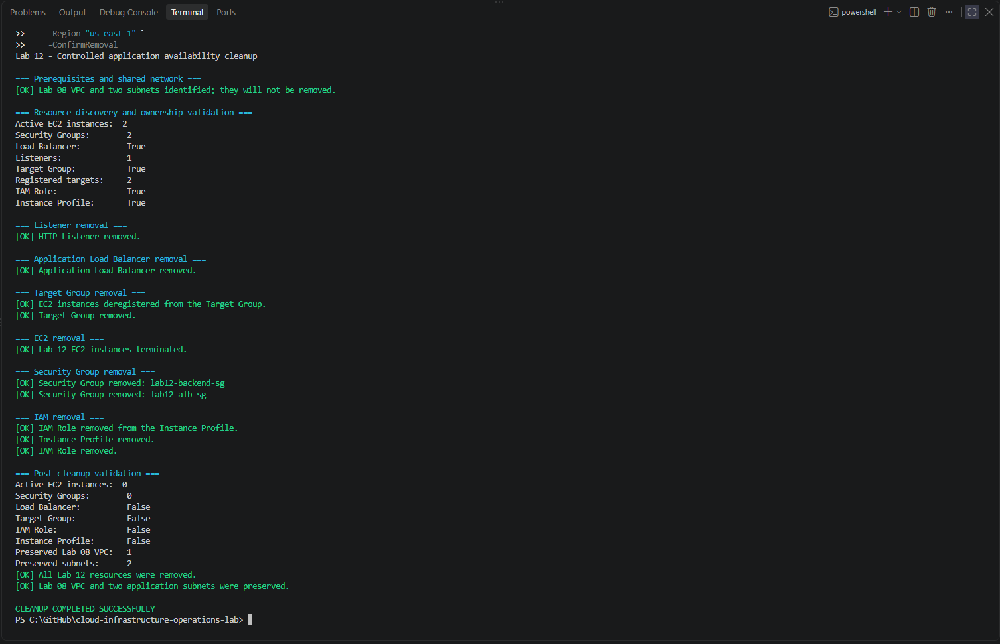

# Lab 12 — Disponibilidade da aplicação com Application Load Balancer

## Objetivo

Implementar e validar uma aplicação web distribuída entre duas zonas de disponibilidade na AWS.

O laboratório utiliza duas instâncias Amazon EC2 com Nginx, registradas em um Target Group e acessadas por meio de um Application Load Balancer. Os health checks permitem que o balanceador encaminhe tráfego somente para servidores saudáveis.

Uma falha controlada em um dos backends comprova que a aplicação permanece disponível pela segunda instância. Após a recuperação do serviço, os dois targets retornam ao estado `healthy`.

As instâncias são administradas pelo AWS Systems Manager, sem chave SSH e sem regra de entrada para a porta TCP `22`.

> **English summary:** Deployment and validation of a highly available web application across two AWS Availability Zones using Amazon EC2, Nginx, an Application Load Balancer, Target Group health checks, controlled backend failure, service recovery, independent validation and controlled cleanup.

---

## Resultado

O fluxo foi concluído com sucesso:

- dois backends Nginx foram implantados em `us-east-1a` e `us-east-1b`;
- o Application Load Balancer distribuiu requisições entre os backends A e B;
- os dois targets foram validados no estado `healthy`;
- o Nginx do backend A foi interrompido pelo Systems Manager;
- o Target Group identificou o backend A como `unhealthy`;
- vinte requisições HTTP consecutivas foram atendidas pelo backend B durante a falha;
- o backend A foi recuperado e retornou ao estado `healthy`;
- uma nova validação independente confirmou o estado íntegro da arquitetura;
- o cleanup removeu todos os recursos específicos do Lab 12;
- a VPC e as duas sub-redes compartilhadas do Lab 08 foram preservadas.

---

## Arquitetura

O laboratório reutiliza a VPC e as duas sub-redes públicas criadas no Lab 08.

```text
Internet
   |
   v
Application Load Balancer
   |
   v
Listener HTTP :80
   |
   v
Target Group
   |
   +-- EC2 + Nginx — backend A — us-east-1a
   |
   +-- EC2 + Nginx — backend B — us-east-1b
```

O acesso administrativo segue um caminho separado:

```text
AWS IAM Identity Center
          |
          v
AWS Systems Manager
          |
          +-- EC2 backend A
          |
          +-- EC2 backend B
```

O Application Load Balancer é público e utiliza as duas sub-redes do Lab 08. As instâncias possuem conectividade de saída, mas não aceitam HTTP diretamente da internet. O Security Group dos backends permite TCP `80` somente quando a origem é o Security Group do ALB.

---

## Componentes

| Componente | Configuração |
|:---:|:---:|
| Região | `us-east-1` |
| VPC | `lab08-application-vpc` |
| Sub-rede A | `lab08-public-subnet-a` |
| Sub-rede B | `lab08-public-subnet-b` |
| Zona A | `us-east-1a` |
| Zona B | `us-east-1b` |
| Instância A | `lab12-availability-instance-a` |
| Instância B | `lab12-availability-instance-b` |
| Tipo das instâncias | `t3.micro` |
| Sistema operacional | Amazon Linux 2023 |
| Serviço web | Nginx |
| Security Group do ALB | `lab12-alb-sg` |
| Security Group dos backends | `lab12-backend-sg` |
| IAM Role | `lab12-ec2-availability-role` |
| Instance Profile | `lab12-ec2-availability-instance-profile` |
| Política do Systems Manager | `AmazonSSMManagedInstanceCore` |
| Application Load Balancer | `lab12-availability-alb` |
| Target Group | `lab12-availability-tg` |
| Listener | HTTP na porta TCP `80` |
| Health check | HTTP `GET /health` |
| Acesso administrativo | AWS Systems Manager |
| Key Pair | Não utilizada |
| IMDSv2 | Obrigatório |

---

## Estrutura

```text
labs/12-aws-application-availability/
├── README.md
├── images/
│   ├── Clipboard_09-17-2026_01.png
│   ├── Clipboard_09-17-2026_03.png
│   ├── Clipboard_09-17-2026_04.png
│   ├── Clipboard_09-17-2026_05.png
│   └── Clipboard_09-17-2026_06.png
├── policies/
│   └── ec2-ssm-trust-policy.json
└── scripts/
    ├── deploy-aws-application-availability.ps1
    ├── invoke-aws-availability-failure.ps1
    ├── remove-aws-application-availability.ps1
    └── test-aws-application-availability.ps1
```

| Arquivo | Responsabilidade |
|:---:|---|
| `deploy-aws-application-availability.ps1` | Criar IAM, Security Groups, instâncias EC2, Nginx, Target Group, ALB e Listener |
| `test-aws-application-availability.ps1` | Validar infraestrutura, segurança, serviços, targets e tráfego HTTP sem alterar recursos |
| `invoke-aws-availability-failure.ps1` | Interromper um backend, validar a continuidade e recuperar o serviço |
| `remove-aws-application-availability.ps1` | Remover somente os recursos específicos do Lab 12 e validar o estado final |
| `ec2-ssm-trust-policy.json` | Permitir que o serviço EC2 assuma a IAM Role do laboratório |

---

## Controles de segurança

- autenticação temporária pelo AWS IAM Identity Center;
- instâncias sem Key Pair;
- nenhuma regra de entrada para SSH;
- administração remota pelo AWS Systems Manager;
- IMDSv2 obrigatório;
- volumes raiz EBS `gp3` criptografados;
- IAM Role e Instance Profile dedicados;
- HTTP público permitido somente no Security Group do ALB;
- HTTP nos backends permitido somente a partir do Security Group do ALB;
- tags operacionais utilizadas para identificação e proteção do cleanup;
- validação de propriedade antes de alterações destrutivas;
- preservação explícita da rede compartilhada do Lab 08.

As tags aplicadas aos recursos compatíveis foram:

| Tag | Valor |
|:---:|:---:|
| `Project` | `cloud-infrastructure-operations-lab` |
| `Environment` | `lab` |
| `Lab` | `12` |
| `ManagedBy` | `aws-cli` |
| `Owner` | `itamarsb` |
| `Name` | Nome específico do recurso |

---

## Pré-requisitos

- Windows PowerShell 5.1 ou PowerShell 7;
- AWS CLI v2;
- Session Manager Plugin;
- perfil `cloud-operations-lab`;
- autenticação pelo AWS IAM Identity Center;
- VPC e duas sub-redes públicas do Lab 08 disponíveis em `us-east-1`;
- permissões para EC2, Elastic Load Balancing, IAM e Systems Manager.

```powershell
aws sso login --profile cloud-operations-lab
```

---

## Execução

### 1. Implantação

```powershell
$DeployScript = ".\labs\12-aws-application-availability\scripts\deploy-aws-application-availability.ps1"

& $DeployScript `
    -ProfileName "cloud-operations-lab" `
    -Region "us-east-1" `
    -AvailabilityZoneA "us-east-1a" `
    -AvailabilityZoneB "us-east-1b" `
    -InstanceType "t3.micro"
```

O script localiza a rede do Lab 08; cria IAM, Security Groups, instâncias, Target Group, ALB e Listener; configura o Nginx e o endpoint `/health`; aguarda os targets ficarem saudáveis; e valida a aplicação.

### 2. Validação independente

```powershell
$TestScript = ".\labs\12-aws-application-availability\scripts\test-aws-application-availability.ps1"

& $TestScript `
    -ProfileName "cloud-operations-lab" `
    -Region "us-east-1"
```

O validador executa verificações somente leitura sobre rede, Security Groups, EC2, EBS, IAM, Systems Manager, Nginx, ALB, Target Group, health checks, Listener e tráfego HTTP. A execução confirmou HTTP `200` e respostas observadas nos backends A e B.

### 3. Falha controlada e recuperação

```powershell
$FailureScript = ".\labs\12-aws-application-availability\scripts\invoke-aws-availability-failure.ps1"

& $FailureScript `
    -ProfileName "cloud-operations-lab" `
    -Region "us-east-1" `
    -ConfirmFailureTest
```

O script interrompe o Nginx no backend A pelo Systems Manager, aguarda sua transição para `unhealthy` e confirma que o backend B continua saudável. Em seguida, realiza vinte requisições pelo ALB, recupera o serviço interrompido e aguarda os dois targets retornarem ao estado `healthy`.

### 4. Validação após a recuperação

```powershell
& $TestScript `
    -ProfileName "cloud-operations-lab" `
    -Region "us-east-1"
```

A segunda execução confirmou que os dois backends e todos os componentes de balanceamento retornaram ao estado operacional esperado.

### 5. Cleanup

```powershell
$RemoveScript = ".\labs\12-aws-application-availability\scripts\remove-aws-application-availability.ps1"

& $RemoveScript `
    -ProfileName "cloud-operations-lab" `
    -Region "us-east-1" `
    -ConfirmRemoval
```

O cleanup remove Listener, ALB, registros e Target Group, instâncias EC2, Security Groups, Instance Profile e IAM Role. A validação final confirmou a ausência dos recursos do Lab 12 e a preservação da VPC e das duas sub-redes do Lab 08.

---

## Troubleshooting aplicado

Durante a validação HTTP, o PowerShell 5.1 rejeitou a definição simultânea dos cabeçalhos `Keep-Alive` e `Close`. As chamadas foram ajustadas para utilizar o parâmetro nativo `-DisableKeepAlive`.

O processamento das respostas remotas também passou a normalizar caracteres de retorno de carro antes da comparação. Com esses ajustes, a validação confirmou HTTP `200` e respostas provenientes dos dois backends.

As correções foram incorporadas aos scripts `test-aws-application-availability.ps1` e `invoke-aws-availability-failure.ps1`.

---

## Evidências

### Validação local dos arquivos

Os quatro scripts PowerShell passaram pela análise sintática e a política de confiança IAM foi validada como JSON.



### Validação independente da arquitetura

O validador confirmou os controles de segurança, os dois targets saudáveis, HTTP `200` e respostas observadas nos backends A e B.



### Falha controlada e recuperação

Com o Nginx interrompido no backend A, vinte requisições consecutivas foram atendidas pelo backend B. Ao final, os dois targets retornaram ao estado `healthy`.



### Validação após a recuperação

Uma nova execução do validador confirmou o retorno integral da arquitetura ao estado operacional.



### Cleanup e preservação da rede compartilhada

O cleanup removeu todos os recursos exclusivos do Lab 12 e preservou a VPC e as duas sub-redes do Lab 08.



---

## Critérios de sucesso validados

- [x] duas instâncias implantadas em zonas de disponibilidade diferentes;
- [x] Amazon Linux 2023 e Nginx ativos nos dois backends;
- [x] instâncias sem Key Pair e com IMDSv2 obrigatório;
- [x] volumes raiz EBS `gp3` criptografados;
- [x] administração pelo AWS Systems Manager;
- [x] separação entre os Security Groups do ALB e dos backends;
- [x] nenhuma regra de entrada para SSH;
- [x] ALB associado às duas sub-redes;
- [x] Target Group com os dois targets saudáveis;
- [x] Listener HTTP encaminhando somente para o Target Group esperado;
- [x] resposta HTTP `200` pelo endereço do ALB;
- [x] tráfego observado nos backends A e B;
- [x] falha controlada detectada pelo health check;
- [x] continuidade confirmada durante a indisponibilidade de um backend;
- [x] backend recuperado e dois targets novamente saudáveis;
- [x] validação independente concluída após a recuperação;
- [x] recursos específicos removidos pelo cleanup;
- [x] infraestrutura compartilhada do Lab 08 preservada.

---

## Considerações de custo

Durante a execução, duas instâncias `t3.micro`, dois endereços IPv4 públicos, volumes EBS e um Application Load Balancer puderam gerar cobrança.

Nenhum NAT Gateway, Elastic IP, domínio DNS ou certificado TLS foi criado. Os recursos específicos do Lab 12 permaneceram ativos somente durante a implantação, as validações e o teste de disponibilidade, sendo removidos ao final pelo script de cleanup.

---

## Conclusão

O Lab 12 demonstrou disponibilidade de aplicação por meio de distribuição de tráfego, health checks e isolamento entre a camada pública e os servidores web.

A falha controlada comprovou que a perda de um backend não interrompeu o acesso à aplicação. A recuperação devolveu os dois targets ao estado saudável, e o cleanup eliminou os recursos temporários sem afetar a rede compartilhada.

O laboratório encerra o módulo de infraestrutura AWS e prepara a transição para os cenários de operação e troubleshooting do Lab 13.
