# Lab 14 — Utilização de disco e crescimento de logs

## Objetivo

Implantar uma instância Amazon EC2 com um volume EBS dedicado para logs, provocar crescimento controlado da utilização desse volume, executar um diagnóstico somente leitura, aplicar uma mitigação segura e remover os recursos exclusivos do laboratório.

O laboratório exercitou uma investigação operacional baseada em seis dimensões:

1. capacidade total, utilizada e disponível;
2. utilização percentual do filesystem;
3. consumo de inodes;
4. diretórios e arquivos que mais ocupavam espaço;
5. arquivos removidos que permaneciam abertos por processos;
6. crescimento, rotação, compressão e retenção de logs.

A pressão de armazenamento foi isolada em um volume de dados montado em `/var/log/lab14`. O volume raiz da instância não foi preenchido intencionalmente.

> **English summary:** This lab deployed an Amazon EC2 instance with a dedicated EBS log volume, generated controlled disk pressure, diagnosed filesystem capacity, inode usage, large files and open deleted files, mitigated the incident through log rotation and compression, validated recovery and safely removed the temporary AWS resources.

---

## Resultado do laboratório

O ciclo operacional foi concluído com sucesso:

```text
Volume saudável
        |
        v
Pressão controlada
        |
        v
Utilização elevada: 85%
        |
        v
Diagnóstico somente leitura
        |
        v
24 arquivos responsáveis identificados
        |
        v
Rotação, compressão e retenção
        |
        v
Utilização saudável: 57%
        |
        v
Validação independente
        |
        v
Cleanup dos recursos exclusivos
```

Os principais resultados foram:

| Indicador | Resultado |
|:---:|:---:|
| Estado inicial | Saudável |
| Limite saudável | Abaixo de `60%` |
| Limite operacional elevado | A partir de `80%` |
| Limite máximo de segurança | `88%` |
| Pico controlado observado | `85%` |
| Arquivos de pressão identificados | `24` |
| Espaço potencialmente recuperável | `1,50 GiB` |
| Utilização após mitigação | `57%` |
| Utilização de inodes | `1%` |
| Arquivos removidos ainda abertos | `0` |
| Estado final | Saudável |
| Cleanup | Concluído |
| Rede compartilhada do Lab 08 | Preservada |

---

## Cenário

Uma aplicação simulada gravou arquivos de log em um volume EBS dedicado.

A utilização do filesystem foi elevada de forma controlada até atingir o estado operacional `Elevated`. Em seguida, um diagnóstico somente leitura identificou os arquivos responsáveis pelo consumo.

A mitigação realizou rotação, compressão, validação de integridade e retenção limitada dos arquivos. Depois da recuperação, uma validação independente confirmou que o filesystem havia retornado ao estado `Healthy`.

Por fim, o cleanup removeu todos os recursos exclusivos do Lab 14 e preservou a infraestrutura de rede compartilhada do Lab 08.

O objetivo não foi apenas apagar arquivos, mas demonstrar uma sequência segura de investigação, mitigação, validação e encerramento aplicável a incidentes reais de capacidade.

---

## Decisão de segurança

O incidente não foi provocado no volume raiz.

Foi utilizado um volume EBS `gp3` de `2 GiB`, criptografado e dedicado ao laboratório. O volume foi formatado com `ext4` e montado em:

```text
/var/log/lab14
```

Essa separação reduziu o risco de:

- impedir o funcionamento do sistema operacional;
- interromper o agente do Systems Manager;
- bloquear atualizações ou comandos administrativos;
- comprometer a conexão utilizada para recuperação;
- afetar arquivos que não pertenciam ao laboratório.

A geração de dados utilizou um limite máximo de segurança de `88%`.

O script de pressão recusaria qualquer operação que não possuísse margem suficiente para permanecer dentro desse limite.

---

## Arquitetura

O Lab 14 reutilizou a VPC e a sub-rede pública `lab08-public-subnet-a` criadas no Lab 08.

```text
AWS IAM Identity Center
          |
          v
AWS Systems Manager
          |
          v
Amazon EC2
Amazon Linux 2023
          |
          v
Volume EBS gp3 criptografado
/var/log/lab14
```

A instância não utilizou Key Pair e o Security Group não possuía regras de entrada.

O acesso administrativo ocorreu pelo AWS Systems Manager.

---

## Componentes

| Componente | Configuração |
|:---:|:---:|
| Região | `us-east-1` |
| VPC compartilhada | `lab08-application-vpc` |
| Sub-rede compartilhada | `lab08-public-subnet-a` |
| Zona de disponibilidade | `us-east-1a` |
| Instância EC2 | `lab14-disk-utilization-instance` |
| Tipo da instância | `t3.micro` |
| Sistema operacional | Amazon Linux 2023 |
| Volume raiz | EBS `gp3` criptografado |
| Volume de logs | EBS `gp3`, `2 GiB`, criptografado |
| Ponto de montagem | `/var/log/lab14` |
| Filesystem | `ext4` |
| Diretório controlado | `/var/log/lab14/generated` |
| Diretório de arquivos rotacionados | `/var/log/lab14/archive` |
| IAM Role | `lab14-ec2-disk-utilization-role` |
| Instance Profile | `lab14-ec2-disk-utilization-instance-profile` |
| Security Group | `lab14-disk-utilization-sg` |
| Política do Systems Manager | `AmazonSSMManagedInstanceCore` |
| Acesso administrativo | AWS Systems Manager |
| Key Pair | Não utilizada |
| IMDSv2 | Obrigatório |
| Limite de estado elevado | `80%` |
| Limite máximo de segurança | `88%` |
| Limite saudável pós-mitigação | Abaixo de `60%` |

---

## Estrutura

```text
labs/14-aws-disk-utilization/
├── README.md
├── images/
│   ├── Clipboard_09-20-2026_01.png
│   ├── Clipboard_09-20-2026_02.png
│   ├── Clipboard_09-20-2026_03.png
│   ├── Clipboard_09-20-2026_04.png
│   ├── Clipboard_09-20-2026_05.png
│   ├── Clipboard_09-20-2026_06.png
│   ├── Clipboard_09-22-2026_07.png
│   ├── Clipboard_09-22-2026_08.png
│   ├── Clipboard_09-22-2026_09.png
│   ├── Clipboard_09-22-2026_10.png
│   ├── Clipboard_09-22-2026_11.png
│   ├── Clipboard_09-22-2026_12.png
│   ├── Clipboard_09-22-2026_13.png
│   ├── Clipboard_09-22-2026_14.png
│   └── Clipboard_09-23-2026_15.png
├── policies/
│   └── ec2-ssm-trust-policy.json
└── scripts/
    ├── deploy-aws-disk-utilization.ps1
    ├── diagnose-aws-disk-utilization.ps1
    ├── invoke-aws-disk-pressure.ps1
    ├── mitigate-aws-disk-utilization.ps1
    ├── remove-aws-disk-utilization.ps1
    └── test-aws-disk-utilization.ps1
```

---

## Responsabilidade dos arquivos

| Arquivo | Responsabilidade |
|---|---|
| `deploy-aws-disk-utilization.ps1` | Criar os recursos, anexar o volume de logs, formatá-lo e configurar a montagem persistente |
| `invoke-aws-disk-pressure.ps1` | Gerar dados controlados até ultrapassar o limite operacional, sem atingir o limite máximo de segurança |
| `diagnose-aws-disk-utilization.ps1` | Investigar capacidade, inodes, diretórios, arquivos, logs e descritores abertos sem modificar o ambiente |
| `mitigate-aws-disk-utilization.ps1` | Aplicar rotação, compressão, validação de integridade e retenção controlada |
| `test-aws-disk-utilization.ps1` | Validar independentemente infraestrutura, montagem e estado de utilização |
| `remove-aws-disk-utilization.ps1` | Remover somente os recursos exclusivos do Lab 14 |
| `ec2-ssm-trust-policy.json` | Permitir que o serviço EC2 assuma a IAM Role do laboratório |

---

## Escopo executado

O laboratório incluiu:

- localização da VPC e da sub-rede compartilhadas do Lab 08;
- descoberta da imagem mais recente do Amazon Linux 2023;
- criação de IAM Role e Instance Profile dedicados;
- associação da política `AmazonSSMManagedInstanceCore`;
- criação de Security Group sem regras de entrada;
- implantação de uma instância EC2;
- ausência de Key Pair;
- exigência do IMDSv2;
- volume raiz EBS `gp3` criptografado;
- volume de logs EBS `gp3` criptografado e dedicado;
- formatação `ext4`;
- montagem persistente por UUID;
- geração controlada de arquivos de log;
- validação dos limites operacionais;
- diagnóstico somente leitura;
- identificação dos maiores consumidores de espaço;
- inspeção de utilização de inodes;
- inspeção de arquivos removidos ainda abertos;
- análise de logs do sistema;
- mitigação por rotação e compressão;
- validação da integridade dos arquivos comprimidos;
- retenção limitada de arquivos;
- validação independente pós-mitigação;
- cleanup controlado;
- validação pós-cleanup;
- preservação da rede compartilhada do Lab 08.

Não foram criados:

- Application Load Balancer;
- Target Group;
- Auto Scaling Group;
- NAT Gateway;
- VPC Endpoint;
- Elastic IP;
- banco de dados;
- domínio DNS;
- certificado TLS;
- Key Pair;
- regra de entrada para SSH.

---

## Pressão controlada de disco

O script de pressão criou arquivos somente dentro de:

```text
/var/log/lab14/generated
```

Antes de gravar os dados, o script:

1. confirmou o ponto de montagem esperado;
2. confirmou o dispositivo e o filesystem;
3. confirmou que o volume pertencia ao Lab 14;
4. mediu a capacidade e a utilização existentes;
5. calculou o espaço utilizável do filesystem;
6. calculou a quantidade máxima de dados que poderia ser gravada;
7. confirmou a margem até o limite de segurança;
8. exigiu autorização explícita.

A execução utilizou:

```powershell
$PressureScript = ".\labs\14-aws-disk-utilization\scripts\invoke-aws-disk-pressure.ps1"

& $PressureScript `
    -ProfileName "cloud-operations-lab" `
    -Region "us-east-1" `
    -TargetUsagePercent 82 `
    -SafetyUsageMaximumPercent 88 `
    -ChunkSizeMiB 64 `
    -ConfirmDiskPressure
```

O cálculo considerou o espaço efetivamente utilizável do filesystem `ext4`:

```bash
USABLE_BYTES=$(( USED_BYTES + AVAILABLE_BYTES ))
TARGET_BYTES=$(( (USABLE_BYTES * TARGET_PERCENT) / 100 ))
SAFETY_BYTES=$(( (USABLE_BYTES * (SAFETY_PERCENT - 1)) / 100 + 1 ))
BYTES_REQUIRED=$(( TARGET_BYTES - USED_BYTES ))
SAFETY_MARGIN=$(( SAFETY_BYTES - USED_BYTES ))
```

Essa abordagem evitou que os blocos reservados do `ext4` fossem interpretados como espaço disponível para a geração de pressão.

A utilização observada após a operação foi de `85%`, permanecendo abaixo do limite máximo de `88%`.

---

## Diagnóstico estruturado

O diagnóstico foi executado separadamente da mitigação e não modificou arquivos, configurações ou recursos AWS.

A execução utilizou:

```powershell
$DiagnosisScript = ".\labs\14-aws-disk-utilization\scripts\diagnose-aws-disk-utilization.ps1"

& $DiagnosisScript `
    -ProfileName "cloud-operations-lab" `
    -Region "us-east-1" `
    -HealthyUsageMaximumPercent 60 `
    -ElevatedUsageMinimumPercent 80 `
    -SafetyUsageMaximumPercent 88 `
    -LargestFileCount 10
```

### Filesystem e capacidade

O diagnóstico coletou:

```bash
lsblk -f
findmnt /var/log/lab14
df -hT /var/log/lab14
df -B1 /var/log/lab14
```

Os resultados confirmaram:

- dispositivo correto;
- filesystem `ext4`;
- montagem em `/var/log/lab14`;
- UUID presente;
- capacidade total do `ext4` de aproximadamente `1,90 GiB`;
- capacidade utilizável de aproximadamente `1,78 GiB`;
- utilização elevada de `85%`;
- estado operacional `Elevated`.

### Inodes

A utilização de inodes foi coletada com:

```bash
df -i /var/log/lab14
```

O resultado foi de apenas `1%`, demonstrando que o incidente estava relacionado à capacidade em bytes e não ao esgotamento de inodes.

### Diretórios e arquivos

Foram utilizados:

```bash
du -x -h --max-depth=2 /var/log/lab14
find /var/log/lab14 -xdev -type f -printf '%s %TY-%Tm-%Td %TH:%TM %p\n'
```

O diagnóstico identificou:

- `24` arquivos de pressão;
- arquivos de aproximadamente `64 MiB`;
- aproximadamente `1,50 GiB` de espaço recuperável;
- concentração do consumo no diretório controlado;
- ausência de consumo relevante fora do escopo do laboratório.

### Arquivos removidos ainda abertos

A inspeção utilizou:

```bash
lsof +L1
```

Nenhum arquivo removido ainda aberto por processos foi encontrado:

```text
Open deleted files: 0
```

Essa ausência foi registrada como resultado operacional válido.

### Estado da montagem

Foram executados:

```bash
mountpoint /var/log/lab14
findmnt --verify
```

A montagem foi confirmada e a entrada persistente baseada em UUID permaneceu válida.

### Logs do sistema

O diagnóstico também coletou eventos recentes com:

```bash
journalctl --since '-30 minutes' --no-pager
```

A coleta permitiu observar eventos do sistema e do agente do Systems Manager sem alterar o ambiente.

---

## Separação entre diagnóstico e mitigação

O diagnóstico e a mitigação foram executados por scripts diferentes.

Essa separação garantiu que:

- as evidências fossem coletadas antes da mudança;
- a investigação permanecesse somente leitura;
- os arquivos responsáveis fossem conhecidos antes da mitigação;
- a recuperação exigisse autorização explícita;
- os estados anterior e posterior pudessem ser comparados;
- o diagnóstico não ocultasse a causa ao realizar correções automáticas.

---

## Mitigação

A mitigação exigiu o parâmetro explícito:

```text
-ConfirmMitigation
```

A execução utilizou:

```powershell
$MitigationScript = ".\labs\14-aws-disk-utilization\scripts\mitigate-aws-disk-utilization.ps1"

& $MitigationScript `
    -ProfileName "cloud-operations-lab" `
    -Region "us-east-1" `
    -HealthyUsageMaximumPercent 60 `
    -SafetyUsageMaximumPercent 88 `
    -RetainedArchiveCount 5 `
    -ConfirmMitigation
```

O script:

1. localizou e validou a instância correta;
2. confirmou o volume e o ponto de montagem;
3. mediu a utilização inicial;
4. validou os caminhos reais dos diretórios controlados;
5. selecionou somente arquivos `lab14-pressure-*.log`;
6. comprimiu cada arquivo em um arquivo temporário;
7. validou a integridade do conteúdo comprimido;
8. promoveu o arquivo temporário validado;
9. removeu o original somente após a validação;
10. aplicou retenção limitada aos arquivos;
11. sincronizou as gravações pendentes;
12. mediu novamente a utilização;
13. confirmou a restauração do estado saudável.

A remoção foi limitada a:

```text
/var/log/lab14/generated/lab14-pressure-*.log
/var/log/lab14/archive/lab14-pressure-*.log.gz
```

O script não:

- apagou arquivos fora do diretório controlado;
- formatou novamente o volume;
- desmontou o filesystem;
- alterou o volume raiz;
- removeu recursos AWS;
- modificou a rede compartilhada.

A utilização foi reduzida de `85%` para `57%`.

---

## Validação independente

O script `test-aws-disk-utilization.ps1` foi utilizado antes e depois das operações.

### Estado saudável inicial

```powershell
$TestScript = ".\labs\14-aws-disk-utilization\scripts\test-aws-disk-utilization.ps1"

& $TestScript `
    -ProfileName "cloud-operations-lab" `
    -Region "us-east-1" `
    -ExpectedUsageState "Healthy" `
    -HealthyUsageMaximumPercent 60 `
    -ElevatedUsageMinimumPercent 80 `
    -SafetyUsageMaximumPercent 88
```

### Estado elevado

```powershell
& $TestScript `
    -ProfileName "cloud-operations-lab" `
    -Region "us-east-1" `
    -ExpectedUsageState "Elevated" `
    -HealthyUsageMaximumPercent 60 `
    -ElevatedUsageMinimumPercent 80 `
    -SafetyUsageMaximumPercent 88
```

### Estado saudável pós-mitigação

```powershell
& $TestScript `
    -ProfileName "cloud-operations-lab" `
    -Region "us-east-1" `
    -ExpectedUsageState "Healthy" `
    -HealthyUsageMaximumPercent 60 `
    -ElevatedUsageMinimumPercent 80 `
    -SafetyUsageMaximumPercent 88
```

A validação pós-mitigação confirmou:

- infraestrutura esperada;
- tags corretas;
- ausência de Key Pair;
- IMDSv2 obrigatório;
- volumes criptografados;
- volume de dados `gp3`;
- montagem persistente por UUID;
- volume correto associado à instância;
- instância online no Systems Manager;
- diretórios esperados;
- filesystem `ext4`;
- utilização de `57%`;
- estado `Healthy`.

---

## Cleanup

O cleanup exigiu autorização explícita:

```text
-ConfirmRemoval
```

A execução utilizou:

```powershell
$RemoveScript = ".\labs\14-aws-disk-utilization\scripts\remove-aws-disk-utilization.ps1"

& $RemoveScript `
    -ProfileName "cloud-operations-lab" `
    -Region "us-east-1" `
    -ConfirmRemoval
```

Antes de remover qualquer recurso, o script validou:

- nomes esperados;
- tags de propriedade;
- associação entre instância, volume, Security Group, IAM Role e Instance Profile;
- presença da confirmação explícita;
- escopo exclusivo do Lab 14.

A sequência de remoção foi:

1. término da instância EC2;
2. espera pelo estado `terminated`;
3. espera pela disponibilização do volume de dados;
4. remoção do volume EBS dedicado;
5. remoção do Security Group;
6. remoção da IAM Role do Instance Profile;
7. remoção do Instance Profile;
8. desassociação da política `AmazonSSMManagedInstanceCore`;
9. remoção da IAM Role;
10. validação da ausência dos recursos exclusivos;
11. confirmação da permanência da rede do Lab 08.

Foram removidos:

| Recurso | Resultado |
|---|---|
| Instância EC2 do Lab 14 | Removida |
| Volume EBS dedicado | Removido |
| Security Group do Lab 14 | Removido |
| Instance Profile do Lab 14 | Removido |
| IAM Role do Lab 14 | Removida |

Foram preservados:

| Recurso compartilhado | Resultado |
|---|---|
| VPC `lab08-application-vpc` | Preservada |
| Sub-rede `lab08-public-subnet-a` | Preservada |

O script também confirmou que o cleanup pode ser executado novamente com segurança, sem tentar remover recursos de outros laboratórios.

---

## Controles de segurança

- autenticação temporária pelo AWS IAM Identity Center;
- administração pelo AWS Systems Manager;
- ausência de Key Pair;
- ausência de regra de entrada para SSH;
- IMDSv2 obrigatório;
- volumes EBS criptografados;
- volume dedicado para o incidente;
- IAM Role e Instance Profile dedicados;
- Security Group específico e sem regras de entrada;
- tags operacionais;
- validação de propriedade antes das alterações;
- limites mínimo e máximo para a utilização simulada;
- cálculo baseado no espaço utilizável do filesystem;
- autorização explícita para pressão, mitigação e cleanup;
- normalização dos finais de linha antes do transporte do Bash;
- validação de integridade antes da remoção dos arquivos originais;
- restrição por caminhos reais e padrões de nomes;
- cleanup idempotente;
- preservação da infraestrutura compartilhada do Lab 08;
- validação da árvore de trabalho do Git durante as execuções.

---

## Tags

Os recursos compatíveis receberam:

| Tag | Valor |
|---|---|
| `Project` | `cloud-infrastructure-operations-lab` |
| `Environment` | `lab` |
| `Lab` | `14` |
| `ManagedBy` | `aws-cli` |
| `Owner` | `itamarsb` |
| `Name` | Nome específico do recurso |

As tags também foram utilizadas como mecanismo de validação de propriedade antes de operações destrutivas.

---

## Pré-requisitos

- Windows PowerShell 5.1 ou PowerShell 7;
- AWS CLI v2;
- Session Manager Plugin;
- perfil `cloud-operations-lab`;
- autenticação pelo AWS IAM Identity Center;
- VPC do Lab 08 disponível em `us-east-1`;
- sub-rede `lab08-public-subnet-a` disponível;
- permissões para EC2, IAM e Systems Manager;
- WSL com Bash para validação local dos scripts incorporados.

Autenticação:

```powershell
aws sso login --profile cloud-operations-lab
```

Validação da sessão:

```powershell
aws sts get-caller-identity `
    --profile cloud-operations-lab `
    --region us-east-1 `
    --no-cli-pager
```

---

## Fluxo operacional executado

### 1. Implantação

```powershell
$DeployScript = ".\labs\14-aws-disk-utilization\scripts\deploy-aws-disk-utilization.ps1"

& $DeployScript `
    -ProfileName "cloud-operations-lab" `
    -Region "us-east-1" `
    -AvailabilityZone "us-east-1a" `
    -InstanceType "t3.micro" `
    -DataVolumeSizeGiB 2
```

### 2. Validação do estado saudável

```powershell
$TestScript = ".\labs\14-aws-disk-utilization\scripts\test-aws-disk-utilization.ps1"

& $TestScript `
    -ProfileName "cloud-operations-lab" `
    -Region "us-east-1" `
    -ExpectedUsageState "Healthy" `
    -HealthyUsageMaximumPercent 60 `
    -ElevatedUsageMinimumPercent 80 `
    -SafetyUsageMaximumPercent 88
```

### 3. Pressão controlada

```powershell
$PressureScript = ".\labs\14-aws-disk-utilization\scripts\invoke-aws-disk-pressure.ps1"

& $PressureScript `
    -ProfileName "cloud-operations-lab" `
    -Region "us-east-1" `
    -TargetUsagePercent 82 `
    -SafetyUsageMaximumPercent 88 `
    -ChunkSizeMiB 64 `
    -ConfirmDiskPressure
```

### 4. Validação do estado elevado

```powershell
& $TestScript `
    -ProfileName "cloud-operations-lab" `
    -Region "us-east-1" `
    -ExpectedUsageState "Elevated" `
    -HealthyUsageMaximumPercent 60 `
    -ElevatedUsageMinimumPercent 80 `
    -SafetyUsageMaximumPercent 88
```

### 5. Diagnóstico

```powershell
$DiagnosisScript = ".\labs\14-aws-disk-utilization\scripts\diagnose-aws-disk-utilization.ps1"

& $DiagnosisScript `
    -ProfileName "cloud-operations-lab" `
    -Region "us-east-1" `
    -HealthyUsageMaximumPercent 60 `
    -ElevatedUsageMinimumPercent 80 `
    -SafetyUsageMaximumPercent 88 `
    -LargestFileCount 10
```

### 6. Mitigação

```powershell
$MitigationScript = ".\labs\14-aws-disk-utilization\scripts\mitigate-aws-disk-utilization.ps1"

& $MitigationScript `
    -ProfileName "cloud-operations-lab" `
    -Region "us-east-1" `
    -HealthyUsageMaximumPercent 60 `
    -SafetyUsageMaximumPercent 88 `
    -RetainedArchiveCount 5 `
    -ConfirmMitigation
```

### 7. Validação pós-mitigação

```powershell
& $TestScript `
    -ProfileName "cloud-operations-lab" `
    -Region "us-east-1" `
    -ExpectedUsageState "Healthy" `
    -HealthyUsageMaximumPercent 60 `
    -ElevatedUsageMinimumPercent 80 `
    -SafetyUsageMaximumPercent 88
```

### 8. Cleanup

```powershell
$RemoveScript = ".\labs\14-aws-disk-utilization\scripts\remove-aws-disk-utilization.ps1"

& $RemoveScript `
    -ProfileName "cloud-operations-lab" `
    -Region "us-east-1" `
    -ConfirmRemoval
```

---

## Evidências

### 1. Validação local inicial

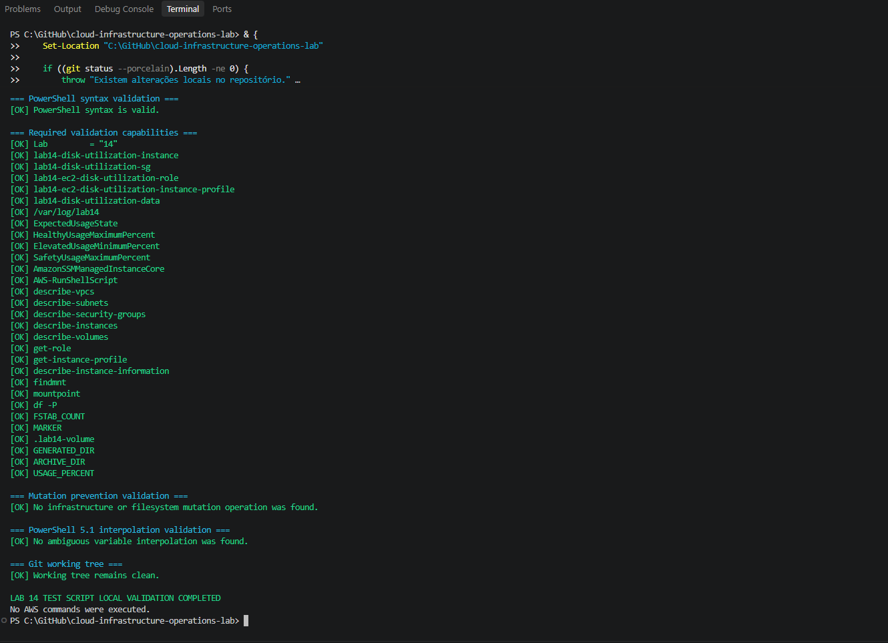

A validação inicial confirmou a estrutura, a política IAM e a sintaxe dos componentes disponíveis naquele estágio do laboratório.

### 2. Implantação da infraestrutura

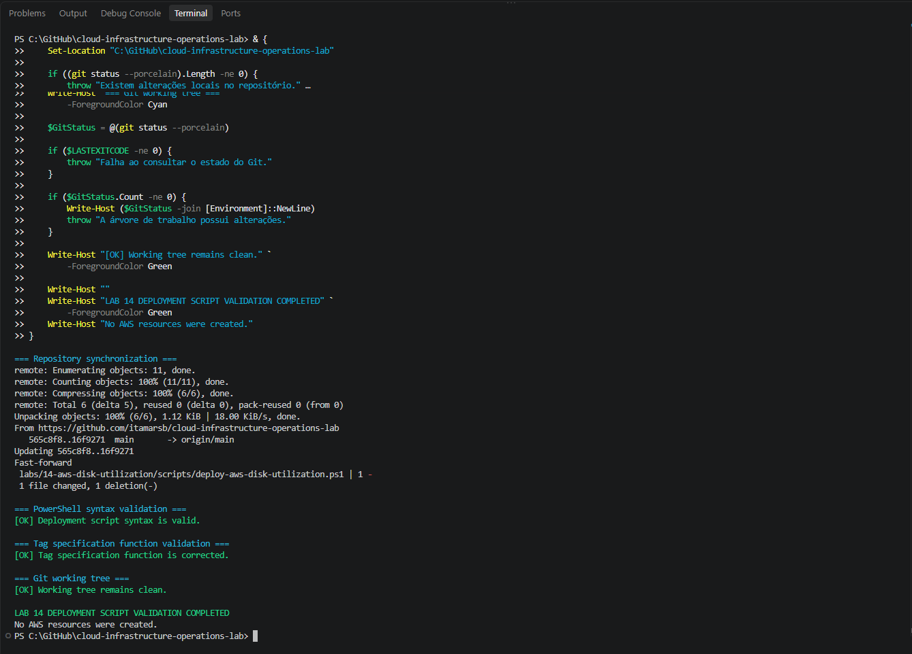

A implantação criou a instância EC2, o volume EBS dedicado, o Security Group, a IAM Role e o Instance Profile.

### 3. Configuração do volume dedicado

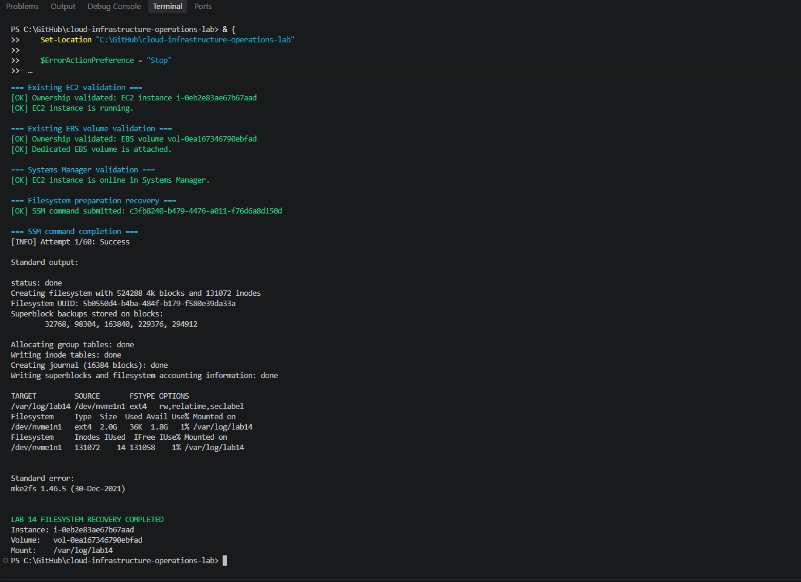

A configuração remota confirmou o volume `ext4`, a montagem em `/var/log/lab14` e a persistência por UUID.

### 4. Validação independente da infraestrutura

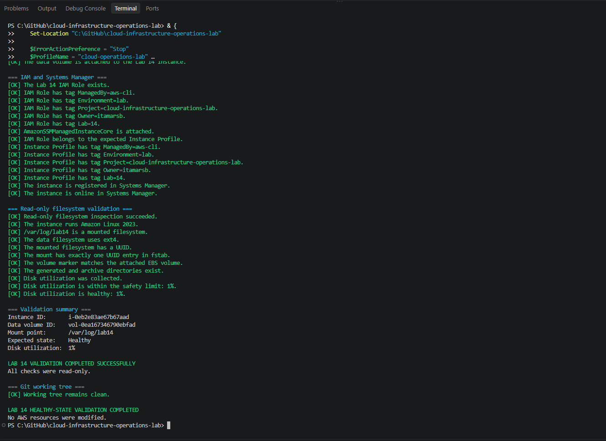

O script de teste confirmou as tags, os controles de segurança, o volume dedicado e a integração com o Systems Manager.

### 5. Estado saudável inicial

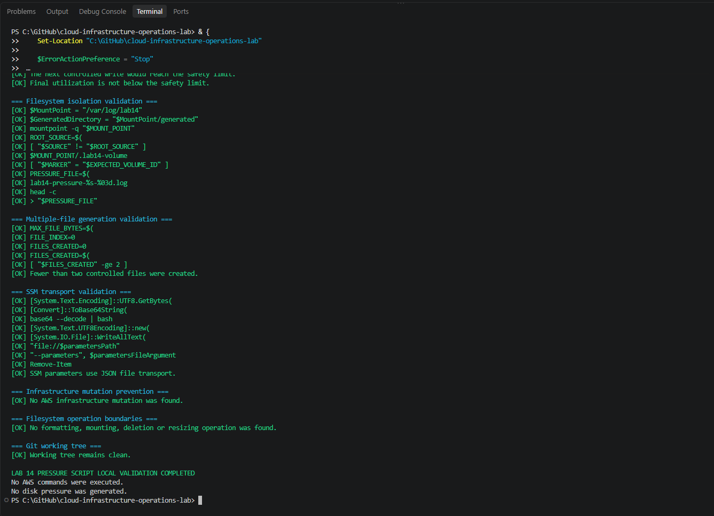

A inspeção somente leitura confirmou o estado saudável anterior à pressão controlada.

### 6. Primeira inspeção do cenário de pressão

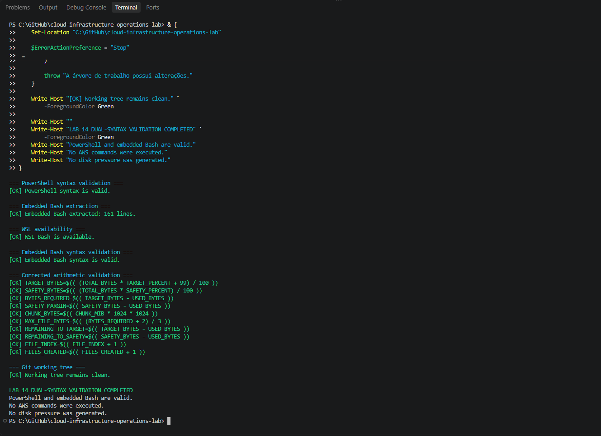

A execução confirmou os controles de segurança e os limites utilizados para a geração de arquivos.

### 7. Normalização e validação do Bash incorporado

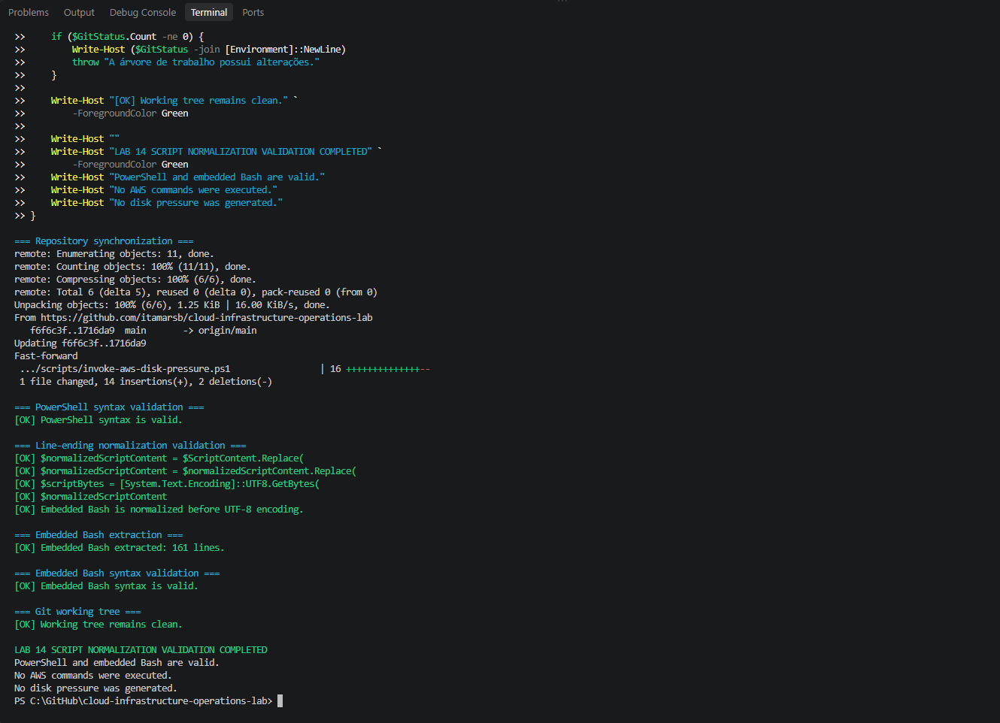

A validação confirmou a sintaxe do PowerShell, a sintaxe do Bash e a normalização dos finais de linha antes do transporte pelo Systems Manager.

### 8. Validação do cálculo baseado em espaço utilizável

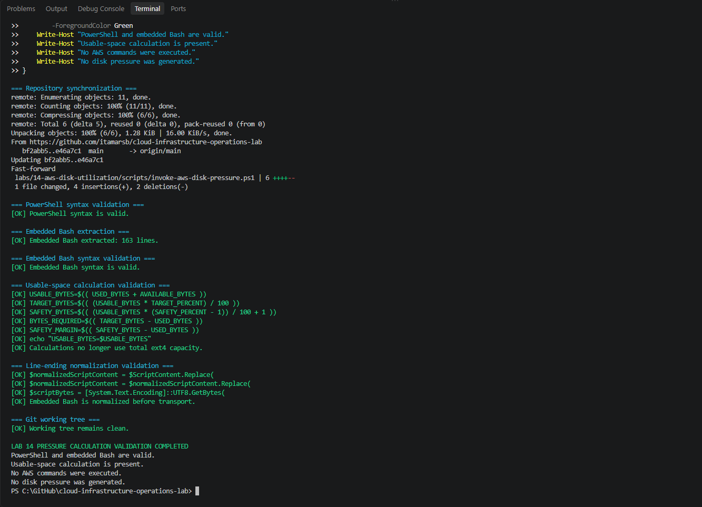

O cálculo foi corrigido para utilizar `USED_BYTES + AVAILABLE_BYTES`, respeitando os blocos reservados do filesystem `ext4`.

### 9. Diagnóstico do estado elevado

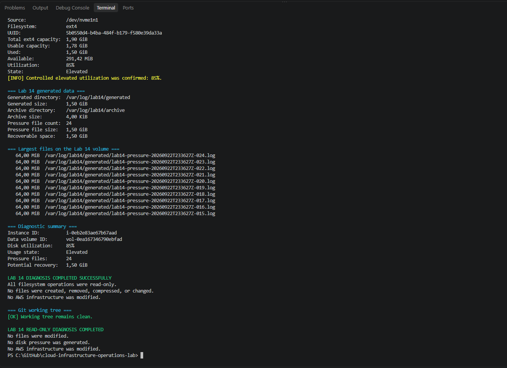

O diagnóstico confirmou utilização elevada, identificou os arquivos responsáveis e calculou o espaço recuperável.

### 10. Diagnóstico estendido

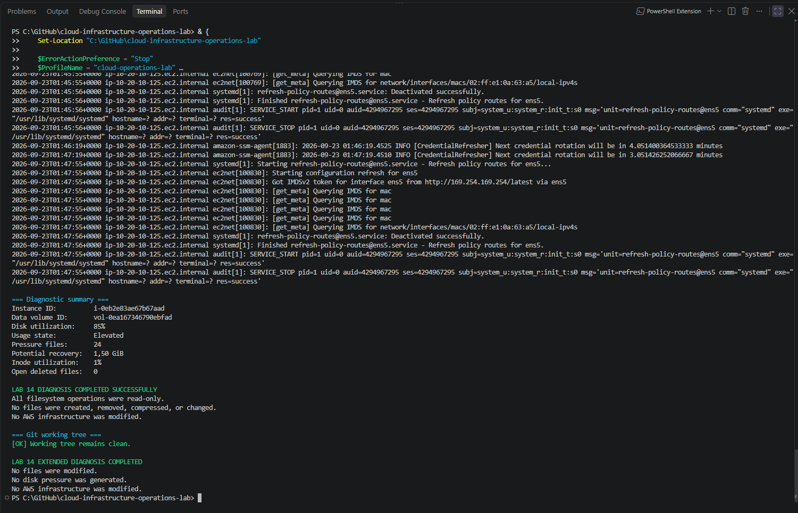

A inspeção estendida incluiu capacidade, inodes, maiores arquivos, descritores removidos ainda abertos e eventos recentes do sistema.

### 11. Validação estrutural da mitigação

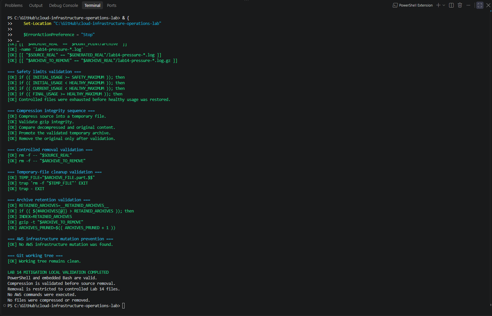

A validação local confirmou a sequência de compressão, verificação de integridade, promoção do arquivo temporário, remoção controlada e retenção.

### 12. Mitigação controlada

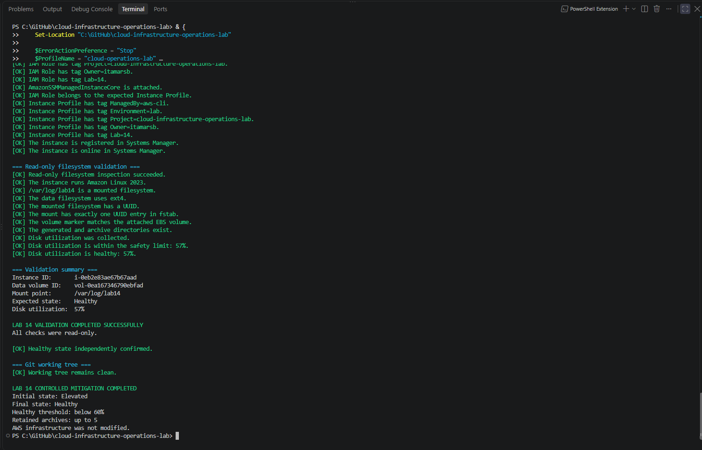

A mitigação processou os arquivos controlados e restaurou a utilização saudável do volume.

### 13. Validação pós-mitigação

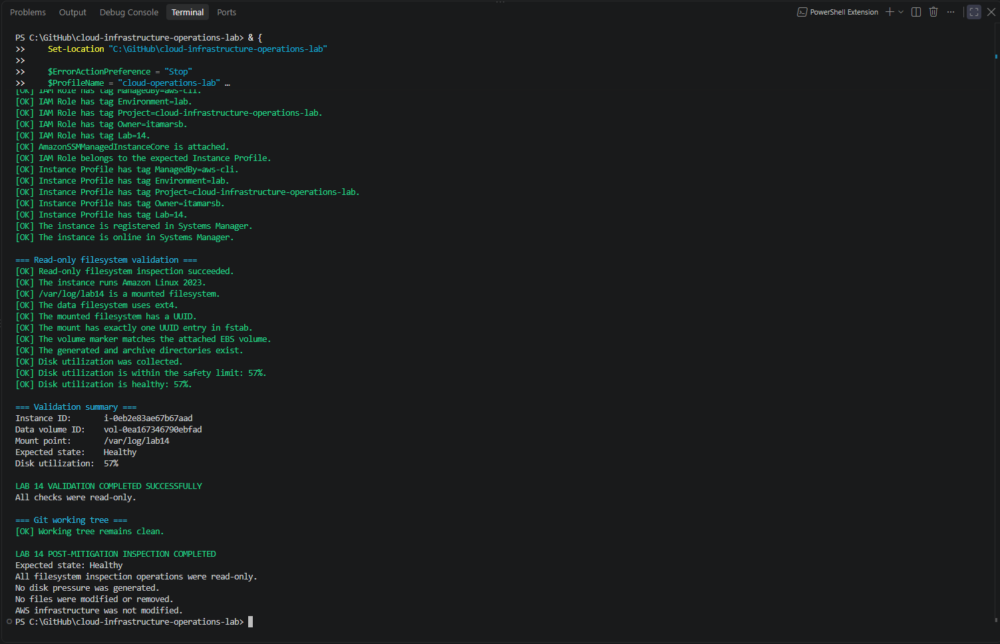

A inspeção independente confirmou utilização de `57%`, estado `Healthy` e ausência de alterações na infraestrutura AWS.

### 14. Validação estrutural do cleanup

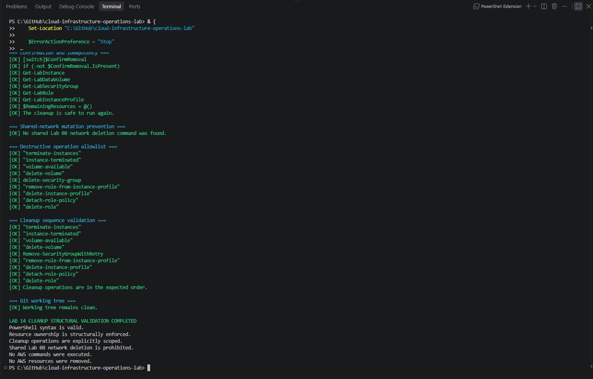

A validação local confirmou a propriedade dos recursos, a ordem das operações destrutivas, a idempotência e a proibição de remover a rede compartilhada.

### 15. Cleanup concluído

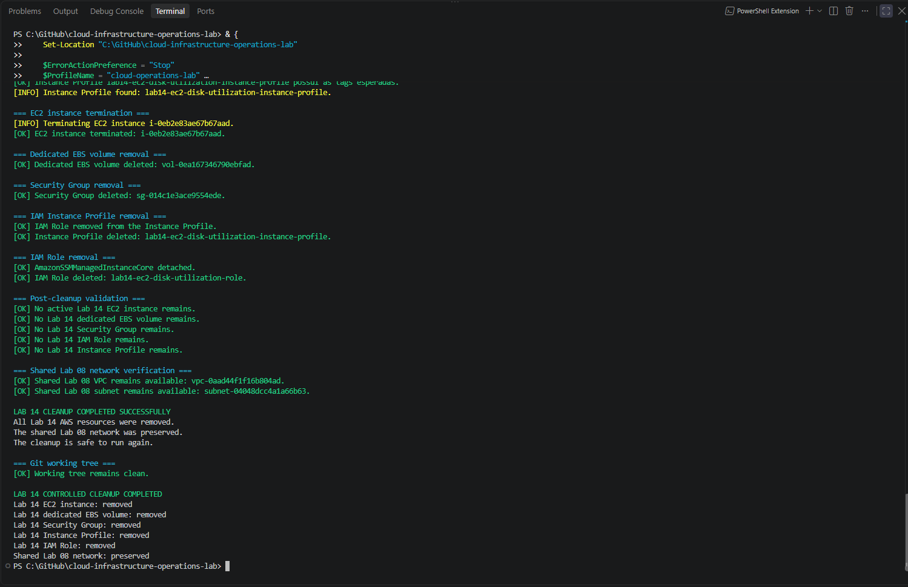

O cleanup removeu todos os recursos exclusivos do Lab 14, preservou a VPC e a sub-rede do Lab 08 e manteve a árvore de trabalho limpa.

---

## Critérios de sucesso

O Lab 14 foi considerado concluído porque:

1. a VPC e a sub-rede compartilhadas foram localizadas sem alterações;
2. exatamente uma instância ativa do Lab 14 foi implantada;
3. a instância executou Amazon Linux 2023;
4. nenhuma Key Pair foi associada;
5. o IMDSv2 foi configurado como obrigatório;
6. os volumes EBS utilizaram criptografia;
7. o volume de logs utilizou `gp3` e possuía `2 GiB`;
8. o volume foi formatado com `ext4`;
9. `/var/log/lab14` foi montado no volume dedicado;
10. a montagem persistente foi configurada por UUID;
11. a instância ficou online no Systems Manager;
12. o estado inicial apresentou utilização inferior a `60%`;
13. a pressão controlada ultrapassou `80%`;
14. a utilização permaneceu abaixo do limite de segurança de `88%`;
15. o volume raiz não sofreu pressão intencional;
16. o diagnóstico registrou capacidade e utilização;
17. o diagnóstico registrou o consumo de inodes;
18. o diagnóstico identificou os maiores diretórios e arquivos;
19. o diagnóstico verificou arquivos removidos ainda abertos;
20. nenhuma correção foi realizada pelo script de diagnóstico;
21. a mitigação alterou somente arquivos controlados;
22. os logs antigos foram rotacionados e comprimidos;
23. a integridade dos arquivos comprimidos foi validada;
24. a utilização pós-mitigação ficou abaixo de `60%`;
25. a validação independente terminou com sucesso;
26. o cleanup removeu todos os recursos exclusivos do Lab 14;
27. a VPC e a sub-rede do Lab 08 permaneceram disponíveis;
28. a árvore de trabalho permaneceu limpa.

---

## Estado final

- [x] escopo definido;
- [x] arquitetura definida;
- [x] estrutura criada no repositório;
- [x] política de confiança IAM implementada;
- [x] script de implantação implementado;
- [x] script de pressão controlada implementado;
- [x] script de diagnóstico implementado;
- [x] script de mitigação implementado;
- [x] script de validação independente implementado;
- [x] script de cleanup implementado;
- [x] validação sintática concluída;
- [x] implantação executada;
- [x] estado saudável inicial validado;
- [x] pressão controlada executada;
- [x] estado elevado validado;
- [x] diagnóstico concluído;
- [x] causa identificada;
- [x] mitigação executada;
- [x] estado saudável restaurado;
- [x] validação pós-mitigação concluída;
- [x] cleanup executado;
- [x] validação pós-cleanup concluída;
- [x] rede compartilhada preservada;
- [x] evidências publicadas;
- [x] laboratório concluído.

---

## Considerações de custo

Durante a execução, os seguintes recursos puderam gerar cobrança:

- uma instância EC2 `t3.micro`;
- um endereço IPv4 público;
- um volume raiz EBS;
- um volume EBS de dados com `2 GiB`.

O laboratório não utilizou:

- Application Load Balancer;
- NAT Gateway;
- Elastic IP;
- VPC Endpoint;
- banco de dados gerenciado.

Todos os recursos exclusivos do Lab 14 foram removidos após a conclusão.

A VPC e a sub-rede do Lab 08 permaneceram disponíveis por serem componentes compartilhados com outros laboratórios.

---

## Competências demonstradas

Este laboratório demonstra competências relacionadas a:

- administração de instâncias Amazon EC2;
- volumes EBS dedicados;
- filesystems Linux `ext4`;
- montagem persistente por UUID;
- análise de capacidade em bytes;
- análise de utilização de inodes;
- diagnóstico de consumo de disco;
- identificação de arquivos grandes;
- inspeção de arquivos removidos ainda abertos;
- análise de logs com `journalctl`;
- automação com PowerShell e Bash;
- execução remota com AWS Systems Manager;
- rotação e compressão de logs;
- validação de integridade;
- retenção controlada;
- mitigação segura;
- validação independente;
- scripts idempotentes;
- cleanup protegido;
- preservação de infraestrutura compartilhada;
- controle de custos operacionais.

---

## Conclusão

O Lab 14 reproduziu com segurança um incidente de utilização elevada de disco em uma instância Amazon EC2.

O uso de um volume EBS dedicado manteve a pressão isolada do volume raiz. O diagnóstico somente leitura identificou os arquivos responsáveis sem alterar o ambiente. A mitigação aplicou rotação, compressão, validação de integridade e retenção controlada, reduzindo a utilização de `85%` para `57%`.

A validação independente confirmou o retorno ao estado saudável. O cleanup removeu todos os recursos exclusivos do laboratório e preservou a rede compartilhada do Lab 08.

O laboratório demonstrou o ciclo operacional completo:

```text
Implantar
   |
Validar
   |
Provocar
   |
Diagnosticar
   |
Mitigar
   |
Validar novamente
   |
Remover com segurança
```
