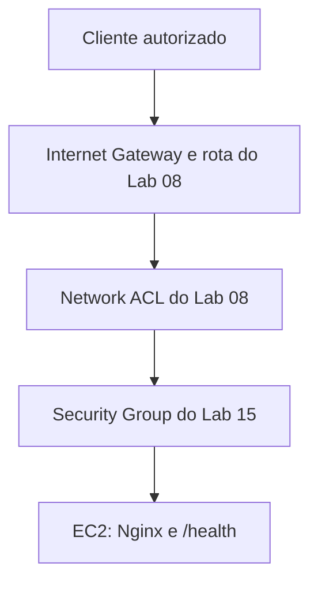

# Lab 15 — Troubleshooting de conectividade na AWS

## Objetivo e resultado

Investigar uma aplicação Nginx saudável em uma instância Amazon EC2, mas inacessível externamente após a remoção controlada de uma regra HTTP do Security Group. O diagnóstico separou o estado da aplicação, da instância e da rede. A recuperação restaurou somente a regra removida. Ao final, os recursos exclusivos foram removidos e a rede compartilhada do Lab 08 permaneceu disponível.

**Status: concluído em 25/09/2026.**

> **English summary:** An EC2-hosted Nginx application remained healthy locally while a controlled Security Group ingress change blocked external HTTP. Read-only diagnosis identified the missing rule, recovery restored connectivity, and cleanup preserved the shared Lab 08 network.

## Ambiente

| Componente | Configuração observada |
|---|---|
| Conta e Região | `412381774441`, `us-east-1` |
| VPC e sub-rede compartilhadas | `vpc-0aad44f1f16b804ad`, `subnet-04048dcc4a1a66b63` |
| Rota e Network ACL | `rtb-066dd13c45a54d908`, `acl-0535ec68170362eab` |
| Instância temporária | `i-00e61027112ec19d7`, Amazon Linux 2023, `t3.micro` |
| Security Group temporário | `sg-0ab0be4669912dc03` |
| Aplicação | Nginx em TCP `80`, endpoints `/` e `/health` |
| Administração | AWS Systems Manager; sem Key Pair ou regra SSH |
| Origem HTTP durante a execução | `177.35.240.154/32` |

Os IDs da instância e do Security Group são históricos: ambos foram removidos. O IPv4 público da instância era dinâmico; o CIDR `/32` identificava o operador naquele momento. Uma nova execução exige a origem atual. A falha afetou somente a regra TCP `80` do Security Group exclusivo do Lab 15. O Systems Manager continuou disponível.



## Scripts e proteção

| Arquivo em `scripts/` | Função |
|---|---|
| `deploy-aws-connectivity-troubleshooting.ps1` | Implantar e verificar o ambiente |
| `test-aws-connectivity-troubleshooting.ps1` | Validar independentemente `Healthy` ou `Failed` |
| `invoke-aws-connectivity-failure.ps1` | Revogar a regra HTTP específica |
| `diagnose-aws-connectivity-failure.ps1` | Investigar sem alterar o ambiente |
| `recover-aws-connectivity.ps1` | Restaurar a regra HTTP específica |
| `remove-aws-connectivity-troubleshooting.ps1` | Remover somente os recursos exclusivos |

A política de confiança da IAM Role está em `policies/ec2-ssm-trust-policy.json`. Os scripts validam nomes, tags e relações antes de operações de alteração. O ambiente usou acesso temporário via IAM Identity Center, Systems Manager, IMDSv2 obrigatório, volume raiz `gp3` criptografado, ausência de Key Pair e SSH e entrada HTTP limitada a um `/32`.

## Sequência executada

**O ambiente já foi removido.** Os comandos a seguir registram a execução e servem para uma eventual nova sessão, após confirmar conta, Região e estado da rede compartilhada. Não reutilize o CIDR histórico sem conferir seu IPv4 atual.

```powershell
aws sso login --profile cloud-operations-lab
aws sts get-caller-identity --profile cloud-operations-lab --region us-east-1

$PublicIp = ([string](Invoke-RestMethod -Uri "https://checkip.amazonaws.com/" -UseBasicParsing)).Trim()
$ParsedIp = $null
if (-not [Net.IPAddress]::TryParse($PublicIp, [ref]$ParsedIp) -or
    $ParsedIp.AddressFamily -ne [Net.Sockets.AddressFamily]::InterNetwork) {
    throw "Não foi possível identificar o IPv4 público."
}
$AllowedHttpCidr = "$PublicIp/32"
$Scripts = ".\labs\15-aws-connectivity-troubleshooting\scripts"
```

### 1. Implantação e estado saudável

```powershell
& "$Scripts\deploy-aws-connectivity-troubleshooting.ps1" `
    -ProfileName "cloud-operations-lab" `
    -Region "us-east-1" `
    -AvailabilityZone "us-east-1a" `
    -InstanceType "t3.micro" `
    -AllowedHttpCidr $AllowedHttpCidr

& "$Scripts\test-aws-connectivity-troubleshooting.ps1" `
    -ProfileName "cloud-operations-lab" `
    -Region "us-east-1" `
    -AllowedHttpCidr $AllowedHttpCidr `
    -ExpectedConnectivityState "Healthy"
```

O deploy criou instância, Security Group, IAM Role e Instance Profile. A primeira checagem HTTP do deploy falhou. A investigação confirmou que `curl.exe --noproxy "*"` alcançava `/health` com HTTP `200` e corpo `healthy`; a validação independente corrigida concluiu `Healthy`. Não houve segundo deploy.

### 2. Falha controlada e validação

```powershell
& "$Scripts\invoke-aws-connectivity-failure.ps1" `
    -ProfileName "cloud-operations-lab" `
    -Region "us-east-1" `
    -AllowedHttpCidr $AllowedHttpCidr `
    -ConfirmConnectivityFailure

& "$Scripts\test-aws-connectivity-troubleshooting.ps1" `
    -ProfileName "cloud-operations-lab" `
    -Region "us-east-1" `
    -AllowedHttpCidr $AllowedHttpCidr `
    -ExpectedConnectivityState "Failed"
```

A regra `sgr-078a847a191680242` de entrada TCP `80` para `177.35.240.154/32` foi revogada. O teste confirmou regra ausente e HTTP externo indisponível, enquanto Systems Manager, Nginx, porta `80` e `/health` local permaneceram saudáveis. Um `throw` posterior partiu do bloco chamador que consultou `$LASTEXITCODE` após o script PowerShell; a própria execução exibiu `FALHA CONTROLADA CONFIRMADA`, e o teste independente concluiu `Failed`.

### 3. Diagnóstico somente leitura

```powershell
& "$Scripts\diagnose-aws-connectivity-failure.ps1" `
    -ProfileName "cloud-operations-lab" `
    -Region "us-east-1" `
    -AllowedHttpCidr $AllowedHttpCidr
```

O diagnóstico encontrou a instância `running`, Systems Manager `Online`, Nginx `active`, `nginx -t` válido, porta `80` em escuta e `/health` local retornando `healthy`. A rota pública estava ativa e o Internet Gateway associado à VPC. A regra HTTP esperada estava ausente, e a resposta externa não era `healthy`. O conjunto de evidências é compatível com a falha planejada no Security Group. A Network ACL foi listada para inspeção; o script não a compara com uma captura anterior.

### 4. Recuperação e nova validação

```powershell
& "$Scripts\recover-aws-connectivity.ps1" `
    -ProfileName "cloud-operations-lab" `
    -Region "us-east-1" `
    -AllowedHttpCidr $AllowedHttpCidr `
    -ConfirmRecovery

& "$Scripts\test-aws-connectivity-troubleshooting.ps1" `
    -ProfileName "cloud-operations-lab" `
    -Region "us-east-1" `
    -AllowedHttpCidr $AllowedHttpCidr `
    -ExpectedConnectivityState "Healthy"
```

A recuperação restaurou a entrada TCP `80` apenas para o CIDR autorizado. A nova regra recebeu o ID `sgr-0f44b7def8eed4ae`. O endpoint externo `/health` voltou a responder `healthy`, e o teste independente concluiu `Healthy`.

### 5. Cleanup e preservação da rede

```powershell
& "$Scripts\remove-aws-connectivity-troubleshooting.ps1" `
    -ProfileName "cloud-operations-lab" `
    -Region "us-east-1" `
    -ConfirmRemoval

aws ec2 describe-vpcs `
    --vpc-ids vpc-0aad44f1f16b804ad `
    --region us-east-1 --profile cloud-operations-lab `
    --query "Vpcs[0].VpcId" --output text

aws ec2 describe-subnets `
    --subnet-ids subnet-04048dcc4a1a66b63 `
    --region us-east-1 --profile cloud-operations-lab `
    --query "Subnets[0].VpcId" --output text
```

O cleanup encerrou a instância e removeu o Security Group, o Instance Profile e a IAM Role exclusivos. Sua validação final confirmou a ausência desses recursos. As consultas independentes posteriores confirmaram que a VPC e a sub-rede do Lab 08 continuavam presentes e relacionadas.

## Evidências

| Captura | Resultado |
|---|---|
| [04 — falha controlada](images/Clipboard_09-25-2026_04.png) | Regra HTTP removida; HTTP externo indisponível |
| [05 — diagnóstico](images/Clipboard_09-25-2026_05.png) | Aplicação local saudável; regra HTTP ausente |
| [06 — recuperação](images/Clipboard_09-25-2026_06.png) | Regra restaurada; HTTP externo saudável |
| [07 — teste após recuperação](images/Clipboard_09-25-2026_07.png) | `VALIDAÇÃO CONCLUÍDA: Healthy` |
| [08 — cleanup](images/Clipboard_09-25-2026_08.png) | Recursos exclusivos removidos |
| [09 — verificação final](images/Clipboard_09-25-2026_09.png) | VPC e sub-rede preservadas |

As capturas [inicial](images/Clipboard_09-23-2026_16.png), [01](images/Clipboard_09-24-2026_01.png), [02](images/Clipboard_09-24-2026_02.png) e [03](images/Clipboard_09-24-2026_03.png) também integram o registro.

## Lições operacionais e custos

- Serviço ativo e endpoint local saudável não provam conectividade externa: a origem, a regra de entrada e a observação do cliente também precisam ser verificadas.
- No Windows, um proxy pode afetar a checagem HTTP. Os scripts usam `curl.exe --noproxy "*"` para testar o caminho direto.
- Os parâmetros JSON do Systems Manager são passados ao AWS CLI por `file://`, evitando problemas de citação no PowerShell; o arquivo temporário é apagado em `finally`.
- Sob `Set-StrictMode -Version Latest`, respostas AWS com propriedades opcionais exigem teste de existência antes do acesso.
- A instância EC2, seu IPv4 público e o volume EBS podiam gerar cobrança enquanto ativos. Os recursos exclusivos foram removidos ao fim.

## Conclusão

O ciclo `Healthy → Failed → diagnóstico → recuperação → Healthy → cleanup` foi concluído. A causa observada foi a ausência da regra HTTP no Security Group: o serviço permaneceu saudável internamente, mas o cliente perdeu acesso externo. A restauração da regra recuperou a conectividade; a remoção final preservou a rede compartilhada.
