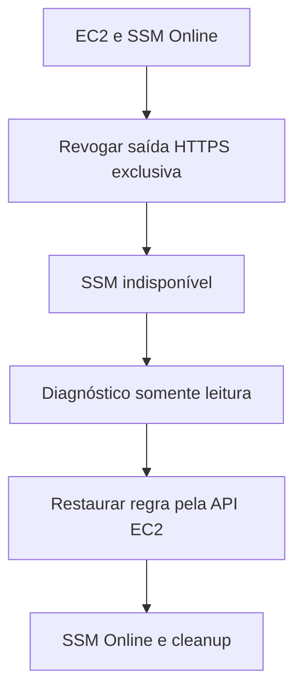

# Lab 16 — Systems Manager indisponível

## Objetivo

Investigar uma instância Amazon EC2 que deixa de ficar `Online` no AWS Systems Manager após uma falha controlada na comunicação de saída. Identificar a causa por meio de consultas somente leitura, recuperar a conectividade pela API do EC2, validar o retorno do agente e remover os recursos temporários.

> **English summary:** Diagnose a managed EC2 node that becomes unavailable in AWS Systems Manager after a controlled outbound HTTPS network change. Restore the isolated Security Group rule through the EC2 API, validate the agent, and clean up the temporary resources.

**Status:** planejamento. Nenhum recurso do Lab 16 foi criado.

## Cenário e hipótese

Uma instância `t3.micro` com Amazon Linux 2023 será implantada na sub-rede pública compartilhada do Lab 08. Ela terá IAM Role e Instance Profile próprios, `AmazonSSMManagedInstanceCore`, SSM Agent ativo e um Security Group exclusivo sem entradas. A saída IPv4 será configurada explicitamente para permitir HTTPS TCP `443`. A validação inicial deverá confirmar EC2 `running` e Systems Manager `Online`.

A falha proposta revogará **somente** a regra de saída HTTPS identificada por seu `SecurityGroupRuleId`. A instância permanecerá ligada; IAM, agente, VPC, rota, Internet Gateway e Network ACL não serão alterados. O efeito esperado é a perda da conexão do agente com o Systems Manager, observada como `ConnectionLost` ou ausência de confirmação de `Online` após uma janela limitada. O diagnóstico verificará as permissões e o caminho de rede, apontando a regra ausente como causa *compatível com as evidências*. A recuperação restaurará a regra exata pela API EC2, que não depende de uma sessão SSM na instância.

Essa hipótese será testada na prática. O script de falha deve confirmar o estado observado; caso o agente permaneça `Online` até o prazo configurado, deve reportar resultado inconclusivo, sem declarar sucesso. Nesse caso, a recuperação deverá restaurar a regra antes de encerrar a execução.

## Arquitetura e limites

| Componente | Planejamento |
|---|---|
| Perfil e Região | `cloud-operations-lab`, `us-east-1` |
| Rede reutilizada | VPC `lab08-application-vpc`; sub-rede `lab08-public-subnet-a` |
| Zona e instância | `us-east-1a`; `t3.micro`; Amazon Linux 2023 |
| IAM | Role e Instance Profile exclusivos com `AmazonSSMManagedInstanceCore` |
| Security Group | Exclusivo; nenhuma entrada; saída TCP `443` controlada |
| Administração | Session Manager e Run Command antes da falha e após a recuperação |
| Segurança | Sem SSH, Key Pair, regra TCP `22`, NAT Gateway ou VPC Endpoint novo |
| Disco | Volume raiz `gp3` criptografado; IMDSv2 obrigatório |

O fluxo planejado será:



O Security Group será usado somente pela instância do Lab 16. Os scripts devem recusar dependências inesperadas e identificar recursos por nome, tags, VPC e associações. Não devem modificar o Security Group, as rotas ou a Network ACL do Lab 08, nem qualquer instância de outro laboratório ou repositório.

## Verificações anteriores à falha

1. Confirmar identidade AWS, Região, VPC, sub-rede, rota pública e Internet Gateway.
2. Confirmar que a instância possui IPv4 público, IAM Instance Profile esperado, SSM Agent `Online`, IMDSv2 obrigatório e nenhum acesso SSH.
3. Confirmar que o Security Group exclusivo está associado somente à instância esperada e que sua única autorização de saída IPv4 é TCP `443` para `0.0.0.0/0`. Não deve haver outra regra IPv6, outra interface de rede ou caminho privado para os endpoints que contorne a falha.
4. Confirmar que `AmazonSSMManagedInstanceCore` está anexada à IAM Role esperada e que a instância não depende de uma configuração alternativa de gerenciamento que invalide o teste.
5. Registrar o ID e os atributos da regra de saída antes da revogação, para permitir recuperação exata.
6. Confirmar uma operação SSM somente leitura enquanto o agente estiver `Online`.

Caso qualquer pré-requisito falhe, a introdução da falha não deve começar. A IAM Role e o agente serão inspecionados no diagnóstico, mas não serão alterados neste cenário.

## Fluxo operacional previsto

### 1. Implantação

O script `deploy-aws-systems-manager-troubleshooting.ps1` criará a IAM Role, o Instance Profile, o Security Group e uma EC2 exclusiva. Deverá aguardar `Online`, conferir as tags e expor os IDs necessários. Recurso incompatível encontrado previamente causará interrupção, sem assumir propriedade.

### 2. Validação inicial

`test-aws-systems-manager-troubleshooting.ps1` será somente leitura e terá estados esperados `Healthy` e `Failed`. Em `Healthy`, verificará EC2 `running`, IAM correto, saída HTTPS presente e SSM `Online`; um Run Command simples e somente leitura poderá comprovar a comunicação.

### 3. Falha controlada

`invoke-aws-systems-manager-failure.ps1` exigirá `-ConfirmFailure`. Depois de repetir as verificações críticas, revogará somente a regra de saída identificada. Confirmará a ausência da regra e observará o SSM por um período com limite. Não tentará usar SSM após a perda de contato. Uma falha parcial deverá ser exibida com o estado atual e a forma de recuperar o acesso.

### 4. Diagnóstico

`diagnose-aws-systems-manager-failure.ps1` consultará STS, EC2, IAM e SSM sem modificar recursos. Registrará instância, sub-rede, rota, Internet Gateway, Security Group, regras de saída, Instance Profile, política IAM e `PingStatus`/último contato do nó. Não atribuirá uma falha de IAM ou do serviço do agente sem evidências suficientes.

### 5. Recuperação

`recover-aws-systems-manager.ps1` exigirá `-ConfirmRecovery`. Após confirmar propriedade e ausência da regra esperada, restaurará somente saída TCP `443` no Security Group exclusivo por meio da API EC2. Aguardará o retorno do SSM a `Online`, verificará a comunicação e exibirá o novo ID da regra. Se a regra exata já estiver presente, não criará uma duplicata.

### 6. Cleanup

`remove-aws-systems-manager-troubleshooting.ps1` exigirá `-ConfirmRemoval`. Após inventário e confirmação de propriedade, encerrará a instância, removerá o Security Group, o Instance Profile e a IAM Role exclusivos e confirmará a ausência desses recursos. A VPC e a sub-rede do Lab 08 serão verificadas separadamente após o cleanup.

## Critérios de sucesso

- [ ] Instância exclusiva implantada e agente `Online` antes da falha.
- [ ] IAM Role e Instance Profile exclusivos verificados.
- [ ] Security Group sem entrada e com uma única saída IPv4 HTTPS verificado.
- [ ] Revogação restrita ao ID da regra planejada.
- [ ] Instância permanece `running` e o SSM perde contato no prazo definido.
- [ ] Diagnóstico somente leitura registra IAM, agente observável e caminho de rede.
- [ ] Saída HTTPS restaurada sem sessão SSM.
- [ ] Agente volta a `Online` e comunicação é comprovada.
- [ ] Validação independente conclui `Healthy`.
- [ ] Recursos exclusivos removidos; rede compartilhada preservada.
- [ ] Evidências publicadas após a execução, com nomes escolhidos então.

## Estrutura planejada

```text
labs/16-aws-systems-manager-troubleshooting/
├── README.md
├── images/
├── policies/
│   └── ec2-ssm-trust-policy.json
└── scripts/
    ├── deploy-aws-systems-manager-troubleshooting.ps1
    ├── test-aws-systems-manager-troubleshooting.ps1
    ├── invoke-aws-systems-manager-failure.ps1
    ├── diagnose-aws-systems-manager-failure.ps1
    ├── recover-aws-systems-manager.ps1
    └── remove-aws-systems-manager-troubleshooting.ps1
```

Os scripts e a política acima ainda serão implementados. Os diretórios podem inicialmente conter apenas arquivos `.gitkeep`. Nenhum nome de captura será reservado antes da produção das evidências.

## Custos e referências

Uma instância EC2, o volume EBS e o IPv4 público podem gerar cobranças enquanto permanecerem ativos. O laboratório não criará endpoints privados, NAT Gateway ou recursos de outra aplicação. O cleanup deve ser executado após a recuperação e a coleta das evidências.

- [AWS — Troubleshooting managed node availability](https://docs.aws.amazon.com/systems-manager/latest/userguide/fleet-manager-troubleshooting-managed-nodes.html)
- [AWS — Network requirements for Systems Manager](https://docs.aws.amazon.com/systems-manager/latest/userguide/setup-create-vpc.html)
- [AWS — Troubleshooting managed nodes using ssm-cli](https://docs.aws.amazon.com/systems-manager/latest/userguide/troubleshooting-managed-nodes-using-ssm-cli.html)
