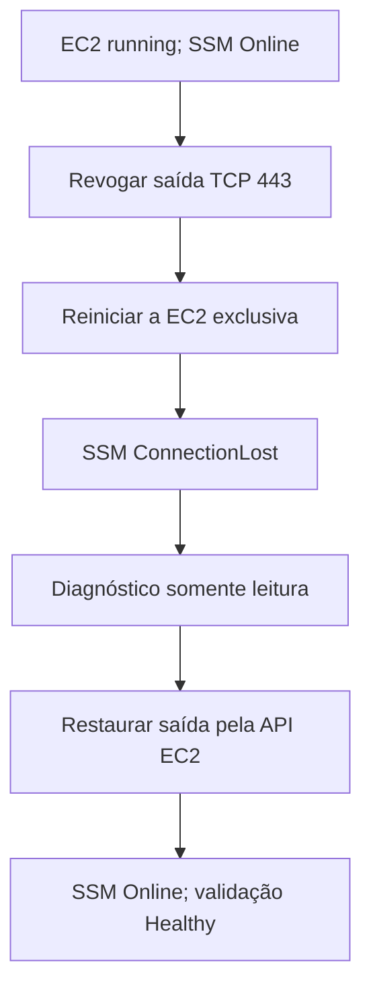

# Lab 16 — Troubleshooting do AWS Systems Manager

## Resumo

Uma instância EC2 gerenciada pelo AWS Systems Manager perdeu a comunicação após a remoção controlada de sua única regra de saída HTTPS. O laboratório confirmou que a instância continuava `running`, enquanto o Systems Manager passou a `ConnectionLost`. O diagnóstico verificou rede, Security Group e IAM; a recuperação restaurou a regra pela API do EC2 e confirmou o retorno a `Online`.

A primeira tentativa de reproduzir a falha foi inconclusiva: o Systems Manager permaneceu `Online` durante a janela de observação, e o script restaurou a regra. A execução seguinte reiniciou somente a instância do Lab 16 após revogar a regra, encerrando as conexões existentes. Dessa vez, `ConnectionLost` foi observado na verificação 38 de 40.

> **English summary:** A controlled removal of outbound HTTPS access caused an EC2 managed node to become unavailable in AWS Systems Manager. The first attempt was inconclusive and restored the rule. After rebooting the dedicated instance to close existing connections, the second attempt confirmed `ConnectionLost`. Read-only diagnosis identified the missing egress rule, and recovery through the EC2 API returned the node to `Online`. Dedicated resources were then removed while the shared network remained available.

**Estado:** concluído. Falha controlada, diagnóstico, recuperação, validação final e cleanup executados.

## Objetivo

Praticar uma investigação em que a instância EC2 continua em execução, mas deixa de responder ao Systems Manager. O exercício exige distinguir o estado da instância do estado do agente gerenciado, verificar as possíveis causas sem alterar a infraestrutura durante o diagnóstico e recuperar a comunicação sem depender de uma sessão SSM já indisponível.

## Ambiente e limites

| Componente | Configuração utilizada |
|:---|:---|
| Conta e Região | Conta AWS `412381774441`; `us-east-1` |
| Perfil local | `cloud-operations-lab` |
| Instância exclusiva | `i-0931fdb3d51d9c100`; `t3.micro`; Amazon Linux 2023 |
| VPC compartilhada | `vpc-0aad44f1f16b804ad`, do Lab 08 |
| Sub-rede compartilhada | `subnet-04048dcc4a1a66b63`, do Lab 08 |
| Security Group exclusivo | `sg-052869d181178d6af` |
| Entrada no Security Group | Nenhuma |
| Saída prevista | TCP `443` para `0.0.0.0/0` |
| Administração | AWS Systems Manager; sem SSH ou Key Pair |
| IAM | Role e Instance Profile exclusivos com `AmazonSSMManagedInstanceCore` |
| Metadados da instância | IMDSv2 obrigatório |

A VPC, a sub-rede, a tabela de rotas, o Internet Gateway e a Network ACL são recursos compartilhados. A falha controlada alterou somente a regra de saída do Security Group exclusivo. A instância de outro repositório mantida na conta não fez parte deste laboratório.

## Arquitetura do cenário


```mermaid
flowchart TD
    A["EC2 running; SSM Online"] --> B["Revogar saída TCP 443"]
    B --> C["Reiniciar a EC2 exclusiva"]
    C --> D["SSM ConnectionLost"]
    D --> E["Diagnóstico somente leitura"]
    E --> F["Restaurar saída pela API EC2"]
    F --> G["SSM Online; validação Healthy"]
```

A reinicialização faz parte da versão final do procedimento de falha. Ela foi acrescentada depois que a primeira execução demonstrou que revogar a regra, isoladamente, não produziu `ConnectionLost` dentro do prazo observado.

## Resultado observado

| Etapa | Observação |
|:---|:---|
| Implantação | EC2 exclusiva criada e Systems Manager `Online` |
| Validação inicial | Estado `Healthy`; IAM, rede e regra HTTPS conferidos |
| Primeira tentativa de falha | Regra revogada, mas SSM permaneceu `Online` nas 24 verificações; resultado inconclusivo e regra restaurada |
| Segunda tentativa de falha | Regra revogada; instância exclusiva reiniciada; SSM passou a `ConnectionLost` na verificação 38/40 |
| Validação da falha | Instância `running`, regra HTTPS ausente e SSM `ConnectionLost`; estado `Failed` confirmado |
| Diagnóstico | Rota pública, Internet Gateway, Network ACL e política IAM presentes; nenhuma regra de saída no Security Group exclusivo |
| Recuperação | Nova regra HTTPS `sgr-0af22e7052e1d0a4f` criada; SSM retornou a `Online` |
| Validação final | Estado `Healthy` confirmado de forma independente |
| Cleanup | Instância, Security Group, Instance Profile e IAM Role exclusivos removidos; VPC e sub-rede compartilhadas preservadas |

O diagnóstico concluiu que as observações eram **compatíveis** com a ausência da saída HTTPS como causa da indisponibilidade. A Network ACL foi inspecionada, mas o script não a comparou com uma captura anterior.

## Problemas encontrados e correções

### Codificação do script de diagnóstico no Windows PowerShell

A primeira análise de sintaxe de `diagnose-aws-systems-manager-failure.ps1` encontrou uma cadeia de caracteres sem terminador. O arquivo foi ajustado para UTF-8 com BOM, necessário para a leitura correta daquele conteúdo no ambiente Windows PowerShell 5.1 utilizado. Depois da correção, os seis scripts passaram pela análise de sintaxe e a política IAM passou pela validação de JSON.

[Captura da validação dos scripts e da política IAM](images/Clipboard_09-25-2026_10.png)

### Comparação do Instance Profile

O primeiro deploy terminou com a instância `Online`, mas o validador rejeitou seu Instance Profile. A comparação foi corrigida para usar o ARN completo esperado para a conta e o nome do profile. A validação `Healthy` passou sem repetir o deploy.

[Captura da validação inicial Healthy](images/Clipboard_09-26-2026_01.png)

### Regra removida, mas SSM ainda Online

Na primeira tentativa de falha controlada, a regra HTTPS foi revogada e o SSM permaneceu `Online` durante as 24 verificações. O script tratou o resultado como inconclusivo e restaurou a saída HTTPS. Uma validação posterior confirmou novamente o estado `Healthy`.

A permanência de conexões já estabelecidas foi considerada uma explicação possível para a observação. O procedimento foi então ajustado para reiniciar **somente a instância exclusiva do Lab 16** após a revogação e ampliar a observação para 40 verificações. Na segunda execução, o SSM passou a `ConnectionLost` na verificação 38/40, enquanto a EC2 continuava `running`.

[Captura da segunda tentativa e da falha confirmada](images/Clipboard_09-26-2026_02.png)

A primeira tentativa permanece registrada como inconclusiva. O sucesso do laboratório corresponde à segunda execução, seguida das validações independentes.

## Diagnóstico da falha confirmada

O validador executado com `-ExpectedConnectivityState "Failed"` confirmou a ausência da saída HTTPS e `PingStatus: ConnectionLost`. Em seguida, o diagnóstico somente leitura verificou:

- EC2 `running`, com IPv4 público e IMDSv2 obrigatório;
- rota pública ativa e Internet Gateway associado;
- Network ACL observada com regras de permissão e negação padrão;
- Security Group exclusivo sem regras de entrada e sem regras de saída;
- Instance Profile e política `AmazonSSMManagedInstanceCore` presentes;
- Systems Manager em `ConnectionLost`.

[Captura da validação Failed e do diagnóstico](images/Clipboard_09-26-2026_03.png)

O diagnóstico consultou o estado dos recursos. Ele não alterou IAM, VPC, rotas, Network ACL, agente SSM ou instância.

## Recuperação

A recuperação usou a API do EC2 para restaurar a saída TCP `443` para `0.0.0.0/0` no Security Group exclusivo. Esse caminho não dependia de Run Command ou Session Manager enquanto o nó estava em `ConnectionLost`.

O script criou a regra `sgr-0af22e7052e1d0a4f`, aguardou o retorno do Systems Manager a `Online` e confirmou a conectividade. Uma execução separada do validador terminou com `VALIDAÇÃO CONCLUÍDA: Healthy`.

[Captura da recuperação e da validação Healthy](images/Clipboard_09-26-2026_04.png)

## Cleanup

Após a recuperação e a coleta das evidências, `remove-aws-systems-manager-troubleshooting.ps1` confirmou a propriedade dos recursos exclusivos e encerrou a instância `i-0931fdb3d51d9c100`. Em seguida, removeu o Security Group `sg-052869d181178d6af`, o Instance Profile e a IAM Role do Lab 16.

A validação pós-cleanup confirmou a ausência dos recursos exclusivos. Uma consulta adicional confirmou que a VPC `vpc-0aad44f1f16b804ad` e a sub-rede `subnet-04048dcc4a1a66b63` do Lab 08 continuavam disponíveis. O repositório local permaneceu sem alterações após a execução.

[Captura do cleanup e da verificação da rede compartilhada](images/Clipboard_09-26-2026_05.png)

## Scripts

| Arquivo | Função |
|:---|:---|
| [`deploy-aws-systems-manager-troubleshooting.ps1`](scripts/deploy-aws-systems-manager-troubleshooting.ps1) | Criar os recursos exclusivos e aguardar o SSM `Online` |
| [`test-aws-systems-manager-troubleshooting.ps1`](scripts/test-aws-systems-manager-troubleshooting.ps1) | Validar, somente por leitura, os estados `Healthy` ou `Failed` |
| [`invoke-aws-systems-manager-failure.ps1`](scripts/invoke-aws-systems-manager-failure.ps1) | Revogar a regra identificada, reiniciar a EC2 exclusiva e observar `ConnectionLost` |
| [`diagnose-aws-systems-manager-failure.ps1`](scripts/diagnose-aws-systems-manager-failure.ps1) | Inspecionar EC2, rede, IAM e SSM sem alterar recursos |
| [`recover-aws-systems-manager.ps1`](scripts/recover-aws-systems-manager.ps1) | Restaurar a saída HTTPS pela API do EC2 e aguardar `Online` |
| [`remove-aws-systems-manager-troubleshooting.ps1`](scripts/remove-aws-systems-manager-troubleshooting.ps1) | Remover os recursos exclusivos após validações de propriedade |

A política de confiança da instância está em [`policies/ec2-ssm-trust-policy.json`](policies/ec2-ssm-trust-policy.json).

## Execução e verificações

Os comandos abaixo documentam as fases executadas **em ordem**, a partir da raiz do repositório, com sessão AWS SSO válida. Para reproduzir o laboratório, implante primeiro novos recursos com o script de deploy. Os IDs da execução documentada acima já foram removidos.

Após o deploy, a validação inicial é feita por:

```powershell
$Scripts = ".\labs\16-aws-systems-manager-troubleshooting\scripts"

& (Join-Path $Scripts "test-aws-systems-manager-troubleshooting.ps1") `
    -ProfileName "cloud-operations-lab" `
    -Region "us-east-1" `
    -ExpectedConnectivityState "Healthy"
```

Após confirmar os pré-requisitos, a falha controlada é iniciada por:

```powershell
& (Join-Path $Scripts "invoke-aws-systems-manager-failure.ps1") `
    -ProfileName "cloud-operations-lab" `
    -Region "us-east-1" `
    -ConfirmFailure
```

O estado de falha e suas possíveis causas são verificados por:

```powershell
& (Join-Path $Scripts "test-aws-systems-manager-troubleshooting.ps1") `
    -ProfileName "cloud-operations-lab" `
    -Region "us-east-1" `
    -ExpectedConnectivityState "Failed"

& (Join-Path $Scripts "diagnose-aws-systems-manager-failure.ps1") `
    -ProfileName "cloud-operations-lab" `
    -Region "us-east-1"
```

A recuperação é realizada por:

```powershell
& (Join-Path $Scripts "recover-aws-systems-manager.ps1") `
    -ProfileName "cloud-operations-lab" `
    -Region "us-east-1" `
    -ConfirmRecovery

& (Join-Path $Scripts "test-aws-systems-manager-troubleshooting.ps1") `
    -ProfileName "cloud-operations-lab" `
    -Region "us-east-1" `
    -ExpectedConnectivityState "Healthy"
```

Por fim, os recursos exclusivos são removidos por:

```powershell
& (Join-Path $Scripts "remove-aws-systems-manager-troubleshooting.ps1") `
    -ProfileName "cloud-operations-lab" `
    -Region "us-east-1" `
    -ConfirmRemoval
```

## Critérios de conclusão

- [x] Instância exclusiva implantada e SSM `Online`.
- [x] IAM Role, Instance Profile e política SSM verificados.
- [x] Security Group exclusivo sem entrada e com saída HTTPS controlada.
- [x] Primeira tentativa inconclusiva identificada e regra restaurada.
- [x] Falha reproduzida após revogação da saída HTTPS e reinicialização da instância exclusiva.
- [x] Instância `running` e SSM `ConnectionLost` confirmados.
- [x] Diagnóstico somente leitura documentado.
- [x] Saída HTTPS restaurada pela API do EC2.
- [x] SSM `Online` e validação independente `Healthy`.
- [x] Recursos exclusivos removidos e rede compartilhada preservada após o cleanup.
- [x] Evidência do cleanup publicada.

## Custos e limites

A instância EC2, seu volume EBS e o IPv4 público podiam gerar custos enquanto permanecessem ativos. Os recursos exclusivos desta execução foram removidos. A VPC e a sub-rede compartilhadas do Lab 08 permaneceram disponíveis. A instância mantida para outro repositório não foi incluída no cleanup.

## Referências

- [AWS Systems Manager — Troubleshooting managed node availability](https://docs.aws.amazon.com/systems-manager/latest/userguide/fleet-manager-troubleshooting-managed-nodes.html)
- [AWS Systems Manager — Network requirements](https://docs.aws.amazon.com/systems-manager/latest/userguide/setup-create-vpc.html)
- [Amazon VPC — Connection tracking for security groups](https://docs.aws.amazon.com/AWSEC2/latest/UserGuide/security-group-connection-tracking.html)
