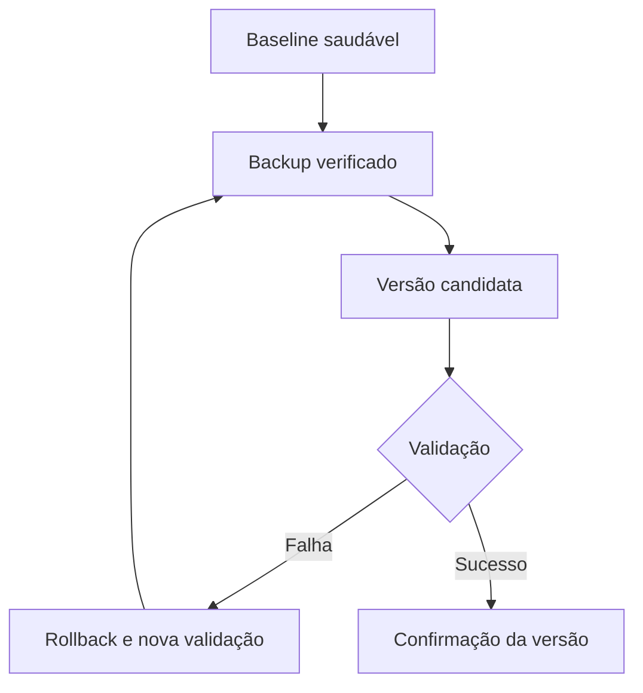

# Lab 17 — Atualização controlada de aplicação na AWS

## Resumo

Este laboratório planeja uma atualização de uma aplicação web servida pelo Nginx em uma instância EC2 exclusiva. A versão inicial será registrada e validada antes da mudança. Uma versão candidata será publicada de modo controlado, verificada por testes independentes e confirmada somente após atender aos critérios de saúde. Uma falha simulada permitirá praticar o rollback para a versão anterior.

> **English summary:** This lab will deploy a versioned Nginx web application on a dedicated EC2 instance, record a healthy baseline, apply a controlled release, validate service health, practice rollback after an unsuccessful release, and confirm a healthy update. Shared networking resources will remain untouched.

**Estado:** em preparação. Este README descreve o procedimento pretendido; nenhuma execução do Lab 17 foi realizada ainda.

## Objetivos

- Registrar o estado inicial da aplicação, serviço, configuração e versão publicada.
- Preparar uma atualização reproduzível, com critério explícito de sucesso.
- Verificar a configuração do Nginx antes de ativar uma mudança.
- Demonstrar uma tentativa malsucedida e restaurar a versão anterior.
- Publicar uma atualização válida, confirmar sua versão e registrar evidências.
- Remover somente os recursos exclusivos do laboratório.

## Escopo da atualização

O objeto da mudança será o **conteúdo e a configuração da aplicação servida pelo Nginx**, com uma identificação de versão visível no endpoint `/version`. A versão do pacote `nginx` e a versão do Amazon Linux 2023 serão registradas como parte do baseline, mas a atualização de pacotes do sistema operacional fica fora desta mudança. Assim, o rollback deste exercício pode ser comprovado pela restauração de arquivos e configuração conhecidos.

O endpoint `/health` deverá responder HTTP `200` com um corpo de saúde definido pelos scripts. O endpoint `/version` deverá identificar a versão ativa. A versão candidata inválida será tratada como uma tentativa separada da publicação válida, mantendo registro do motivo da rejeição e do estado restaurado.

## Arquitetura prevista

| Componente | Uso planejado |
|:---:|---|
| Conta, perfil e Região | Perfil `cloud-operations-lab`, `us-east-1`; confirmar a identidade antes de qualquer alteração |
| Rede compartilhada | VPC e sub-rede públicas do Lab 08, localizadas por tags e validadas antes do deploy |
| Computação | EC2 `t3.micro` exclusiva, Amazon Linux 2023, volume raiz criptografado |
| Administração | IAM Role e Instance Profile exclusivos com `AmazonSSMManagedInstanceCore`; Systems Manager Run Command |
| Segurança | Security Group exclusivo; HTTP `80` limitado ao IPv4 `/32` atual do operador; sem SSH nem Key Pair |
| Aplicação | Nginx com `/health` e `/version`; versões de conteúdo e configuração identificáveis |
| Evidências | Resultados de deploy, baseline, falha, rollback, atualização válida, confirmação e cleanup |

Os nomes e IDs dos recursos serão definidos e verificados nos scripts. Nenhum ID histórico dos Labs 15 ou 16 deve ser reutilizado. A instância de outro repositório mantida na conta não participa do cenário.

## Fluxo planejado

1. Validar `git status`, sessão SSO, identidade AWS, Região e rede compartilhada.
2. Implantar somente os recursos exclusivos do Lab 17 e aguardar EC2 `running` e SSM `Online`.
3. Registrar baseline: pacote Nginx, `nginx -t`, `systemctl`, HTTP `/health`, HTTP `/version` e versão inicial.
4. Preparar cópia recuperável dos arquivos sob gerenciamento do Lab 17 e registrar seus hashes.
5. Aplicar uma versão candidata com erro controlado, observar a rejeição pelo teste de configuração ou de saúde e executar rollback.
6. Confirmar que o rollback restaurou os hashes, a versão inicial e a saúde local e externa.
7. Aplicar uma versão candidata válida; verificar configuração, serviço, endpoint local e acesso HTTP permitido externamente.
8. Confirmar a atualização com registro da versão ativa e dos resultados da validação independente.
9. Executar cleanup dos recursos exclusivos e conferir que a rede compartilhada permanece disponível.



## Critérios de validação

| Momento | Evidência esperada |
|:---:|---|
| Antes da mudança | Instância `running`, SSM `Online`, Nginx ativo, `nginx -t` válido e `/health` saudável |
| Candidata inválida | Falha detectada de forma explícita, com motivo registrado; nenhuma confirmação da versão |
| Depois do rollback | Arquivos restaurados; configuração válida; serviço saudável; `/version` identifica a versão inicial |
| Candidata válida | Configuração válida; `/health` HTTP `200`; `/version` identifica a nova versão local e externamente |
| Confirmação | Versão ativa, hashes e resultado dos testes registrados; rollback disponível até a confirmação |
| Depois do cleanup | Recursos exclusivos ausentes; VPC e sub-rede do Lab 08 presentes; instância de outro projeto preservada |

O validador deverá ser **somente leitura** e oferecer estados esperados explícitos. O script de diagnóstico deverá coletar evidências sem realizar correções. Toda operação de alteração deverá conferir conta, tags, nomes e vínculo da instância antes de agir; a recuperação deve continuar possível mesmo se o Nginx estiver inativo, desde que SSM permaneça `Online`.

## Estrutura prevista

```text
labs/17-aws-controlled-update/
├── README.md
├── images/
├── policies/
│   └── ec2-ssm-trust-policy.json
└── scripts/
    ├── deploy-aws-controlled-update.ps1
    ├── test-aws-controlled-update.ps1
    ├── apply-aws-controlled-update.ps1
    ├── diagnose-aws-controlled-update.ps1
    ├── rollback-aws-controlled-update.ps1
    ├── confirm-aws-controlled-update.ps1
    └── remove-aws-controlled-update.ps1
```

Os arquivos de script e de política serão acrescentados nas próximas etapas. O diretório `images/` receberá somente capturas produzidas durante a execução; não há nomes de imagens reservados.

## Proteções e limites

- Os scripts de deploy e cleanup não devem alterar nem excluir a VPC, sub-rede, rotas, Internet Gateway ou Network ACL do Lab 08.
- Cada alteração precisa atingir exclusivamente recursos identificados por nome, tags e relações do Lab 17.
- O backup deve ser verificado antes da primeira mudança; o rollback deverá ser idempotente e preservar o diagnóstico da falha.
- Não executar `dnf upgrade` geral nem usar um rollback de pacotes como prova da recuperação deste cenário.
- O CIDR HTTP será informado novamente na execução; não incorporar ao código um IPv4 histórico.
- EC2, EBS e IPv4 público podem gerar custos até o cleanup; a confirmação da atualização não deve remover o ambiente antes das evidências finais.

## Critérios de conclusão

- [ ] Estrutura, política e scripts revisados.
- [ ] Verificação de sintaxe PowerShell 5.1 e JSON realizada.
- [ ] Deploy e baseline saudável comprovados.
- [ ] Backup e hashes registrados.
- [ ] Falha de atualização reproduzida e diagnosticada.
- [ ] Rollback executado e estado anterior validado de forma independente.
- [ ] Atualização válida aplicada e nova versão confirmada.
- [ ] Evidências reais adicionadas ao README.
- [ ] Cleanup executado sem afetar a rede compartilhada ou a instância de outro repositório.

## Referências

- [AWS Systems Manager — Run Command pela AWS CLI](https://docs.aws.amazon.com/systems-manager/latest/userguide/walkthrough-cli.html)
- [AWS CLI — `ssm send-command`](https://docs.aws.amazon.com/cli/latest/reference/ssm/send-command.html)
- [Amazon Linux 2023 — gerenciamento de pacotes](https://docs.aws.amazon.com/linux/al2023/ug/package-management.html)
