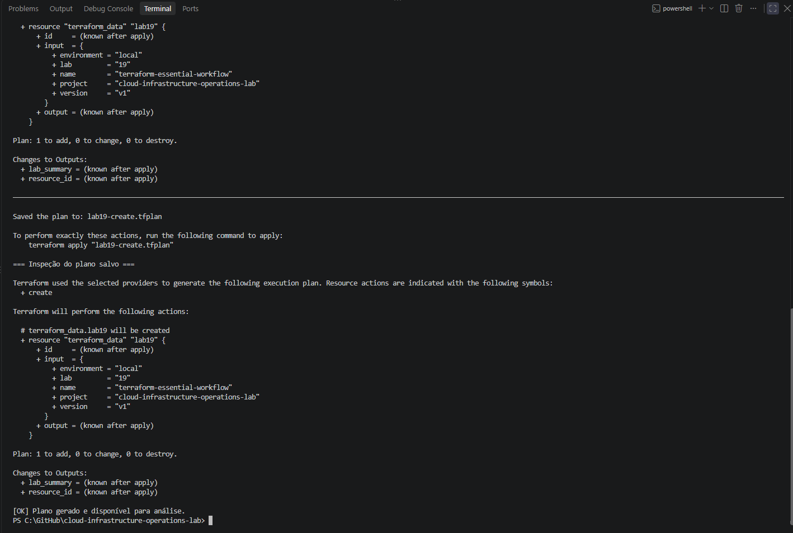
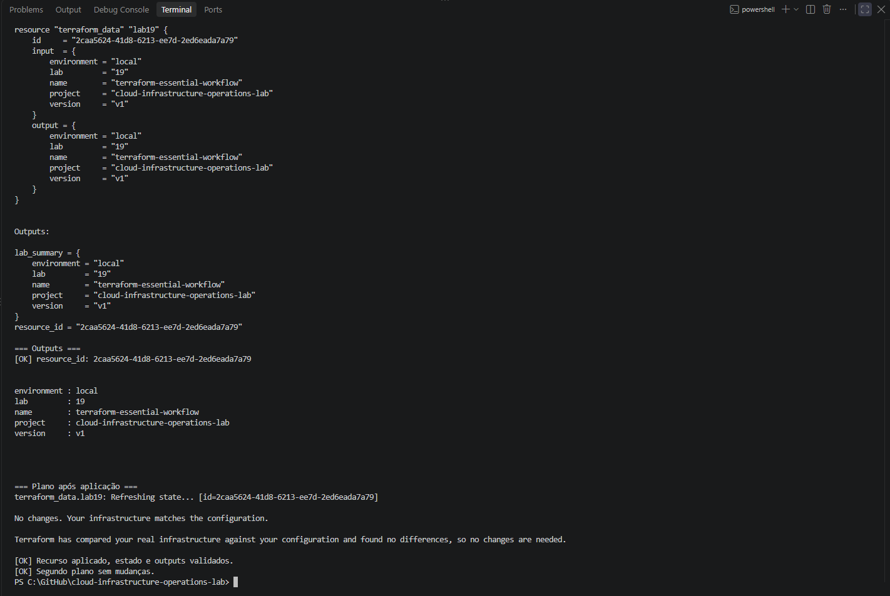
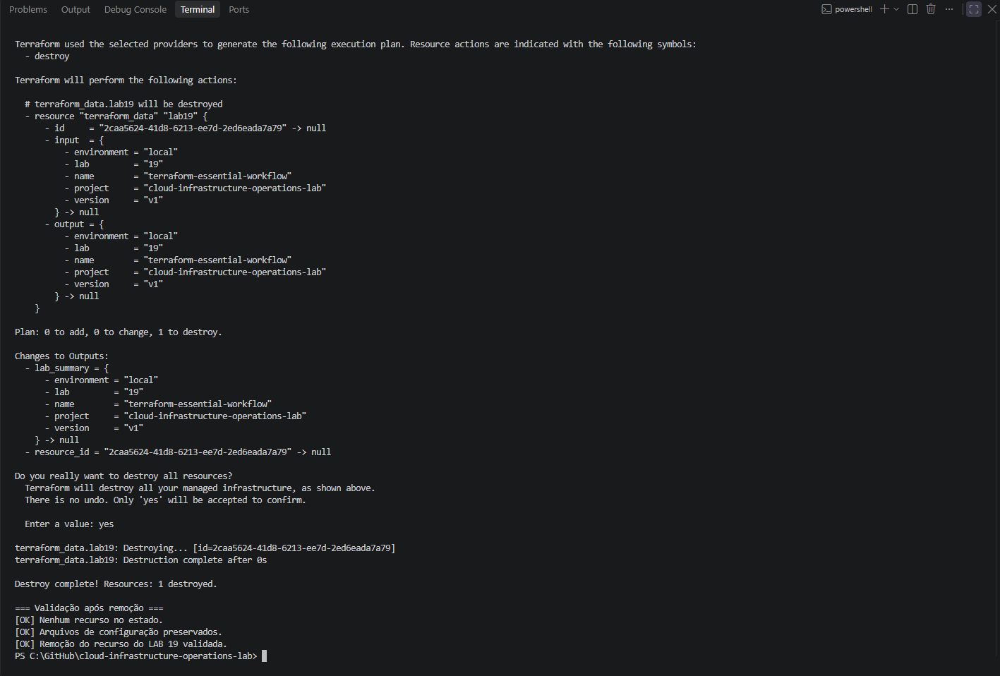

# Lab 19 — Fluxo essencial do Terraform

## Resumo

Este laboratório demonstra o fluxo de trabalho do Terraform por meio de um exercício local com o recurso integrado `terraform_data`.

O procedimento abrange inicialização, formatação, validação, planejamento, aplicação, inspeção do estado e remoção.

**Estado:** concluído. Recurso criado, estado e outputs validados, segundo plano sem mudanças e remoção confirmada.

> **English summary:** Completed local Terraform workflow exercise using the built-in terraform_data resource. Initialization, formatting, validation, saved-plan application, state and output inspection, and a no-change plan were verified. The resource was destroyed, leaving no resources in state while preserving the configuration files.

## Objetivo

Compreender como o Terraform utiliza a configuração e o estado registrado para propor e executar operações.

O exercício permite:

- identificar o diretório de execução;
- inicializar uma configuração;
- conferir formatação e validade;
- interpretar e salvar um plano;
- aplicar um plano previamente analisado;
- consultar recursos e outputs no estado;
- verificar a ausência de mudanças após a aplicação;
- remover o recurso gerenciado;
- distinguir remoção de recursos de exclusão dos arquivos locais.

## Escopo

Foi utilizado um único recurso `terraform_data`, sem provisioners ou comandos externos.

Esse recurso registra dados e acompanha seu ciclo de vida no estado do Terraform. Sua criação não representa uma instância, um bucket ou outro recurso AWS.

A execução foi local, sem autenticação AWS e sem provisionamento em nuvem.

A rede compartilhada do Lab 08 e os recursos de outros projetos permanecem fora do escopo.

O provisionamento AWS com Terraform será abordado no Lab 20.

## Ambiente utilizado

| Item | Valor |
|:---:|:---:|
| Sistema | Windows |
| Shell | Windows PowerShell 5.1 |
| Terraform | `1.16.1` |
| Plataforma | `windows_amd64` |
| Workspace | `default` |
| Provider | `terraform.io/builtin/terraform` |
| Recurso | `terraform_data.lab19` |
| Estado | Local |

A restrição definida em `versions.tf` é:

```hcl
terraform {
  required_version = ">= 1.4.0, < 2.0.0"
}
```

## Pré-requisitos

- Git instalado.
- Terraform disponível no PATH.
- Windows PowerShell 5.1.
- Repositório local em `C:\GitHub\cloud-infrastructure-operations-lab`.
- Arquivos deste laboratório publicados e sincronizados.
- Repositório sem alterações locais antes da atualização.

## Organização

| Caminho | Finalidade |
|:---:|:---:|
| `README.md` | Procedimento, critérios e resultados |
| `images/` | Evidências da execução |
| `terraform/versions.tf` | Restrição de versão do Terraform |
| `terraform/main.tf` | Recurso integrado do exercício |
| `terraform/outputs.tf` | Informações disponibilizadas após a aplicação |

Diretório de execução:

```text
C:\GitHub\cloud-infrastructure-operations-lab\labs\19-terraform-essential-workflow\terraform
```

Os comandos Terraform devem ser executados nesse diretório.

## Conceitos utilizados

| Conceito | Significado neste exercício |
|:---:|:---:|
| Configuração | Arquivos `.tf` que descrevem o resultado desejado |
| Recurso | Objeto `terraform_data` acompanhado pelo Terraform |
| Estado | Registro local dos objetos gerenciados e de seus atributos |
| Plano | Operações propostas a partir da configuração e do estado |
| Aplicação | Execução das operações do plano |
| Output | Valor disponibilizado pela configuração |
| Remoção | Encerramento do recurso gerenciado pelo exercício |

O estado não substitui a configuração. A configuração descreve o que deve existir; o estado registra o que o Terraform acompanha.

## Procedimento

Os comandos abaixo descrevem o ciclo completo do exercício. Em PowerShell, o código de saída deve ser conferido imediatamente após cada comando externo.

### 1. Conferir e atualizar o repositório

Na raiz do repositório:

- conferir `git status --porcelain`;
- interromper se houver alterações locais;
- executar `git pull --ff-only`;
- conferir o código de saída;
- verificar a presença dos três arquivos `.tf`;
- consultar `terraform version`.

Depois, acessar o diretório `terraform/` deste laboratório e conferir o workspace:

```powershell
terraform workspace show
```

Resultado utilizado: `default`.

### 2. Inicializar

```powershell
terraform init -input=false -no-color
```

Resultado observado: inicialização concluída.

O exercício utiliza um provider integrado ao Terraform e não depende de um plugin AWS.

### 3. Conferir formatação

```powershell
terraform fmt -check -diff -no-color
```

Resultado observado: código de saída `0`, sem diferenças de formatação.

Se houver diferenças em uma nova execução, revisar e corrigir os arquivos antes de continuar. Uma correção com `terraform fmt` pode alterar arquivos versionados e deve ser conferida no Git.

### 4. Validar a configuração

```powershell
terraform validate -no-color
```

Resultado observado:

```text
Success! The configuration is valid.
```

Essa validação verifica a configuração; ela não comprova a criação do recurso.

### 5. Gerar e analisar o plano

No Windows PowerShell, passar os argumentos como strings em um array:

```powershell
$PlanArguments = @(
    "plan"
    "-input=false"
    "-no-color"
    "-detailed-exitcode"
    "-out=lab19-create.tfplan"
)

& terraform @PlanArguments
$PlanExitCode = $LASTEXITCODE

if ($PlanExitCode -ne 2) {
    throw "Esperado plano com mudanças; código recebido: $PlanExitCode"
}
```

Inspecionar o plano salvo:

```powershell
terraform show -no-color "lab19-create.tfplan"
```

Resultado observado:

```text
Plan: 1 to add, 0 to change, 0 to destroy.
```

O plano continha somente `terraform_data.lab19`, com os dados:

```text
environment = "local"
lab         = "19"
name        = "terraform-essential-workflow"
project     = "cloud-infrastructure-operations-lab"
version     = "v1"
```

Antes da aplicação, conferir o recurso, seus atributos e as operações propostas.

Se o plano divergir do esperado, interromper e investigar.

### 6. Aplicar o plano analisado

```powershell
$ApplyArguments = @(
    "apply"
    "-input=false"
    "-no-color"
    "lab19-create.tfplan"
)

& terraform @ApplyArguments
```

A aplicação de um plano salvo não solicita uma nova confirmação interativa. A revisão deve ocorrer antes desse comando.

Resultado observado:

```text
Apply complete! Resources: 1 added, 0 changed, 0 destroyed.
```

### 7. Inspecionar estado e outputs

Executar separadamente:

```powershell
terraform state list
terraform show -no-color
terraform output -json
```

O estado continha somente:

```text
terraform_data.lab19
```

O output `lab_summary` apresentou os cinco valores definidos na configuração.

Identificador observado nesta execução:

```text
2caa5624-41d8-6213-ee7d-2ed6eada7a79
```

Esse identificador pertence à execução registrada e pode ser diferente em uma nova criação.

Não editar manualmente o arquivo de estado.

### 8. Verificar ausência de mudanças

```powershell
$CheckArguments = @(
    "plan"
    "-input=false"
    "-no-color"
    "-detailed-exitcode"
)

& terraform @CheckArguments
$PlanExitCode = $LASTEXITCODE

if ($PlanExitCode -ne 0) {
    throw "Esperado plano sem mudanças; código recebido: $PlanExitCode"
}
```

Resultado observado:

```text
No changes. Your infrastructure matches the configuration.
```

O código de saída foi `0`.

| Código | Significado de `plan -detailed-exitcode` |
|:---:|:---:|
| `0` | Plano concluído sem mudanças |
| `1` | Erro |
| `2` | Plano concluído com mudanças propostas |

O código `2` não representa falha, mas exige análise das mudanças propostas.

### 9. Remover o recurso

Conferir o workspace e confirmar que o estado contém somente `terraform_data.lab19`.

Executar:

```powershell
$DestroyArguments = @(
    "destroy"
    "-no-color"
)

& terraform @DestroyArguments
```

Proposta observada:

```text
Plan: 0 to add, 0 to change, 1 to destroy.
```

Após conferir o escopo, confirmar com `yes`.

Resultado observado:

```text
Destroy complete! Resources: 1 destroyed.
```

### 10. Validar a remoção

```powershell
$RemainingResources = @(terraform state list)

if ($LASTEXITCODE -ne 0) {
    throw "Falha ao consultar o estado após a remoção."
}

if ($RemainingResources.Count -ne 0) {
    throw "Ainda existem recursos no estado."
}
```

A consulta retornou código `0` e nenhum recurso.

Também foi confirmada a presença de:

- `versions.tf`;
- `main.tf`;
- `outputs.tf`.

Como os arquivos `.tf` permanecem no diretório, um novo plano normal após o destroy proporá criar o recurso novamente.

Essa proposta de criação não indica falha na remoção.

## Ocorrência durante a execução

A primeira tentativa de planejamento retornou:

```text
Error: Too many command line arguments
```

O plano foi gerado com sucesso após passar os argumentos por um array de strings no PowerShell, incluindo `"-out=lab19-create.tfplan"`.

Nenhum recurso havia sido criado na tentativa que apresentou o erro.

## Resultados obtidos

| Etapa | Resultado |
|:---:|:---:|
| Inicialização | Concluída |
| Formatação | Sem diferenças; código `0` |
| Validação | Configuração válida |
| Plano inicial | `1 to add, 0 to change, 0 to destroy` |
| Aplicação | Um recurso criado |
| Inspeção do estado | Somente `terraform_data.lab19` |
| Outputs | Valores compatíveis com a configuração |
| Segundo plano | Sem mudanças; código `0` |
| Destroy | Um recurso destruído |
| Pós-destroy | Nenhum recurso no estado |
| Configuração | Três arquivos `.tf` preservados |

## Arquivos locais e versionamento

| Arquivo ou diretório | Tratamento |
|:---:|:---:|
| Arquivos `.tf` | Versionar |
| `README.md` e evidências | Versionar |
| `.terraform/` | Não versionar |
| `terraform.tfstate` e backups | Não versionar |
| Planos `*.tfplan` | Não versionar |
| `.terraform.lock.hcl`, caso gerado | Versionar quando registrar dependências externas |

O `.gitignore` principal contém regras para o diretório `.terraform/`, arquivos de estado e planos com extensão `.tfplan`.

O destroy remove o recurso gerenciado, mas pode manter arquivos locais de estado e seus backups. Esses arquivos não devem ser publicados como evidência nem adicionados ao Git.

Não excluir o estado para simular uma remoção. A remoção deve ser executada pelo Terraform e comprovada pela consulta ao estado.

## Evidências

### Plano inicial

Plano salvo e inspecionado, contendo somente a criação de `terraform_data.lab19`.



### Estado, outputs e plano sem mudanças

Inspeção do recurso e dos outputs, seguida de um plano sem mudanças.



### Remoção e validação final

Destroy concluído, estado sem recursos e arquivos de configuração preservados.



## Limites do exercício

O laboratório demonstra o fluxo essencial do Terraform e o uso de estado local.

Não demonstra provisionamento AWS, estado remoto, colaboração entre operadores, bloqueio remoto ou detecção de drift em infraestrutura externa.

Esses assuntos serão desenvolvidos nos próximos laboratórios.

## Critérios de conclusão

- [x] Configuração publicada.
- [x] Versão do Terraform conferida.
- [x] Inicialização concluída.
- [x] Formatação conferida.
- [x] Configuração validada.
- [x] Plano inicial analisado.
- [x] Aplicação concluída.
- [x] Estado e outputs conferidos.
- [x] Segundo plano sem mudanças.
- [x] Recurso removido pelo Terraform.
- [x] Estado sem recursos após o destroy.
- [x] Arquivos de configuração preservados.
- [x] Evidências publicadas.
- [x] Resultados documentados.

## Referências

- [Recurso terraform_data](https://developer.hashicorp.com/terraform/language/resources/terraform-data)
- [Fluxo de execução do Terraform](https://developer.hashicorp.com/terraform/cli/run)
- [Comando terraform plan](https://developer.hashicorp.com/terraform/cli/commands/plan)
- [Comando terraform apply](https://developer.hashicorp.com/terraform/cli/commands/apply)
- [Comando terraform destroy](https://developer.hashicorp.com/terraform/cli/commands/destroy)
- [Estado do Terraform](https://developer.hashicorp.com/terraform/language/state)
