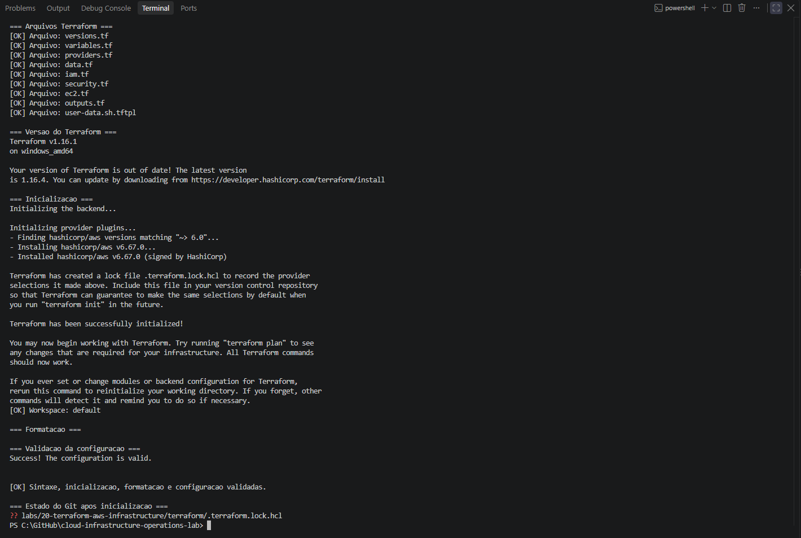
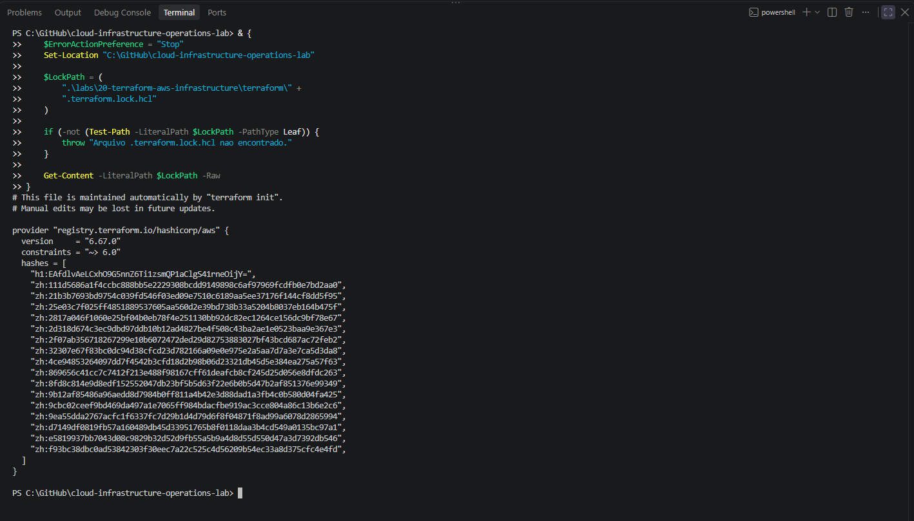
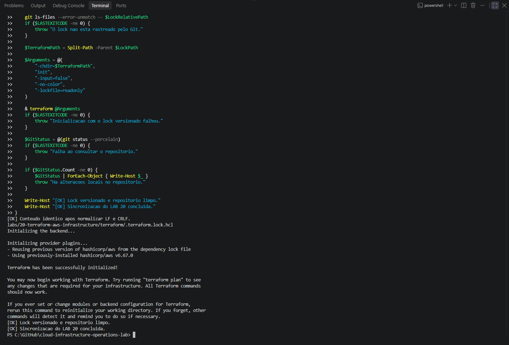
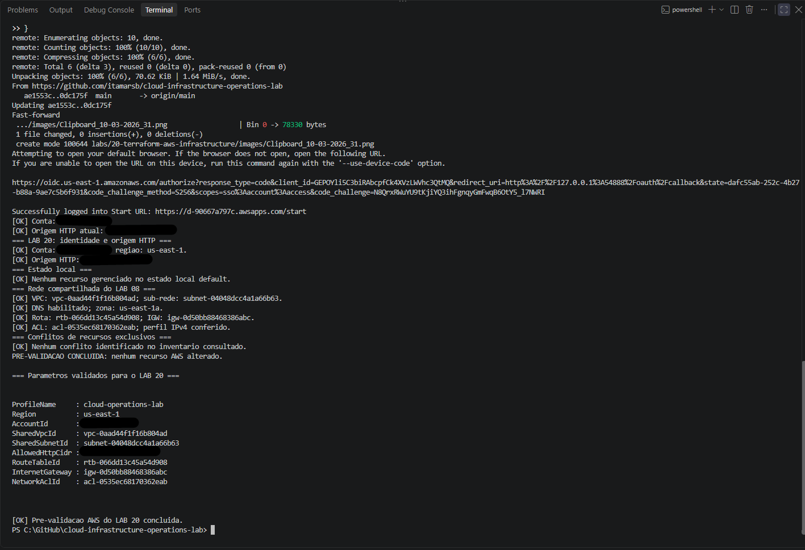
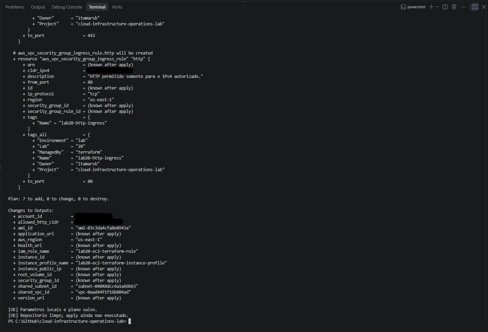
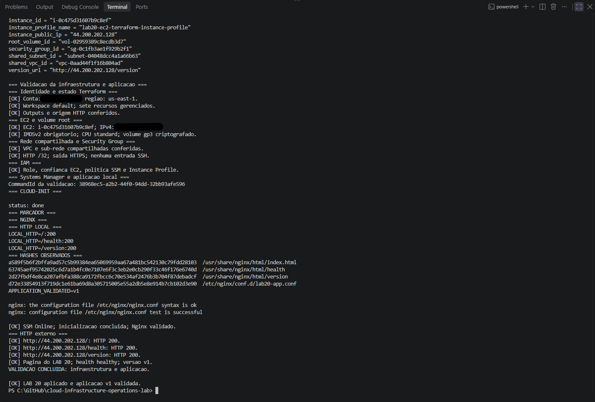
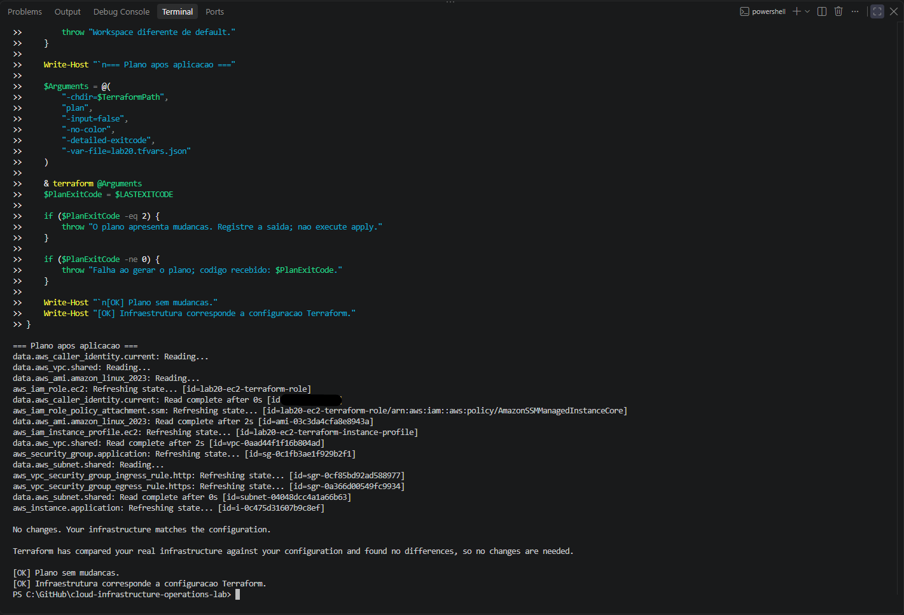
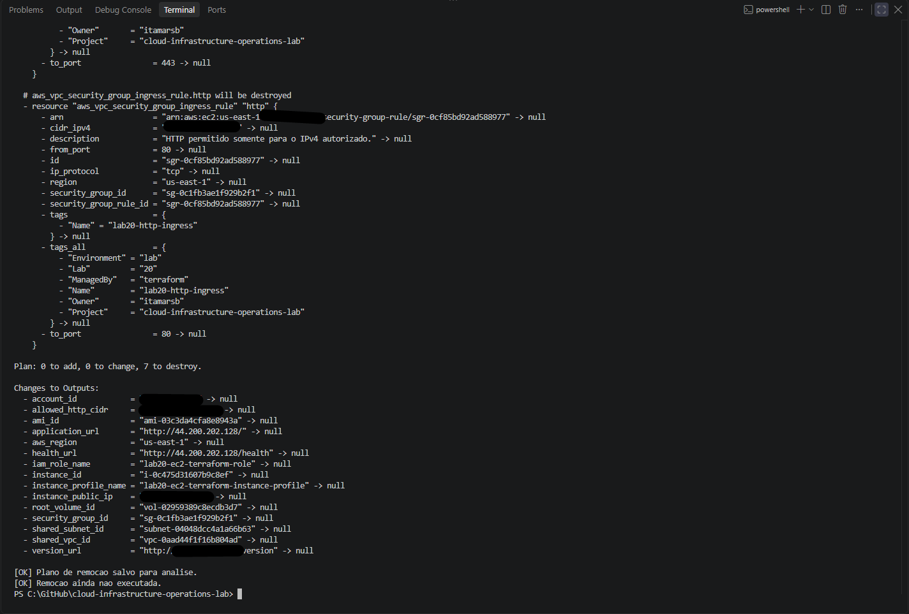
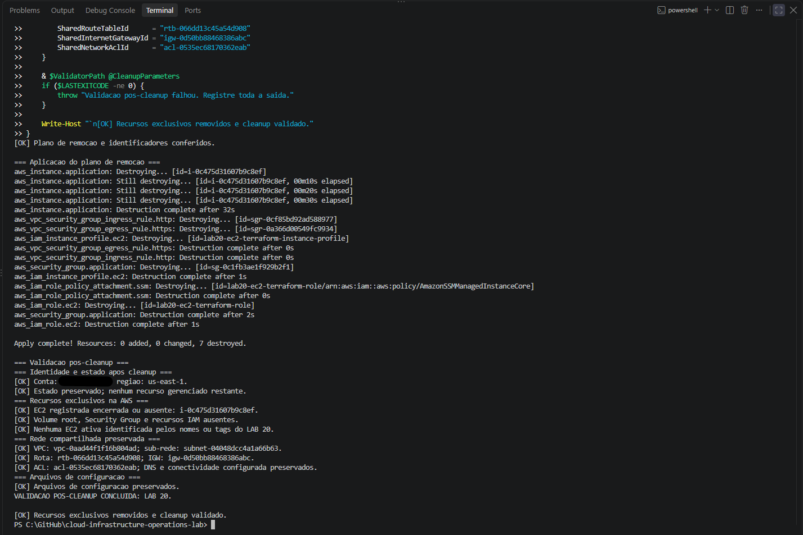

# Lab 20 — Infraestrutura AWS como código

## Resumo

Este laboratório aplica o fluxo de trabalho do Terraform ao provisionamento de uma aplicação Nginx na AWS.

A configuração gerencia sete recursos exclusivos: IAM Role, associação de política IAM, Instance Profile, Security Group, duas regras de tráfego e uma instância EC2. A VPC e a sub-rede pública do LAB 08 são consultadas como dependências existentes.

A execução contemplou autenticação temporária, validação da configuração, análise e aplicação de planos salvos, inspeção do estado e dos outputs, testes independentes da aplicação e remoção dos recursos exclusivos.

**Estado:** concluído em 03/10/2026. Provisionamento, validação da aplicação, plano sem mudanças e cleanup executados. Rede compartilhada preservada.

> **English summary:** Completed AWS infrastructure exercise using Terraform to provision seven managed resources for an EC2 instance running Nginx. Validation covered IAM, networking, encrypted storage, IMDSv2, Systems Manager and local/external HTTP responses. A subsequent plan reported no changes. All exclusive resources were removed, and post-cleanup checks confirmed that the shared network remained available.

## Objetivo

Provisionar, validar e remover recursos AWS por meio de uma configuração Terraform, com revisão dos planos, inspeção do estado e preservação da infraestrutura compartilhada.

O exercício demonstra:

- configuração do provider AWS;
- autenticação temporária por IAM Identity Center;
- distinção entre recursos gerenciados e dependências consultadas;
- dependências entre IAM, segurança e EC2;
- análise e aplicação de planos salvos;
- consulta de estado e outputs;
- validação operacional independente do resultado do apply;
- verificação de um segundo plano sem mudanças;
- remoção dos recursos exclusivos pelo Terraform;
- validação da rede compartilhada após o cleanup.

## Escopo

### Recursos gerenciados

| Endereço Terraform | Finalidade |
|:---:|:---:|
| `aws_iam_role.ec2` | Identidade assumida pela instância EC2 |
| `aws_iam_role_policy_attachment.ssm` | Associação da política do Systems Manager |
| `aws_iam_instance_profile.ec2` | Associação da role à instância |
| `aws_security_group.application` | Security Group exclusivo |
| `aws_vpc_security_group_ingress_rule.http` | Entrada TCP 80 para o IPv4 autorizado |
| `aws_vpc_security_group_egress_rule.https` | Saída TCP 443 |
| `aws_instance.application` | Instância EC2 com aplicação Nginx |

O volume root é definido no bloco `root_block_device` da instância. Ele não constitui um oitavo recurso Terraform independente.

Sua configuração inclui:

- tipo `gp3`;
- capacidade de 8 GiB;
- criptografia;
- remoção automática no encerramento da instância.

### Dependências consultadas

| Data source | Finalidade |
|:---:|:---:|
| `aws_caller_identity.current` | Consulta da identidade AWS |
| `aws_vpc.shared` | Consulta da VPC do LAB 08 |
| `aws_subnet.shared` | Consulta da sub-rede pública do LAB 08 |
| `aws_ami.amazon_linux_2023` | Seleção da AMI Amazon Linux 2023 |

A VPC e a sub-rede compartilhadas não são declaradas como recursos gerenciados pelo LAB 20 nem importadas para seu estado.

Permanecem fora do escopo de alteração ou remoção:

- VPC e sub-redes do LAB 08;
- Internet Gateway compartilhado;
- tabelas de rotas;
- Network ACLs;
- recursos de outros laboratórios ou projetos.

### Fora do escopo

Este laboratório não inclui criação de VPC, Application Load Balancer, Auto Scaling, banco de dados, bucket de aplicação, estado remoto, módulos reutilizáveis, pipeline ou simulação de drift.

## Ambiente utilizado

| Item | Valor |
|:---:|:---:|
| Sistema local | Windows |
| Shell | Windows PowerShell 5.1 |
| Terraform | `1.16.1`, plataforma `windows_amd64` |
| Provider AWS | `hashicorp/aws` versão `6.67.0` |
| Restrição do provider | `~> 6.0` |
| Perfil AWS | `cloud-operations-lab` |
| Região | `us-east-1` |
| Zona da instância | `us-east-1a` |
| Workspace | `default` |
| Estado Terraform | Local |
| Sistema da instância | Amazon Linux 2023 |
| Tipo da instância | `t3.micro` |
| Aplicação | Nginx |
| Administração | AWS Systems Manager |

A seleção do provider está registrada em `.terraform.lock.hcl`, incluindo seus hashes.

A AMI é consultada durante o planejamento. A execução documentada utilizou `ami-03c3da4cfa8e8943a`.

## Pré-requisitos

- LAB 19 concluído.
- Git, AWS CLI e Terraform disponíveis no PATH.
- Perfil `cloud-operations-lab` configurado para IAM Identity Center.
- Sessão SSO válida.
- Permissões para consultar a rede e gerenciar os recursos exclusivos.
- Rede compartilhada do LAB 08 disponível.
- Sub-rede pública com rota ativa para o Internet Gateway.
- IPv4 público atual do operador identificado.
- Repositório sincronizado e sem alterações locais antes da atualização.

A conta AWS deve ser conferida antes do planejamento, da aplicação e da remoção.

## Organização dos arquivos

| Arquivo ou diretório | Finalidade |
|:---|:---|
| `README.md` | Escopo, procedimento, resultados e evidências |
| `images/` | Capturas da execução |
| `terraform/versions.tf` | Restrições de Terraform e provider |
| `terraform/variables.tf` | Parâmetros e validações |
| `terraform/providers.tf` | Provider, conta permitida e tags padrão |
| `terraform/data.tf` | Identidade, rede compartilhada e AMI |
| `terraform/iam.tf` | Role, política associada e Instance Profile |
| `terraform/security.tf` | Security Group e regras |
| `terraform/ec2.tf` | Instância e volume root |
| `terraform/outputs.tf` | Identificadores e informações da aplicação |
| `terraform/user-data.sh.tftpl` | Inicialização da aplicação |
| `terraform/.terraform.lock.hcl` | Versão selecionada e hashes do provider |
| `scripts/test-aws-terraform-prerequisites.ps1` | Pré-validação AWS |
| `scripts/test-aws-terraform-infrastructure.ps1` | Validação da infraestrutura e aplicação |
| `scripts/test-aws-terraform-cleanup.ps1` | Validação pós-cleanup |

Apesar da extensão `.tftpl`, o arquivo de inicialização é carregado com `file()`, preservando as expressões próprias do Bash. A configuração normaliza CRLF para LF antes de fornecer o conteúdo à instância.

Diretório local da configuração:

```text
C:\GitHub\cloud-infrastructure-operations-lab\labs\20-terraform-aws-infrastructure\terraform
```

Os comandos utilizam esse diretório por meio de `-chdir`, no workspace `default`. O estado do LAB 19 não é reutilizado.

## Identificação e segurança

Os recursos que suportam tags utilizam:

| Tag | Valor |
|:---|:---|
| `Project` | `cloud-infrastructure-operations-lab` |
| `Environment` | `lab` |
| `Lab` | `20` |
| `ManagedBy` | `terraform` |
| `Owner` | `itamarsb` |
| `Name` | Nome específico do recurso |

O escopo de remoção é determinado pelos recursos gerenciados no estado do laboratório.

A configuração implementa:

- autenticação temporária, sem credenciais nos arquivos;
- perfil e região explícitos;
- restrição do provider à conta esperada;
- role assumida pelo serviço `ec2.amazonaws.com`;
- associação da política `AmazonSSMManagedInstanceCore`;
- Instance Profile exclusivo;
- entrada TCP 80 somente para o IPv4 autorizado, com máscara `/32`;
- saída TCP 443 para `0.0.0.0/0`;
- ausência de entrada SSH e de Key Pair;
- IMDSv2 obrigatório;
- volume root criptografado;
- remoção do volume root no encerramento;
- créditos de CPU em modo `standard`.

O conteúdo HTTP é demonstrativo e não contém credenciais ou dados de aplicação sensíveis.

## Aplicação e verificações

A inicialização instala o Nginx, publica os arquivos da aplicação, valida a configuração e habilita o serviço.

O marcador `/var/lib/lab20/bootstrap-complete` é gravado com `v1` somente após as verificações locais da página, do health e da versão.

| Endpoint | HTTP esperado | Conteúdo esperado |
|:---|:---:|:---|
| `/` | `200` | Página de identificação do LAB 20 |
| `/health` | `200` | `healthy` |
| `/version` | `200` | `v1` |

A criação da instância pelo Terraform não comprova a conclusão da inicialização. Essa condição é verificada separadamente pelo script operacional.

O validador confere:

- sete recursos gerenciados no estado;
- outputs e relações entre os recursos;
- nomes e tags;
- EC2 em execução;
- volume root `gp3`, criptografado e com 8 GiB;
- IMDSv2 e créditos de CPU;
- Security Group e suas duas regras;
- confiança da role, política SSM e Instance Profile;
- instância Online no Systems Manager;
- conclusão do cloud-init e marcador da aplicação;
- Nginx ativo, habilitado e com configuração válida;
- respostas HTTP locais e externas;
- conteúdo da página, health e versão.

Os hashes dos quatro arquivos da aplicação são coletados como registro observado. Essa coleta não constitui comparação automática com um manifesto de hashes esperados.

Os scripts não provisionam recursos nem reparam a aplicação. A validação remota utiliza SSM Run Command para executar verificações.

## Procedimento

### 1. Sincronizar o repositório

Consultar o estado do Git, interromper se houver alterações locais e atualizar com `git pull --ff-only`.

Conferir os arquivos e validar a sintaxe dos três scripts PowerShell.

### 2. Inicializar e validar a configuração

Executar:

- `terraform init`;
- consulta do workspace;
- `terraform fmt -check -diff`;
- `terraform validate`.

Versionar `.terraform.lock.hcl`.

Com o lock publicado, a inicialização pode utilizar `-lockfile=readonly` para exigir a seleção de dependências registrada.

### 3. Validar identidade e dependências AWS

Autenticar com AWS SSO, confirmar a conta e identificar o IPv4 público atual.

Executar `test-aws-terraform-prerequisites.ps1` com `-AllowedHttpCidr`.

A opção `-PassThru` retorna os parâmetros validados, incluindo VPC, sub-rede, tabela de rotas, Internet Gateway e Network ACL.

A pré-validação verifica a rede compartilhada e conflitos com os recursos exclusivos do LAB 20.

### 4. Preparar os parâmetros locais

Criar `terraform/lab20.tfvars.json` com os valores validados:

| Variável | Finalidade |
|:---|:---|
| `aws_profile` | Perfil utilizado pelo provider |
| `aws_region` | Região AWS |
| `expected_account_id` | Conta permitida |
| `shared_vpc_id` | VPC compartilhada |
| `shared_subnet_id` | Sub-rede compartilhada |
| `allowed_http_cidr` | IPv4 público autorizado com `/32` |

O arquivo não contém credenciais e permanece fora do versionamento.

Confirmar o IPv4 atual antes de gerar o plano e antes da aplicação.

### 5. Gerar e analisar o plano inicial

No Windows PowerShell, fornecer os argumentos como strings em um array:

```powershell
$Arguments = @(
    "-chdir=$TerraformPath",
    "plan",
    "-input=false",
    "-no-color",
    "-detailed-exitcode",
    "-var-file=lab20.tfvars.json",
    "-out=lab20-create.tfplan"
)

& terraform @Arguments
$PlanExitCode = $LASTEXITCODE
```

Para o provisionamento inicial, o código esperado é `2`, indicando mudanças propostas.

Inspecionar `lab20-create.tfplan` com `terraform show` e conferir:

- sete criações;
- nenhuma alteração ou remoção;
- conta e região;
- VPC e sub-rede utilizadas;
- configuração IAM;
- regras de tráfego;
- AMI e tipo da instância;
- volume root;
- IMDSv2;
- nomes e tags.

Resultado esperado:

```text
Plan: 7 to add, 0 to change, 0 to destroy.
```

### 6. Aplicar o plano salvo

Aplicar somente o arquivo analisado:

```powershell
$Arguments = @(
    "-chdir=$TerraformPath",
    "apply",
    "-input=false",
    "-no-color",
    "lab20-create.tfplan"
)

& terraform @Arguments
```

A aplicação de um plano salvo não solicita nova confirmação interativa.

Conferir o código de saída e registrar os outputs.

### 7. Validar infraestrutura e aplicação

Executar `test-aws-terraform-infrastructure.ps1` com o CIDR autorizado.

O script aguarda a disponibilidade no Systems Manager e verifica a infraestrutura, a inicialização e os endpoints.

Os testes HTTP externos devem ser executados a partir do IPv4 autorizado.

Registrar o CommandId da validação para consulta em caso de falha.

### 8. Conferir o plano sem mudanças

Executar um novo plano com os mesmos parâmetros, usando `-detailed-exitcode`.

Resultado esperado:

```text
No changes. Your infrastructure matches the configuration.
```

O código esperado é `0`.

Qualquer mudança proposta deve ser analisada antes de uma nova aplicação.

### 9. Gerar e analisar o plano de remoção

Conferir conta e workspace. Registrar os identificadores necessários à validação posterior, pois os outputs serão removidos pelo cleanup.

Gerar o plano:

```powershell
$Arguments = @(
    "-chdir=$TerraformPath",
    "plan",
    "-destroy",
    "-input=false",
    "-no-color",
    "-detailed-exitcode",
    "-var-file=lab20.tfvars.json",
    "-out=lab20-destroy.tfplan"
)

& terraform @Arguments
$PlanExitCode = $LASTEXITCODE
```

Inspecionar o arquivo salvo.

Resultado esperado:

```text
Plan: 0 to add, 0 to change, 7 to destroy.
```

Conferir que somente os recursos exclusivos estão incluídos.

### 10. Aplicar a remoção

Aplicar o plano de remoção analisado:

```powershell
$Arguments = @(
    "-chdir=$TerraformPath",
    "apply",
    "-input=false",
    "-no-color",
    "lab20-destroy.tfplan"
)

& terraform @Arguments
```

O volume root é removido junto com a instância por `DeleteOnTermination`.

### 11. Validar o cleanup

Executar `test-aws-terraform-cleanup.ps1`, fornecendo os identificadores registrados antes da remoção.

| Parâmetro | Recurso conferido |
|:---|:---|
| `InstanceId` | Instância encerrada ou ausente |
| `RootVolumeId` | Volume root ausente |
| `SecurityGroupId` | Security Group ausente |
| `SharedVpcId` | VPC compartilhada |
| `SharedSubnetId` | Sub-rede compartilhada |
| `SharedRouteTableId` | Tabela de rotas efetiva |
| `SharedInternetGatewayId` | Internet Gateway |
| `SharedNetworkAclId` | Network ACL associada |

O script também verifica recursos exclusivos por nomes e tags, ausência dos recursos IAM, estado local e arquivos de configuração.

A verificação da rede confere os identificadores, DNS, associação da sub-rede, rota pública e perfil IPv4 da ACL. Ela não representa uma comparação integral de todas as propriedades da rede.

## Estado e versionamento

| Arquivo ou diretório | Tratamento |
|:---|:---|
| Configuração `.tf` | Versionar |
| Inicialização da aplicação | Versionar |
| Scripts, README e evidências | Versionar |
| `.terraform.lock.hcl` | Versionar |
| `.terraform/` | Não versionar |
| Estado e backups do estado | Não versionar |
| Planos `.tfplan` | Não versionar |
| `lab20.tfvars.json` | Não versionar |

Estado e planos podem conter informações da infraestrutura e conteúdo de inicialização. Não são publicados como evidências.

Preservar o estado durante todo o ciclo de vida dos recursos. Excluir o arquivo de estado ou remover entradas com `state rm` não equivale a remover os recursos AWS.

Após o cleanup, o critério é a ausência de recursos gerenciados restantes. Data sources eventualmente presentes no estado são consultas, não infraestrutura sob gerenciamento.

Um plano normal após o cleanup pode propor novamente as sete criações, pois a configuração continua presente.

## Resultados obtidos

Execução concluída em **03/10/2026**, horário de Brasília.

| Etapa | Resultado |
|:---|:---|
| Sintaxe PowerShell | Três scripts validados |
| Inicialização | Provider AWS `6.67.0` instalado |
| Lock | Versionado e reutilizado com `-lockfile=readonly` |
| Formatação | Sem diferenças |
| Validação Terraform | Configuração válida |
| Pré-validação AWS | Identidade, rede e ausência de conflitos conferidas |
| Plano inicial | `7 to add, 0 to change, 0 to destroy` |
| Apply inicial | `7 added, 0 changed, 0 destroyed` |
| Estado e outputs | Sete recursos gerenciados e informações conferidas |
| Systems Manager | Online |
| Cloud-init | `status: done` |
| Nginx | Serviço e configuração validados |
| HTTP local e externo | Três endpoints com HTTP 200 |
| Aplicação | Página correta, `healthy` e `v1` |
| Segundo plano | Sem mudanças; código `0` |
| Plano de remoção | `0 to add, 0 to change, 7 to destroy` |
| Aplicação da remoção | `0 added, 0 changed, 7 destroyed` |
| Pós-cleanup | Recursos exclusivos removidos |
| Rede compartilhada | Identificadores e condições verificadas preservados |
| Configuração e estado | Arquivos preservados; nenhum recurso gerenciado restante |

### Recursos da execução

Os identificadores abaixo representam a execução concluída, não recursos atualmente ativos.

| Recurso | Identificador |
|:---|:---|
| AMI | `ami-03c3da4cfa8e8943a` |
| EC2 | `i-0c475d31607b9c8ef` |
| Volume root | `vol-02959389c8ecdb3d7` |
| Security Group | `sg-0c1fb3ae1f929b2f1` |
| Regra HTTP | `sgr-0cf85bd92ad588977` |
| Regra HTTPS | `sgr-0a366d00549fc9934` |
| IAM Role | `lab20-ec2-terraform-role` |
| Instance Profile | `lab20-ec2-terraform-instance-profile` |
| CommandId da validação | `38968ec5-a2b2-44f0-94dd-32bb93afe596` |

### Rede compartilhada conferida

| Componente | Identificador |
|:---|:---|
| VPC | `vpc-0aad44f1f16b804ad` |
| Sub-rede | `subnet-04048dcc4a1a66b63` |
| Tabela de rotas | `rtb-066dd13c45a54d908` |
| Internet Gateway | `igw-0d50bb88468386abc` |
| Network ACL | `acl-0535ec68170362eab` |

## Observações da execução

### Finais de linha do lock

A comparação SHA-256 entre a cópia original do lock e a cópia obtida pelo Git apresentou diferença.

Após normalizar CRLF para LF, o conteúdo foi confirmado como idêntico. A inicialização com `-lockfile=readonly` reutilizou o provider registrado, e o repositório permaneceu limpo.

### Validação após o apply

O sucesso do apply foi seguido por verificações independentes de EC2, EBS, IAM, rede, Systems Manager e aplicação.

A conclusão operacional foi registrada somente após a validação local e externa dos três endpoints.

## Tratamento de falhas

Uma falha no apply pode ocorrer após a criação de parte dos recursos.

Nesse caso:

- registrar a saída completa;
- consultar o estado e o inventário AWS;
- identificar as operações concluídas;
- corrigir a causa;
- gerar e analisar um novo plano antes de continuar.

Uma falha no validador não significa que o provisionamento foi desfeito. Conferir o CommandId, a inicialização, o serviço e a conectividade antes de repetir qualquer operação.

Para problemas HTTP, verificar o IPv4 autorizado, as regras do Security Group, a rede e o Nginx.

Se o cleanup falhar parcialmente, consultar o estado e os recursos remanescentes antes de gerar um novo plano de remoção.

## Custos e encerramento

A execução utiliza EC2, EBS e IPv4 público. O cleanup removeu os recursos exclusivos provisionados para o exercício.

A rede do LAB 08 permanece disponível como dependência compartilhada.

## Evidências

### Inicialização, formatação e validação



### Arquivo de dependências



### Lock versionado e reutilizado



### Pré-validação AWS



### Plano inicial



### Validação da infraestrutura e aplicação



### Plano sem mudanças



### Plano de remoção



### Cleanup e validação final



## Critérios de conclusão

- [x] Estrutura criada.
- [x] Configuração Terraform publicada.
- [x] Scripts de validação publicados.
- [x] Sintaxe PowerShell validada.
- [x] Identidade AWS conferida.
- [x] Dependências compartilhadas validadas.
- [x] Inicialização concluída.
- [x] Lock versionado.
- [x] Formatação e configuração validadas.
- [x] Plano de provisionamento analisado.
- [x] Plano salvo aplicado.
- [x] Estado e outputs conferidos.
- [x] Systems Manager Online.
- [x] Inicialização da aplicação concluída.
- [x] Nginx e endpoints validados.
- [x] Segundo plano sem mudanças.
- [x] Plano de remoção analisado.
- [x] Recursos exclusivos removidos.
- [x] Validação pós-cleanup concluída.
- [x] Rede compartilhada preservada.
- [x] Evidências publicadas.
- [x] Resultados documentados.

## Referências

- [Provider AWS](https://registry.terraform.io/providers/hashicorp/aws/latest/docs)
- [Data sources do Terraform](https://developer.hashicorp.com/terraform/language/data-sources)
- [Comando terraform plan](https://developer.hashicorp.com/terraform/cli/commands/plan)
- [Comando terraform apply](https://developer.hashicorp.com/terraform/cli/commands/apply)
- [Arquivo de dependências](https://developer.hashicorp.com/terraform/language/files/dependency-lock)
- [AWS Systems Manager](https://docs.aws.amazon.com/systems-manager/latest/userguide/what-is-systems-manager.html)
