# Lab 23 — Mudanças e drift

## Resumo

Laboratório local de Terraform para comparar mudanças intencionais na configuração com alterações realizadas diretamente em um recurso gerenciado.

O exercício utilizou o provider `hashicorp/local` e um recurso `local_file` para gerenciar um arquivo JSON. A execução incluiu criação de um baseline, mudança controlada, introdução de drift, diagnóstico, recuperação e remoção.

**Estado:** concluído. Recurso removido, estado final sem recursos e arquivo gerenciado ausente. Configuração, parâmetros e registros locais preservados.

> **English summary:** Completed local Terraform exercise comparing intentional configuration changes with external resource drift. A managed JSON file was created, updated from v1 to v2, modified outside Terraform, inspected and restored to its declared configuration. A subsequent plan reported no changes. Cleanup removed the managed resource and file while preserving configuration and local records.

## Objetivos

- Diferenciar configuração declarada, estado e recurso observado.
- Interpretar um plano após uma mudança intencional.
- Introduzir uma alteração controlada fora do Terraform.
- Detectar a divergência entre o arquivo existente e a configuração.
- Revisar as ações propostas antes da aplicação.
- Restaurar o conteúdo declarado.
- Validar o arquivo diretamente, além de consultar estado e outputs.
- Confirmar ausência de mudanças após a recuperação.
- Remover o recurso pelo Terraform e verificar o resultado.

## Ambiente e escopo

| Item | Utilizado na execução |
|:---:|:---:|
| Terminal | Windows PowerShell 5.1 |
| Terraform | 1.16.1 — windows_amd64 |
| Provider | `hashicorp/local` 2.9.1 |
| Backend | Estado local |
| Workspace | `default` |
| Recurso | `local_file.application_config` |
| Arquivo gerenciado | `local-artifacts/application-config.json` |

O laboratório não provisionou recursos AWS nem utilizou autenticação por SSO ou o backend S3 do Lab 21.

O arquivo representou uma configuração didática de aplicação. Nenhum serviço foi iniciado a partir dele.

A alteração externa ficou restrita ao arquivo gerenciado pelo LAB 23. O arquivo de estado não foi editado manualmente.

## Organização

| Caminho | Finalidade |
|:---:|:---:|
| `README.md` | Procedimento, resultados e evidências |
| `.gitignore` | Exclusão dos artefatos locais do laboratório |
| `images/` | Capturas da execução |
| `terraform/versions.tf` | Restrições de versão e declaração do provider |
| `terraform/variables.tf` | Entradas e validações |
| `terraform/main.tf` | Conteúdo declarado e recurso gerenciado |
| `terraform/outputs.tf` | Caminho, hash esperado e configuração registrada |
| `terraform/terraform.tfvars.example` | Exemplo de parâmetros |
| `terraform/.terraform.lock.hcl` | Versão selecionada e hashes do provider |
| `local-artifacts/` | Arquivo gerenciado e registros locais, excluídos do Git |

Diretório utilizado para os comandos Terraform:

```text
C:\GitHub\cloud-infrastructure-operations-lab\labs\23-terraform-changes-drift\terraform
```

Destino do recurso:

```text
C:\GitHub\cloud-infrastructure-operations-lab\labs\23-terraform-changes-drift\local-artifacts\application-config.json
```

## Configuração utilizada

O conteúdo do arquivo foi construído com `jsonencode`, seguido de uma quebra de linha, e declarado no recurso `local_file.application_config`.

| Campo | Baseline inicial | Após a mudança intencional | Durante o drift |
|---|---|---|---|
| `project_name` | `cloud-infrastructure-operations-lab` | Mesmo valor | Mesmo valor |
| `environment` | `dev` | `dev` | `dev` |
| `application_version` | `v1` | `v2` | `v2` |
| `log_level` | `info` | `info` | `debug` |
| `managed_by` | `terraform` | `terraform` | `terraform` |
| `lab` | `23` | `23` | `23` |

A mudança intencional alterou `application_version` nos parâmetros locais do Terraform.

O drift alterou somente `log_level` no arquivo existente, preservando a configuração Terraform e seus parâmetros.

O arquivo versionado `terraform.tfvars.example` mantém o exemplo inicial com `v1 / info / dev`. O arquivo local `terraform.tfvars` terminou a execução com `v2 / info / dev` e permaneceu excluído do Git.

## Conceitos demonstrados

| Conceito | Aplicação no laboratório |
|---|---|
| Configuração declarada | Conteúdo definido pelo código e pelos parâmetros Terraform |
| Estado | Registro dos atributos conhecidos do recurso gerenciado |
| Recurso observado | Arquivo presente no sistema de arquivos |
| Baseline | Conteúdo validado e confirmado por um plano sem mudanças |
| Mudança intencional | Alteração dos parâmetros seguida de plano e aplicação |
| Drift | Alteração externa no arquivo gerenciado |
| Reconciliação | Aplicação do plano para restaurar o conteúdo declarado |
| Validação independente | Leitura do arquivo e comparação de conteúdo e SHA256 pelo PowerShell |

Os outputs e o estado não substituíram a leitura direta do arquivo. Após a alteração externa, eles ainda apresentavam `log_level = info`, enquanto o arquivo observado continha `log_level = debug`.

A interpretação das ações foi feita a partir dos planos efetivamente gerados.

## Procedimento executado

### 1. Preparação, inicialização e validação

O repositório foi sincronizado e os cinco arquivos de configuração foram conferidos.

Antes da criação, o destino gerenciado estava ausente e não havia recursos no estado.

Foram executados:

```powershell
terraform init -input=false -no-color
terraform workspace show
terraform fmt -check -diff -recursive -no-color
terraform validate -no-color
```

Resultados:

- Provider `hashicorp/local` 2.9.1 instalado.
- Workspace `default` confirmado.
- Formatação aprovada.
- Configuração válida.
- Arquivo `.terraform.lock.hcl` gerado.

Após a publicação do arquivo de dependências, suas cópias local e remota foram comparadas. A sincronização preservou o conteúdo e uma nova inicialização utilizou:

```powershell
terraform init -input=false -no-color -lockfile=readonly
```

O arquivo de dependências permaneceu inalterado e o repositório terminou essa etapa sem alterações locais.

### 2. Criação do baseline v1

O plano `lab23-baseline-create.tfplan` foi salvo e revisado.

Foram conferidos o endereço do recurso, o provider, a ação de criação, o destino e o conteúdo JSON.

Resultado do plano:

```text
Plan: 1 to add, 0 to change, 0 to destroy.
```

Após a aplicação, o arquivo foi lido diretamente e comparado com o conteúdo planejado. Estado, outputs e SHA256 também foram conferidos.

Foi preservada uma cópia local em `baseline-v1.json`.

Um segundo plano confirmou:

```text
No changes. Your infrastructure matches the configuration.
```

Código de saída: `0`.

### 3. Mudança intencional para v2

O parâmetro local `application_version` foi alterado de `v1` para `v2`, mantendo `log_level = info` e `environment = dev`.

O plano `lab23-change-v2.tfplan` apresentou substituição do recurso:

```text
Plan: 1 to add, 0 to change, 1 to destroy.
```

Após a aplicação, o arquivo, o estado e os outputs foram conferidos. O novo conteúdo foi preservado em `baseline-v2.json`.

Um novo plano confirmou ausência de mudanças e código de saída `0`.

### 4. Introdução do drift

O arquivo `application-config.json` foi alterado diretamente pelo PowerShell:

```text
log_level: info → debug
```

A gravação utilizou UTF-8 sem BOM e o conteúdo permaneceu um JSON válido.

Foram preservados:

- Arquivos `.tf`.
- Parâmetros em `terraform.tfvars`.
- Arquivo de dependências.
- Estado Terraform.
- Baseline v2.

O arquivo observado passou a apresentar um SHA256 diferente. Uma cópia foi preservada em `drift-observed.json`.

Nesse momento:

| Fonte consultada | `log_level` |
|---|---|
| Configuração declarada | `info` |
| Estado e outputs registrados | `info` |
| Arquivo observado | `debug` |

### 5. Diagnóstico e plano de recuperação

A comparação identificou a divergência entre o arquivo observado e o baseline v2.

O plano de recuperação foi salvo em `lab23-recover.tfplan`.

Neste cenário, o plano apresentou uma ação de criação para `local_file.application_config`:

```text
Plan: 1 to add, 0 to change, 0 to destroy.
```

A ação foi conferida no JSON do plano, juntamente com o provider, o destino e o conteúdo a restaurar.

O arquivo com `debug` continuava presente após o planejamento. Portanto, a ação `create` do plano não foi interpretada como evidência de que o arquivo físico já havia sido removido.

### 6. Recuperação e validação

O plano revisado foi aplicado:

```text
Apply complete! Resources: 1 added, 0 changed, 0 destroyed.
```

Após a aplicação:

- O arquivo voltou a apresentar `v2 / info / dev`.
- Seu conteúdo correspondeu exatamente ao baseline v2.
- O SHA256 foi restaurado.
- O estado continha somente o recurso esperado.
- Os outputs corresponderam ao conteúdo restaurado.
- Baselines, registro de drift, configuração e parâmetros foram preservados.

### 7. Plano sem mudanças após a recuperação

Um novo plano foi executado com os mesmos parâmetros:

```powershell
terraform plan -input=false -no-color -detailed-exitcode -var-file=terraform.tfvars
```

Resultado:

```text
No changes. Your infrastructure matches the configuration.
```

Código de saída: `0`.

O arquivo gerenciado continuou correspondente ao baseline v2. O registro de drift permaneceu preservado com seu conteúdo divergente.

### 8. Planejamento da remoção

Foi gerado o plano `lab23-destroy.tfplan` com `-destroy`.

Resultado:

```text
Plan: 0 to add, 0 to change, 1 to destroy.
```

A revisão confirmou uma única ação de remoção para `local_file.application_config`, no destino esperado e com o conteúdo do baseline v2.

O planejamento preservou o arquivo gerenciado, a configuração, os parâmetros, o estado e os registros locais.

### 9. Remoção e verificação final

O plano salvo e revisado foi aplicado:

```powershell
terraform apply -input=false -no-color lab23-destroy.tfplan
```

Resultado:

```text
Apply complete! Resources: 0 added, 0 changed, 1 destroyed.
```

As verificações finais confirmaram:

- Zero recursos em `terraform state list`.
- Arquivo `application-config.json` ausente.
- Sete arquivos de configuração e parâmetros preservados.
- Quatro registros locais preservados.
- Repositório sem alterações locais.

O plano sem mudanças foi confirmado antes da remoção. Após a remoção, a configuração foi preservada para permitir uma futura recriação.

## Comparação dos resultados

| Etapa | Ações observadas | Código do plano |
|---|---|---|
| Criação do baseline v1 | 1 criação | `2` |
| Verificação do baseline v1 | Sem mudanças | `0` |
| Mudança intencional para v2 | 1 criação e 1 remoção | `2` |
| Verificação do baseline v2 | Sem mudanças | `0` |
| Recuperação após drift | 1 criação | `2` |
| Verificação após recuperação | Sem mudanças | `0` |
| Remoção | 1 remoção | `2` |

A mudança intencional e o drift produziram planos diferentes neste laboratório. A primeira apresentou substituição; a recuperação do drift apresentou criação.

## Hashes registrados

| Situação | SHA256 |
|---|---|
| Baseline v1 — `v1 / info / dev` | `99eae7313d4b6efc9526d8405fc8598aa09fd137992d65dd78d11fc2f6a8c40a` |
| Baseline v2 — `v2 / info / dev` | `de6d87ba8c1239b81669c4782a631479f62b2e997c4fe10bab88ec91c1f8029d` |
| Drift — `v2 / debug / dev` | `587652d481ed560636443dfdd4a5cc3c2b60be012560f2b4e3ff2a738e631e6a` |
| Arquivo recuperado — `v2 / info / dev` | `de6d87ba8c1239b81669c4782a631479f62b2e997c4fe10bab88ec91c1f8029d` |

O hash restaurado correspondeu ao baseline v2. A validação também comparou o conteúdo completo do arquivo.

## Registros locais preservados

| Arquivo | Finalidade |
|---|---|
| `baseline-v1.json` | Conteúdo inicial validado |
| `baseline-v2.json` | Conteúdo após a mudança intencional |
| `drift-observed.json` | Conteúdo observado após a alteração externa |
| `terraform-v1.tfvars` | Cópia dos parâmetros iniciais |

Esses quatro arquivos permaneceram em `local-artifacts/`, excluídos do Git.

## Interpretação dos códigos de saída

| Código de `plan -detailed-exitcode` | Significado |
|---|---|
| `0` | Plano concluído sem mudanças |
| `1` | Erro |
| `2` | Plano concluído com mudanças propostas |

Durante a execução, `$LASTEXITCODE` foi consultado imediatamente após os comandos externos.

Os planos salvos foram revisados antes da aplicação, incluindo endereço, ações, provider, caminho e conteúdo do recurso.

## Versionamento

| Item | Tratamento |
|---|---|
| Arquivos `.tf` | Versionados |
| `terraform.tfvars.example` | Versionado |
| `.terraform.lock.hcl` | Versionado |
| README, `.gitignore` e evidências | Versionados |
| `terraform.tfvars` | Excluído do Git |
| `.terraform/` | Excluído do Git |
| Estados e cópias de estado | Excluídos do Git |
| Planos salvos | Excluídos do Git |
| Conteúdo de `local-artifacts/` | Excluído do Git |

O `.gitignore` da raiz cobre os arquivos locais do Terraform. O `.gitignore` deste laboratório exclui seu diretório `local-artifacts/`.

## Evidências

### Inicialização e dependências

Provider instalado, formatação aprovada e configuração válida.

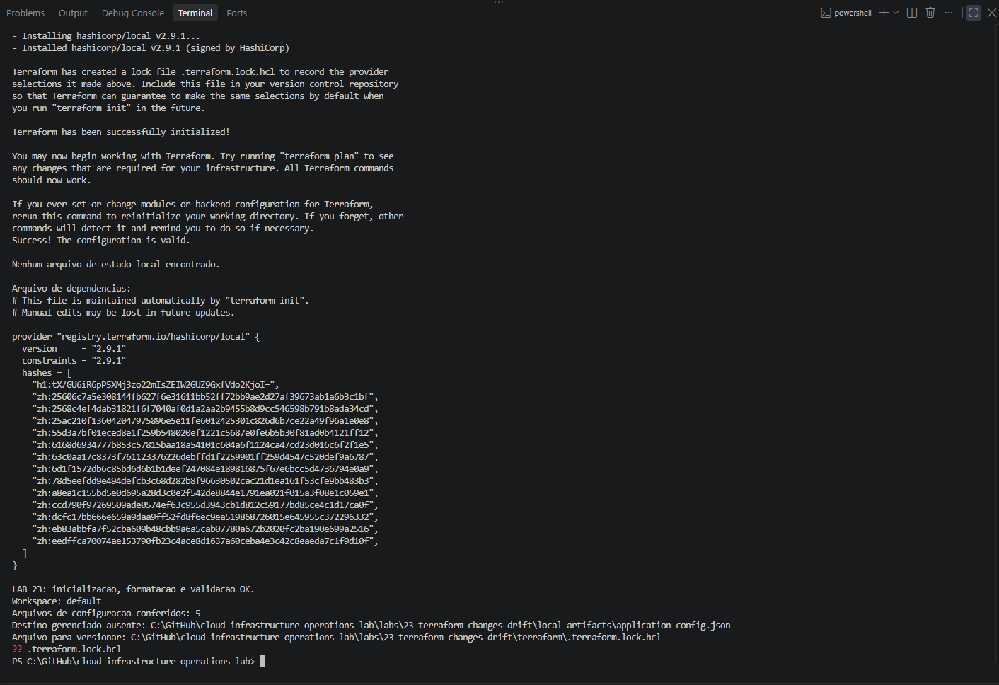

Sincronização do arquivo de dependências e inicialização com `-lockfile=readonly`.

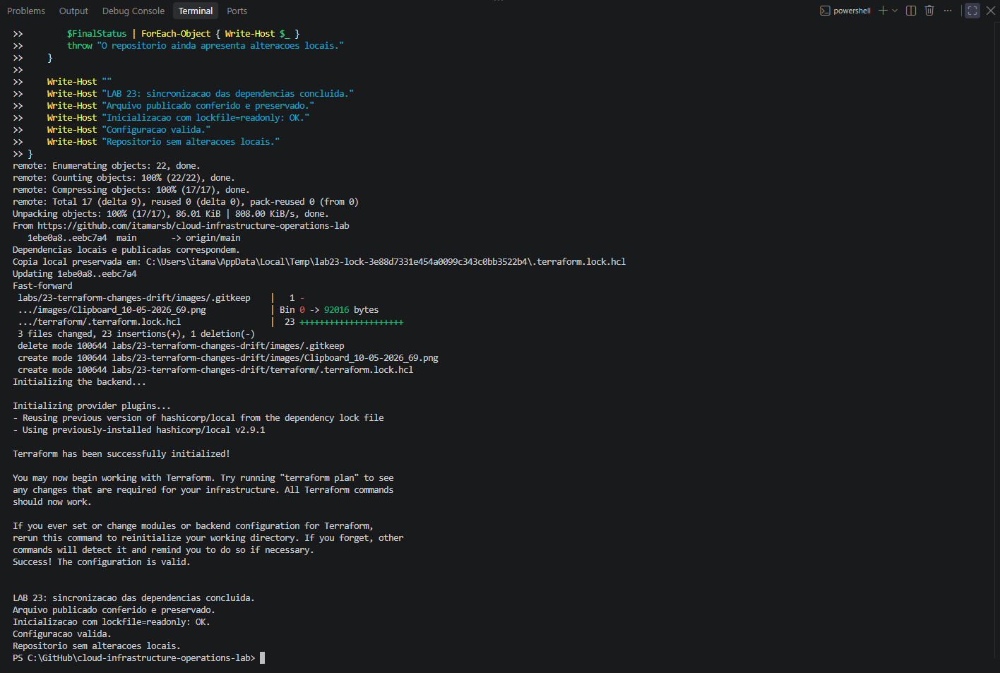

### Baseline v1

Plano de criação salvo e conferido.

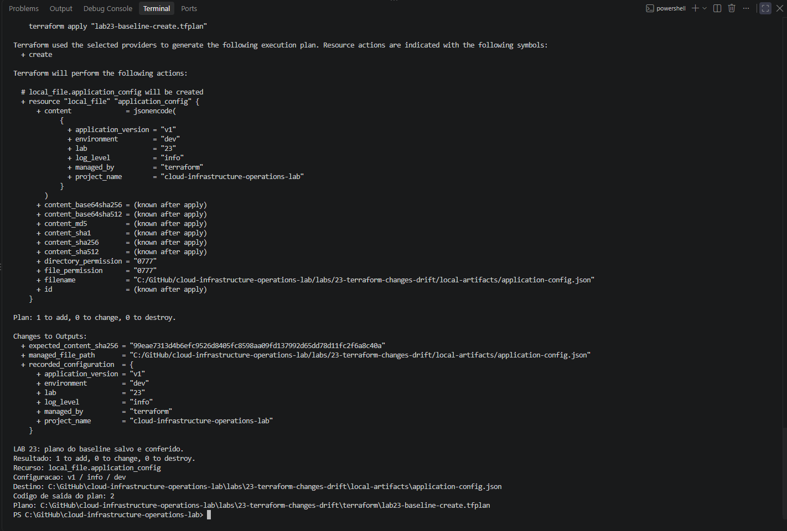

Aplicação e validação independente do arquivo.

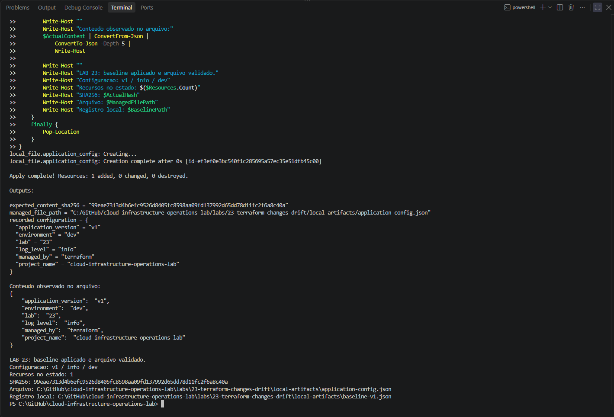

Segundo plano sem mudanças.

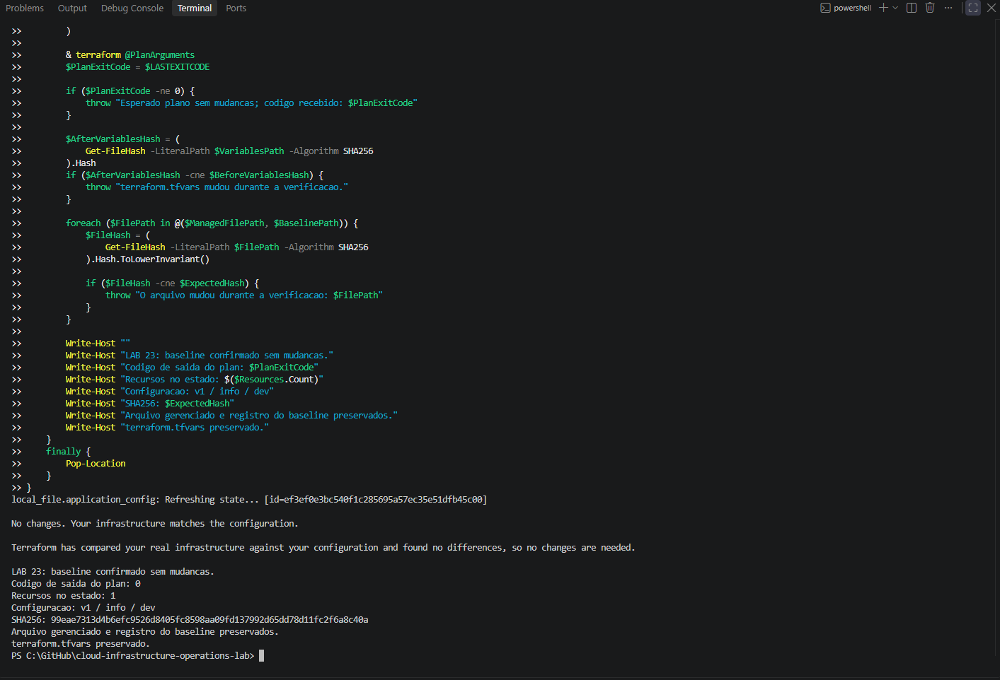

### Mudança intencional

Plano da mudança de `v1` para `v2`.

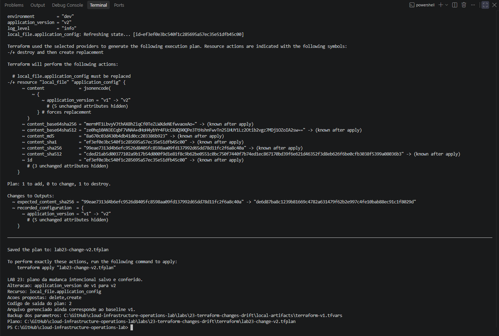

Aplicação e validação do novo conteúdo.

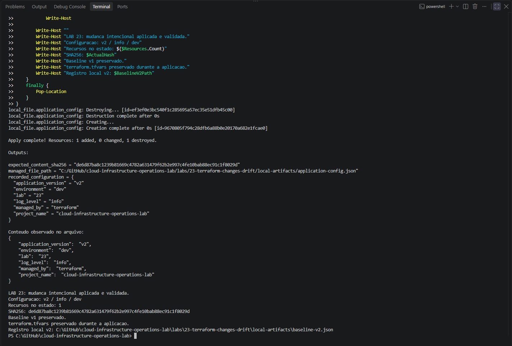

Plano sem mudanças após a atualização.

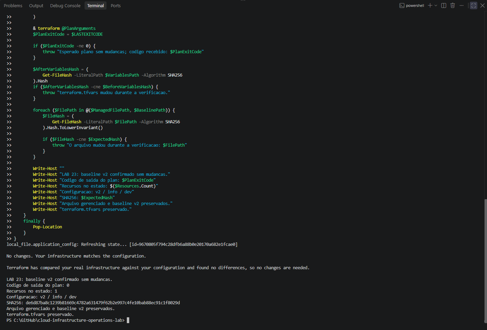

### Drift e recuperação

Alteração externa de `log_level` para `debug`.

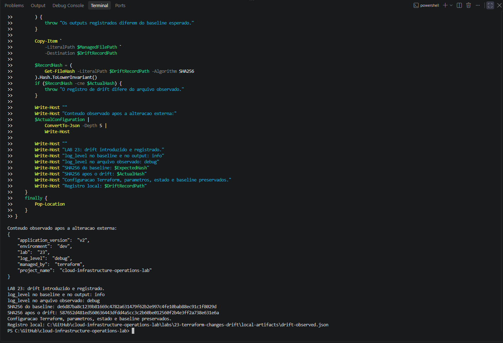

Comparação dos valores registrados e observados, seguida do plano de recuperação.

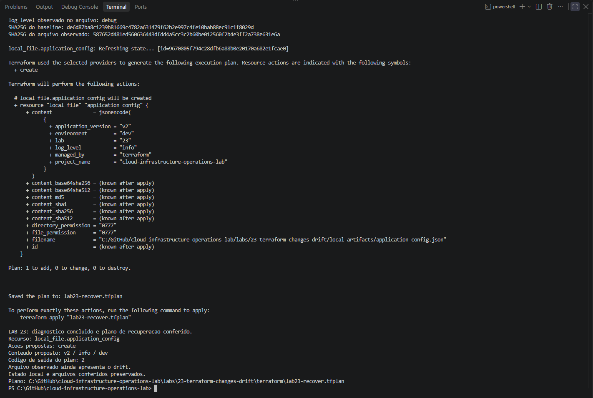

Conteúdo declarado restaurado e validado.

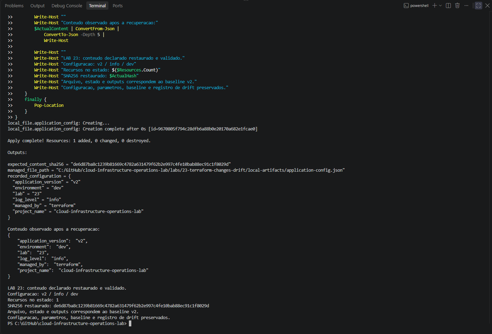

Plano sem mudanças após a recuperação.

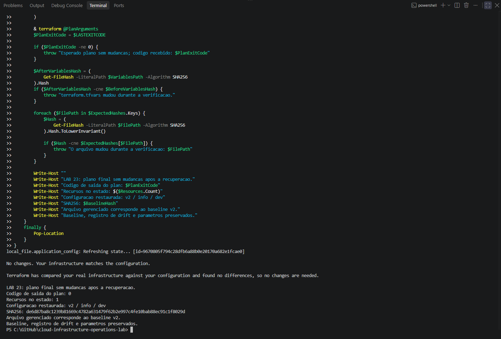

### Remoção

Plano de remoção salvo e conferido.

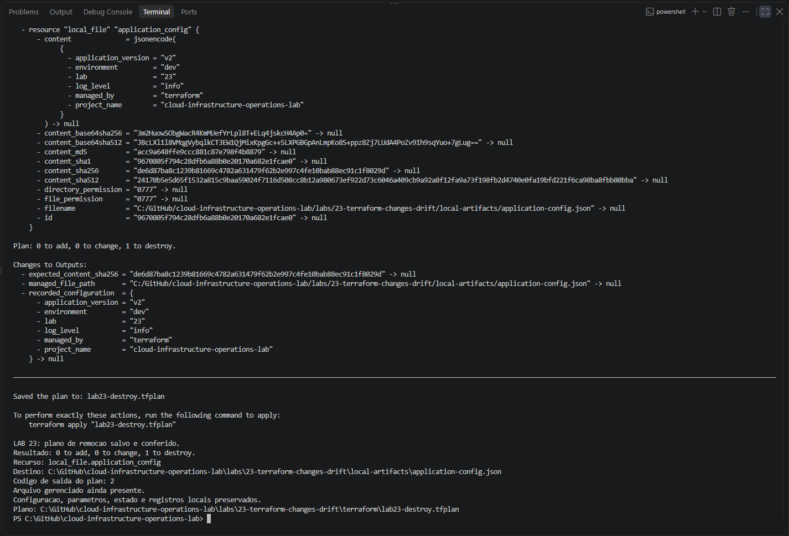

Recurso removido, estado vazio, arquivo ausente e registros preservados.

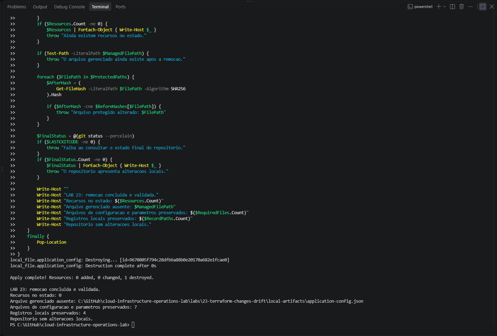

## Critérios de conclusão

- [x] Estrutura e configuração Terraform publicadas.
- [x] Diretório de artefatos locais excluído do Git.
- [x] Provider inicializado e arquivo de dependências versionado.
- [x] Formatação e validação concluídas.
- [x] Baseline v1 criado e validado.
- [x] Plano sem mudanças confirmado no baseline v1.
- [x] Mudança intencional planejada, aplicada e conferida.
- [x] Baseline v2 registrado e confirmado sem mudanças.
- [x] Drift introduzido no arquivo exclusivo.
- [x] Divergência diagnosticada.
- [x] Plano de recuperação salvo e revisado.
- [x] Conteúdo declarado restaurado e validado.
- [x] Plano sem mudanças após a recuperação.
- [x] Plano de remoção salvo e revisado.
- [x] Recurso removido e arquivo ausente.
- [x] Estado final sem recursos.
- [x] Configuração e registros locais preservados.
- [x] Evidências registradas.

## Referências

- [Gerenciamento de resource drift](https://developer.hashicorp.com/terraform/tutorials/state/resource-drift)
- [Recurso local_file — provider 2.9.1](https://registry.terraform.io/providers/hashicorp/local/2.9.1/docs/resources/file)
- [Comando terraform plan](https://developer.hashicorp.com/terraform/cli/commands/plan)
- [Arquivo de dependências](https://developer.hashicorp.com/terraform/language/files/dependency-lock)
