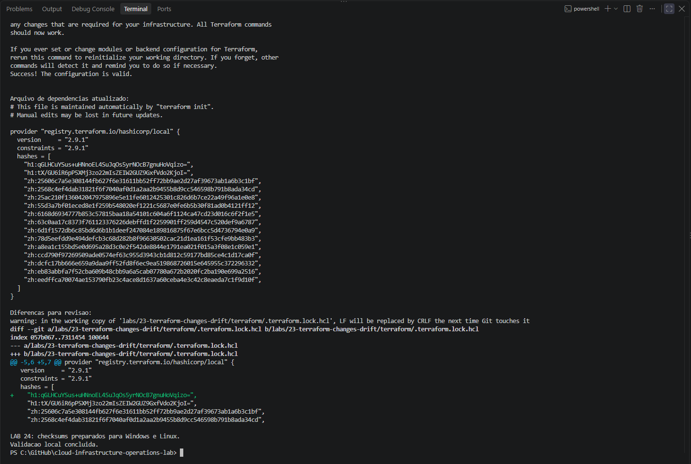
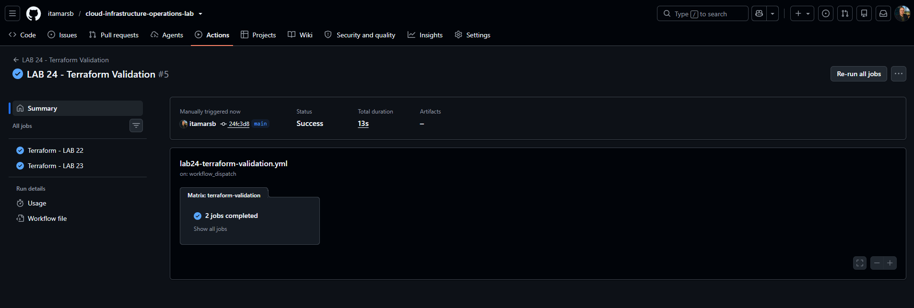
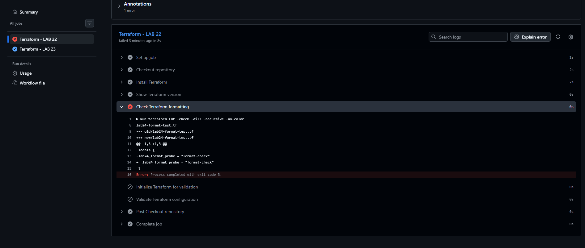
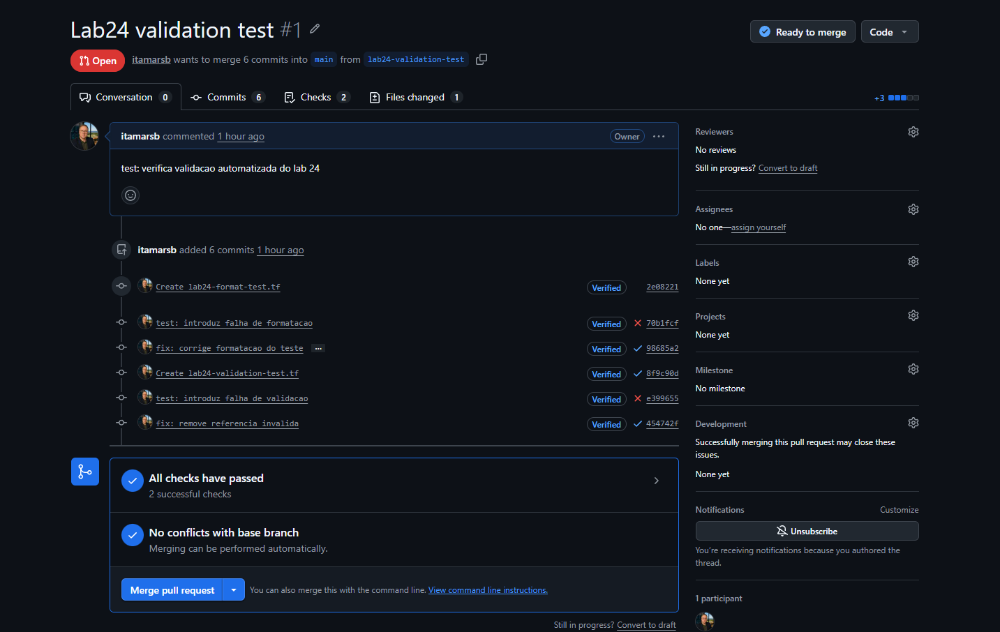
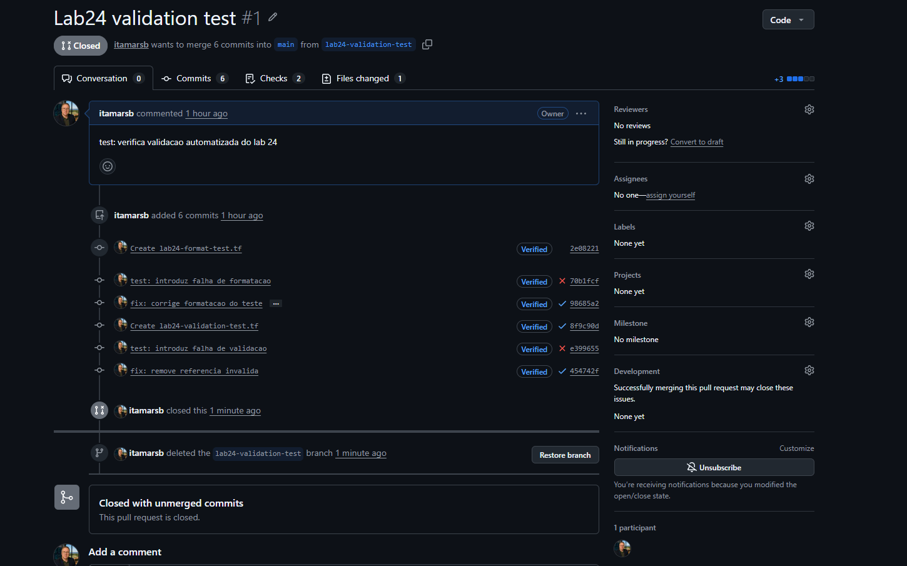

# LAB 24 — Validação automatizada do Terraform

## Status

Concluído.

Workflow executado com sucesso no GitHub Actions para os LABs 22 e 23. Testes controlados comprovaram a detecção de falhas de formatação e de configuração, seguida da aprovação após as correções.

O pull request de teste foi fechado sem merge e a branch temporária foi excluída.

## Objetivo

Automatizar a verificação das configurações Terraform do repositório, utilizando integração contínua para:

- Conferir a formatação dos arquivos.
- Inicializar os módulos e providers necessários à validação.
- Validar a consistência das configurações.
- Identificar erros antes da aplicação de mudanças.
- Registrar os resultados nos checks de um pull request.

## Organização

| Item | Caminho |
|:---:|:---:|
| Workflow | `.github/workflows/lab24-terraform-validation.yml` |
| Configuração do LAB 22 | `labs/22-terraform-variables-outputs-modules/terraform/` |
| Configuração do LAB 23 | `labs/23-terraform-changes-drift/terraform/` |
| Documentação | `labs/24-terraform-automated-validation/README.md` |
| Evidências | `labs/24-terraform-automated-validation/images/` |

[Consultar o workflow](../../.github/workflows/lab24-terraform-validation.yml).

## Ambiente

| Componente | Configuração |
|:---:|:---:|
| Plataforma de CI | GitHub Actions |
| Runner | Ubuntu 24.04 |
| Terraform | 1.16.1 |
| Checkout | `actions/checkout@v6` |
| Instalação do Terraform | `hashicorp/setup-terraform@v4` |
| Provider do LAB 22 | Provider integrado `terraform` |
| Provider do LAB 23 | `hashicorp/local` 2.9.1 |
| Permissão do workflow | `contents: read` |

A matriz executa um job para cada laboratório. A configuração `fail-fast: false` permite que o outro job continue quando um deles falha.

## Acionamento do workflow

O workflow pode ser executado por:

- Push na branch `main`.
- Pull request com destino à branch `main`.
- Acionamento manual pela aba Actions.

Os eventos de push e pull request possuem filtros para alterações nos seguintes caminhos:

- O próprio arquivo do workflow.
- O diretório Terraform do LAB 22.
- O diretório Terraform do LAB 23.
- O arquivo `.gitattributes`.

Alterações apenas na documentação ou nas imagens deste laboratório não acionam automaticamente o workflow.

## Etapas da validação

### 1. Conferir a versão

```bash
terraform version
```

### 2. Verificar a formatação

```bash
terraform fmt -check -diff -recursive -no-color
```

O comando verifica os arquivos e apresenta diferenças de formatação. O workflow não corrige os arquivos automaticamente.

### 3. Inicializar para validação

No LAB 22:

```bash
terraform init -backend=false -input=false -no-color
```

No LAB 23:

```bash
terraform init \
  -backend=false \
  -input=false \
  -no-color \
  -lockfile=readonly
```

O LAB 23 exige a presença do arquivo `.terraform.lock.hcl`. Após a inicialização, o workflow também verifica se esse arquivo permaneceu sem alterações:

```bash
git diff --exit-code -- .terraform.lock.hcl
```

### 4. Validar a configuração

```bash
terraform validate -no-color
```

A validação verifica a consistência interna da configuração, incluindo referências a variáveis e compatibilidade com os providers inicializados.

## Preparação das dependências para Windows e Linux

A primeira execução identificou uma incompatibilidade entre o pacote do provider instalado no runner Linux e os checksums disponíveis no arquivo de dependências.

A preparação foi realizada no ambiente local com:

```powershell
terraform providers lock `
    -platform=windows_amd64 `
    -platform=linux_amd64
```

O Terraform acrescentou o checksum necessário para Linux, preservando a versão `2.9.1` do provider `hashicorp/local`.

Depois da atualização, foram executados:

```powershell
terraform init -backend=false -input=false -no-color -lockfile=readonly
terraform validate -no-color
```

O arquivo atualizado foi versionado no LAB 23. A execução seguinte no GitHub Actions aprovou os dois jobs.

## Testes controlados

Os testes foram realizados na branch temporária `lab24-validation-test`, por meio do pull request #1.

### Falha de formatação

Foi criado o arquivo `lab24-format-test.tf` no diretório Terraform do LAB 22, com uma atribuição sem a indentação esperada:

```hcl
locals {
lab24_format_probe = "format-check"
}
```

Resultados observados:

- O check de formatação do LAB 22 falhou com código de saída `3`.
- As etapas de inicialização e validação desse job não foram executadas.
- O job do LAB 23 foi aprovado.

A indentação foi corrigida:

```hcl
locals {
  lab24_format_probe = "format-check"
}
```

Após o commit de correção, os dois checks foram aprovados.

### Falha de validação

Foi criado o arquivo `lab24-validation-test.tf` no diretório Terraform do LAB 22:

```hcl
locals {
  lab24_validation_probe = var.lab24_undeclared_variable
}
```

Resultados observados:

- A formatação foi aprovada.
- A inicialização foi concluída.
- A validação falhou com a mensagem `Reference to undeclared input variable`.
- O comando encerrou com código de saída `1`.
- O job do LAB 23 foi aprovado.

O arquivo de teste inválido foi excluído no commit `fix: remove referencia invalida`.

Após a correção, o pull request apresentou dois checks aprovados.

## Resultados

| Cenário | LAB 22 | LAB 23 |
|:---|:---:|:---:|
| Configurações válidas com dependências preparadas | Aprovado | Aprovado |
| Formatação incorreta no arquivo de teste | Falha em `fmt` | Aprovado |
| Formatação corrigida | Aprovado | Aprovado |
| Referência a variável não declarada | Falha em `validate` | Aprovado |
| Referência inválida removida | Aprovado | Aprovado |

Os checks demonstraram a detecção dos erros introduzidos e a recuperação após as correções.

A execução dos checks, por si só, não comprova a existência de uma regra de proteção que impeça o merge de um pull request com falhas.

## Encerramento do teste

Após a aprovação final:

1. O pull request #1 foi fechado sem merge.
2. A branch `lab24-validation-test` foi excluída.
3. Foi conferida a ausência dos dois arquivos de teste na branch `main`.
4. O workflow permaneceu publicado na branch `main`.
5. As evidências foram armazenadas neste laboratório.

[Consultar o pull request de teste](https://github.com/itamarsb/cloud-infrastructure-operations-lab/pull/1).

## Escopo

O workflow executa verificações de formatação, inicialização e validação.

Não executa `terraform plan`, `terraform apply` ou `terraform destroy`, nem utiliza credenciais AWS.

Os resultados demonstram a validade das configurações para essas verificações. Não substituem a revisão de um plano de execução ou os testes de comportamento dos recursos.

## Evidências

Capturas registradas durante a preparação, execução e encerramento dos testes:











## Critérios de conclusão

- [x] Workflow publicado no diretório `.github/workflows/`.
- [x] Terraform com versão definida no workflow.
- [x] LABs 22 e 23 incluídos na matriz de validação.
- [x] Checksums do provider preparados para Windows e Linux.
- [x] Execução válida com os dois jobs aprovados.
- [x] Falha de formatação detectada.
- [x] Aprovação após a correção da formatação.
- [x] Referência a variável não declarada detectada.
- [x] Aprovação após a remoção da referência inválida.
- [x] Pull request de teste fechado sem merge.
- [x] Branch temporária excluída.
- [x] Arquivos de teste ausentes na branch `main`.
- [x] Evidências publicadas.

## Aprendizados

- Diferenciar verificação de formatação e validação da configuração.
- Preparar dependências para ambientes com sistemas operacionais diferentes.
- Utilizar um lockfile versionado em uma execução de CI.
- Interpretar a etapa e o código de saída de uma falha.
- Executar verificações independentes com uma matriz de jobs.
- Testar o pipeline em uma branch temporária.
- Encerrar experimentos sem incorporar seus arquivos à branch principal.
