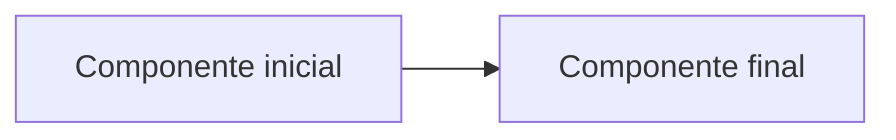

# Lab XX — Nome do laboratório

## Objetivo

Descreva de forma direta o que será realizado neste laboratório e qual competência principal será desenvolvida.

---

## Cenário

Apresente uma situação simples de trabalho que justifique a execução do laboratório.

Exemplo:

> Você recebeu a tarefa de preparar um ambiente para executar atividades de Cloud Operations com segurança e organização.

---

## Informações rápidas

| Informação | Descrição |
|---|---|
| **Nível** | Básico |
| **Tempo estimado** | XX–XX minutos |
| **Custo estimado** | Gratuito ou valor estimado |
| **Serviços AWS** | Não aplicável ou serviços utilizados |
| **Competência principal** | Competência desenvolvida |
| **Cleanup obrigatório** | Sim ou Não |

---

## Competências desenvolvidas

Ao concluir este laboratório, você será capaz de:

- competência 1;
- competência 2;
- competência 3.

---

## Pré-requisitos

Antes de iniciar, verifique se você possui:

- requisito 1;
- requisito 2;
- requisito 3.

---

## Arquitetura

Inclua um diagrama apenas quando ele ajudar a compreender os recursos, conexões ou fluxo do laboratório.



Quando não houver arquitetura relevante, utilize:

> Este laboratório não cria infraestrutura em nuvem e, portanto, não necessita de diagrama de arquitetura.

---

## Etapa 1 — Nome da etapa

Explique brevemente o objetivo da etapa.

Execute:

```bash
comando
```

### Resultado esperado

```text
resultado esperado
```

---

## Etapa 2 — Nome da etapa

Explique brevemente o que deverá ser feito.

---

## Validação

Confirme os resultados do laboratório:

- [ ] validação 1 concluída;
- [ ] validação 2 concluída;
- [ ] validação 3 concluída.

---

## Troubleshooting

### Problema: descrição do problema

**Possível causa:**

Explique a causa provável.

**Solução:**

Apresente o procedimento de correção.

---

## Situação prática de trabalho

Explique como a atividade executada aparece no cotidiano de um Analista Cloud Júnior.

Exemplo:

> Em uma equipe de Cloud Operations, essa validação pode ser utilizada durante a preparação de uma estação de trabalho, investigação de falhas ou execução de mudanças operacionais.

---

## Cleanup

Descreva todos os recursos, arquivos ou configurações que deverão ser removidos.

Quando nenhum recurso tiver sido criado:

> Este laboratório não cria recursos AWS e não gera custos. Nenhuma ação de cleanup é obrigatória.

---

## Checklist de conclusão

- [ ] Li o objetivo e compreendi o cenário.
- [ ] Executei todas as etapas.
- [ ] Validei os resultados.
- [ ] Registrei as evidências necessárias.
- [ ] Executei o cleanup, quando aplicável.
- [ ] Revisei as lições aprendidas.

---

## Lições aprendidas

Ao concluir este laboratório, você praticou:

- aprendizado 1;
- aprendizado 2;
- aprendizado 3.

---

## Próximo laboratório

Continue para:

```text
Lab XX — Nome do próximo laboratório
```
